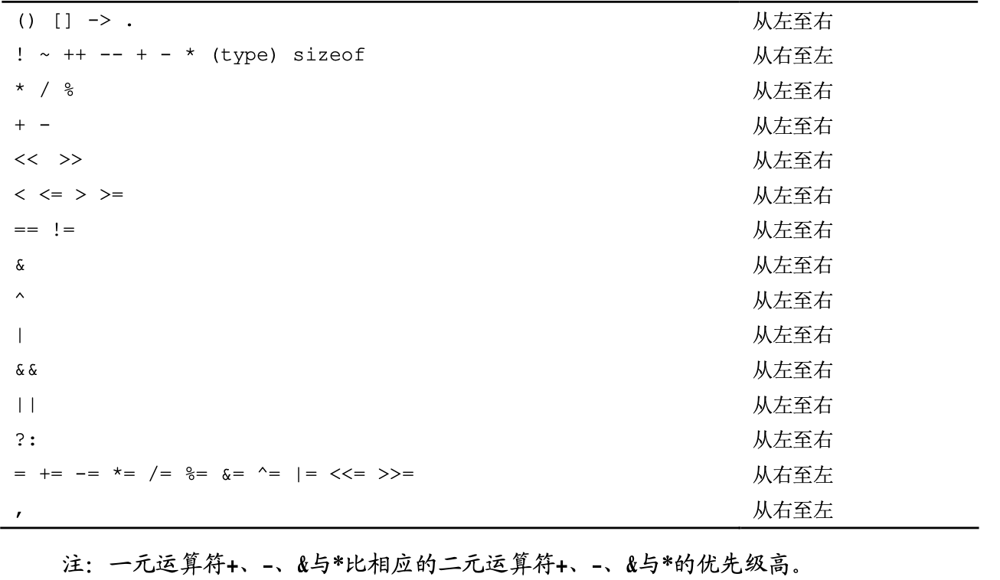
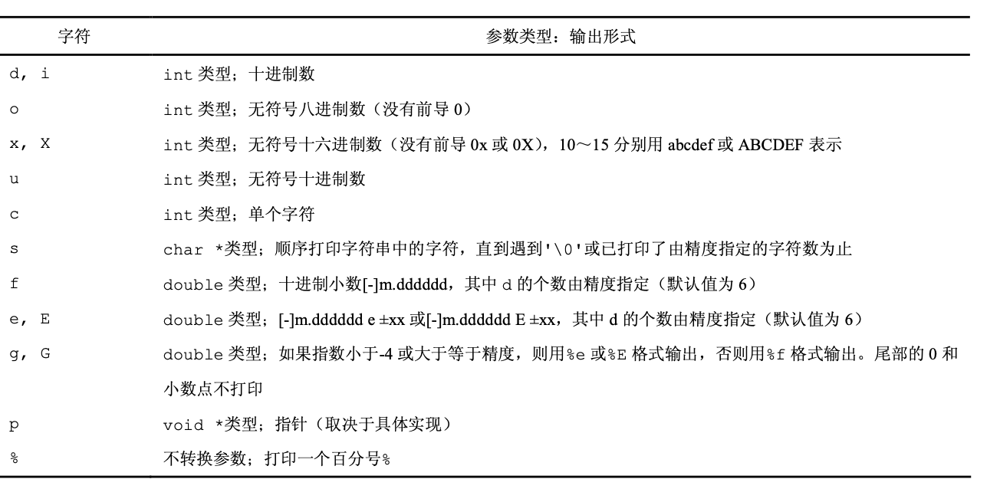
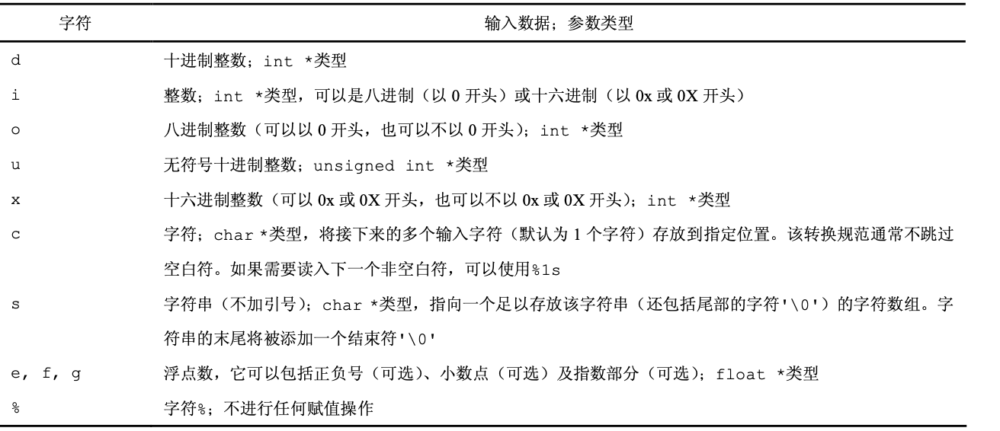

# 1 导言
## 1.1 入门

```c
#include <stdio.h>            // 包含标准库的信息
int main()                    // 定义名为 main 的函数，它不接受参数值
{                             // main函数的语句都被括在花括号中
   printf("hello, world\n");  // main函数调用库函数printf以显示字符序列;
}                             // \n 代表换行符
```

一个C语言程序，无论其大小如何，都是由函数和变量组成的。函数中包含一些语句，以指定所要执行的计算操作;变量则用于存储计算过程中使用的值。

函数之间进行数据交换的一种方法是调用函数向被调用函数提供一个值(称为参数)列表。函数名后面的一对圆括号将参数列表括起来。

调用函数时，只需要使用函数名加上用圆括号括起来的参数表即可。

用双引号括起来的字符序列称为字符串或字符串常量，如"hello, world\n"就是一个字符串。

\n 表示换行； \t 表示制表符;\b 表示回退符;\"表示双引号;\\表示反斜杠符本身
## 1.2 变量与算数表达式
在 C 语言中，所有变量都必须先声明后使用。声明通常放在函数起始处，在任何可执行 语句之前。声明用于说明变量的属性，它由一个类型名和一个变量表组成。

除 int 与 float 类型之外，C 语高还提供了其它一些基本数据类型，例如:
char 字符——一个字节 short 短整型
long 长整型
double 双精度浮点型

while 循环语句的执行方式是这样的:首先测试圆括号中的条件;如果条件为真 (fahr<=upper)，则执行循环体(括在花括号中的 3 条语句);然后再重新测试圆括号中的 条件，如果为真，则再次执行循环体;当圆括号中的条件测试结果为假(fahr>upper)时， 循环结束，并继续执行跟在 while 循环语句之后的下一条语句。
```c
while (fahr <= upper) {
    ...
}
```
如果某个算术运算符的所有操作数均为整型，则执行整型运算。但是，如果某个算术运 算符有一个浮点型操作数和一个整型操作数，则在开始运算之前整型操作数将会被转换为浮 点型。

%d 按照十进制整型数打印

%6d 按照十进制整型数打印，至少 6 个字符宽

%f 按照浮点数打印

%6f 按照浮点数打印，至少 6 个字符宽

%.2f 按照浮点数打印，小数点后有两位小数

%6.2f 按照浮点数打印，至少 6 个字符宽，小数点后有两位小数

%o 表示八进制数;%x 表示十六进制数;%c 表示字符;%s 表示字符串;%%表示百分号(%)本身。
## 1.3 for 语句
for 语句是一种循环语句，它是对 while 语句的推广。如果将 for 语句与前面介绍的 while 语句比较，就会发现 for 语句的操作更直观一些。圆括号中共包含 3 个部分，各部分 之间用分号隔开。

第一部分是初始化部分，仅在进入循环前执行一次。

第二部分是控制循环的测试或条件部分。循环控制将对该条件求值，如果结果值为真(true)，则执行循环体(本例中的循环体仅包含一个 printf 函数调用语句)。

此后将执行第三部分将循环变量 fahr 增加一个步长，并再次对条件求值。如果计算得到的条件值为假(faise)， 循环将终止执行。

## 1.4 符号常量
#define 指 令可以把符号名(或称为符号常量)定义为一个特定的字符串:

#define 名字 替换文本

在该定义之后，程序中出现的所有在#define 中定义的名字(既没有用引号引起来，也不是 其它名字的一部分)都将用相应的替换文本替换。其中，名字与普通变量名的形式相同:它 们都是以字母打头的字母和数字序列;替换文本可以是任何字符序列，而不仅限于数字。

## 1.5 字符输入/输出
标准库提供了一次读/写一个字符的函数，其中最简单的是 getchar和putchar两个函数。

每次调用时，getchar 函数从文本流中读入下一个输入字符，并将其作为结果值返回。

每次调用 putchar 函数时将打印一个字符。。

### 1.5.1 文件复制
借助于 getchar 与 putchar 函数，可以在不了解其它输入/输出知识的情况下编写出 数量惊人的有用的代码。最简单的例子就是把输入一次一个字符地复制到输出，其基本思想 如下:

读一个字符

while (该字符不是文件结束指示符)

    输出刚读入的字符

    读下一个字符

在没有输入时，getchar 函数将返回一个特殊值，这个特殊值与任何实际字符都不同。这个 值称为 EOF(end of file，文件结束)。

EOF 定义在头文件<stdio.h>中，是个整型数，其具体数值是什么并不重要，只要它与 任何 char 类型的值都不相同即可。这里使用符号常量，可以确保程序不需要依赖于其对应的 任何特定的数值。
### 1.5.2 字符计数
```c
 #include <stdio.h>
 /* count characters in input; 1st version */
 main () {
    long nc;
    nc = 0;
    while (getchar() != EOF) {
        ++nc;
    }

    printf("%ld\n", nc);
 }
```
该字符计数程序使用 long 类型的变量存放计数值，而没有使用 int 类型的变量。long 整型数(长整型)至少要占用 32 位存储单元。在某些机器上 int 与 long 类型的长度相同， 但在一些机器上，int 类型的值可能只有 16 位存储单元的长度(最大值为 32767)，这样，相 当小的输入都可能使 int 类型的计数变量溢出。转换说明%ld 告诉 printf 函数其对应的参 数是 long 整型。
### 1.5.3 行计数
```c
 #include <stdio.h>
 /* count lines in inout */
 main () {
    int c, nl;
    nl = 0;
    while ((c = getchar()) != EOF) {
        if (c == '\n') {
            ++nl;
        }
    }

    printf("%d\n", nl);
 }
```
### 1.5.4 单词计数
```c
 #include <stdio.h>

 #define IN  /* inside a word */
 #define OUT /* outside a word */

 /* count lines, words,and characters in input */
 main() {
    int c, nl, nw, nc, state;
    state = OUT;
    nl = nw = nc = 0;
    while ((c = getchar()) != EOF) {
        ++nc;
        if (c == '\n') {
            ++nl;
        }
        if (c == ' ' || c == '\n' || c = '\t') {
            state = OUT;
        } else if (state == OUT) {
            state = IN;
            ++nw;
        }
    }

    printf("%d %d %d\n", nl, nw, nc);
 }
```
## 1.6 数组

数组下标可以是任何整型表达式，包括整型变量(如 i)以及整型常量。


由定义可知，char 类型的字符是小整型，因此 char 类型的变量和常量在算术表达式中 等价于int类型的变量和常量。这样做既自然又方便，例如，c - '0'是一个整型表达式， 如果存储在 c 中的字符是'0'~'9'，其值将为 0~9，因此可以充当数组 ndigit 的合法下 标。

程序中经常使用下列方式表示多路判定:
```c
if (条件1)

语句 1

else if (条件1) 语句 2
...
...
else
```
在这种方式中，各条件从前往后依次求值，直到满足某个条件，然后执行对应的语句部分。 这部分语句执行完成后，整个语句体执行结束(其中的任何语句都可以是括在花括号中的若 干条语句)。如果所有条件都不满足，则执行位于最后一个 else 之后的语句(如果有的话)。 类似于前面的单词计数程序，如果没有最后一个 else 及对应的语句，该语句体将不执行任何 动作。
## 1.7 函数

函数定义的一般形式为:

返回值类型 函数名(0 个或多个参数声明)

{

声明部分

语句序列

}

我们通常把函数定义中圆括号内列表中出现的变量称为形式参数，而把函数调用中与形 式参数对应的值称为实际参数。

由于 main 本身也是函数， 因此也可以向其调用者返回一个值，该调用者实际上就是程序的执行环境。一般来说，返回 值为 0 表示正常终止，返回值为非 0 表示出现异常情况或出错结束条件。为简洁起见，前面 的 main 函数都省略了 return 语句，但我们将在以后的 main 函数中包含 return 语句， 以提醒大家注意，程序还要向其执行环境返回状态。

合适的参数名能够起到很好的说明性作用，因此我们在函数原型中总是指明参数名。

参数名在圆括号内指定，参数类型在左花括号之前声明。如果没有声明某个参数的类 型，则默认为 int 类型。
## 1.8 参数-传值作用
在 C 语言中，所有函数参数都是“通过值”传递的。也就是说，传递给被调用函数的 参数值存放在临时变量中，而不是存放在原来的变量中。

在 C 语言中，被调用函数不能直接修改主调函数中变量的值，而只 能修改其私有的临时副本的值。


必要时，也可以让函数能够修改主调函数中的变量。这种情况下，调用者需要向被调用 函数提供待设置值的变量的地址(从技术角度看，地址就是指向变量的指针)，而被调用函数 则需要将对应的参数声明为指针类型，并通过它间接访问变量。

如果是数组参数，情况就有所不同了。当把数组名用作参数时，传递给函数的值是数组 起始元素的位置或地址——它并不复制数组元素本身。在被调用函数中，可以通过数组下标 访问或修改数组元索的值。
## 1.9 字符数组
它把第一个参数 s 声明为数组，把第二个参数 lim 声明为整型，声明中提供数组大小的目的是留出存储空间。在 getline 函数中没有必要指明数组 s 的长度，这是因为该数组的大小是在 main 函数中设置的

有些函数返回有用的值，而有些函数(如 copy)仅用于执行一些动作，并不返回值。copy 函数的返回值类型为 void，它显式说明该函数不返回任何值。

getline 函数把字符'\0'(即空字符，其值为 0)插入到它创建的数组的末尾，以标记 字符串的结束。

printf 函数中的格式规范%s 规定，对应的参数必须是以这种形式表示的字符串。
## 1.10 外部变量与作用域
main 函数中的变量(如 line、longest 等)是 main 函数的私自变量或局部变量。由 于它们是在 main 函数中声明的，因此其它函数不能直接访问它们。函数中的每个局部变量只在函数被调用时存在，在函数执行完毕退出时消失。

由于自动变量只在函数调用执行期间存在，因此，在函数的两次调用之间，自动变量不 保留前次调用时的赋值，且在每次进入函数时都要显式为其赋值。如果自动变量没有赋值， 则其中存放的是无效值。

即使在对外部变量赋值的函数返回后， 这些变量仍将保持原来的值不变。

外部变量必须定义在所有函数之外，且只能定义一次，定义后编译程序将为它分配存储单元。

从语法角度看，外部变量的定 义与局部变量的定义是相同的，但由于它们位于各函数的外部，因此这些变量是外部变量。 函数在使用外部变量之前，必须要知道外部变量的名字。
# 2 类型、运算符与表达式
变量和常量是程序处理的两种基本数据对象。声明语句说明变量的名字及类型，也可以指定变量的初值。运算符指定将要进行的操作。表达式则把变量与常量组合起来生成新的值。 对象的类型决定该对象可取值的集合以及可以对该对象执行的操作

## 2.1 变量名
名字是由字母和数字组成的序列，但其第一个字符必须为字母。

选择的变量名要能够尽量从字面上表达变量的用途，这样做不容易引起混淆。局部变量 一般使用较短的变量名(尤其是循环控制变量)，外部变量使用较长的名字。

## 2.2 数据类型及长度

char 字符型，占用一个字节，可以存放本地字符集中的一个字符

int 整型，通常反映了所用机器中整数的最自然长度

float 单精度浮点型

double 双精度浮点型

short 类型通常为 16 位，1ong 类型通常为 32 位，int 类型可以为 16 位或 32 位。

short 与 int 类型至少为 16 位，而 long 类型至少为 32 位，并且 short 类型不得长于 int 类型，而 int 类型不得长于 long 类型。
## 2.3 常量

浮点数常量中包含一个小数点(如 123.4)或一个指数(如 1e-2)，也可以两者都有。 没有后缀的浮点数常量为 double 类型。

带前缀 0 的整型常量表 示它为八进制形式;前缀为 0x 或 0X，则表示它为十六进制形式。八进制与十六进制的常量也可 以使用后缀 L 表示 long 类型，使用后缀 U 表示 unsigned 类型。

一个字符常量是一个整数，书写时将一个字符括在单引号中，如，'x'。

ANSI C语言中的全部转义字符序列如下所示:

\a响铃符  \b回退符

\f换页符  \n换行符

\r 回车符  \t 横向制表符

\v 纵向制表符  \\反斜杠

\?问号  \'单引号

\"双引号  \ooo 八进制数

\xhh 十六进制数

字符常量'\0'表示值为 0 的字符，也就是空字符(null)。我们通常用'\0'的形式代替 0， 以强调某些表达式的字符属性，但其数字值为 0。

在没有显式说明的情况下，enum 类型中第一个枚举名的值为 0，第二个为 1，依此类推。如 果只指定了部分枚举名的值，那么未指定值的枚举名的值将依着最后一个指定值向后递增，

枚举为建立常量值与名字之间的关联提供了一种便利的方式。相对于#define 语句来说， 它的优势在于常量值可以自动生成。尽管可以声明 enum 类型的变量，但编译器不检查这种类 型的变量中存储的值是否为该枚举的有效值。不过，枚举变量提供这种检查，因此枚举比 #define 更具优势。此外，调试程序可以以符号形式打印出枚举变量的值。
## 2.4 声明
所有变量都必须先声明后使用，尽管某些变量可以通过上下文隐式地声明。一个声明指 定一种变量类型，后面所带的变量表可以包含一个或多个该类型的变量。

一个声明语句中的多个变量可以拆开在多个声明语句中声明。

在声明中，如果变量名的后面紧跟一个等号以 及一个表达式，该表达式就充当对变量进行初始化的初始化表达式。

如果变量不是自动变量，则只能进行一次初始化操作，从概念上讲，应该是在程序开始 执行之前进行，并且初始化表达式必须为常量表达式。每次进入函数或程序块时，显式初始 化的自动变量都将被初始化一次，其初始化表达式可以是任何表达式。默认情况下，外部变 量与静态变量将被初始化为 0。未经显式初始化的自动变量的值为未定义值(即无效值)。

任何变量的声明都可以使用 const 限定符限定。该限定符指定变量的值不能被修改。对 数组而言，const 限定符指定数组所有元素的值都不能被修改
## 2.5 算数运算符
二元算术运算符包括:+、-、*、/、%(取模运算符)。整数除法会截断结果中的小数部分。

二元运算符+和-具有相同的优先级，它们的优先级比运算符*、/和%的优先级低，而运 算符*、/和%的优先级又比一元运算符+和-的优先级低。算术运算符采用从左到右的结合规 则。
## 2.6 关系运算符与逻辑运算符
关系运算符包括下列几个运算符:
> >= < <=
它们具有相同的优先级。

逻辑运算符&&与||有一些较为特殊的属性，由&&与||连接的表达式按从左到右的顺序进 行求值，并且，在知道结果值为真或假后立即停止计算。

如果在调用 getchar 函数之前就测试 c 是否为 EOF，结果也是不正确的，因此， 函数的调用与赋值都必须在对 c 中的字符进行测试之前进行。

运算符&&的优先级比||的优先级高，但两者都比关系运算符和相等性运算符的优先级低。

根据定义，在关系表达式或逻辑表达式中，如果关系为真，则表达式的结果值为数值 1;如果为假，则结果值为数值 0。

逻辑非运算符!的作用是将非 0 操作数转换为 0，将操作数 0 转换为 1。
## 2.7 类型转换
一般来说，自动转换是指把“比较窄的”操作数转换为“比较宽的”操作数，并且不丢失信息的转换，不允许使用无意义的表达式，针对可能导致信息丢失的表达式，编译器可能会给出警告信息，比如把较长的整型值赋给较短的整型变量，把浮点型值赋值给整型变量，等等，但这些表达式并不非法。

将字符类型转换为整型时，我们需要注意一点。C 语言没有指定 char 类型的变量是无符 号变量(signed)还是带符号变量(unsigned)。当把一个 char 类型的值转换为 int 类 型的值时，其结果有没有可能为负整数?对于不同的机器，其结果也不同，这反映了不同机 器结构之间的区别。在某些机器中，如果 char 类型值的最左一位为 1，则转换为负整数(进 行“符号扩展”)。而在另一些机器中，把 char 类型值转换为 int 类型时，在 char 类型值 的左边添加 0，这样导致的转换结果值总是正值。

为了保证程序的可移植性，如果要在 char 类型的变量中存储非字符数据， 最好指定 signed 或 unsigned 限定符。

当关系表达式(如 i>j)以及由&&、||连接的逻辑表达式的判定结果为真时，表达式的 值为 1;当判定结果为假时，表达式的值为 0。

C 语言中，很多情况下会进行隐式的算术类型转换。一般来说，如果二元运算符(具有两 个操作数的运算符称为二元运算符，比如+或*)的两个操作数具有不同的类型，那么在进行 运算之前先要把“较低”的类型提升为“较高”的类型，运算的结果为较高的类型。

如果没有 unsigned 类型的操作数，则只要使用下面 这些非正式的规则就可以了:

• 如果其中一个操作数的类型为 long double，则将另一个操作数转换为 1ong double 类型;

• 如果其中一个操作数的类型为 double，则将另一个操作数转换为 double 类型;

• 如果其中一个操作数的类型为 float，则将另一个操作数转换为 float 类型;

• 将 char 与 short 类型的操作数转换为 int 类型;

• 如果其中一个操作数的类型为 long，则将另一个操作数也转换为 long 类型。

当表达式中包含 unsigned 类型的操作数时，转换规则要复杂一些。主要原因在于，带 符号值与无符号值之间的比较运算是与机器相关的，因为它们取决于机器中不同整数类型的 大小。

赋值时也要进行类型转换。赋值运算符右边的值需要转换为左边变量的类型，左边变量 的类型即赋值表达式结果的类型。

在任何表达式中都可以使用一个称为强制类型转换的一元运算符强制进行显式类 型转换。在下列语句中，表达式将按照上述转换规则被转换为类型名指定的类型:

    (类型名) 表达式

我们可以这样来理解强制类型转换的准确含义:在上述语句中，表达式首先被赋值给类型名 指定的类型的某个变量，然后再用该变量替换上述整条语句。

注意，强制类型转换只是生成一 个指定类型的 n 的值，n 本身的值并没有改变。强制类型转换运算符与其它一元运算符具有相 同的优先级。

在通常情况下，参数是通过函数原型声明的。这样，当函数被调用时，声明将对参数进 行自动强制转换。
## 2.8 自增运算符与自减运算符
C 语言提供了两个用于变量递增与递减的特殊运算符。自增运算符++使其操作数递增 1，自减运算符使其操作数递减 1。

++与--这两个运算符特殊的地方主要表现在:它们既可以用作前缀运算符(用在变量前 面，如++n)。也可以用作后缀运算符(用在变量后面，如 n++)。在这两种情况下，其效果都 是将变量 n 的值加 1。但是，它们之间有一点不同。表达式++n 先将 n 的值递增 1，然后再使 用变量 n 的值，而表达式 n++则是先使用变量 n 的值，然后再将 n 的值递增 1。也就是说， 对于使用变量 n 的值的上下文来说，++n 和 n++的效果是不同的。

在不需要使用任何具体值且仅需要递增变量的情况下，前缀方式和后缀方式的效果相同。
## 2.9 按位运算符
C 语言提供了 6 个位操作运算符。这些运算符只能作用于整型操作数，即只能作用于带符号或无符号 char、short、int、long 类型:

& 按位与(AND)

| 按位或(OR)

^ 按位异或(XOR)

<< 左移

>> 右移

~ 按位求反(一元运算符)

按位异或运算符^当两个操作数的对应位不相同时将该位设置为 1，否则，将该位设置为 0。

我们必须将位运算符&、|同逻辑运算符&&、||区分开来，后者用于从左至右求表达式的真值。

移位运算符<<与>>分别用于将运算的左操作数左移与右移，移动的位数则由右操作数指 定(右操作数的值必须是非负值)。

在对 unsigned 类型的无符号值进行右移 位时，左边空出的部分将用 0 填补;当对 signed 类型的带符号值进行右移时，某些机器将 对左边空出的部分用符号位填补(即“算术移位”)，而另一些机器则对左边空出的部分用 0 填补(即“逻辑移位”)。
## 2.10 赋值运算符与表达式
在赋值表达式中，如果表达式左边的变量重复出现在表达式的右边，

其中的运算符+=称为赋值运算符

大多数二元运算符(即有左、右两个操作数的运算符，比如+)都有一个相应的赋值运算 符 op=，其中，op 可以是下面这些运算符之一:

+ - * / % << >> & ^ |
## 2.11 条件表达式
条件表达式(使用三元运算符“? :”)提供了另外一种方法编写这段程序及类似的代码段，在表达式

   expr1 ? expr2 : expr3

中，首先计算 expr1，如果其值不等于 0(为真)，则计算expr2 的值，并以该值作为条件 表达式的值，否则计算expr3 的值，并以该值作为条件表达式的值。expr2 与expr3 中只 能有一个表达式被计算。

条件表达式实际上就是一种表达式，它可以用在其它表达式可以使用的任何 地方;如果 expr2 与 expr3 的类型不同，结果的类型将由本章前面讨论的转换规则决定。

条件表达式中第一个表达式两边的圆括号并不是必须的，这是因为条件运算符?:的优先 级非常低，仅高于赋值运算符。但我们还是建议使用圆括号，因为这可以使表达式的条件部 分更易于阅读。
## 2.12 运算符优先级与求值次序
同一行中 的各运算符具有相同的优先级，各行间从上往下优先级逐行降低。例如，*、/与%三者具有相 同的优先级，它们的优先级都比二元运算符+、-高。运算符( )表示函数调用。


注意，位运算符&、^与|的优先级比运算符==与!=的低。这意味着，位测试表达式，必须用圆括号括起来才能得到正确结果。

函数调用、嵌套赋值语句、自增与自减运算符都有可能产生“副作用”——在对表达式 求值的同时，修改了某些变量的值。在有副作用影响的表达式中，其执行结果同表达式中的 变量被修改的顺序之间存在着微妙的依赖关系。
# 3 控制流
## 3.1 语句与程序块
用一对花括号“{”与“}”把一组声明和语句括在一起就构成了一个复合语句(也叫作 程序块)，复合语句在语法上等价于单条语句。函数体中被花括号括起来的语句便是明显一例。 if、else，while 与 for 之后被花括号括住的多条语句也是类似的例子。(在任何程序块中 都可以声明变量，笫 4 章将对此进行讨论。)右花括号用于结束程序块，其后不需要分号。
## 3.2 if-else语句
if-else 语句用于条件判定，其语法如下所示:

if {表达式}

 语句 1

else

语句 2

该语句执行时，先计算表达式的值，如果其值为真(即表达式的值 为非 0)，则执行语句 1;如果其值为假(即表达式的值为 0)，并且该语句包含 else 部分， 则执行语句 2。

由于 if 语句只是简单测试表达式的数值，因此可以对某些代码的编写进行简化。最明显 的例子是用如下写法

if (表达式)

因为 if-else 语句的 else 部分是可选的，所以在嵌套的 if 语句中省略它的 else 部 分将导致歧义。解决的方法是将每个 else 与最近的前一个没有 else 配对的 if 进行匹配。
## 3.3 else-if 语句
在 C 语言中我们会经常用到下列结构:

if (表达式)

语句

else if (表达式)

语句

else if (表达式)

语句

else if (表达式)

语句

else

语句

其中的各表 达式将被依次求值，一旦某个表达式结果为真，则执行与之相关的语句，并终止整个语句序 列的执行。同样，其中各语句既可以是单条语句，也可以是用花括号括住的复合语句。

最后一个 else 部分用于处理“上述条件均不成立”的情况或默认情况，也就是当上面各 条件都不满足时的情形。有时候并不需要针对默认情况执行显式的操作，这种情况下，可以 把该结构末尾的

else

语句

部分省略掉;该部分也可以用来检查错误，以捕获“不可能”的条件。
## 3.4 switch语句
switch 语句是一种多路判定语句，它测试表达式是否与一些常量整数值中的某一个值匹 配，并执行相应的分支动作。

switch (表达式) {

case 常量表达式: 语句序列

case 常量表达式: 语句序列

default: 语句序列

每一个分支都由一个或多个整数值常量或常量表达式标记。如果某个分支与表达式的值匹配， 则从该分支开始执行。各分支表达式必须互不相同。如果没有哪一分支能匹配表达式，则执 行标记为 default 的分支。default 分支是可选的。如果没有 default 分支也没有其它分 支与表达式的值匹配，则该 switch 语句不执行任何动作。各分支及 default 分支的排列次 序是任意的。

break 语句将导致程序的执行立即从 switch 语句中退出。在 switch 语句中，case 的作用只是一个标号，因此，某个分支中的代码执行完后，程序将进入下一分支继续执行， 除非在程序中显式地跳转。跳出 switch 语句最常用的方法是使用 break 语句与 return 语 句。
## 3.5 while循环与for循环
while (表达式)
语句

中，首先求表达式的值。如果其值非 0，则执行语句，并再次求该表达式的值。这一循环过程 一直进行下去，直到该表达式的值为 0 为止，随后继续执行语句后面的部分。

for 循环语句;

for (表达式 1; 表达式 2; 表达式 3)

语句

它等价于下列 while 语句:

表达式 1;

while (表达式2) {

语句

表达式 3;
}

最常见的情况是，表达式 1 与表达式 3 是赋值表达式或函数调用，表达式 2 是关系表达式。这 3 个组成部分中的任何部 分都可以省略，但分号必须保留。如果在 for 语句中省略表达式 1 与表达式 3，它就退化成 了 while 循环语句。如果省略测试条件，即表达式 2，则认为其值永远是真值，因此，下列 for 循环语句:
```c
for (;;) {
    ...
}
```
是一个“无限”循环语句，这种语句需要借助其它手段(如 break 语句或 return 语句)才能终止执行。

因为其中没有初始化或重新初始化的操作，所以使用 whi1e 循环语句更自然一些。

如果语句中需要执行简单的初始化和变量递增，使用 for 语句更合适一些，它将循环控制语句集中放在循环的开头，结构更紧凑、更清晰。通过下列语句可以很明显地看出这一点:
 ```c
   for (i = 0; i < n; i++)
      ...
```

逗号运算符“,”也是 C 语言优先级最低的运算符，在 for 语句中经常会用到它。被逗 号分隔的一对表达式将按照从左到右的顺序进行求值，表达式右边的操作数的类型和值即为 其结果的类型和值。
## 3.6 do-while循环
C 语言中的第三种循环——do-while 循环则在循环体执行后测试终止条件， 这样循环体至少被执行一次。

do-while 循环的语法形式如下:
```c
do
    语句
while (表达式);
```
先执行循环体中的语句部分，然后再求表达式的值。如果表达式的值为真， 则再次执行语句，依此类推。当表达式的值变为假，则循环终止
## 3.7 break语句与continue语句
不通过循环头部或尾部的条件测试而跳出循环，有时是很方便的。break 语句可用于从 for、while 与 do-while 等循环中提前退出，就如同从 switch 语句中提前退出一样。break 语句能使程序从 switch 语句或最内层循环中立即跳出。

continue 语句与 break 语句是相关联的，但它没有 break 语句常用。continue 语 句用于使 for、while 或 do-while 语句开始下一次循环的执行。在 while 与 do-while 语句中，continue 语句的执行意味着立即执行测试部分;在 for 循环中，则意味着使控制 转移到递增循环变量部分。continue 语句只用于循环语句，不用于 switch 语句。某个循 环包含的 switch 语句中的 continue 语句，将导致进入下一次循环。
## 3.8 goto语句与标号
C 语言提供了可随意滥用的 goto 语句以及标记跳转位置的标号。从理论上讲，goto 语 句是没有必要的，实践中不使用 goto 语句也可以很容易地写出代码。

最常见的用法是终止程序在某些深度嵌套 的结构中的处理过程，例如一次跳出两层或多层循环。这种情况下使用 break 语句是不能达 到目的的，它只能从最内层循环退出到上一级的循环。下面是使用 goto 语句的一个例子:
```c
for ( ... )
    for ( ... ) {
             ...
             if (disaster)
                goto error;
    } ...
error:
/* clean up the mess */
```
在该例子中，如果错误处理代码很重要，并且错误可能出现在多个地方，使用 goto 语句将会 比较方便。

标号的命名同变量命名的形式相同，标号的后面要紧跟一个冒号。标号可以位于对应的 goto 语句所在函数的任何语句的前面。标号的作用域是整个函数。

所有使用了 goto 语句的程序代码都能改写成不带 goto 语句的程序，但可能会增加一些 额外的重复测试或变量。

# 4 函数与程序结构
## 4.1 函数的基本常识
函数的定义形式如下:

返回值类型 函数明(参数声明表)
{
    声明和语句
}

函数定义中的各构成部分都可以省略。最简单的函数如下所示:
```c
dummy() {}
```
该函数不执行任何操作也不返回任何值。这种不执行任何操作的函数有时很有用，它可以在 程序开发期间用以保留位置(留待以后填充代码)。如果函数定义中省略了返回值类型，则默 认为 int 类型。


被调用函数通过 return 语句向调用者返回值，return 语句的后面可以跟任何表达式:

        return 表达式;

调用函数可以忽略返回值。并且，return 语句的后面也不一定需要表达式。当 return 语句的后面没有表达式时，函数将不向调用者返回值。当被调用函数执行到最后的右花括号 而结束执行时，控制同样也会返回给调用者(不返回值)。如果某个函数从一个地方返回时有 返回值，而从另一个地方返回时没有返回值，该函数并不非法，但可能是一种出问题的征兆。 在任何情况下，如果函数没有成功地返回一个值，则它的“值”肯定是无用的。
## 4.2 返回非整型值的函数

我们通过函数 atof(s)来说明函数返回非整型值的方法。该函数把字符串 s 转换为相应的双精度浮点数。

首先，由于 atof 函数的返回值类型不是 int，因此该函数必须声明返回值的类型。返回 值的类型名应放在函数名字之前

其次，调用函数必须知道 atof 函数返回的是非整型值，这一点也是很重要的。为了达到 该目的，一种方法是在调用函数中显式声明 atof 函数。

函数 atof 的声明与定义必须一致。如果 atof 函数与调用它的主函数 main 放在同一源 文件中，并且类型不一致，编译器就会检测到该错误。但是，如果 atof 函数是单独编译的(这 种可能性更大)，这种不匹配的错误就无法检测出来，atof 函数将返回 double 类型的值， 而 main 函数却将返回值按照 int 类型处理，最后的结果值毫无意义。

如果先前没有声明过的一个名字出现在某个表达式中，并且其后紧跟一个左圆括号，那么上 下文就会认为该名字是一个函数名字，该函数的返回值将被假定为 int 类型，但上下文并不 对其参数作任何假设。并且，如果函数声明中不包含参数

表达式的值在返回之前将被转换为函数的类型。因为函数 atoi 的返回值为 int 类型， 所以，return 语句中的 atof 函数的 double 类型值将被自动转换为 int 类型值。但是， 这种操作可能会丢失信息，某些编译器可能会对此给出警告信息。在该函数中，由于采用了 类型转换的方法显式表明了所要执行的转换操作，因此可以防止有关的警告信息。
## 4.3 外部变量

C 语言程序可以看成由一系列的外部对象构成，这些外部对象可能是变量或函数。

外部变量定 义在函数之外，因此可以在许多函数中使用。由于 C 语言不允许在一个函数中定义其它函数， 因此函数本身是“外部的”。默认情况下，外部变量与函数具有下列性质:通过同一个名字对 外部变量的所有引用(即使这种引用来自于单独编译的不同函数)实际上都是引用同一个对 象(标准中把这一性质称为外部链接)。在这个意义上，外部变量类似于 Fortran 语言的 COMMON 块或 Pascal 语言中在最外层程序块中声明的变量。

因为外部变量可以在全局范围内访问，这就为函数之间的数据交换提供了一种可以代替 函数参数与返回值的方式。任何函数都可以通过名字访问一个外部变量，当然这个名字需要 通过某种方式进行声明。

因为外部变量可以在全局范围内访问，这就为函数之间的数据交换提供了一种可以代替 函数参数与返回值的方式。任何函数都可以通过名字访问一个外部变量，当然这个名字需要 通过某种方式进行声明。

计算器程序的实现很简单。每个操作数都被依次压入到栈中;当一个运算符到达时，从 栈中弹出相应数目的操作数(对二元运算符来说是两个操作数)，把该运算符作用于弹出的操 作数，并把运算结果再压入到栈中。
```c
while (下一个运算符或操作数不是文件结束指示符)
    if (是数)
        将该数压入到栈中
    else if (是运算符)
      弹出所需数目的操作数
      执行运算
      将结果压入到栈中
    else if (是换行符)
        弹出并打印栈顶的值
    else
        出错
```
栈的压入与弹出操作比较简单，但是，如果把错误检测与恢复操作都加进来，该程序就 显得很长了，最好把它们设计成独立的函数，而不要把它们作为程序中重复的代码段使用。 另外还需要一个单独的函数来取下一个输入运算符或操作数。

如果变量定义在任何函数的外部，则是外部变量。

程序中经常会出现这样的情 况:程序不能确定它已经读入的输入是否足够，除非超前多读入一些输入。读入一些字符以 合成一个数字的情况便是一例:在看到第一个非数字字符之前，已经读入的数的完整性是不 能确定的。由于程序要超前读入一个字符，这样就导致最后有一个字符不属于当前所要读入 的数。

如果能“反读”不需要的字符，该问题就可以得到解决。每当程序多读入一个字符时， 就把它压回到输入中，对代码其余部分而言就好像没有读入该字符一样。我们可以编写一对 互相协作的函数来比较方便地模拟反取字符操作。getch 函数用于读入下一个待处理的字符， 而 ungetch 函数则用于把字符放回到输入中，这样，此后在调用 getch 函数时，在读入新 的输入之前先返回 ungetch 函数放回的那个字符。

ungetch 函数把要压回的字符放到一个共享缓冲 区(字符数组)中，当该缓冲区不空时，getch 函数就从缓冲区中读取字符;当缓冲区为空 时，getch 函数调用 getchar 函数直接从输入中读字符。这里还需要增加一个下标变量来记 住缓冲区中当前字符的位置。

由于缓冲区与下标变量是供 getch 与 ungetch 函数共享的，且在两次调用之间必须保 持值不变，因此它们必须是这两个函数的外部变量。
## 4.4 作用域规则
名字的作用域指的是程序中可以使用该名字的部分。对于在函数开头声明的自动变量来 说，其作用域是声明该变量名的函数。不同函数中声明的具有相同名字的各个局部变量之间 没有任何关系。函数的参数也是这样的，实际上可以将它看作是局部变量。

外部变量或函数的作用域从声明它的地方开始，到其所在的(待编译的)文件的末尾结 束。

另一方面，如果要在外部变量的定义之前使用该变量，或者外部变量的定义与变量的使用不在同一个源文件中，则必须在相应的变量声明中强制性地使用关键字 extern。

将外部变量的声明与定义严格区分开来很重要。变量声明用于说明变量的属性(主要是 变量的类型)，而变量定义除此以外还将引起存储器的分配。

在一个源程序的所有源文件中，一个外部变量只能在某个文件中定义一次，而其它文件 可以通过 extern 声明来访问它(定义外部变量的源文件中也可以包含对该外部变量的 extern 声明)。外部变量的定义中必须指定数组的长度，但 extern 声明则不一定要指定数 组的长度。

外部变量的初始化只能出现在其定义中。
## 4.5 头文件
如果该程序的各组 成部分很长，这么做还是有必要的。我们这样分割:将主函数 main 单独放在文件 main.c 中;将 push 与 pop 函数以及它们使用的外部变量放在第二个文件 stack.c 中;将 getop 函数放在第三个文件 getop.c 中;将 getch 与 ungetch 函数放在第四个文件 getch.c 中。 之所以分割成多个文件，主要是考虑在实际的程序中，它们分别来自于单独编译的库。

我们尽可能把共享的部分集 中在一起，这样就只需要一个副本，改进程序时也容易保证程序的正确性。我们把这些公共 部分放在头文件 calc.h 中，在需要使用该头文件时通过#include 指令将它包含进来

对于某些中等规模的程序，最好只用一个头文件存放程序中各部分共享的对象。较大的程序需要 使用更多的头文件，我们需要精心地组织它们。
## 4.6 静态变量
某些变量，比如文件 stack.c 中定义的变量 sp 与 val 以及文件 getch.c 中定义的变 量 buf 与 bufp，它们仅供其所在的源文件中的函数使用，其它函数不能访问。用 static 声明限定外部变量与函数，可以将其后声明的对象的作用域限定为被编译源文件的剩余部分

要将对象指定为静态存储，可以在正常的对象声明之前加上关键字 static 作为前缀。

外部的 static 声明通常多用于变量，当然，它也可用于声明函数。

如果把函数声明为 static 类型，则该函数名除了对该函数声明所在的文件可见外，其它文件都无法访问。

static 也可用于声明内部变量。static 类型的内部变量同自动变量一样，是某个特定 函数的局部变量，只能在该函数中使用，但它与自动变量不同的是，不管其所在函数是否被 调用，它一直存在，而不像自动变量那样，随着所在函数的被调用和退出而存在和消失。换 句话说，static 类型的内部变量是一种只能在某个特定函数中使用但一直占据存储空间的变 量。
## 4.7 寄存器变量
register 声明告诉编译器，它所声明的变量在程序中使用频率较高。其思想是，将 register 变量放在机器的寄存器中，这样可以使程序更小、执行速度更快。但编译器可以 忽略此选项。

register 声明的形式如下所示:
```c

register int x;
register char c;

```
register 声明只适用于自动变量以及函数的形式参数。

实际使用时，底层硬件环境的实际情况对寄存器变量的使用会有一些限制。每个函数中 只有很少的变量可以保存在寄存器中，且只允许某些类型的变量。但是，过量的寄存器声明 并没有什么害处，这是因为编译器可以忽略过量的或不支持的寄存器变量声明。另外，无论 寄存器变量实际上是不是存放在寄存器中，它的地址都是不能访问的。在不同的机器中，对寄存器变量的数目和类型的具体限制也
## 4.8 程序块结构
C 语言并不是 Pascal 等语言意义上的程序块结构的语言，它不允许在函数中定义函数。但 是，在函数中可以以程序块结构的形式定义变量。变量的声明(包括初始化)除了可以紧跟 在函数开始的花括号之后，还可以紧跟在任何其它标识复合语句开始的左花括号之后。以这 种方式声明的变量可以隐藏程序块外与之同名的变量，它们之间没有任何关系，并在与左花 括号匹配的右花括号出现之前一直存在。

在一个好的程序设计风格中，应该避免出现变量名隐藏外部作用域中相同名字的情况， 否则，很可能引起混乱和错误。
## 4.9 初始化
在不进行显式初始化的情况下，外部变量和静态变量都将被初始化为 0，而自动变量和寄 存器变量的初值则没有定义(即初值为无用的信息)。

定义标量变量时，可以在变量名后紧跟一个等号和一个表达式来初始化变量

对于外部变量与静态变量来说，初始化表达式必须是常量表达式，且只初始化一次(从概念 上讲是在程序开始执行前进行初始化)。对于自动变量与寄存器变量，则在每次进入函数或程 序块时都将被初始化。

自动变量的初始化等效于简写的赋值语句

数组的初始化可以在声明的后面紧跟一个初始化表达式列表，初始化表达式列表用花括 号括起来，各初始化表达式之间通过逗号分隔。

当省略数组的长度时，编译器将把花括号中初始化表达式的个数作为数组的长度

如果初始化表达式的个数比数组元索数少，则对外部变量、静态变量和自动变量来说， 没有初始化表达式的元素将被初始化为 0，如果初始化表达式的个数比数组元素数多，则是错 误的。不能一次将一个初始化表达式指定给多个数组元素，也不能跳过前面的数组元素而直 接初始化后面的数组元素。

字符数组的初始化比较特殊:可以用一个字符串来代替用花括号括起来并用逗号分隔的 初始化表达式序列
## 4.10 递归
C 语言中的函数可以递归调用，即函数可以直接或间接调用自身。

函数递归调用自身时，每次调用都会得到一个与以前的自动变量集合不同的新的自动变 量集合。

一个能较好说明递归的例子是快速排序。对于一个给定的数组，从中选择一个元素，以该元素为界将其余元素划分为两个子集， 一个子集中的所有元素都小于该元索，另一个子集中的所有元素都大于或等于该元素。对这 样两个子集递归执行这一过程，当某个子集中的元素数小于 2 时，这个子集就不需要再次排 序，终止递归。

归并不节省存储器的开销，因为递归调用过程中必须在某个地方维护一个存储处理值 的栈。递归的执行速度并不快，但递归代码比较紧凑，并且比相应的非递归代码更易于编写 与理解。在描述树等递归定义的数据结构时使用递归尤其方便。
## 4.11 C预处理器
### 4.11.1 文件包含
文件包含指令(即#include 指令)使得处理大量的#define 指令以及声明更加方便。

如果文件名用引号引起来，则在源文件所在 位置查找该文件;如果在该位置没有找到文件，或者如果文件名是用尖括号<与>括起来的， 则将根据相应的规则查找该文件，这个规则同具体的实现有关。被包含的文件本身也可包含 #include 指令。

源文件的开始处通常都会有多个#include 指令，它们用以包含常见的#define 语句和 extern 声明，或从头文件中访问库函数的函数原型声明

大的程序中，#include 指令是将所有声明捆绑在一起的较好的方法。它保证所有的 源文件都具有相同的定义与变量声明，这样可以避免出现一些不必要的错误。
### 4.11.2 宏替换
宏定义的形式如下:

#define 名字 替换文本

#define 指令中的名字与变量名的命名方式相同，替换文本可以是任意字符串。通常情况下， #define 指令占一行，替换文本是#define 指令行尾部的所有剩余部分内容，但也可以把一 个较长的宏定义分成若干行，这时需要在待续的行末尾加上一个反斜杠符\。#define 指令 定义的名字的作用域从其定义点开始，到被编译的源文件的末尾处结束。宏定义中也可以使 用前面出现的宏定义。替换只对记号进行，对括在引号中的字符串不起作用。

宏定义也可以带参数，这样可以对不同的宏调用使用不同的替换文本。

可以通过#undef 指令取消名字的宏定义，这样做可以保证后续的调用是函数调用，而不 是宏调用

形式参数不能用带引号的字符串替换。但是，如果在替换文本中，参数名以#作为前缀则 结果将被扩展为由实际参数替换该参数的带引号的字符串。

在实际参数中，每个双引号"将被替换为\"，反斜杠\将被替换为\\，因此替换后的字符串是合法的字符串常量。
### 4.11.3 条件包含
#if 语句对其中的常量整型表达式(其中不能包含 sizeof、类型转换运算符或 enum 常 量)进行求值，若该表达式的值不等于 0，则包含其后的各行，直到遇到#endif、#elif 或 #else 语句为止(预处理器语句#elif 类似于 else if)。在#if 语句中可以使用表达式 defined(名字)，该表达式的值遵循下列规则:当名字已经定义时，其值为 1;否则，其值 为 0。
# 5 指针与数组
指针是一种保存变量地址的变量。
## 5.1 指针与地址
通常的机器都有一系列连 续编号或编址的存储单元，过些存储单元可以单个进行操纵，也可以以连续成组的方式操纵。 通常情况下，机器的一个字节可以存放一个 char 类型的数据，两个相邻的字节存储单元可存 储一个 short(短整型)类型的数据，而 4 个相邻的字节存储单元可存储一个 long(长整型) 类型的数据。指针是能够存放一个地址的一组存储单元(通常是两个或 4 个字节)。

一元运算符&可用于取一个对象的地址

```c
p = &c;
```
将把 c 的地址赋值给变量 p，我们称 p 为“指向”c 的指针。地址运算符&只能应用于内存中的对象，即变量与数组元素。它不能作用于表达式、常量或 register 类型的变量。

一元运算符*是间接寻址或间接引用运算符。当它作用于指针时，将访问指针所指向的对 象。
```c
int x = 1, y = 2, z[10];
int *ip; /* ip is a pointer to int */

 y=*ip; /*ipnowpointstox*/
 *ip=0; /*yisnow1*/
ip=&x; /*xisnow0*/
ip = &z[0]; /* ip now points to z[0] */
```

指针只能指向某种特定类型的对象，也就是说，每个指针都必须指向某 种特定的数据类型。

一元运算符*和&的优先级比算术运算符的优先级高，

语句(*ip)++ 中的圆括号是必需的，否则，该表达式将对 ip 进行加 1 运算， 而不是对 ip 指向的对象进行加 1 运算，这是因为，类似于* 和++这样的一元运算符遵循从右 至左的结合顺序。

由于指针也是变量，所以在程序中可以直接使用，而不必通过间接引用 的方法使用。
## 5.2 指针与函数参数
由于 C 语言是以传值的方式将参数值传递给被调用函数。因此，被调用函数不能直接修 改主调函数中变最的值。

指针参数使得被调用函数能够访问和修改主调函数中对象的值。
## 5.3 指针与数组
一般来说，用 指针编写的程序比用数组下标编写的程序执行速度快，但另一方面，用指针实现的程序理解 起来稍微困难一些。

定义了一个长度为 10 的数组 a。换句话说，它定义了一个由 10 个对象组成的集合，这 10 个对象存储在相邻的内存区域中，名字分别为 a[0]、a[1]、...、a[9]，a[i]表示该数组的第 i 个元素。

如果 pa 的声明为
```c
  int *pa;
```
则说明它是一个指向整型对象的指针，那么，赋值语句
```c
  pa = &a[0];
```
则可以将指针 pa 指向数组 a 的第 0 个元素，也就是说，pa 的值为数组元素 a[0]的地址

这样，赋值语句
```c
x = *pa;
```
将把数组元素 a[0]中的内容复制到变量 x 中。

如果 pa 指向数组中的某个特定元素，那么，根据指针运算的定义，pa+1 将指向下一个 元素，pa+i 将指向 pa 所指向数组元素之后的第 i 个元素，而 pa-i 将指向 pa 所指向数组 元素之前的第 i 个元素。因此，如果指针 pa 指向 a[0]，那么*(pa+1)引用的是数组元素 a[1]的内容，pa+i 是数组元素 a[i]的地址，*(pa+i)引用的是数组元素 a[i]的内容

pa+1 指向 pa 所指向的对象的下一个对象。相应地，pa+i 指向 pa 所指向的对象之后的第 i 个对象。

数组类型的变量或表达式的值是 该数组第 0 个元素的地址。执行赋值语句
```c
pa = &a[0];
```
后，pa 和 a 具有相同的值。因为数组名所代表的就是该数组最开始的一个元素的地址，所以，
赋值语句 pa=&a[0]也可以写成下列形式:
```c
pa = a;
```
对数组元素 a[i]的引用也可以写成*(a+i)这种形式

&a[i]和 a+i 的含义也是相同的。a+i 是 a之后第 i 个元素的地址。相应地，如果 pa 是个指针，那么，在表达式中也可以在它的后面加 下标。pa[i]与*(pa+i)是等价的。简而言之，一个通过数组和下标实现的表达式可等价地 通过指针和偏移量实现。

当把数组名传递给一个函数时，实际上传递的是该数组第一个元索的地址。在被调用函 数中，该参数是一个局部变量，因此，数组名参数必须是一个指针，也就是一个存储地址值 的变量

如果将数组名传递给函数，函数可以根据情况判定是按照数组处理还是按照指针处理， 随后根据相应的方式操作该参数。为了直观且恰当地描述函数，在函数中甚至可以同时使用 数组和指针这两种表示方法。也可以将指向子数组起始位置的指针传递给函数，这样，就将数组的一部分传递给了函数。
## 5.4 地址算数运算
如果 p 是一个指向数组中某个元素的指针，那么 p++将对 p 进行自增运算并指向下一个 元素，而 p+=i 将对 p 进行加 i 的增量运算，使其指向指针 p 当前所指向的元素之后的第 i 个元素。这类运算是指针或地址算术运算中最简单的形式。

一般情况下，同其它类型的变量一样，指针也可以初始化。通常，对指针有意义的初始 化值只能是 0 或者是表示地址的表达式，对后者来说，表达式所代表的地址必须是在此前已 定义的具有适当类型的数据的地址。

指针与整数之间不能相互转换，但 0 是惟一的例外:常量 0 可以赋值给指针，指针也可 以和常量 0 进行比较。程序中经常用符号常量 NULL 代替常量 0，这样便于更清晰地说明常量 0 是指针的一个特殊值。符号常量 NULL 定义在标准头文件<stddef.h>中。我们在后面部分 经常会用到 NULL。

首先，在某些情况下对指针可以进 行比较运算。例如，如果指针 p 和 q 指向同一个数组的成员，那么它们之间就可以进行类似 于==、!=、<、>=的关系比较运算。如果 p 指向的数组元素的位置在 q 指向的数组元素位置 之前，那么关系表达式
```c
p<q
```
的值为真。任何指针与 0 进行相等或不等的比较运算都有意义。但是，指向不同数组的元素 的指针之间的算术或比较运算没有定义。(这里有一个特例:指针的算术运算中可使用数组最 后一个元素的下一个元素的地址。)

其次。我们从前面可以看到，指针可以和整数进行相加或相减运算。

无论指针 p 指向的对象是何种类型，上 述结论都成立。在计算 p+n 时，n 将根据 p 指向的对象的长度按比例缩放，而 p 指向的对象 的长度则取决于 p 的声明。例如，如果 int 类型占 4 个字节的存储空间，那么在 int 类型的 计算中，对应的 n 将按 4 的倍数来计算。

指针的减法运算也是有意义的:如果 p 和 q 指向相同数组中的元索，且 p<q，那么 q-p+1 就是位于 p 和 q 指向的元索之间的元素的数目。

whi1e 循环语句将依次检查字符串中的每个字符，直到遇到标识字符数组结尾的字符'\0' 为止。由 于 p 是指向字符的指针，所以每执行一次 p++，p 就将指向下一个字符的地址，p-s 则表示 已经检查过的字符数，即字符串的长度。


指针的算术运算具有一致性:如果处理的数据类型是比字符型占据更多存储空间的浮点 类型，并且 p 是一个指向浮点类型的指针，那么在执行 p++后，p 将指向下一个浮点数的地 址。

有效的指针运算包括相同类型指针之间的赋值运算;指针同整数之间的加法或减法运算; 指向相同数组中元素的两个指针间的减法或比较运算;将指针赋值为 0 或指针与 0 之间的比 较运算。其它所有形式的指针运算都是非法的，例如两个指针间的加法、乘法、除法、移位 或屏蔽运算;指针同 float 或 double 类型之间的加法运算;不经强制类型转换而直接将指 向一种类型对象的指针赋值给指向另一种类型对象的指针的运算(两个指针之一是 void * 类型的情况除外)。
## 5.5 字符指针与函数
字符串常量是一个字符数组，在字符串的内部表示中，字符数组以空字符'\0'结尾，所以，程序可以通过检查空字符找到字符数组的结尾。字符串常量占据的存储单元数也因此比双引号内的字符数大 1。

字符串常量最常见的用法也许是作为函数参数

在上述语句中，printf 接受的是一个指向字符数组第一个字符的指针。也就是说，字符串常量可 通过一个指向其第一个元素的指针访问。
## 5.6 指针数组以及指向指针的指针
如果待排序的文本行首尾相连地存储在一个长字符数 组中，那么每个文本行可通过指向它的第一个字符的指针来访问。这些指针本身可以存储在 一个数组中。这样，将指向两个文本行的指针传递给函数 strcmp 就可实现对这两个文本行 的比较。当交换次序颠倒的两个文本行时，实际上交换的是指针数组中与这两个文本行相对 应的指针，而不是这两个文本行本身

这种实现方法消除了因移动文本行本身所带来的复杂的存储管理和巨大的开销这两个孪生问题。

排序过程包括下列 3 个步骤:

  读取所有输入行

  对文本行进行排序

  按次序打印文本行

最好将程序划分成若干个与问题的自然划分相一致的函数，并通过主函数控制 其它函数的执行。

输入函数必须收集和保存每个文本行中的字符，并建立一个指向这些文本行的指针的数 组。它同时还必须统计输入的行数，因为在排序和打印时要用到这一信息。由于输入函数只 能处理有限数目的输入行，所以在输入行数过多而超过限定的最大行数时，该函数返回某个 用于表示非法行数的数值
## 5.7 多维数组
C 语言中二维数组的使用方式和其它语言一样。数组元素按行存储，因此，当按存储顺序访问数组时，最右边的数组下标(即列)变化得最快。


数组可以用花括号括起来的初值表进行初始化，二维数组的每一行由相应的子列表进行 初始化。

如果将二维数组作为参数传递给函数，那么在函数的参数声明中必须指明数组的列数。 数组的行数没有太大关系，因为前面已经讲过，函数调用时传递的是一个指针，它指向由行 向量构成的一维数组，其中每个行向量是具有 13 个整型元素的一维数组。在该例子中，传递 给函数的是一个指向很多对象的指针，其中每个对象是由 13 个整型元素构成的一维数组。
## 5.8 指针数组的初始化
```c
/* month_name: return name of n-th month */
char *month_name(int n)
{
    static char *name[] = {
    "Illegal month",
    "January", "February", "March",
    "April", "May", "June",
    "July", "August", "September",
    "October", "November", "December"
};
```
其中，name 的声明与排序例子中 lineptr 的声明相同，是一个一维数组，数组的元素为字 符指针。name 数组的初始化通过一个字符串列表实现，列表中的每个字符串赋值给数组相应 位置的元素。第 i 个字符串的所有字符存储在存储器中的某个位置，指向它的指针存储在 name[i]中。由于上述声明中没有指明 name 的长度，因此，编译器编译时将对初值个数进 行统计，并将这一准确数字填入数组的长度。
## 5.9 指针与多维数组
```c
int a[10][20];
int *b[10];
```
语法角度讲，a[3][4]和 b[3][4]都是对一个 int 对象的合法引用。但 a 是一个 真正的二维数组，它分配了 200 个 int 类型长度的存储空间，并且通过常规的矩阵下标计算 公式 20×row+col(其中，row 表示行，col 表示列)计算得到元素 a[row][col]的位置。但是， 对 b 来说，该定义仅仅分配了 10 个指针，并且没有对它们初始化，它们的初始化必须以显式 的方式进行，比如静态初始化或通过代码初始化

指针数组最频繁的 用处是存放具有不同长度的字符串，
## 5.10 命令行参数
在支持 C 语言的环境中，可以在程序开始执行时将命令行参数传递给程序。调用主函数 main 时，它带有两个参数。第一个参数(习惯上称为 argc，用于参数计数)的值表示运行 程序时命令行中参数的数目;第二个参数(称为 argv，用于参数向量)是一个指向字符串数 组的指针，其中每个字符串对应一个参数。我们通常用多级指针处理这些字符串。


最简单的例子是程序 echo，它将命令行参数回显在屏幕上的一行中，其中命令行中各参 数之间用空格隔开。也就是说，命令
```c
   echo hello, world
```
将打印下列输出:
```c
hello, world
```
标准库函数 strstr(s, t)返回一个指针，该指针指向字符串 t 在字符串 s 中第一次出现的 位置;如果字符串 t 没有在字符串 s 中出现，函数返回 NULL(空指针)。该函数声明在头文 件<string.h>中。
## 5.11 指向函数的指针
在 C 语言中，函数本身不是变量，但可以定义指向函数的指针。这种类型的指针可以被 赋值、存放在数组中、传递给函数以及作为函数的返回值等等。

其 中，指针数组参数的类型为通用指针类型void *。由于任何类型的指针都可以转换为void *类型，并且在将它转换回原来的类型时不会丢失信息，
## 5.12 复杂声明
C 语 言的语法力图使声明和使用相一致。对于简单的情况，C 语言的做法是很有效的，但是，如果 情况比较复杂，则容易让人混淆，原因在于，C 语言的声明不能从左至右阅读，而且使用了太 多的圆括号。
# 6 结构
## 6.1 结构的基本知识

关键字 struct 引入结构声明。结构声明由包含在花括号内的一系列声明组成。关键字 struct 后面的名字是可选的，称为结构标记(这里是 point)。结构标记用于为结构命名， 在定义之后，结构标记就代表花括号内的声明，可以用它作为该声明的简写形式。

结构中定义的变量称为成员。结构成员、结构标记和普通变量(即非成员)可以采用相同的名字，它们之间不会冲突，因为通过上下文分析总可以对它们进行区分。另外，不同结 构中的成员可以使用相同的名字，但是，从编程风格方面来说，通常只有密切相关的对象才 会使用相同的名字。

struct 声明定义了一种数据类型。在标志结构成员表结束的右花括号之后可以跟一个变 量表，这与其它基本类型的变量声明是相同的。

如果结构声明的后面不带变量表，则不需要为它分配存储空间，它仅仅描述了一个结构 的模板或轮廓。但是，如果结构声明中带有标记，那么在以后定义结构实例时便可以使用该 标记定义。

结构的初始化可以在定义的后面使用初值表进行。初值表中同每个成员对应的初值必须是常量表达式

自动结构也可以通过赋值初始化，还可以通过调用返回相应类型结构的函数进行初始化。 在表达式中，可以通过下列形式引用某个特定结构中的成员:

结构名.成员

其中的结构成员运算符“.”将结构名与成员名连接起来。
## 6.2 结构与函数
结构的合法操作只有几种:作为一个整体复制和赋值，通过&运算符取地址，访问其成员。 其中，复制和赋值包括向函数传递参数以及从函数返回值。结构之间不可以进行比较。可以 用一个常量成员值列表初始化结构，自动结构也可以通过赋值进行初始化。

为了更进一步地理解结构，我们编写几个对点和矩形进行操作的函数。至少可以通过 3 种可能的方法传递结构:一是分别传递各个结构成员，二是传递整个结构，三是传递指向结 构的指针。

如果传递给函数的结构很大，使用指针方式的效率通常比复制整个结构的效率要高。结 构指针类似于普通变量指针
## 6.3 结构数组
每个关键字项包括一对变量:
```c
   char *word;
   int cout;
```
这样的多个变量对共同构成一个数组。我们来看下面的声明:
```c
struct key {
    char *word;
    int count;
} keytab[NKEYS];
```
它声明了一个结构类型 key，并定义了该类型的结构数组 keytab，同时为其分配存储空间。数组 keytab 的每个元素都是一个结构。

因为结构 keytab 包含一个固定的名字集合，所以，最好将它声明为外部变量，这样， 只需要初始化一次，所有的地方都可以使用。这种结构的初始化方法同前面所述的初始化方 法类似——在定义的后面通过一个用圆括号括起来的初值表进行初始化，

因为结构 keytab 包含一个固定的名字集合，所以，最好将它声明为外部变量，这样， 只需要初始化一次，所有的地方都可以使用。这种结构的初始化方法同前面所述的初始化方 法类似——在定义的后面通过一个用圆括号括起来的初值表进行初始化，

C 语言提供了一个编译时(compile-time)一元运算符 sizeof，它可用来计算任一对象的长度。表达式

sizeof 对象

以及

sizeof(类型名)

将返回一个整型值，它等于指定对象或类型占用的存储空间字节数。(严格地说，sizeof 的 返回值是无符号整型值，其类型为 size_t，该类型在头文件<stddef.h>中定义。)其中， 对象可以是变量、数组或结构;类型可以是基本类型，如 int、double，也可以是派生类型， 如结构类型或指针类型。
## 6.4 指向结构的指针

它返回的值类型是一个 指向 struct key 类型的指针，而非整型，这在函数原型及 binsearch 函数中都要声明。 如果 binsearch 找到与输入单词匹配的数组元素，它将返回一个指向该元素的指针，否则返 回 NULL。

## 6.5 自引用结构
一种解决方法是，在读取输入中任意单词的同时，就将它放置到正确的位置，从而始终 保证所有单词是按顺序排列的。虽然这可以不用通过在线性数组中移动单词来实现，但它仍 然会导致程序执行的时间过长。我们可以使用一种称为二叉树的数据结构来取而代之。

每个不同的单词在树中都是一个节点，每个节点包含:

• 一个指向该单词内容的指针

• 一个统计出现次数的计数值

• 一个指向左子树的指针

• 一个指向右子树的指针

任何节点最多拥有两个子树，也可能只有一个子树或一个都没有。对节点的所有操作要保证，任何节点的左子树只包含按字典序小于该节点中单词的那些 单词，右子树只包含按字典序大于该节点中单词的那些单词。

要查找一个新单词是否已经在树中，可以从根节点开始，比较新单词与该节点中的单词。若 匹配，则得到肯定的答案。若新单词小于该节点中的单词，则在左子树中继续查找，否则在 右子树中查找。如在搜寻方向上无子树，则说明新单词不在树中，并且，当前的空位置就是 存放新加入单词的正确位置。因为从任意节点出发的查找都要按照同样的方式查找它的一个 子树，所以该过程是递归的


函数 addtree 是递归的。主函数 main 以参数的方式传递给该函数的一个单词将作为树 的最顶层(即树的根)。在每一步中，新单词与节点中存储的单词进行比较，随后，通过递归 调用 addtree 而转向左子树或右子树。该单词最终将与树中的某节点匹配(这种情况下计数 值加 1)，或遇到一个空指针(表明必须创建一个节点并加入到树中)。若生成了新节点，则 addtree 返回一个指向新节点的指针，该指针保存在父节点中。

如果单词不是按照随机的顺序到达的，树将变得不平衡，这种情 况下，程序的运行时间将大大增加。最坏的情况下，若单词已经排好序，则程序模拟线性查 找的开销将非常大。
## 6.6 表查找
为了对结构的更多方面进行深入的讨论，我们来编写一个表查找程序包的核心部分代码。 这段代码很典型，可以在宏处理器或编译器的符号表管理例程中找到。

该算法采用的是散列查找方法——将输入的名字转换为一个小的非负整数，该整数随后 将作为一个指针数组的下标。数组的每个元素指向某个链表的表头，链表中的各个块用于描 述具有该散列值的名字。如果没有名字散列到该值，则数组元素的值为 NULL

链表中的每个块都是一个结构，它包含一个指向名字的指针、一个指向替换文本的指针以及一个指向该链表后继块的指针。如果指向链表后继块的指针为 NULL，则表明链表结束。
## 6.7 类型定义
C 语言提供了一个称为 typedef 的功能，它用来建立新的数据类型名，例如，声明
```c
typedef int Length;
```
将 Length 定义为与 int 具有同等意义的名字。类型 Length 可用于类型声明、类型转换等，它和类型 int 完全相同，例如:
```c
Length len, maxlen;
Length *lengths[];
```
类似地，声明
```c
typedef char* String;
```
将 String 定义为与 char *或字符指针同义，此后，便可以在类型声明和类型转换中使用 String，

typedef 中声明的类型在变量名的位置出现，而不是紧接在关键字 typedef 之 后。typedef 在语法上类似于存储类 extern、static 等。我们在这里以大写字母作为 typedef 定义的类型名的首字母，以示区别。

## 6.8 联合
联合是可以(在不同时刻)保存不同类型和长度的对象的变量，编译器负责跟踪对象的 长度和对齐要求。联合提供了一种方式，以在单块存储区中管理不同类型的数据，而不需要 在程序中嵌入任何同机器有关的信息。
```c
union u_tag {
      int ival;
      float fval;
      char *sval;
   } u;
```

可以通过下列语法访问联合中的成员:

联合名.成员

或

联合指针->成员

它与访问结构的方式相同

联合可以使用在结构和数组中，反之亦可。访问结构中的联合(或反之)的某一成员的 表示法与嵌套结构相同

联合就是一个结构，它的所有成员相对于基地址的偏移量都为 0，此结构空间要 大到足够容纳最“宽”的成员，并且，其对齐方式要适合于联合中所有类型的成员。对联合 允许的操作与对结构允许的操作相同:作为一个整体单元进行赋值、复制、取地址及访问其 中一个成员。

联合只能用其第一个成员类型的值进行初始化，因此，上述联合 u 只能用整数值进行初 始化。
## 6.9 位字段
联合就是一个结构，它的所有成员相对于基地址的偏移量都为 0，此结构空间要 大到足够容纳最“宽”的成员，并且，其对齐方式要适合于联合中所有类型的成员。对联合 允许的操作与对结构允许的操作相同:作为一个整体单元进行赋值、复制、取地址及访问其 中一个成员。

联合只能用其第一个成员类型的值进行初始化，因此，上述联合 u 只能用整数值进行初 始化。

尽管这些方法很容易掌握，但是，C 语言仍然提供了另一种可替代的方法，即直接定义和 访问一个字中的位字段的能力，而不需要通过按位逻辑运算符。位字段(bit-field)，或简称字 段，是“字”中相邻位的集合。“字”(word)是单个的存储单元，它同具体的实现有关。

单 个 字 段 的 引 用 方 式 与 其 它 结 构 成 员 相 同 ，

字段的作用与小整数相似。同其它整数一样，字段可出现在算术 表达式中

字段的所有属性几乎都同具体的实现有关。字段是否能覆盖字边界由具体的实现定义。 字段可以不命名，无名字段(只有一个冒号和宽度)起填充作用。特殊宽度 0 可以用来强制 在下一个字边界上对齐。
# 7 输入与输出
## 7.1 标准输入/输出
最简单的输入机制是使用 getchar 函数从标准输入中(一般为键盘)一次读取一个字符:
```c
   int getchar(void)
```
getchar 函数在每次被调用时返回下一个输入字符。若遇到文件结尾，则返回 EOF。符号常 量 EOF 在头文件<stdio.h>中定义，其值一般为-1，但程序中应该使用 EOF 来测试文件是否 结束，这样才能保证程序同 EOF 的特定值无关。

函数
```c
int putchar(int)
```
用于输出数据。putchar(c)将字符 c 送至标准输出上，在默认情况下，标准输出为屏幕显 示。如果没有发生错误，则函数 putchar 将返同输出的字符;如果发生了错误，则返回 EOF。 同样，通常情况下，也可以使用“>输出文件名”的格式将输出重定向到某个文件中。

使用输入/输出库函数的每个源程序文件必须在引用这些函数之前包含下列语句
```c
#include <stdio.h>
```
当文件名用一对尖括号<和>括起来时，预处理器将在由具体实现定义的有关位置中查找指定的文件

许多程序只从一个输入流中读取数据，并且只向一个输出流中输出数据。对于这样的程 序，只需要使用函数 getchar、putchar 和 printf 实现输入/输出即可，并且对程序来 说已经足够了。特别是，如果通过重定向将一个程序的输出连接到另一个程序的输入，仅仅 使用这些函数就足够了。
## 7.2 格式化输出-printf函数
输出函数 printf 将内部数值转换为字符的形式。

函数 printf 在输出格式 format 的控制下，将其参数进行转换与格式化，并在标准输出设 备上打印出来。它的返回值为打印的字符数。

格式字符串包含两种类型的对象:普通字符和转换说明。在输出时，普通字符将原样不 动地复制到输出流中，而转换说明并不直接输出到输出流中，而是用于控制 printf 中参数 的转换和打印，每个转换说明都由一个百分号字符(即%)开始，并以一个转换字符结束。在 字符%和转换字符中间可能依次包含下列组成部分:

• 负号，用于指定被转换的参数按照左对齐的形式输出。

• 数，用于指定最小字段宽度。转换后的参数将打印不小于最小字段宽度的字段。如果有必要，字段左边(如果使用左对齐的方式，则为右边)多余的字符位置用空格填充以保证最小字段宽。

• 小数点，用于将字段宽度和精度分开。

• 数，用于指定精度，即指定字符串中要打印的最大字符数、浮点数小数点后的位数、整型最少输出的数字数目。

• 字母 h 或 l，字母 h 表不将整数作为 short 类型打印，字母 l 表示将整数作为 long类型打印。

在转换说明中，宽度或精度可以用星号*表示，这时，宽度或精度的值通过转换下一参数 (必须为 int 类型)来计算。

函数 printf 使用第一个参数判断后面参数的个数及类型。如果参数的个数不够 或者类型错误，则将得到错误的结果。
## 7.3 变长参数
省略号表示参数表中参数的数量和类型是可变的。省略号只能出现在参数表的尾部。

编写函数 minprintf 的关键在于如何处理一个甚至连名字都没有的参数表。标准头文件 <stdarg.h>中包含一组宏定义，它们对如何遍历参数表进行了定义。该头文件的实现因不 同的机器而不同，但提供的接口是一致的。
## 7.4 格式化输入——scanf函数
输入函数 scanf 对应于输出函数 printf，它在与后者相反的方向上提供同样的转换功 能。具有变长参数表的函数 scanf 的声明形式如下:
```c
int scanf(char *format, ...)
```
scanf 函数从标准输入中读取字符序列，按照 format 中的格式说明对字符序列进行解释， 并把结果保存到其余的参数中。格式参数 format 将在接下来的内容中进行讨论。其它所有 参数都必须是指针，用于指定经格式转换后的相应输入保存的位置。和上节讲述 printf 一 样，本节只介绍 scanf 函数最有用的一些特征，而并不完整地介绍。

当 scanf 函数扫描完其格式串，或者碰到某些输入无法与格式控制说明匹配的情况时， 该函数将终止，同时，成功匹配并赋值的输入项的个数将作为函数值返回，所以，该函数的

返回值可以用来确定已匹配的输入项的个数。如果到达文件的结尾，该函数将返回 EOF。注 意，返回 EOF 与 0 是不同的，0 表示下一个输入字符与格式串中的第一个格式说明不匹配。 下一次调用 scanf 函数将从上一次转换的最后一个字符的下一个字符开始继续搜索。

格式串通常都包含转换说明，用于控制输入的转换。格式串可能包含下列部分:

• 空格或制表符，在处理过程中将被忽略。

• 普通字符(不包括%)，用于匹配输入流中下一个非空白符字符。

• 转换说明，依次由一个%、一个可选的赋值禁止字符*、一个可选的数值(指定最大字段宽度)、一个可选的 h、l 或 L 字符(指定目标对象的宽度)以及一个转换字符 组成。


转换说明 d、i、o、u 及 x 的前面可以加上字符 h 或 l。前缀 h 表明参数表的相应参数 是一个指向 short 类型而非 int 类型的指针，前缀 l 表明参数表的相应参数是一个指向 long 类型的指针。类似地，转换说明 e、f 和 g 的前面也可以加上前缀 l，它表明参数表的相应参 数是一个指向 double 类型而非 float 类型的指针。
## 7.5 文件访问
程序 cat 可以用来说明该问题，它把一批命名文件串联后输出到标准输出上。cat 可用来在屏幕 上打印文件，对于那些无法通过名字访问文件的程序来说。它还可以用作通用的输入收集器。 例如，下列命令行:
```c
cat x.c y.c
```
将在标准输出上打印文件 x.c 和 y.c 的内容。

在读写一个文件之前，必须通过库函数 fopen 打开该文件。fopen 用 类似于 x.c 或 y.c 这样的外部名与操作系统进行某些必要的连接和通信(我们不必关心这些 细节)，并返回一个随后可以用于文件读写操作的指针。

该指针称为文件指针，它指向一个包含文件信息的结构，这些信息包括:缓冲区的位置、 缓冲区中当前字符的位置、文件的读或写状态、是否出错或是否已经到达文件结尾等等。用 户不必关心这些细节，因为<stdio.h>中已经定义了一个包含这些信息的结构 FILE。


如果打开一个不存在的文件用于写或追加，该文件将被创建(如果可能的话)。当以写方 式打开一个已存在的文件时，该文件原来的内容将被覆盖。但是，如果以追加方式打开一个 文件，则该文件原来的内容将保留不变。读一个不存在的文件会导致错误，其它一些操作也 可能导致错误，比如试图读取一个无读取权限的文件。如果发生错误，fopen 将返回 NULL。

文件被打开后，就需要考虑采用哪种方法对文件进行读写。有多种方法可供考虑，其中， getc 和 putc 函数最为简单。getc 从文件中返回下一个字符，它需要知道文件指针，以确 定对哪个文件执行操作
## 7.6 错误处理——stderr和exit
cat 程序的错误处理功能并不完善。问题在于，如果因为某种原因而造成其中的一个文 件无法访问，相应的诊断信息要在该连接的输出的末尾才能打印出来。当输出到屏幕时，这 种处理方法尚可以接受，但如果输出到一个文件或通过管道输出到另一个程序时，就无法接 受了。

为了更好地处理这种情况，另一个输出流以与 stdin 和 stdout 相同的方式分派给程序， 即 stderr。即使对标准输出进行了重定向，写到 stderr 中的输出通常也会显示在屏幕上。

程序使用了标准库函数 exit，当该函数被调用时，它将终止调用程序的执行。任 何调用该程序的进程都可以获取 exit 的参数值，因此，可通过另一个将该程序作为子进程的 程序来测试该程序的执行是否成功。按照惯例，返回值 0 表示一切正常，而非 0 返回值通常 表示出现了异常情况。exit 为每个已打开的输出文件调用 fclose 函数，以将缓冲区中的所 有输出写到相应的文件中。
## 7.7 行输入和行输出
标准库提供了一个输入函数 fgets，它和前面几章中用到的函数 getline 类似。
```c
char *fgets(char *line, int maxline, FILE *fp)
```
fgets 函数从 fp 指向的文件中读取下一个输入行(包括换行符)，并将它存放在字符数组line 中，它最多可读取 maxline-1 个字符。读取的行将以'\0'结尾保存到数组中。通常情 况下，fgets 返回 line，但如果遇到了文件结尾或发生了错误，则返回 NULL(我们编写的 getline 函数返回行的长度，这个值更有用，当它为 0 时意味着已经到达了文件的结尾)。

输出函数 fputs 将一个字符串(不需要包含换行符)写入到一个文件中:
```c
int fputs(char *line, FILE *fp)
```
如果发生错误，该函数将返回 EOF，否则返回一个非负值。

库函数 gets 和 puts 的功能与 fgets 和 fputs 函数类似，但它们是对 stdin 和 stdout 进行操作。有一点我们需要注意，gets 函数在读取字符串时将删除结尾的换行符('\n')， 而 puts 函数在写入字符串时将在结尾添加一个换行符。
## 7.8 其他函数
### 7.8.1 字符串操作函数

### 7.8.2 字符类别测试和转换函数

### 7.8.3 ungetc函数
```c
int ungetc(int c, FILE *fp)
```
该函数将字符 c 写回到文件 fp 中。如果执行成功，则返回 c，否则返回 EOF。每个文件只能 接收一个写回字符。ungetc 函数可以和任何一个输入函数一起使用，比如 scanf、getc 或 getchar。
### 7.8.4 命令执行函数
函数 system(char* s)执行包含在字符申 s 中的命令，然后继续执行当前程序。s 的 内容在很大程度上与所用的操作系统有关。

### 7.8.5 存储管理函数
函数 malloc 和 calloc 用于动态地分配存储块。函数 malloc 的声明如下:
```c
void *malloc(size_t n)
```
当分配成功时，它返回一个指针，设指针指向 n 字节长度的未初始化的存储空间，否则返回NULL。函数 calloc 的声明为
```c
void *calloc(size_t n, size_t size)
```
当分配成功时，它返回一个指针，该指针指向的空闲空间足以容纳由 n 个指定长度的对象组 成的数组，否则返回 NULL。该存储空间被初始化为 0。
### 7.8.6 数学函数

### 7.8.7 随机数发生器函数
函数 rand()生成介于 0 和 RAND_MAX 之间的伪随机整数序列。其中 RAND_MAX 是在头 文件<stdlib.h>中定义的符号常量。下面是一种生成大于等于 0 但小于 1 的随机浮点数的 方法:
```c
#define frand() ((double) rand() / (RAND_MAX+1.0))
```
(如果所用的函数库中已经提供了一个生成浮点随机数的函数，那么它可能比上面这个函数 具有更好的统计学特性。)

函数 srand(unsigned)设置 rand 函数的种子数。