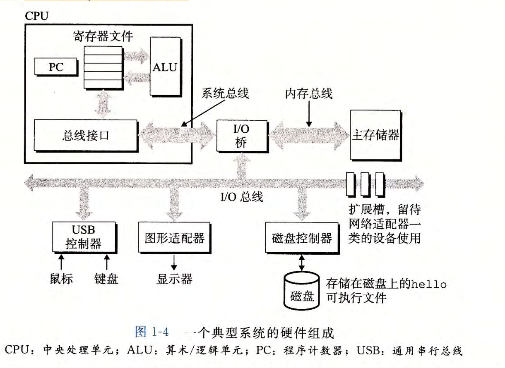

# 计算机系统漫游
## 1.1 信息就是位+上下文
hello程序的生命周期是从一个源程序（或者说源文件）开始的，即程序员通过编辑器创建并保存的文本文件，文件名是hello.c。源程序实际上就是一个由值0和1组成的位（又称为比特）序列，8个位被组织成一组，称为字节。

hello.c 程序是以字节序列的方式储存在文件中的。每个字节都有 一 个整数值，对应于某些字符。

hello.c 的表示方法说明了一个基本思想：系统中所有的信息 包括磁盘文件、内存中的程序、内存中存放的用户数据以及网络上传送的数据，都是由一串比特表示的。区分不同数据对象的唯 一 方法是我们读到这些数据对象时的上下文。比如，在不同的上下文中，一个同样的字节序列可能表示一个整数 、 浮点数、字符串或者机器指令。

## 1.2 程序被其他程序翻译成不同的格式
目标程序也称为可执行目标文件。

GCC编译器驱动程序读取源程序文件hello.c,并把它翻译成一个可执行目标文件hello。这个翻译过程可分为四个阶段完成，执行这四个阶段的程序（预处理器、编译器、汇编器和链接器）一起构成了编译系统。

    预处理阶段。预处理器(cpp)根据以字符＃开头的命令，修改原始的C程序。

    编译阶段。编译器(ccl)将文本文件hello.i翻译成文本文件hello.s,它包含一个汇编语言程序。

    汇编阶段。接下来，汇编器(as)将 hello.s翻译成机器语言指令，把这些指令打包成一种叫做可重定位目标程序(relocatable object program) 的格式，并将结果保存在目标文件hello.o中。

    链接阶段。请注意，hello程序调用了printf函数，它是每个C编译器都提供的标准C库中的一个函数。

## 1.3了解编译系统如何工作是大有益处的
1. 优化程序性能
2. 理解链接是出现的错误
3. 避免安全漏洞

## 1.4 出读取读取并解释存储在内存中的指令
### 1.4.1 系统硬件组成
1. 总线
1. 总线
贯穿整个系统的是一组电子管道，称作总线，它携带信息字节并负责在各个部件间传递。通常总线被设计成传送定长的字节块，也就是字(word)。字中的字节数（即字长）是一个基本的系统参数，各个系统中都不尽相同。现在的大多数机器字长要么是4个字节（32位），要么是8个字节（64 位）。

2. I/O设备
I/O（输入／输出）设备是系统与外部世界的联系通道。我们的示例系统包括四个 I/O 设备：作为用户输入的键盘和鼠标，作为用户输出的显示器，以及用于长期存储数据和程序的磁盘驱动器（简单地说就是磁盘）。

每个I/O设备都通过一个控制器或适配器与I/O总线相连。控制器和适配器之间的区别主要在于它们的封装方式。控制器是I/O 设备本省或者系统的主印制电路板（主板）伤的芯片组。而适配器则是一块插在主板插槽上的卡。它们的功能都是在I/O总线和I/O设备之间传递信息。

3. 主存
主存是一个临时存储设备，在处理器执行程序时，用来存放程序和程序处理的数据。从物理上来说，主存是由一组动态随机存取存储器(DRAM)芯片组成的。从逻辑上来说，存储器是一个线性的字节数组，每个字节都有其唯一的地址（数组索引），这些地址是从零开始的。一般来说，组成程序的每条机器指令都由不同数量的字节构成。与C程序变量相对应的数据项的大小是根据类型变化的。

4. 处理器
中央处理单元(CPU),简称处理器，是解释（或执行）存储在主存中指令的引擎。处理器的核心是一个大小为一个字的存储设备（或寄存器），称为程序计数器(PC)。在任何时刻，PC都指向主存中的某条机器语言指令（即含有该条指令的地址）。

