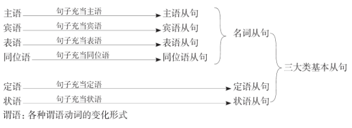
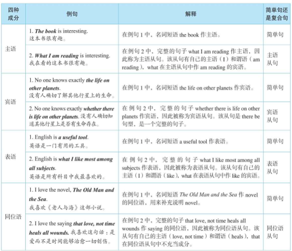
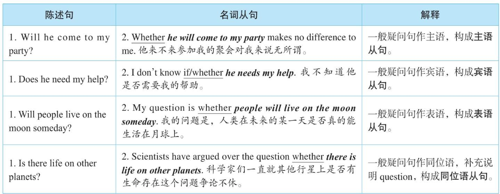
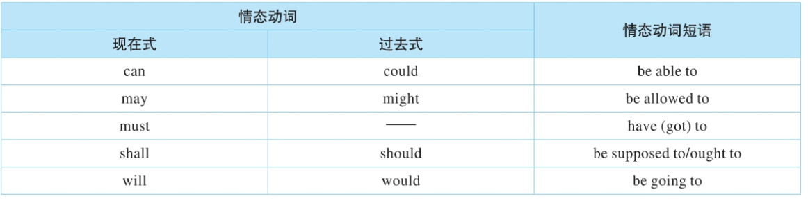

# 1 简单句与复合句
## 1.1 引言
英语的句子结构是非常有规律的，一个完整的句子都是由两部分组成：“陈述对象陈述内容”。这里的陈述对象一般是由名词或相当于名词的成分来充当，用语法术语来说叫主语。而陈述内容则是说明主语怎么样了，都是用动词来表达，我们称之为谓语。因此，一个完整的英文句子就是：“主语+谓语”。

有了主语和谓语动词之后，一个句子的基本骨架结构就成形了，但意思往往还不完整，还需要在动词后面接其他成分。具体接什么成分，这是由谓语动词决定的，动词决定了一个句子是否有宾语，或者有几个宾语，或者是否需要补足语以及状语。因此，谓语动词决定了一个句子的骨架结构。这就给了读者两点启示：第一，在分析复杂的难句结构时，首先要找到句子的谓语，包括主句的谓语以及各个从句的谓语；第二，写句子时，一定要知道谓语动词的用法特点，比如该动词后面是否能接宾语，接什么形式的宾语，接不定式作宾语还是动名词作宾语等等，这些问题无不由谓语动词决定。所以，在下列句型分析中，读者要特别注意每一种句型的谓语动词的特点。

## 1.2 句型一：主语+系动词+表语
### 1.2.1 谓语动词的特点
该句型的谓语动词是系动词（linking verb）（如be或其他系动词）。系动词，又叫连系动词，顾名思义，这种动词并没有具体的动作，而只是起连接主语和后面成分的作用。这种动词后面所接的成分用来说明主语的特点，表明主语的性质特征，因此被称为主语补足语或表语（能表示主语特征的成分），这就是读者熟悉的“主系表”句型。

一、单纯表示主语的特征或状态

这样的系动词有feel，look，sound，taste，smell，seem和appear等。请看例句：

   The iron feels hot.这块铁摸起来很热。

   The rose doesn’t smell much.这枝玫瑰花不是很香。

二、表示主语由一种状态转变为另一种状态

这样的系动词有become，grow，get，turn，fall，go和come等。请看例句：

   The leaf will turn yellow in autumn. 叶子秋天就会变黄。

   The teacher became angry.老师生气了。

  fall, go和come等词作系动词时，与形容词连用一般具有固定的搭配关系。请先看下面含有fall的例子：

   Our supplies of sugar and rice fell short.我们的糖和大米供应不足。

   The jokes fell flat.这个玩笑毫无效果。

   The book was old and soon fell apart.这本书很旧，很快就散了。

   fall due 到期

   fall asleep 睡着

  因为这里的fall都是作系动词，所以其后面不能接shortly或flatly这样的副词，即不能说fall shortly*或fall flatly*等。

  请看go作系动词的例子：

   go hungry 饿了，挨饿

   go mad 变疯了

go作系动词时，一般用于贬义，即表示主语是朝着坏的或消极的一面改变。相反，come作为系动词，则是表示褒义的，即表示主语是朝着好的或积极的一面改变。

三、表示主语保持某种状态

这样的系动词有continue，remain，stay，keep，hold，rest和prove等。请看例句：

  He has fallen into the habit of doing morning exercises to stay healthy.

  妙语点睛　不要说stay healthily*，因为副词healthily不能作表语。

  精品译文　为了保持健康，他已经养成了晨练的习惯。

  四、近似不及物动词的系动词

  近似于不及物动词的系动词有 sit，act，arrive，blush，marry，die和be born等。有人将其称为“半系动词”，因为它们介于不及物动词和系动词之间。

### 1.2.2. 简单句叠加成复杂难句
  Vitamins are organic compounds.

  妙语点睛　这个句子的主语是vitamins，谓语是系动词are，名词短语organic compounds是表语。

  精品译文　维生素是一种有机化合物。

  这个句子很简单，但现在要逐步将其复杂化。比如在名词compounds后面添加一个后置定语，如下句：

  Vitamins are organic compounds necessary for the normal growth of life.

 这里我们添加了一个形容词短语necessary for the normal growth of life，将其后置修饰名词compounds。

  精品译文　维生素是一种有机化合物，是生命正常生长所必不可少的。

  我们进一步把后置定语复杂化，比如下句：

  Vitamins are organic compounds necessary for the normal growth and maintenance of life of animals, including man.

  妙语点睛　这里的形容词短语是necessary for the normal growth and maintenance of life of animals, including man，依然将其后置修饰名词compounds。

  精品译文　维生素是一种有机化合物，是所有动物（包括人类）正常生长和生命延续所必不可少的。

## 1.3 句型二：主语+谓语
### 1.3.1 谓语动词的特点
该句型的谓语动词是不及物动词（intransitive verb），所表示的动作没有作用对象，其本身意思完整，其后不需带宾语。比如1.2.1小节中关于苍鹰的那个故事，只含有“主谓”结构的句子包括：

  The egg hatched.

  The little eagle grew up.

  It clucked and cackled.

  妙语点睛　这三个句子的主语分别是the egg，the little eagle和it，而谓语动词分别是hatched，grew up和clucked and cackled，其中，最后一句话的谓语是并列谓语，即有两个动词clucked和cackled充当谓语。这些动词都是不及物动词，所以没有接宾语。

  精品译文　1. 这枚蛋孵化成了一只小鹰。

    2. 小鹰慢慢长大了。

    3. 它发出咯咯的叫声。

  尽管这个句型里没有宾语，但是在谓语动词后面往往会接状语，用来修饰谓语动词，比如表示动作发生的地点等。
### 1.3.2 简单句叠加成复杂难句
  了解“主谓”句型结构之后，下面举例说明该句型如何演变为一个结构较为复杂的难句，以使读者了解简单句与复杂句之间的联系。请看例句：

  This trend began during the Second World War.

  妙语点睛　该句的主语是this trend，谓语began是一个不及物动词，后边没有带宾语。介词短语during the Second World War作时间状语。

  精品译文　这种趋势始于第二次世界大战期间。

  下面开始一步步把这个句子复杂化。比如：

  This trend began during the Second World War, when several governments came to the conclusion.

  妙语点睛　这里加了一个定语从句when several governments came to the conclusion，来修饰时间the Second World War。这个定语从句是一个“主语+谓语+宾语”的句型，主语是several governments，谓语是动词短语came to，宾语是the conclusion。

  精品译文　这种趋势始于第二次世界大战期间，当时一些国家的政府得出这样的结论。

  我们再进一步把这个句子复杂化，比如：

  This trend began during the Second World War, when several governments came to the conclusion that the specific demands cannot generally be foreseen in detail.

  妙语点睛　这里添加了一个同位语从句that the specific demands cannot generally be foreseen in detail，补充说明conclusion。这个同位语从句也是一个“主语+谓语”的句型，这里的主语是the specific demands，谓语是一个被动结构cannot generally be foreseen，介词短语in detail作状语。

  精品译文　这种趋势始于第二次世界大战期间，当时一些国家的政府得出结论：具体要求通常是无法详尽预见的。

  综上所述，上面这个复杂的句子其实是由四个简单句叠加而成的，即有两个“主语+谓语”结构的句子：this trend began during the Second World War和the specific demands cannot generally be foreseen in detail，还有两个“主语+谓语+宾语”结构的句子：several governments came to the conclusion 和 a government wants to make of its scientific establishment.

## 1.4 句型三：主语+谓语+宾语
### 1.4.1 谓语动词的特点
该句型的谓语动词是及物动词（transitive verb），这种动词告诉我们由主语发出的动作所作用的对象是什么，这个“所作用的对象”就是通常所说的宾语，即宾语是主语动作的承受对象。因此，这类动词是带有宾语的。英文中绝大多数动词都是及物动词。
### 1.4.2 简单句叠加成复杂难句
  讨论完“主谓宾”句型结构之后，下面将举例说明该句型如何演变为一个结构较为复杂的难句，使读者了解简单句与复杂句之间的联系。请看例句：

  The emphasis helped to obscure the great importance.

  妙语点睛　该句的主语是the emphasis，谓语是helped，宾语是不定式短语to obscure the great importance。

  精品译文　这种强调模糊了这一重要性。

  下面开始一步步把这个句子复杂化，比如：

  The emphasis given by both scholars and statesmen helped to obscure the great importance.

  妙语点睛　这里是在主语emphasis后面添加了一个分词短语given by both scholars and statesmen，作后置定语，表明是谁在强调。

  精品译文　学者和政治家们的这种强调模糊了这一重要性。

  The emphasis given by both scholars and statesmen to the presumed disappearance of the American frontier helped to obscure the great importance.

  妙语点睛　这里添加了一个介词短语to the presumed disappearance of the American frontier。这个介词短语修饰哪个部分呢？其实这个介词短语是补充说明主语emphasis的，表明强调的内容是什么。

  精品译文　学者和政治家们强调美国边疆消失的假设，这种强调模糊了这一重要性。

  综上所述，这个复杂的句子其实就是一个“主语+谓语+宾语”的句型，即the emphasis…helped to obscure the great importance…。其内部又带有一个“主语+谓语”的句型，即that occurred…。

## 1.5 句型四：主语+谓语+间接宾语+直接宾语
### 1.5.1 谓语动词的特点
该句型的谓语动词是双宾动词（dative verb），这种动词后面所接的成分有人又有物。一般来讲，这里的“人”表示动作的接受者，称作间接宾语（indirect object）；“物”表示动作作用的对象，是动作的承受者，称作直接宾语（direct object）。间接宾语和直接宾语合起来称为双宾语。

 He showed the guard（间接宾语）his passport（直接宾语）.

  妙语点睛　对于这个句型，一般可以进行这样的改写，即把直接宾语提前至谓语后面，然后添加介词to或for，再把间接宾语放在介词后面。比如上面这个句子可以改写成“He showed his passport to the guard.”。

  精品译文　他把护照给门卫看了。

  选择介词for还是to，取决于谓语动词。具体详述如下：

  1. 同show一样，当间接宾语后移时，间接宾语前需带介词to，表示间接宾语是动作的接受者。这样的动词有：assign，award，bring，deliver，deny，feed，give，grant，hand，lend，offer，owe，pass，pay，promise，post，read，recommend，sell，send，show，take和write等等。
  2. 同buy一样，当间接宾语后移时，间接宾语前需带介词for。这样的动词有：book （预订），buy，build，change，choose，cook，fetch，find，get，keep，make，order，prepare和sing等等。

  3. 有个别动词只用于“主语+动词+间接宾语（+直接宾语）”的结构，而不用介词来替换。这样的动词有：charge，cost和bet等等。

  此外，还有更特殊的动词（如ask）当间接宾语后移时，间接宾语前需带介词of。
### 1.5.2 简单句叠加成复杂难句
 讨论完“主谓双宾”的句型结构之后，下面将举例说明该句型如何演变为一个结构较为复杂的难句，使读者了解简单句与复杂句之间的联系。请看例句：

  Her work won her the Nobel Prize in 1983.

  妙语点睛　该句的动词won是一个双宾动词，其后要接双宾语，即win sb. sth.，表示“为某人赢得某物”。这里的her是间接宾语，the Nobel Prize是直接宾语。

  精品译文　她的工作使她赢得了1983年的诺贝尔奖。

  Her work in genetics won United States scientist Barbara McClintock the Nobel Prize in 1983.

  妙语点睛　这句话的间接宾语较长，即United States scientist Barbara McClintock，直接宾语是the Nobel Prize，原句型仍为win sb. sth.，即表示“为某人赢得某物”。

  精品译文　芭芭拉·麦克林托克在遗传学领域的研究成果使她赢得了1983年的诺贝尔奖。
## 1.6 句型五：主语+谓语+宾语补足语
### 1.6.1 谓语动词的特点
 该句型的谓语动词是宾补动词（factitive verb），这种动词后面接宾语，而此宾语后又接补充说明宾语的补足语（object complement）。宾语和宾语补足语合起来称为复合宾语。

  常见的带复合宾语的动词有：appoint，believe，call，choose，consider，declare，elect，feel，find，keep，leave，let，make，name，nominate，prove，see，suppose和vote等等。

### 1.6.2 区分双宾语和复合宾语
 有些读者不能区分双宾语和复合宾语，尤其是当两者都是“动词+人+物”这样的结构时。其实，区分这两种宾语的方法很简单，就是在宾语后面加上be动词，若能构成一个语义通顺的句子，即是补足语。因为宾语与宾语补足语的语义关系就相当于主语与主语补足语的关系，即类似一个主系表结构，所以，在宾语后面添上一个be动词，自然应该能构成一个逻辑语义通顺的句子。而间接宾语与直接宾语二者之间就没有这样的语义关系，所以，添上be之后，自然不能构成一个语义通顺的句子

### 1.6.3 简单句得加成复杂难句

 讨论了“主谓+复合宾语”的句型结构之后，下面举例说明该句型如何演变为一个结构较为复杂的难句，使读者了解简单句与复杂句之间的联系。请看例句：

  Willa Cather considered this novel her best work.

  妙语点睛　该句的动词considered是一个宾补动词，其后不但要带宾语this novel，还要接宾语补足语her best work，补充说明前面的宾语。若只说“Willa Cather considered this novel.*”，这句话的意思显然不完整，于是要对this novel补充一下，加上补足语her best work，说成“Willa Cather considered this novel her best work.”。这样句子的意思才完整。

  精品译文　薇拉·凯瑟认为这部小说是她最好的一部作品。

  现在可以把这句话稍微变得复杂一点，比如把宾语复杂化，如下句所示：

  Willa Cather considered her novel of life in nineteenth-century Nebraska, My Antonia her best work.

  妙语点睛　这句话的宾语较长，是her novel of life in nineteenth-century Nebraska, My Antonia，其中My Antonia是小说的名字，与名词短语her novel of life in nineteenth-century Nebraska构成同位语。宾语补足语是her best work。

  精品译文　薇拉·凯瑟认为她的那部描写19世纪内布拉斯加州生活的小说《我的安东尼亚》是她最好的一部作品。

## 1.7 从简单句到复合句
 一般来讲，一个句子除了有主语和谓语之外，其他可能包含的成分还有宾语、表语、定语、状语、补语和同位语等。在这些成分中，谓语较为特殊，只能由动词（短语）来充当，而其他成分则可以由词、短语或者句子来充当。如果用一个完整的句子来充当另一个句子的某个成分时，即构成相应的从句。请看如下图表：

 从以上图表看出，谓语是不能用句子来充当的，否则就会有“谓语从句”了。而其他成分可以用句子来充当，于是便有了三大从句。具体分类如下：

  1. 名词从句：包括主语从句、宾语从句、表语从句和同位语从句。我们知道，名词在英语句子中可作主语、宾语、表语和同位语这四种成分，因而这四种从句在句子中的作用相当于名词，故将此四类从句又统称为名词从句。

  2. 形容词从句：或叫关系从句（relative clause）或定语从句。因为形容词最大的特点就是在句中起限定或修饰作用，用作定语，故常称为定语从句。

  3. 副词从句：副词在英语中常用来修饰动词、形容词和副词，用作状语，故又称为状语从句。

# 2 名词从句
## 2.1 简单句与名词从句
### 2.1.1 何谓名词从句
在英语中，名词或名词短语主要充当四种句子成分：主语、宾语、表语和同位语（见下表中的各例句1）。如果把句子当作名词来用，分别充当另一句话的主语、宾语、表语或同位语（见下表中的各例句2），于是便构成了四种从句：主语从句、宾语从句、表语从句和同位语从句。因为这四种从句在本质上相当于名词，所以将其统称为名词从句。请看下表：

### 2.1.2 陈述句作句子成分

一、要在陈述句句首加上that

当把一个完整的陈述句（见下表中的各例句1）当作名词来使用时，需要在陈述句句首加that，然后可使“that+陈述句”这一结构分别充当另一个句子的主语、宾语、表语或同位语等四种成分（见下表中的各例句2），即构成主语从句、宾语从句、表语从句或同位语从句。

二、为什么要加that?

  That English is important（主语从句）is an undoubted fact（谓语部分）.

  妙语点睛　假如把that去掉，上句就变成“English is important is an undoubted fact.”。

  这句话就有两个中心谓语部分，即is important和is an undoubted fact。但是，在英语中，句子的核心意思主要是靠谓语部分来表达的，一个句子只表达一个核心意思（因为我们说话要一句一句地说），也就只能有一个谓语部分。现在这个句子有两个谓语部分，势必会造成读者混淆不清，因为他会先读出English is important，这表示“英文很重要”，可是当他继续往下读时，又出现了is an undoubted fact这个谓语部分。于是整个句子“English is important is an undoubted fact.”就会让人感到“丈二和尚摸不着头脑”。读者就会纳闷：你要表达的意思到底是“某个东西重要（something is important）”，还是要说“某个东西是事实（something is an undoubted fact）”？

  为了避免混淆，在句首加上一个标志that，这里的that就相当于一个指路牌，它的出现就等于是在告诉读者：that后面紧接着的句子是要作为另一个句子的某一个成分来使用的，不是要表达的核心意思。因此，当读者读到“ That English is important…”，他就会知道这个句子的核心意思并没有讲出来，他一定会期待着句子接下来的中心意思。当他读到“…is an undoubted fact”时，他知道了，句子要表达的意思是“英语很重要，这是一个毋庸置疑的事实”，而不是要说“英语很重要”。

  在陈述句作名词从句时，需要添加that，这个that相当于一个“指路牌”，能够帮助我们指明断句的方向，不引起对句子的误解。
### 2.1.3 一般疑问句作句子成分

一、用whether或if引导

当把一个一般疑问句（见下表中的各例句1）当作名词来使用时，需要先将疑问句的倒装语序变成陈述句语序，并在句首加上whether或if （if只用在宾语从句中）来引导，以保留原句的疑问意义。然后，用“whether+陈述句”这一结构分别充当另一个句子的主语、宾语、表语或同位语等四种成分（见下表中的各例句2），即构成主语从句、宾语从句、表语从句或同位语从句等四种名词从句。

二、if还是whether？

对于if和whether这两个连词，其用法有以下区别：

  1. if一般只用于引导宾语从句，而whether可引导包括宾语从句在内的其他名词从句。

  If he comes or not makes no difference. *

  妙语点睛　这个句子不妥，应改为“Whether he comes or not makes no difference.”。这里是主语从句，应由whether引导。

  精品译文　他来不来无关紧要。

  The question is if he will come. *

  妙语点睛　这个句子不妥，应改为“The question is whether he will come.”。这里是表语从句，应由whether引导。

  精品译文　问题是他是否会来。

  2. if不和or not直接连用，即一般不说if or not，但可以说if…or not。而whether没有此限制。

  I don’t know if or not he comes. *

  I don’t know whether or not he comes.

  妙语点睛　例句1）错误，因为if和or not不能直接连用，即不能说成if or not。例句2）正确。

  精品译文　我不知道他是否会来。

### 2.1.4 特殊疑问句作句子成分

一、变倒装语序为陈述句语序

当把一个特殊疑问句（见下表中的各例句1）当作名词来使用时，需要先将疑问句的倒装语序变成陈述句语序，然后分别充当另一个句子的主语、宾语、表语或同位语等四种成分（见下表中的各例句2），即构成主语从句、宾语从句、表语从句或同位语从句等四种名词从句。

二、特殊疑问词作主语，无需调整句子语序

需要注意的是，如果特殊疑问词在句中作主语，则特殊疑问句无需调整语序而直接作成分，因为此时的问句即是一个陈述句语序。请看例句：

  Who will chair the meeting?

  Who will chair the meeting has not yet been decided.

  妙语点睛　在例句1）中，特殊疑问词who作主语，此时整个问句“Who will chair the meeting?”是一个“主语+谓语”结构的陈述句语序，因此用该问句作成分时，无需调整语序，而直接在例句2）中充当主语，构成一个主语从句。

  精品译文　1）谁将会主持这个会议？

  2）谁将会主持这个会议，目前还没有决定。

### 2.1.5 引导名词从句的连接词

  第一，对于陈述句，连接词that是后来添加的，此时的that自然不充当从句里的任何成分，而且也没有任何意义，只起连接主句和从句的作用。

  第二，对于一般疑问句，连接词whether也是后来添加的，目的是为了保留疑问的意义，表示“是否”，即whether是有意义的，这不同于that。而与that相同的是，whether也不充当任何句子成分。

  第三，对于特殊疑问句，不需要添加任何连接词，因为特殊疑问词就充当了连词的作用，从而变成了相应的连接词，只需要把倒装语序还原成陈述句语序就可以了。这些特殊疑问词都是在句中充当各种成分的，比如连接代词可以充当主语、宾语或表语，而连接副词则充当状语。

  需要提醒大家注意的是，要特别关注这些连词是否在句子中充当成分。比如，that不能充当任何成分，只起连接作用，后面要接陈述句；what一定是充当从句的主语或宾语等成分；which和whose后面都要接名词等等。

## 2.2 简单句与主语从句
### 2.2.1 陈述句作主语

 把“that+陈述句”这一结构放在主语的位置即构成主语从句。请看例句：

  That the seas are being overfished has been known for years.

  妙语点睛　这里that引导的从句that the seas are being overfished是一个主语从句，直接置于主语的位置。

  精品译文　海洋正在被人类过度捕捞，多年以来这已是尽人皆知的。

 对于陈述句作主语，更常见的是用it作形式主语置于句首，而将主语从句放在句末。因此上面各句可分别改为：

  It has been known for years that the seas are being overfished .

  一、It is+过去分词+that从句

  I t’s reported that…（据报道……）

  It’s believed that…（人们相信……）

  I t is generally thought that…（人们普遍认为……）

  It should be noted that…（应当注意……）

  I t has been found that…（现已发现……）

  It must be pointed out that…（必须指 出……）

  类似动词还有say，expect，know，estimate和forecast等。请看例句：

  As a child and as an adult as well, Bill Gates was untidy. It has been said that in order to counteract this, Mary drew up weekly clothing plans for him. 不论是在小时候还是长大成人以后，比尔·盖茨都是不修边幅的。据说为了让他改掉这个习惯，玛丽专门为他制定了一周的着装计划。

  二、It is+形容词+that从句

  I t is clear that…（显然……）

  It is possible that…（很可能……）

  I t is likely that…（很可能……）

  It is natural that…（很自然……）

  I t is certain that…（可以相信……）

  It is strange that…（奇怪的是……）

  I t is fortunate that…（幸运的是……）

  It is necessary that…（有必要……）

  It is true that English is becoming an international language. 的确，英语正日益成为一门国际通用语言。

  三、It is+名词短语+that从句

  常用的名词有：a pity，a shame，an honor，a good idea和no wonder等等。

  I t is a pity that…（可惜的是……）

  It is a fact that…（事实是……）

  I t is good news that…（……真是太好了）

  It is a good thing that…（……真是件好事）

  I t is no wonder that…（难怪……）

  It is a shame that…（遗憾的是……；……真是太不像话了）

  I t is an honor that…（真荣幸……）

  It is common knowledge that…（……是常识）

  I t is my belief that…（我相信……）

  It is a miracle that…（……真是奇迹）

  It is common knowledge that the whale is not a fish. 鲸鱼不是鱼类，这是一个常识。

### 2.2.2 一般疑问句作主语

 一般疑问句作主语时，要把一般疑问句变成陈述句，并且用whether来引导，然后充当句子的主语，即构成主语从句。请看例句：

  Whether he comes or not makes no difference to me. 他来不来对我来说无所谓。

### 2.2.3 特殊疑问句作主语
  What we need is a wholly new kind of police force.

  妙语点睛　这里的特殊疑问词what是作need的宾语，所以需将原来的倒装句what do we need调整为陈述句语序what we need，然后作主句的主语，即构成主语从句。

  精品译文　我们需要的是一个全新的警察机构。

## 2.3 简单句与宾语从句
### 2.3.1 陈述句作宾语

  把“that+陈述句”这一结构放在宾语的位置即构成宾语从句。请看例句：

  We know (that) the world is round .我们知道，地球是圆的。

  I think (that) a sound knowledge of grammar is indispensable to good writing .我认为扎实的语法功底对良好的写作极为重要 。

  需要提醒读者注意的是，只有宾语从句中的that才可以省去（在不影响对句意的理解的情况下），而主语从句、表语从句和同位语从句中的that一般不能省去。

### 2.3.2 一般疑问句作宾语

  把“whether / if+陈述句”这一结构放在宾语的位置即构成宾语从句。请看例句：

  I don’t know if / whether he needs my help .我不知道他是否需要我的帮助。

  No one knew whether or not interest rates would rise .

  妙语点睛　这里原来的一般疑问句是would interest rates rise，变成陈述句语序后成为interest rates would rise，然后为了保留疑问的意义又添加了whether or not，于是便有了whether or not interest rates would rise，在主句的谓语knew后面作宾语，即构成宾语从句。需要提醒读者注意的是，因为一般不说if or not，所以这里的连词不宜用if，而要用whether。

  精品译文　没有人知道利率是否会提高。

  注意：只有宾语从句才可以用if引导，主语从句、表语从句和同位语从句一般都要用whether引导。

### 2.3.3 特殊疑问句作宾语
  把特殊疑问句变成陈述句语序后放在宾语的位置即构成宾语从句。请看例句：

  I have not decided whom I should vote for .

  妙语点睛　这里的特殊疑问词whom是作vote for的宾语，所以需将原来的倒装句whom should I vote for调整为陈述句语序whom I should vote for，然后作主句谓语decided的宾语，即构成宾语从句。

  精品译文　我还没有决定该投谁一票。

  No one knows exactly how speech began .

  妙语点睛　这里的特殊疑问词how是作began的方式状语，所以需将原来的倒装句how did speech begin调整为陈述句语序how speech began，然后作主句谓语knows的宾语，即构成宾语从句。

  精品译文　没有人确切地知道语言是如何产生的。

## 2.4 简单句与表语从句
### 2.4.1  陈述句作表语
 把“that+陈述句”这一结构放在表语的位置即构成表语从句。请看例句：

  My idea is that the child should be sent to school .我的看法是，应该把这个孩子送去上学。

### 2.4.2 一般疑问句作表语
 把“whether+陈述句”这一结构放在表语的位置即构成表语从句。请看例句：

  My concern is whether he comes or not .我关心的是他到底来不来。

### 2.4.3 特殊疑问句作表语

 把特殊疑问句变成陈述句语序后放在表语的位置即构成表语从句。请看例句：

  Change is what keeps us fresh and innovative. Change is what keeps us from getting stale . Change is what keeps us young .变革能使我们保持思维敏锐，富有创造性。变革能防止我们思想僵化。变革能使我们永葆青春。

## 2.5 简单句与同位语从句
### 2.5.1 陈述句作同位语
  把“that陈述句”这一结构放在同位语的位置即构成同位语从句。请看例句：

  He was prepared to prove his theory that two different weights would fall to the ground at the same time .

  妙语点睛　这里的先行词是his theory，同位语从句是that two different weights would fall to the ground at the same time。

  精品译文　他准备证明他的这一理论：两个重量不同的物体将同时落地。

  Dreary months dragged by before the tragic news reached her that her beloved brother had been killed for anti-Nazi activities .

  妙语点睛　这里的先行词the tragic news与同位语从句that her beloved brother had been killed for anti-Nazi activities被reached her隔开。

  精品译文　在狱中度过数月梦魇般的日子后，突然有一天传来噩耗：她亲爱的哥哥在反法西斯活动中被杀害了。

### 2.5.2 一般疑问句作同位语
  把“whether+陈述句”这一结构放在同位语的位置即构成同位语从句。请看例句：

  They are faced with the problem whether they should continue to work . 他们面临这样一个问题：他们是否应该继续工作。

### 2.5.3 特殊疑问句作同位语
把特殊疑问句变成陈述句语序后放在同位语的位置即构成同位语从句。请看例句：

I have no idea when he will return .我不知道他什么时候回来。

  最后需要说明的是，同位语从句主要是由that引导，而很少用whether以及连接代词或连接副词引导，这是因为我们多是用陈述句来补充说明名词的内容，而很少用一般疑问句或特殊疑问句来补充说明名词的内容。

# 3 定语从句
## 3.1 定语从句概述
### 3.1.1 形容词作定语与从句作定语比较
 定语从句是英语里最为重要的语法项目之一，因为当要表达复杂的意思时，往往需要借助于定语从句来完成，即要用定语从句来修饰某个名词或名词短语。比如当我们说“我不喜欢懒人”，这时只需要用一个形容词lazy来作定语就可以。这句话可以这样说：

  I don’t like lazy people.

  但是，如果要表达稍微复杂一点的意思，比如说“我不喜欢不守信用的人”，这时，简单地用形容词作定语就无能为力了，就要借助于一个句子来修饰名词，用作名词的定语，对名词进行限制。这句话可以这样说：

  I don’t like people who never keep their word .

  lazy是作定语修饰people，而who never keep their word也是作定语修饰people，前者只是单个的形容词，而后者是一个有着完整主谓结构的句子，故称后者为定语从句，即用作定语功能的从句。说它是“从句”，因为I don’t like people是这句话的主句。

 ### 3.1.2 定语从句的两个重要概念：先行词和关系词
  一、 先行词

  被定语从句所修饰的对象称为先行词。上一节例句中的people即为先行词。

  二、关系词

  重复指代先行词、起连接主句和从句的作用，并且在定语从句中充当一定成分的连接词称为关系词。上一节例句2中的who即为关系词。关系词有两个作用：

  1. 代词的作用： 重复指代先行词并且在定语从句中充当一定成分，如上一节例句2中的who指代people并且作从句的主语；

  2. 连接作用： 即连接主句和从句，如上一节例句2中的who起着连接主句I don’t like people和从句who never keep their word的作用。

## 3.2 关系词在定语从句中充当的成分
### 3.2.1 关系词用作从句的主语
  The woman is a famous dancer and she lives next door.

  妙语点睛　上述两个简单句中有一个“重复元素”，这里的she指代the woman，即两句之间有一个交叉点，而通过这个交叉点建立起两句之间的联系。现在要用she lives next door来作定语修饰the woman，以告诉对方哪位女士是舞蹈演员。而在定语从句中，指代“人”的关系词要用who。前面说过，关系词既具有代词的作用又起着连词的作用，因此，上句可改写成：

  The woman is a famous dancer who (=and she) lives next door.

  由此看到，这里的关系词who既取代了代词she也取代了连词and，即who既具有代词的作用也起着连接的作用。另外，定语从句一般要紧跟在它所修饰的名词后面。因此，上一句又可进一步改写成：

  The woman who lives next door is a famous dancer.

  到此，一个标准的定语从句“制造”完毕。

  关系词who既指代the woman，同时又在从句中作成分——从句的主语，而且还替换了and，起着连词的作用。

  精品译文　这位女士是一名著名的舞蹈演员，她就住在我家隔壁

  过以上的变换操作过程，总结出以下三点，提醒读者注意：

  一、用关系词who代替人称代词（如she或they）后，定语从句里就不能再保留这些代词了。比如不能说：

  The woman who she lives next door is a famous dancer. *

  I like guys who they have a good sense of humor. *

  因为who在从句中作主语，所以不必重复代词（如she或they）了。

  二、细心的读者也许已经注意到了，上述两个定语从句who lives next door和who have a good sense of humor分别修饰的名词woman和guys，它们在各自的主句中充当的成分不同：woman作主语（the woman is a famous dancer），而guys是作宾语（I like guys）。事实上，定语从句可以修饰一个主句当中的任何一个名词。但是，我们关注的往往是关系词在定语从句中所充当的成分，不关心定语从句是修饰主句的哪个名词。

  三、关于定语从句的主谓一致的问题。我们看到，同样是who作主语，但是who lives next door的谓语动词lives是第三人称单数形式，即词尾加了-s；而who have a good sense of humor的谓语动词have却不是第三人称单数形式。读者或许就有一个疑问：为什么同样的主语who竟然会接两种不同形式的谓语呢？这里其实涉及关系词who的指代问题，也就是说，定语从句的谓语动词形式是由关系词所指代的先行词来决定的，而不是取决于关系词本身。定语从句who lives next door中的who指代的woman是单数名词，故谓语用单数的lives；而定语从句who have a good sense of humor中的who指代的guys是复数名词，故谓语用复数的have。这也进一步验证了，关系词是有指代作用的（同时具有连词作用）。

### 3.2.2 关系词用作从句中的动词的宾语
关系词除了像上面讨论的在定语从句中作主语外，还可以在从句中作宾语。而且，还可以进一步区分为从句动词的宾语和从句介词的宾语。

I’d really like to find a friend who I can trust…completely.

这里的who虽然发生了移位，但依然充当从句动词trust的宾语。用“…”表示trust的宾语是存在的，只不过发生了移位，移到了从句的开头，由who来充当。因此，这里的关系词who是充当从句的宾语。既然从句的谓语trust有宾语了，原来的him就要去掉，所以不能这样说：

I’d really like to find a friend who I can trust him completely. *

综上所述，最后带有定语从句的完整句子就是：

I’d really like to find a friend who I can trust completely . 我想找一个我完全能够信任的人做朋友。

### 3.2.3 关系词用作从句中节词的宾语
 I hope I never have a boss who I can’t talk to about my problems.

  妙语点睛　这里的who充当介词to的宾语。

  精品译文　我不希望有一个无法与其谈论我的问题的老板。

### 3.2.4 作宾语的关系词可以省去
我们看到，关系词在定语从句中主要可以充当两种成分：主语或宾语（动词的宾语或介词的宾语）。至此，我们将讨论关系词的省略问题。英语里有这样的习惯：作宾语的关系词可以省去，不论关系词是作动词的宾语还是作介词的宾语都可以省去。比如以上各节中讨论过的相关例句，可以分别改写成：

  I’d really like to find a friend ( ) I can trust completely.

  顺便提一句，在从句中作主语的关系词无法省去。比如不能说：

  I like guys ( ) have a good sense of humor. *

## 3.3 关系代词与先行词的搭配关系
### 3.3.1 先行词指“人”，用关系代词who或whom
一、先行词指“人”才能用who或whom

二、who和whom的区别

 1. who的前面不能与介词搭配使用

  因为who是主格形式，所以在介词的后面不能用who，比如不说with who*，而说with whom。请看例句：

  I’m talking about friends who you can share almost everything with.

  不能说“I’m talking about friends with who you can share almost everything. *”。

  而应该说“I’m talking about friends with whom you can share almost everything.”。

  主格形式的who除了作定语从句的主语外，还可以充当定语从句的宾语或表语。

 2. whom在定语从句中不能作主语，但可作宾语或表语

  A rich person is not one who has the most, but is one who needs the least.

  妙语点睛　这里的who作从句的主语，所以不能用whom，不说whom has…*。

  精品译文　一个富有的人，不是因为他拥有的最多，而是因为他需要的最少。

  Only the people who have the patience to do simple things

  妙语点睛　这里的who作从句的主语，所以不能用whom，不说whom have…*。

  精品译文　只有有耐心圆满完成简单工作的人，才能够轻而易举地完成困难的事。

  总之，who可以作主语，也可以代替whom作宾语或表语，但不能用在介词后面。而因为whom是宾格形式，所以不能作主语。

### 3.3.2 表示人或物的所有关系，用whose
 whose表示所有关系，其作用就如同物主代词my，your，her，his，their和our，whose的后面要接名词。whose可指人也可指物。“whose+名词”在从句中可作主语、动词的宾语或介词的宾语。

  Atlas (in Greek mythology) was a kneeling man on whose shoulder the world rested.

  妙语点睛　这里的whose shoulder作从句中的动词短语rested on的宾语，这里on被提前了。whose指人即man。

  精品译文　阿特拉斯是（希腊神话中的）一个大力神，他跪在地上，肩上背负着地球。

### 3.3.3 先行词指“物”，用关系代词which
关系词which的造句结构完全类似于前面讨论过的who，比如which可以作从句的主语或宾语，只不过which的先行词是“物”。

一、先行词是单个的名词

 Perhaps it is human to appreciate little that which we have and to long for that which we have not.

  妙语点睛　先行词是that，即which指单个的名词。

  精品译文　或许，“不惜已获，贪求不得”是人类共同的弱点吧。

二、先行词是一个短语

  which可以指代一个短语。请看例句：

  He likes climbing mountains, which is a good exercise.

  妙语点睛　先行词是主句中的一个动名词短语climbing mountains。

  精品译文　他喜欢爬山，这是一项很好的运动。

三、先行词是一个句子

  which可以指代前面的整个句子。请看例句：

  I became a single mother overnight, which is nothing like becoming famous overnight.

  妙语点睛　全句“I became a single mother overnight”作which的先行词。

  精品译文　我在一夜之间成了单亲妈妈，这跟一夜成名可完全不同。

### 3.3.4 that可以指代“人”，也可以指代“物”
关系代词that的意义和用法主要有以下三点：一是 that既可指“人”也可指“物”，指“物”时可以替换which，指“人”时可以替换who；二是that不用在非限制性定语从句中（关于限制性和非限制性定语从句，详见3.5节）；三是that不能用于介词的后面（同who一样）。

因为that的先行词既可以指“人”也可以指“物”，所以that可以用来替换who或which.

既然that可以指“物”也可以指“人”，那么就会涉及与which和who在用法上的区别的问题。为了便于记忆和使用，现列举出下面这些最好用that的情况：

  1. 先行词中同时出现“人”和“物”时，用that

  The writer and his novels that the article deals with are quite familiar to us.

  妙语点睛　这里的先行词是the writer and his novels，即同时有“人（writer）”和“物（his novels）”，所以要选用that引导定语从句。

  精品译文　这篇文章里所说的这个作家以及他的小说，我们都比较熟悉。

  2. 先行词为指“物”的all，little，few，much，none和the first时, 用that

  All that glitters is not gold.

  妙语点睛　这里的先行词是all，所以用that来引导定语从句。另外要注意的是，这里有一个半否定的问题：all…not要译成“并非都是”，不能译成全否定的“所有都不”。

  精品译文　闪光的并非都是金子.

  3. 先行词是不定代词something，anything，nothing和everything时，一般用that

  4. 先行词被any，only，all，every，no，some，much，few，little，序数词，形容词的最高级，the only，the one，the very，the right和the last 等成分修饰时，用that

  Tell us all things that you know. 把你知道的都告诉我们。

  5. that不用在非限制性定语从句中

  不用that引导非限制性定语从句。比如要说：

  I became a single mother overnight, which is nothing like becoming famous overnight.

  我在一夜之间成了单亲妈妈，这跟一夜成名可完全不同。

  不能说“I became a single mother overnight, that is nothing like becoming famous overnight. *”。

  6. that不能用于介词后面

  不能在that前面使用介词。比如要说：

  The world in which we live is made up of matter. 我们所生活的世界是由物质组成的。

  或：The world which we live in is made up of matter.

  或：The world that we live in is made up of matter.

  但不能说“The world in that we live is made up of matter. *”。

## 3.4 关系副词的用法
### 3.4.1 when的用法
一、先行词指时间

  when可以引导限制性和非限制性定语从句（关于这两类定语从句的区分，详见3.5节），其先行词必须是表示时间的名词，如day，year或time等。

  I’ll never forget the day when I met you .

  妙语点睛　这里的先行词是表示时间的名词day，所以用when引导定语从句。when作从句的时间状语，修饰谓语动词met。

  精品译文　我永远不会忘记我们见面的那一天。

二、关系副词when在从句中作时间状语

  在上面的例句中，我们反复强调when是在定语从句中作时间状语。换句话说，若定语从句不是缺少状语，而是缺少主语或宾语，那么即使先行词是表示时间的名词，也不能用when而要用which或that来引导定语从句。因为用when来引导定语从句的前提条件是：when 必须在其引导的定语从句中作时间状语。

  1） I’ll never forget the time which I spent on campus.

  2） I’ll never forget the day when we first met in the park.

  妙语点睛　在这两句话里，尽管先行词分别是表示时间的名词time和day，但用的关系词不同。在例句1）中，由于定语从句中的谓语spent缺宾语，因此关系词要充当这一宾语，故要用which。在例句2）中，定语从句不缺主语或宾语，而是缺少时间状语，故关系词用when，这里when作时间状语，修饰met。

  精品译文　1） 我永远不会忘记在大学

  2） 我永远不会忘记我们第一次在公园里相遇的那一天。

  The day, which began brightly, ended with a violent storm.

  妙语点睛　这里的先行词是day，表示时间。由于定语从句缺少主语，所以用关系代词which引导定语从句，which作从句的主语，而不用关系副词when，因为关系副词无法作主语，只能作状语。

  精品译文　那天，开始的时候还是阳光明媚，后来就下起了暴风雨。

### 3.4.2 where的用法
一、where的先行词指地点

 where引导定语从句，其先行词一般是表示地点的名词，如place和house等。请看例句：

  A: Since you work in the theater, can’t you get me a free ticket now and then?

  B: Certainly if you bring me a few notes now and then from the bank where you work!

  妙语点睛　这里的先行词bank表示地点，where在从句中充当地点状语（定语从句中不缺主语或宾语），修饰work。

  精品译文　A：既然你在剧院工作，那你就不能时常给我弄些免费的票吗？

  B：当然可以，只要你能够从你工作的那家银行里时常给我弄些票子出来。

二、关系副词where在从句中作地点状语

  与when类似，并不是先行词是表示地点的名词时，都得由where来引导定语从句，这得看关系词在从句中充当的成分。若定语从句缺主语或宾语，则要用which或that引导定语从句。请比较：

  1） This is the town where I spent my childhood.

  2） This is the town which I told you about before.

  妙语点睛　在这两句话里，尽管先行词都是表示地点的名词town，但用的关系词不同。在例句1）中，定语从句不缺少主语或宾语，而是缺少地点状语，故关系词用where。where作地点状语，修饰spent。在例句2）里，由于定语从句中的谓语部分told you about缺少宾语，因此关系词要充当这一宾语，故要用which。

  精品译文　1）这就是我度过童年的小城。

  2）这就是我以前告诉过你的小城。

### 3.4.3 why的用法

  why用来表示原因，只引导限制性定语从句，先行词是reason等表示原因的名词。

  This is the reason why I didn’t come here.

  妙语点睛　此处的why相当于for which。

  精品译文　这就是我没来的原因。

## 3.5 限制性与非限制性定语从句
### 3.5.1 限制性定语从句——不用逗号隔开

 限制性定语从句是用来对一个名词提供必要的信息（a defining relative clause defines or gives essential information about a noun），以说明定语从句所修饰的先行词的身份或性质，或用来限制先行词所指的范围。若去掉限制性定语从句，则主句部分的含义不明确，或意义不完整，所以不能用逗号来分隔先行词和定语从句。

  比如“I don’t like people.”，这句话的意思不明确，句意不完整，因此其后面必须加一个限制性定语从句，才能使句意完整。比如加上限制性定语从句后这么说：

  I don’t like people who are never on time . 我不喜欢不守时的人。

### 3.5.2 非限制性定语从句——用逗号隔开

  非限制性定语从句用来提供附加的而非必要的信息，只是对先行词做进一步的解释、补充或说明（a non-defining relative clause gives optional information about a noun）。若去掉此定语从句，整个主句的意义一样很明确，不会引起误解和歧义。一般来讲，下面这两种先行词，其后都宜用非限制性定语从句。

  一、专有名词

  如果定语从句修饰一个专有名词，一般要用逗号分隔先行词与定语从句，也就是说要使用非限制性定语从句。这是因为专有名词本身的意思已经很完整，不需要限制，用定语从句只是对它进行补充说明。请看例句：

  My mother, who is 50 this year , lives with me now.

  妙语点睛　这里的先行词my mother就是一个专有名词，其后的定语从句who is 50 this year只能是作为非限制性的定语从句来提供附加信息，不能使用限制性定语从句。若说“My mother who is 50 this year lives with me now.”，则言外之意为“我有好几个母亲，目前和我住在一起的是今年50岁的那位母亲”。然而实际上，我们只可能有一位母亲。

  精品译文　我母亲今年50岁了，现在和我生活在一起。

  二、类指名词

  上面谈到，专有名词作为先行词，其后接的定语从句一般都是非限制性的。现在来讨论普通名词作为先行词的情况。普通名词若是用来表示类指，即表示的是一类事物，而非具体的某一个事物，此时，其后也宜用非限制性定语从句。请比较下列例句：

  1） An elephant, which is the earth’s largest land mammal , has few natural enemies other than human beings.

  2） One of the elephants which we saw at the zoo had only one tusk.

  妙语点睛　这两句的先行词都是普通名词elephant，但例句1）用了非限制性定语从句which is the earth’s largest land mammal，而例句2）却用了限制性定语从句which we saw at the zoo，原因就是两句中的elephant的意义是不一样的。例句1）中的an elephant是类指或泛指，即表示“大象”这类动物，而不是指称具体的某一头大象。例句2）中的one of the elephants则不是类指概念，而是具体指代某一头大象，即“我们在动物园看到的那头大象”。

  精品译文　1）大象作为陆地上体形最大的哺乳类动物，很少有天敌，除了人类之外。

  2）我们在动物园看到有一头大象只有一颗象牙。

### 3.5.3 用或不用逗号，句意有差别
在英文中，还有一类句子，用限制性或非限制性定语从句都可以，但强调的意义不一样，即句意不同。请比较：

  1） He has a daughter who works in a hospital .

  2） He has a daughter, who works in a hospital .

  妙语点睛　例句1）表示他有多个女儿，其中有一个在医院工作。例句2）强调他有一个女儿，不是儿子，“在医院工作”纯粹是补充信息。

  精品译文　1）他有一个在医院工作的女儿。

  2）他有个女儿，是在医院工作的。

从以上非限制性定语从句的译文看出，非限制性定语从句的翻译非常灵活，不一定都译成定语“……的”结构。

### 3.4.5 非限制性定语从句的翻译

  最后，我们讨论一下上述两种定语从句在翻译上的差别。限制性定语从句一般翻译成定语的形式“……的”，而非限制性定语从句往往会译成各种状语形式。例如：

  The food, which wasn’t in the fridge , all went off.

  食物都坏了，因为没有放在冰箱里。（译成原因状语从句）

  The Ambassador gave a dinner to the scientists, with whom he especially wished to talk .

  大使宴请了那些科学家，因为他特别想与他们交谈一下。（译成原因状语从句）

  The people were desperate for work, any work, which could support their family .

  人们急于找到工作，什么工作都行，只要能养家糊口。（译成条件状语从句）

  The millionaire had another house built, which he didn’t need at all .

  那位百万富翁又建了一幢房子，尽管他并不需要。（译成让步状语从句）

## 3.6 定语从句与同位语从句的区分
### 3.6.1 从结构上区分：that是否作成分
that在定语从句中要充当成分，比如作从句的主语或宾语；而that在同位语从句中不充当任何成分，仅起连词的作用。换句话说，定语从句的结构是“名词+that+不完整的句子”，而同位语从句的结构是“名词that+完整的陈述句”。

  1） The rumor that he spread everywhere turned out to be untrue.

  2） The rumor that Tom was a thief turned out to be untrue.

  妙语点睛　以上两句的先行词都是the rumor，连词都是that。例句1）中的that在从句中充当spread的宾语，故此处为定语从句。例句2）中的that在从句中不充当任何成分，因为从句“Tom was a thief”是一个完整的句子，不缺少任何成分。故其为同位语从句，作the rumor的同位语，补充说明the rumor的具体内容。

  精品译文　1）他到处散布的那个谣言，结果证明是假的。

  2）有谣传说汤姆是小偷，结果证明是假的。
### 3.6.2 从意义上区分：that引导的从句的意义不同
两类从句在意义上也不同：定语从句相当于形容词, 对先行词起修饰、描述和限制的作用；同位语从句相当于一个名词，是对其前面名词内容的具体表述，二者是同位关系。

  1） The news that you heard is not true.

  2） The news that Lincoln was murdered at a theater is true.

  妙语点睛　例句1）中的定语从句that you heard并不是表示news的内容，只是在限制news所指的范围，即“你听到的那个消息”。例句2）中的同位语从句that Lincoln was murdered at a theater是表示news的具体内容，在意义上与news构成同位关系。

  精品译文　1）你听到的那个消息并不是真实的。

  2）有消息说林肯是在一个剧院被刺杀的，这是真的。
# 4 状语从句
## 4.1 时间状语从句
### 4.1.1 时间连词when的用法特点
一般来讲，when的意思相当于at that time（在……时刻），因此从句的谓语动词通常是短暂动词，表示某一时刻的动作。不过，when引导的从句也可接延续动词（continuous verb），这时从句往往用过去进行时态，表示某一时间段内发生的动作。有关连词when常见的主从句时态搭配举例说明如下：

时间状语从句所表达的时间通常是过去和将来。首先，请看when引导从句表示过去动作的四组时态搭配。

一、主句一般过去时+从句一般过去时

 I started my dinner when he left. 他走了之后，我才开始吃晚饭。

 He left when I got there. 我到了以后，他才离开。

  从以上例句可以看出，若主从句都用一般过去时，则表示从句动作先发生。要强调从句动作先发生，从句还可以用过去完成时。于是，就有了下面的第二种时态搭配关系。

二、主句一般过去时+从句过去完成时

 I started my dinner when he had left.

 He left when I had got there.

  这两句的从句用了过去完成时，更强调了从句动作先发生，意思与上面两句区别不大。

  在表示过去的动作中，when引导的从句还有一个重要的时态搭配，即一般过去时（simple past）与过去进行时（past continuous）搭配。关于这一点，在《英语语法新思维初级教程——走近语法》中已详细讨论过。注意，此时的时态搭配与主句、从句没有关系，只与动作的长短有关系。短暂动作用一般过去时，延续动作用过去进行时。这一时态配套使用所表示的意义是：在一个延续背景动作的过程中突然发生了一个短暂动作。既然此时的时态搭配与主从句没有关系，因此可以组合成下面两种时态搭配，即“主句一般过去时+从句过去进行时”或“主句过去进行时+从句一般过去时”，即：

  1. 主句一般过去时+从句过去进行时

  The doorbell rang when I was telephoning.

  妙语点睛　这里的短暂动作rang用一般过去时，延续动作telephone用过去进行时。

  精品译文　门铃响的时候，我正在打电话。

  如上所述，这个句子也可以换成“主句过去进行时+从句一般过去时”这样的时态搭配，即：

  2. 主句过去进行时+从句一般过去时

  I was telephoning when the doorbell rang. 我当时正在打电话，突然门铃响了。

  注意：由“主句一般过去时+when+从句过去进行时”变成“主句过去进行时+when+从句一般过去时”，此时when的意思发生了改变，即由during the time（当……时候）变成了at the time（正在那时）。这时when强调某个短暂动作突然发生，所以可以在when引导的从句中添加suddenly一词。

  3. 主句一般将来时+从句一般现在时

  在表示将来的动作时，主句显然要用一般将来时（simple future），而时间状语从句要用一般现在时（simple present）表示将来，不能使用将来时态。请看例句：

  I’ll speak to him when he arrives. 等他到了我要和他说话。

  I’ll tell him about it when he comes back. 等他回来我要告诉他这件事。

### 4.1.2 时间连词while的用法特点
 当while用作时间连词时，意思相当于during that time（在……期间），表示某一时间段内发生的动作。因此，从句的谓语动词通常是延续动词。请看例句：

  The phone rang while I was taking my bath.

  妙语点睛　此句中while后面的谓语部分taking my bath是一个持续的动作。

  精品译文　电话铃响的时候，我正在洗澡。

  The doorbell rang while we were watching TV.

  妙语点睛　此句中while后面的谓语部分watching TV是一个持续的动作。

  精品译文　当时我正在看电视，突然门铃响了。

  时间连词while和when的含义有差别：while的意思相当于during that time（在……期间），表示某一时间段内发生的动作，因此，从句的谓语动词通常是延续动词。when的意思相当于at that time（在……时刻），从句的谓语动词通常是短暂动词，表示某一时刻的动作（从句也可接延续动词，这时从句往往用过去进行时态）。

### 4.1.3 时间连词until的用法特点
在英语中，until的用法有以下三个要点：

  第一，until既可以用作介词也可以作为连词，所以until的后面可以接名词短语也可以接时间状语从句。

  第二，until的本质思维是表示“一个（主句）动作一直持续到某一个时间点”。具体来说就是：until前面的主句的谓语必须是延续性的，而until后面接的从句的谓语须是短暂性动词或接时间点。

  第三，由上面第二点，可以推导出until的句型结构有：

  1. 作为连词引导从句时的句型：主句的延续动词+until+从句的短暂动词；

  2. 作为介词接名词短语的句型：延续动词+until+时间点（不是时间段）。

  下面将从三个方面来详细讨论until的上述用法特点。

一、延续动词+until+短暂动词或时间点

  当主句或句子的谓语动词是延续动词时，通常用肯定形式。until的后面若接从句，则从句的谓语必定是短暂动词，或者接表示时间点（point of time）的名词短语。请看例句：

  Wait until he comes back.

  妙语点睛　这里主句的谓语wait是延续动词，从句的谓语comes是短暂动词。表示wait的动作一直持续到“他来了”这个时间点为止。

  精品译文　等他回来吧。

二、短暂动词+until+短暂动词或时间点

  值得注意的是，若主句的谓语动词是短暂动词，则要用否定形式。因为否定之后表示的是一个状态，而状态则是延续的，这就是我们常说的not…until（直到……才）结构。请看例句：

  He didn’t leave the office until his boss came back.

  妙语点睛　这里主句的谓语leave是短暂动词，不能与表示持续时间的until连用，所以必须否定成didn’t leave表示一个持续的状态，才能与until连用。这里表示“没有离开”这个状态一直持续到“老板回来”这个时间点为止。从句的谓语came是短暂动词。

  精品译文　直到老板回来后，他才离开办公室。
### 4.1.4 表示“一····就”的结构
英文中，还有一些时间连词用来表达主句的动作和从句的动作相继发生，两者之间的时间间隔不长，相当于汉语里“一……就”的意思。此时，主句和从句的谓语都是短暂动词。

  一、从句动作先于主句动作

  确切地说，就是在从句动作发生之后，紧接着主句动作就发生了。表示这一时间关系的连词有：as soon as，once，the minute，the moment，the instant，immediately，directly和instantly等等。这些连词的用法和句式结构是一样的，主从句时态一般一致。比如若表示将来的动作，则主句用一般将来时（simple future），从句用一般现在时（simple present）表示将来。请看例句：

  We will leave as soon as it stops raining.

  妙语点睛　首先，这里主句的谓语动词leave和从句的谓语动词stops都是短暂动词。其次，这里主句谓语的时态是一般将来时will leave，从句谓语的时态是一般现在时stops，但表示将来的动作。最后，这里从句的动作stops先发生，紧接着主句动作leave发生，即“雨先停，再离开”。

  精品译文　雨一停，我们就动身。

  若表示过去的动作，则主句和从句都用一般过去时。请看例句：

  It began to rain as soon as I arrived home.

  妙语点睛　首先，这里主句的谓语动词began和从句的谓语动词arrived都是短暂动词。其次，这里主句谓语的时态是一般过去时began，从句谓语的时态也是一般过去时arrived。最后，这里从句的动作arrived先发生，紧接着主句的动作began发生，即“先到家，再开始下雨”。

  精品译文　我刚到家，天就开始下起雨来。

  二、主句动作先于从句动作

  确切地说，就是在主句动作发生之后，紧接着从句动作就发生了。表示这一时间关系的连词有：hardly…when，scarcely…when和no sooner…than。需要提醒读者注意的是，这些连词的用法和句式结构是不一样的，主从句时态一般也不一致。他们一般多用来表示过去的动作，此时，主句多用过去完成时，且常倒装，从句用一般过去时。可与as soon as等从句、主句互换。请比较：

  1） No sooner had I arrived home than it began to rain.

  2） It began to rain as soon as I arrived home.

  妙语点睛　首先，在例句1）中，连词than后面的it began to rain是从句，但在例句2）中，it began to rain是主句；在例句1）中，had I arrived home是主句，但在例句2）中，I arrived home是从句。其次，在例句1）中，主句had I arrived home用了过去完成时且是倒装结构，从句it began to rain用一般过去时；在例句2）中，主句it began to rain和从句I arrived home都用一般过去时。

## 4.2 地点状语从句
地点状语从句通常由where引导，用来表达主句的动作发生的场所。其结构通常就是“where+陈述句”，从句可以放在句首或句末。请看例句：

  Stay where you are. 呆在原处别动。

  Generally, air will be heavily polluted where there are factories. 一般在有工厂的地方，空气污染都会很严重。

  A driver should slow down where there are schools. 在有学校的地方，司机应慢行。

地点状语从句若放在句首，在翻译时往往失去地点的含义，要灵活处理。请看例句：

  Where there is a will, there is a way. 有志者，事竟成。

  Where there is Love, there is also Wealth and Success! 只要有爱，就会有成功和财富！

## 4.3 原因状语从句
### 4.3.1 常见连词的用法
我们常用because，for，as和since这四个连词来引导原因状语从句。他们的意义和用法不完全相同。

在这四个连词中，because的语气最强，只有它才能用来回答why的问句，所引出的原因往往是听话人所不知道的或最感兴趣的；也只有because才能被强调词如only，just和perhaps等来修饰。请看例句：

  My friends dislike me because I’m handsome and successful.

  妙语点睛　一般来说，“我”不被朋友喜欢的原因是听者感兴趣的，所以用because引出这个原因。

  精品译文　我的朋友都不喜欢我，是因为我长相英俊又事业有成。

连词since表示人们已知的事实，是不需强调的原因，所以常译成“既然”，通常放在句首。请看例句：

  Since we don’t have class tomorrow, why not go out for a picnic?

  既然我们明天没有课，那么为什么不出去野餐呢？

连词as与since的用法差不多，所引出的理由在说话人看来已经很明显，或已为听话人所熟悉而不需用because加以强调。请看例句：

  As Monday is a national holiday, all government offices will be closed.

  由于周一是法定假日，所有的政府机关都将休息。

连词for表示推断的理由，是对前面分句的内容加以解释或说明。请看例句：

  It rained last night, for the ground is wet this morning. 昨晚下雨了，因为今天早上地是湿的。

试比较：Because it rained last night, the ground is wet this morning.

相比较而言：

as和for引导的主、从句，二者处于平等位置；

because引导的从句显得比主句重要，强调原因；

since引导的从句显得次要，而主句重要，以说明将要做什么事。

### 4.3.2 用介词表示因果关系
常用的介词有：because of，due to和owing to。因为是介词，所以其后面不能接从句。请比较：

  We had an accident because he was careless.

  We had an accident due to his carelessness.

  Owing to his carelessness we had an accident.

  妙语点睛　在例句1中，因为是从句，所以用连词because引导。在例句2中，因为是名词短语his carelessness，所以用介词连接。此处不能说due to he was careless*。在例句3中，同样是名词短语his carelessness，所以要用介词。一般来说，owing to常置于句首，而due to通常不这么用。

## 4.4 目的状语从句
在英语中，常用的引导目的状语从句的连词有：so that，in order that和that。另外，在目的状语从句中常含有情态动词，比如may/might或can/could等。请看例句：

  I turned off the TV in order that my roommate could study in peace and quiet.

  妙语点睛　这里的从句由in order that引导，表示目的，意为“以便”。从句含有情态动词could。

  精品译文　我关掉了电视，好让我的室友安静地学习。

  目的状语从句一般位于主句之后。但若要强调目的状语从句，可将so that或in order that引导的目的状语从句置于句首。
## 4.5 结果状语从句
### 4.5.1 常见连词的用法
常用的引导结果状语从句的连词有：so…that和such…that。下面将详细讨论它们的用法。注意，结果状语从句都要放在主句之后，而不能提到句首。

一、连词so…that的用法

  多数结果状语从句是由so…that引导的，so后面接形容词或副词。请看例句：

  1. 接形容词

   Sensible Sam: I saw you pushing your bicycle to work this afternoon.

  Foolish Fred: Yes, I was so late that I didn’t have time to get on it.

  妙语点睛　这里so…that引导结果状语从句，so的后面接了形容词（late）。

  精品译文　聪明的萨姆：我今天下午看到你推着自行车去上班。

  愚笨的弗雷德：是的，因为当时太晚了，所以我来不及骑上车子。

  2. 接副词

  He has put forward unquestioned claims so consistently that he not only believes them himself, but has convinced industrial and business management that they are true.

  妙语点睛　这里so…that引导结果状语从句，so的后面接了副词（consistently）。

  精品译文　他一直不断地提出确定不疑的主张，以至于不仅他自己对他们深信不疑，而且还使得工商管理界相信他们都是真的。

二、连词such…that的用法

  可以用such…that来引导结果状语从句，such后面要接名词（短语）。请看例句：

  Diplomats and crabs are creatures who move in such a way that it is impossible to tell whether they are coming or going.

  妙语点睛　这里such…that引导结果状语从句，such的后面接了名词（短语）（a way）。

  精品译文　外交官和螃蟹是行为方式相同的动物，我们无法判断他们是要向前走还是想往后退。

### 4.5.2 结果状语从句的倒装
在英文中，such/so…that引导结果状语从句，为了强调，还可以将主句中的so或such引导的部分置于句首从而构成倒装结构。请看例句：

  So fast does light travel that it is difficult for us to imagine its speed.

  妙语点睛　这句话的正常语序为“Light travels so fast that it is difficult for us to imagine its speed.”。

  精品译文　光的传播速度是如此之快，以至于我们无法想象它的速度。

## 4.6 条件状语从句
### 4.6.1 常见连词的用法
最常见的条件状语从句的引导词是if和unless。连词if表示“如果”，unless表示“如果不”或“除非”。请看例句：

  下面这句话读者一定不陌生：

  If winter comes, can spring be far behind? 冬天来了，春天还会远吗？

  有人说爱一个人完全是自己的事情，与对方无关。但不求回报地去爱，又有几人能做到？下面这个例句讲的就是这个道理：

  Giving someone all your love is never an assurance that they’ll love you back. Don’t expect love in return, just wait for it to grow in their heart, but if it doesn’t, be glad it grew in yours. 为某人付出自己全部的爱，并不一定能够保证对方会同样爱你。不要期望爱的回报，就让爱在对方心中慢慢地成长。即使没有，也不要失望，而要为自己心中曾经爱过而感到高兴。

  如果有一天你不经意间微笑起来，连你自己都无法解释为什么自己会笑，那原因就是：

  Today if a happy smile comes to you, a happy smile that perhaps you can’t explain…it is because at that moment, I am thinking of you, and smiling, too. 假如今天你不经意间开心地微笑起来，连你都无法解释自己为什么会笑……这是因为此时此刻我正在想着你，我也在微笑。

### 4.6.2 其他条件状语从句的连词
其他引导条件状语从句的连词有：suppose (that)，supposing (that)，providing/provided (that)，so long as，as long as和on condition that等。

  读者应该很熟悉下面这句中文谚语：

  So long as you work hard enough, an iron rod can be ground into a needle. 只要功夫深，铁杵磨成针。

  关于年龄与心态的问题，下面这句话值得读者诵记：

  A man is not old as long as he is seeking something. A man is not old until regrets take the place of dreams.

  妙语点睛　这里是as long as表示条件，引导从句。

  精品译文　一个人只要还有追求，他就不算老。只有当心中不再有梦想，而只是满怀遗憾，这时他才真正老了。

## 4.7 让步状语从句
### 4.7.1 常见连词的用法
常见的引导让步状语从句的词有though，although，even though和even if。此时，主句前不可用but，但可用yet或still。

  Although he tried hard, (yet /still) he failed. 尽管他努力了，但他还是失败了。

  Although I didn’t know anybody at the party, I had a very good time. 尽管聚会上的人我一个都不认识，但我仍然玩得很愉快。

  The family is the essential presence—the thing that never leaves you, even if you find you have to leave it. 对于每个人来说，家是不可或缺的，它永远为你守候，即使有一天你发现你不得不离开它。

### 4.7.2 表示让步转折关系的介词
上面讨论了常见的让步状语从句的连词，与此相关的是，在英语中，还可以用介词来表示让步转折关系。这些介词主要有despite，in spite of和for all。需要提醒读者注意的是，although和though是连词，因此后面只接从句（有时是省略形式的从句），而这里的介词只接名词（短语），不能接从句。请比较：

   Though he was inexperienced, he did a very good job.

   In spite of his inexperience, he did a very good job.

   In spite of his being inexperienced, he did a very good job.

  妙语点睛　在例句1）中，连词though后面接的是从句he was inexperienced。在例句2）中，his inexperience是一个名词短语，所以要用介词，如in spite of。在例句3）中，his being inexperienced是动名词短语的形式，也属于名词短语，所以这里也需要用介词，如in spite of。

  精品译文　尽管他没有经验，但是他表现得很不错。

  综上所述，我们可以总结出这样的规律：介词后面可以接名词、名词短语、动名词或what引导的从句；连词后面可以接完整的陈述句、形容词（相当于省略句）、分词（相当于省略句）等。

### 4.7.3 置于句首的while一般表示“尽管”
while位于句首，一般意为“尽管”，引导让步状语从句。在很多阅读文章中常见到while的这一用法。请看例句：

  While many countries of the world celebrate their own Mother’s Day at different times throughout the year, there are some countries such as Denmark, Finland, Italy, Turkey, Australia, and Belgium which also celebrate Mother’s Day on the second Sunday of May.

  妙语点睛　while出现在句首，表示让步转折。

  精品译文　尽管世界上很多国家是在不同的日期庆祝母亲节，但是仍然有些国家，比如丹麦、芬兰、意大利、土耳其、澳大利亚和比利时也是在五月的第二个周日庆祝母亲节。

### 4.7.4 as引导的倒装句表示让步
as引导的倒装句可表示让步，这一结构有：

一、形容词提至句首

 Young as he is, he is knowledgeable. 他虽然年轻，但知识渊博。

  There are also desert insects which survive as inactive larvae. In addition, difficult as it is to believe, there are desert fish which can survive through years of drought in the form of inactive eggs.

  妙语点睛　这句话是“形容词+as+主谓”的结构，表示让步。

  精品译文　还有一些沙漠昆虫，其幼虫靠着不活动来存活。此外，尽管很难以置信，但确有一种沙漠鱼，能够以不活动的卵的形式来抵御干旱，可以存活好几年。

二、副词提至句首

  Much as I respect him, I can not agree with him. 虽然我非常尊重他，但是我仍旧不同意他的意见。

  Again as he failed in doing this experiment, he didn’t lose his heart. 尽管他的试验再次失败了，但是他并不灰心。

三、分词提至句首

  Praised as he was, he remained modest. 尽管他受到了表扬，却仍旧很谦虚。

四、名词提至句首

  Child as he is, he is knowledgeable.

  妙语点睛　请注意这句话的名词前不带冠词。

  精品译文　他虽然还是个孩子，却知识渊博。

## 4.8 比较状语从句
### 4.8.1 连词as的基本用法
as引导比较状语从句，其基本结构是as…as，其中前一个as是副词，后一个as是比较状语从句的连词。具体用法如下：

一、结构1：as+形容词或副词+as

  The work is not as difficult as you think. 这项工作不像你想象的那么难。

  Eyes are as eloquent as lips (are). 眼睛像嘴唇一样富有表现力。

  An adult human must take eight steps to go as far as a giraffe does in one stride. 长颈鹿跨一步的距离相当于一个成年人走八步。

二、结构2：as+形容词+a(n)+可数名词单数+as

这里前一个as作为副词来修饰一个形容词，而这个形容词同时又修饰一个名词。使用时要特别注意这里形容词置于不定冠词之前这一特点。请看例句：

  Rarely has a technological development had as great an impact on so many aspects of social, economic, and cultural development as the growth of electronics.

  妙语点睛　若没有as修饰great，这句话原本的结构是a great impact，但现在将其放置在as…as结构中，则冠词和形容词的语序要互换，因此成了as great an impact as。另外要注意的是，整个句子是一个倒装句，正常语序为“A technological development has rarely had as great an impact on…as the growth of electronics.”。

  精品译文　很少有哪项科技的发展能像电子技术的发展这样，对我们的社会、经济以及文化等诸多方面产生如此重要的影响。

三、在否定句中第一个as可用so代替

  6 This room is not so large as the one we saw yesterday. 这个房间没有我们昨天看到的那个大。

  7 No other modern nation devotes so small a portion of its wealth to public health as the United States does.

  妙语点睛　注意否定词（no）在句首，故此句为否定句。

  精品译文　没有一个现代国家像美国这样，只把很少一部分财富投入到公共卫生事业中去。

四、为了保持句子平衡，从句还可以用倒装结构

  此时的结构是“as…as+助动词+主语”，请看例句：

  Small as it is, the ant is as much a creature as are all other animals on the earth.

  妙语点睛　这里的as are all other animals on the earth是一个倒装结构，主语是all other animals on the earth。另外，这里的as much…as表示的是“在同等程度上”，翻译时可以处理成“和……一样”。

  精品译文　尽管蚂蚁很小，但是它同地球上的任何其他动物，也是一种动物

### 4.8.2 连词than 的基本用法
一、可比性问题

  可比性问题，指两个同类事物才能比较，如he 和I。不是同类事物是无法比较的。

  He is taller than I (am). 他比我高。

  The weather of the South is wetter than the North. *

  妙语点睛　这是典型的句子错误，因为the weather of the South和the North是两个截然不同的事物，无法进行比较，只能是“南方的天气”和“北方的天气”这两个同类事物进行比较。故原句应改为“The weather of the South is wetter than that of the North.”。（为避免重复，用that代替 the weather。）

二、比较形式问题

  即指在有than的比较句子里，主句中必须有比较级形式出现。

  There are few electronic applications ______ to raise fears regarding future employment opportunities than robots.

  A. likely

  B. more likely

  C. most likely

  D. much likely

  正确答案　B。

  妙语点睛　这是一道四级真题。本题考查的是比较级的形式。这里只有more能与后面的than构成结构上的搭配，故B正确。

  精品译文　很少有任何一项电子技术的应用能够像机器人这样，引起人们对未来就业机会的恐慌。

三、为了保持句子平衡，从句还可以用全部或部分倒装

  此时的结构是：than助动词+主语。请看例句：

  On the whole, ambitious students are more likely to succeed in their studies than are those with little ambition.

  妙语点睛　这是上面讨论过的考研改错句子。这里的than are those with little ambition是一个倒装结构，主语是those with little ambition。

### 4.8.3 表示倍数比较的三种句型

在英文中，除了用than和as来对两个事物进行比较外，还可以用times和twice等词来说明两事物之间的倍数关系。在英文中，表示两事物倍数关系的比较，可用以下三种句型（以三倍即three times为例）：

  1. “倍数+比较级”结构：A is three times bigger （或其他形容词的比较级） than B

  2. “倍数+as…as”结构：A is three times as big （或其他形容词的原级） as B

  3. “倍数+名词”结构：A is three times the size （或其他形容词对应的名词形式） of B

When the United States entered just such a glowing period after the end of the Second World War, it had a market eight times larger than any competitor, giving its industries unparalleled economies of scale.

  妙语点睛　这里是“倍数+比较级”结构。

  精品译文　美国在二战后进入这样辉煌的历史时期时，其市场规模是任何竞争对手的八倍，这使其工业经济规模无可匹敌。

### 4.8.4 the more…, the more 句型

the more…, the more”结构的基本意思是“越……，越……”。很多英语初学者在使用这个句型时常常会犯错，究其原因，就是没有把握该句型的核心要点。正确使用这个句型的关键在于，要知道这里的比较级部分都必须在各自的分句中充当一定的成分，换句话说，相当于是将分句中的某个成分变为比较级之后提到了句首。

我们总结出这个句型的三个用法要点：

  1. 正确使用该句型的核心：比较级部分都必须在各自引导的分句中充当一定的成分。

  2. 从结构上来看，这个句型的前半部分是从句，后半部分是主句，即“the+比较级（从句），the+比较级（主句）”，这就是为什么前半句常用一般现在时态，而后半句常用一般将来时态，类似于其他状语从句的“主句用将来时，从句用一般现在时”的规则。

  3. 该结构翻译成汉语时，一般是按前后正常的语序来翻译，即先译从句，后译主句。

我们再来看其他例句：

  An archaeologist is the best husband a woman can have: the older she is, the more interested he is in her.

  妙语点睛　我们看到，这里的比较级the older在分句she is中作表语，the more interested在分句he is in her中作表语。

  精品译文　考古学家可谓是一个女人的丈夫的最好人选：因为她越老，他对她就会越感兴趣。

## 4.9 方式状语从句
方式状语从句表示动作的方式，引导词有：as，like，as if，as though和the way等。请看例句：

  When in Rome, do as the Romans do.

  妙语点睛　这是一个英语谚语，意思是“When traveling, follow the customs of the local people.”，相当于汉语中的“入乡随俗”。

  精品译文　入乡随俗。

# 5 完成时态
## 5.1 完成时态的构成
完成时态（perfect tense）的构成分为两部分：一是助动词have，二是实义动词的过去分词-ed。具体来说，用助动词have表示“时（tense）”，以表明动作发生的时间是在过去、现在还是将来；用过去分词来表示动作的“体态（aspect）”，以表明该动作已经完成。用-ed来代替过去分词，于是完成时态的构成是“have+-ed”。以动词work为例，三种完成时态的构成形式如下：

  现在完成时：have worked

  过去完成时：had worked

  将来完成时：will have worked

  现在完成时态、过去完成时态和将来完成时态具有共同的“态（aspect）”，即“完成（perfect）”态。在意义上是表示动作完成了（complete），在结构上用动词的过去分词-ed来表示。
## 5.2 完成时态的意义
完成时态的本质思维或者说其核心意义就是用来表示“回顾（retrospect）”（详见5.3节）。既然是“回顾”，就必然要涉及两个时间点，即从一个时间点回顾到另外一个时间点，因此完成时态必定涉及前后两个时间。

  比如，现在完成时（present perfect tense）就是站在“现在（present）”的时间角度回顾一个“过去”的事件，是把“过去”和“现在”这两个时间点联系在一起，来表达一个事件。

  过去完成时（past perfect tense）就是站在“过去（past）”的时间角度回顾“更远的过去”的事件，是把“更远的过去”和“过去”联系在一起来表达一个事件。

  将来完成时（future perfect tense）则是以回顾的角度去看待将来的某个事件，或者说是站在未来的时间角度回顾在此之前发生的事件。

  简言之：

  现在完成时态就是站在“现在”回顾“过去”；

  过去完成时态就是站在“过去”回顾“更远的过去”；

  将来完成时就是站在未来的时间角度回顾在此之前发生的事件。

  所以，完成时态表示的就是一个横跨前后两个时间点的事件。那么这个事件是如何把两个时间点联系起来的呢？主要通过下列三种方式：

  1. 一个事件从一个时间点“延续（continue）”到另外一个时间点；

  2. 一个事件从一个时间点“重复（repeat）”到另外一个时间点；

  3. 一个事件在前一个时间点已经结束，但它的影响“延续”到另外一个时间点。

以现在完成时为例，一个过去的事件是如何与现在发生联系的呢？其实，一个过去的事件与现在发生联系的方式有上述三种，对应于三种事件：

  1. 延续事件（continuous event）：一个过去发生的事件“延续”到现在；

  2. 重复事件（repeated event）：一个过去发生的事件“重复”到现在；

  3. 单一事件（single event）：一个过去发生的短暂事件没有“延续”或“重复”到现在，但它的影响“延续”到了现在，或者说一个过去发生并结束了的事件对现在仍然有影响。

## 5.3 “回顾”思维
完成时态的本质思维就是用来“回顾（retrospect）”。这一本质思维应用到现在完成时中，就是表示站在“现在时间”的角度回顾“过去”。既然是回顾自己从过去到现在的经历，因此现在完成时态的这种思维用法在个人自传中应该是少不了的。

英语时态是与说话的时间点和语境密切相关的活生生的思维表达，而不是僵化的死规则。

## 5.4 延续事件
### 5.4.1 过去的事件“延续”到现在
所谓“延续事件”，是指“一个开始于过去的动作或状态（action or state）一直延续到现在”，这是现在完成时态最基本、也是最容易理解的意义和用法。请看下面这个笑话：

  An old woman walked out into the middle of the street. The policeman yelled to her,“Don’t you know what it means when I hold up my hand?”

  The lady said,“Sure I do. I have been a school teacher for 28 years now.”

  妙语点睛　在这个笑话中，那位old woman对警察说的这句话：

  I have been a school teacher for 28 years now.

  表示她从事“老师”这个职业是从过去，即28年前开始并且一直延续到了现在，她现在仍然是老师，所以她说28 years now。这是现在完成时态最常见的一个用法，具体来说就是，如果要表示某一动作或状态（action or state）从过去开始，并且一直持续（continue）到说话时，而且还可能持续下去，就要采用完成时态形式

  精品译文　一个老太太走到马路中央，这时一个警察朝她大声嚷道：“我把手举起来，难道你不知道是什么意思吗？”

  这位老太太答道：“当然知道，我做了28年的老师了！”

### 5.4.2 “延续事件”与时间状语的关系

一、谓语要表示“延续”

  显然，既然是表示延续思维，句子的谓语动词就要给予配合，即要能够表示延续。具体来说，谓语必须是延续动词，如前面例句中的learn/live，或者是能够表示延续状态的词，如be动词。如果是短暂动词，则不能表示这种延续思维，比如上一节中的例句2和例句3，就不能说：

  I have fallen in love for eight years. *

  I have married for over a year. *

  因为这里的fall in love和marry都是短暂动词，无法与延续性的时间状语（如for eight years, for over a year）连用。所以，上一节中的例句都用了表达状态的词，如be in love和be married。注意，这里的married是形容词，所以be married并不是一个被动语态。

  另外，大家需要注意的是，之所以说“I have fallen in love for eight years. *”这样的句子是错误的，是因为这里的fall in love是一个短暂动作，而短暂动词不能与延续性的时间状语（如for eight years）连用。但这并不是说像fall in love这样的短暂动词不能用于现在完成时态。换句话说，句子错误的原因是fall in love这样的短暂动作与for eight years这样的延续性时间状语有语义上的冲突，而不是fall in love这样的短暂动作与现在完成时态有冲突。我发现很多中国学生误解了这一点，他们干脆认为“短暂动词不能用于现在完成时态”，从而认定像“I have fallen in love.”这样的句子是错误的。其实，“I have fallen in love.”这类句子是完全正确的。短暂动词用于完成时态时的含义和用法，我们将在5.6节详细讨论。所以，这里要再次强调的是，短暂动词完全可以用于现在完成时态，此时不能和延续性的时间状语连用，而不是说短暂动词不能用于现在完成时态。

  二、要与“延续性时间状语”连用

  表示延续思维的完成时态除了要有延续性的谓语之外，还必须有延续性的时间状语（durational adverbials）。具体来说，这种表示延续性动作或状态的完成时态一般必须接一个表示“一段时间”的延续性时间状语，以说明某个动作或状态持续到现在有多久了。下列例句均是“从过去开始并一直延续到现在”的时间表达方式，所以通常会和现在完成时态搭配。

  1. since+时间点或从句

  Since time began, man has lived in fear of fire. 自古以来，人们就生活在对火的恐惧中。

  since作时间引导词的用法将在5.9节详细讨论。

  2. for+时间段

  Great changes have taken place in Beijing for the past few years. 近几年来，北京发生了巨大的变化。

  3.“到目前为止”“迄今为止”

  这样的时间短语有：until now，up until now，up to now，up till now和so far等。请看例句：

  We have up until now failed to take any action to decide on a common language that would further communication between nations.

  迄今为止，我们尚未采取任何措施来确定一种国际通用语言，以促进各国之间的交流。

  4.“在最近几个世纪/几年/几个月以来”

  这样的时间短语有：in the past few years，over the past few years，during the last three months，for the last few centuries，through centuries和throughout history等。请看例句：

  Throughout history man has had to accept the fact that all living things must die, for the very nature of life includes death. 自古以来，人类就不得不接受这样的事实：一切生物最终都会死亡，因为生命的本身包含了死亡。

 三、没有延续性的时间状语，则表示一个“完成了（complete）”的动作

  以上其实已经给出了完成时态要表示延续思维所必须具有的两个条件：

  （一） 谓语要表示延续；

  （二） 要有延续性的时间状语。

  具体来说，延续性思维的完成时态必须和延续性的时间状语连用才能表示一个延续到现在的动作或状态。

  但是如果没有这个延续性的时间状语，句子用完成时态还正确吗？若正确，那又是什么意思呢？回答是：若没有延续性的时间状语，可以用完成时态，但表示的是一个在过去已经完成的动作，而没有延续到现在。

  先看下面的例句：

  John has lived in Paris for ten years.

  妙语点睛　这句话用了现在完成时态，表示John现在还在巴黎生活（John is still living in Paris now.）。但是如果没有延续性的时间状语而说成“John has lived in Paris.”，则要理解成“约翰在巴黎生活过”，但现在他已不住在巴黎了。

  精品译文　约翰在巴黎生活10年了。

## 5.5 重复事件
### 5.5.1 过去的事件“重复”到现在
所谓“重复事件”，就是表示站在现在的角度回顾到目前为止的一个时间段内（a time period up to now），某一活动或事件重复发生了多次。其实，我们可以把完成时态这一“重复性”思维用法看作是上述“延续性”思维的一个特例——动作不是毫不间断地在连续发生，即不是一个延续性的活动（continuous activity），而是断断续续地在重复，是一个重复活动（repeated activity）。

上面的黑体字部分（如so many）、名词复数-s（如teachers，movies，friends）、every、hit after hit、many以及表示次数的a dozen times等“语言标示”都表示多次重复的事件或活动，表示完成时态的重复性思维。

但是有时候，句中并没有出现上述这样明确表示重复活动的“语言标示”，但重复性思维隐含在说话的语境中。这时就要细心体会其中的重复意味，从而正确理解句子的内涵。

注意力主要集中在实词上，如动词、名词和形容词，而很少关注动词的时态变化、情态动词和介词的微妙含义以及连词的使用，殊不知，后者才是英文思维表达规律的附着载体。国人英语学不好，不会说、不会写，主要原因就在于此

对于上面这个英语句子，读者关键要用心体会两个动词形式：一个是has been，这是动词时态的问题；一个是would want，这是情态动词的问题。这就是我们在上面强调的——动词时态、情态动词的微妙含义等才是英文思维表达规律的附着载体！

正如前文所说，“重复意义”的完成时态可以看作是“延续事件”完成时态的一个特例，所以，这两种完成时的思维方式是如此密切相关，以至于有时我们很难对二者进行严格的界定区分。

### 5.5.2 “重复事件”与时间状语的关系

有下列两点区别：

  一，说话的时间点不同：例句1）是在“今天上午”说的，例句2）则是在“今天下午”或“今天晚上”说的。而这一差别不是从句子的字面上能看出来的，而与具体的交际语境密切相关，这就是由语言之外的信息（即“超语言信息extralinguistic information”）决定的。这也证明了时态表达的灵活性，以及说话的语境对语言表达的重要性。

  二，可重复性不同：例句1）中的have called具有“可重复性”，而例句2）中的called不具有“可重复性”。

由这个例句所揭示的have called与called在“可重复性”方面的差别可以推而广之，即现在完成时态具有“将来可重复性”，而一般过去时态不具有“将来可重复性”。这是判断用现在完成时态还是用一般过去时态的重要原则，我称这个原则为“可重复性”原则（Principle of Repeatability）。下面举例详细说明。

一、可重复原则是现在完成时态的一条根本原则

事件的可重复性对于现在完成时态具有重要意义。如果是一个天然不具有重复性的事件，就不能用现在完成时来表达。

二、可重复原则与将来的时间有关

  这种可重复性往往与将来的时间有关。我们知道，现在完成时是一定要与现在发生联系的，而“现在”又处在过去与将来的临界位置，是一个随时会成为过去的动态时刻，所以要想保证与“现在”有联系，现在完成时态往往会把“现在”延伸至“将来”。也就是说，现在完成时态所表达的动作或状态往往都含有持续或重复到将来某一个时间点的意味，即现在完成时与将来的时间有关，也就是我这里说的“将来可重复性”原则。现在完成时态可以说是以现在的时间为参照来谈一个可以持续或重复到将来的事件。

三、可重复性原则与过去时间

大家知道，在英文中，确定的过去时间状语（如yesterday和last night）不能用于现在完成时态，这可以用可重复原则来解释。因为过去时间状语表明事件在过去已经完成而无法延续或重复到现在及未来，这就违背了完成时态的将来可重复性原则，故现在完成时不能使用确定的过去时间状语。请比较：

  1） I was absent four times last semester.

  2） I have been absent twice this semester.

妙语点睛　在例句1）中，过去时间状语last semester表明“缺课（absent）”这个事件已经结束，即上学期只有确定的四次缺课。该事件不具有可重复性，所以不能用完成时态。在例句2）中，这学期还没有结束，随着时间的推移还可能有更多次数的“缺课（absent）”。该事件具有未来可重复性，所以要用现在完成时态。

  精品译文　1）我上学期逃课四次。

  2）这学期到目前为止我逃过两次课。

四、可重复性原则与现在时间

所谓现在时间，是指诸如today，this week和this year等这样的时间状语。这样的时间状语一般都会用于现在完成时态，如果有特殊的语境信息表明某个事件无法继续延续或重复到现在及将来，就用一般过去时。换句话说，现在时间可以用于现在完成时态或一般过去时态

五、可重复性原则与一般时间

上面我们讨论了过去时间和现在时间与时态表达的关系，现在我们来看一般时间与时态的关系。所谓一般时间，是指诸如in the morning这样不确定是现在还是过去的时间。

大家都知道，一个句子如果出现了具体的过去时间状语，那就不能使用现在完成时态。比如我们不能说：

  I have gotten up at five o’clock this morning. *

但是很多人据此就误认为，只要出现了表示某一时刻的时间状语，句子就一定不能使用现在完成时态

六、可重复性原则与地点表达

有时，地点状语起着表明说话时间的作用，因为地点的转化总是伴随着时间的变化。请比较例句：

1） In my hometown, I had five jobs.

2） In this city, I have had two jobs.

妙语点睛　在例句1）中，地点状语in my hometown表明“我”现在人不在老家，这个地点状语暗含了过去的时间，所以该句要用一般过去时态，该事件不具有可重复性。在例句2）中，地点状语in this city表明“我”现在人在这个城市，这个地点状语暗含了现在的时间，该句的意思是“到目前为止我做过两份工作”，该事件具有可重复性，所以用现在完成时态。

精品译文　1）我在老家的时候，做过五份不同的工作。

2）在这个城市，我到目前为止做过两份不同的工作。

七、可重复性原则与去世的人的情况

  一般来说，谈到有关去世的人的情况，往往都是无法持续和重复的，即不具有将来可重复性，所以，涉及去世的人的句子通常要用一般过去时态（If you refer to the experiences of a dead person, you must use the simple past tense because nothing more can be added to that person’s experience.），而不能用现在完成时态。这里举一个关于电影明星的例句。我们知道，美国著名影星玛丽莲·梦露（Marilyn Monroe）已不在人世，所以谈到关于她的情况时，往往要用一般过去时态。而美国人称“大嘴美人”的茱莉亚·罗伯茨（Julia Roberts）现在还活着，所以谈到关于她的情况时，就会用到现在完成时态。

八、可重复性原则与特定语境

有时，这种“超语言信息”的背景知识并不是一个众所周知的常识，而只是交际双方共有知识（shared knowledge）的一部分，此时到底用现在完成时态还是一般过去时态，则取决于具体语境。如果有语言外的信息决定了某一活动不再延续重复，就要用一般过去时态。请比较：

  1） Have you ever fallen off a horse?

  2） Did you ever fall off a horse?

  妙语点睛　在例句1）中，用了现在完成时态，意味着“骑马”这个活动没有结束，将来还要骑马，因此fall off a horse这个事件可能重复发生。在例句2）中，用了一般过去时态，意味着“骑马”这项活动不再持续，说话人不再骑马了，因此，fall off a horse这个事件不可能重复发生。

  精品译文　1）到目前为止，你骑马从马背上摔下来过吗？

  2）你以前骑马的时候，从马背上摔下来过吗？

  由此可见，“可重复性（repeatability）”是现在完成时态的一个重要的思维特征，但这一特征是很多英语学习者所忽略的甚至是根本不知道的，这必然会影响到他们正确理解和有效使用现在完成时这一重要时态。

## 5.6 单一事件
### 5.6.1 何谓“对现在有影响”？
“延续”思维和“重复”思维的两种完成时态的用法显然又是不同的：首先，“告诉（told）”这一动作并没有延续到现在，因为它是短暂动作；其次，该动作也不是重复发生多次。所以这里的完成时态是这节要详细讨论的第三种完成时态用法：表示过去发生的事件对现在有影响。

具体来说，就是某一个短暂事件是在过去发生并结束的，但是这一事件产生的影响是一直到现在都还存在的（We use the present perfect to refer to an activity that happened at an indefinite time in the past and that still has importance or relevance to the present situation.）。为了表述方便，我们姑且把它称为“单一事件”完成时，所以前面讨论的延续性思维和重复性思维的完成时也可分别称为“延续事件”完成时和“重复事件”完成时。

延续事件”及“重复事件”两种完成时，单从句子的字面即可理解其意。而“单一事件”完成时表示的“对现在有影响”，从句子的字面本身是反映不出来的，而是与真实的说话的语境密切相关，往往表现出一种“言外之意”。

单一事件”完成时从句子的字面看不出“影响”，须结合上下文的语境方能理解“对现在的影响”，体会言外之意。所以，在实际使用时，我们要真实再现句子背后的语境及言外之意，这就与“超语言信息”即语言之外的信息有关。

 一个句子背后往往有着各种复杂的语境前提，这其实就是“语用学（pragmatics）”研究的范畴。因此，这里要强调的是，对于“对现在的影响”的解释，很多时候不是从句子意思本身可以得到的，而是在很大程度上依赖于语境或语用知识

### 5.6.2 何谓“过去事件”？
过去事件”中的这个“过去”应该有离现在较近和较远之分。因为，从时间的角度来看，“过去事件”是表示“到目前为止的过去任何某一时间点发生的事件”，这个“过去任何某一时间点”当然是不确定的，因此可以指离现在很近的过去，也可以是离现在较远的过去。于是，“单一事件”的完成时既可以表示发生在最近的动作，也可以表示发生在较远的过去的动作，具体情况要看上下文的语境。

对于“单一事件”的完成时态，虽然该事件发生的过去时间是不确定的，但我们可以大概地区分为“近的过去（near past）”事件和“远的过去（distant past）”事件，因而所表达的意思也不一样。不过，这种时间上的远近是需要借助上下文的语境才能作出区分的，单从完成时态句子本身是无法区分的。因此可以说，“单一事件”的完成时态，若是离开语境，几乎无法理解它所要表达的真正含义。

一，完整的语境对于语言理解非常重要，尤其是“单一事件”的完成时态，若是离开语境，我们几乎无法理解它所要表达的真正含义；二，“单一事件”的完成时态有“近的过去”与“远的过去”这两种意义上的区分，因而所表达的意思也不一样。

### 5.6.3 新闻热点——近的过去
一、所造成的现在结果往往是直接集体或依然清晰可见的

 这种表示“最近”动作的现在完成时态用在日常生活当中，表示所造成的现在结果往往是直接具体或依然清晰可见的。例如：

  A: Look! Somebody has spilt milk on the carpet.

  B: Well, it wasn’t me. I didn’t do it.

  A: I wonder who it was then.

  妙语点睛　这里对现在造成的“清晰后果”是：地毯被弄脏了，上面现在还有牛奶渍。

  精品译文　A：瞧，谁把牛奶洒在地毯上了。

  B：不是我，我没洒。

  A：那会是谁呢？

二、具有最新的热点新闻的效果

 因为是表示最近才发生的动作，因而具有“新闻”的性质，常常用来提供最新热点新闻（hot news），所以往往用在新闻报道中。比如2003年12月14日萨达姆被抓时，各大媒体立即在新闻报道中说：

  Saddam Hussein has been captured alive in his hometown of Tikrit, the U.S. military said Sunday Dec. 14, 2003.

  美国军方2003年12月14日说，萨达姆·侯赛因在其家乡提克里特被抓获。

三、时态搭配：现在完成时+一般过去时

  另外值得注意的是，口语对话中常出现“现在完成时+一般过去时”的时态搭配使用。此时，我们用“现在完成时”提起一个新闻话题，用“一般过去时”继续详谈内容（Topic: Present Perfect; Details: Past Simple）。这是因为，现在完成时属于现在时态，所以我们并不关心动作发生的具体的过去时间是远还是近，而是关注这一过去事件对现在的结果或对现在造成的影响，即不关注事件的发生时间，而关注事件的内容。因而，在实际生活对话中，通常先用现在完成时开始提出一个谈论的话题，随着对话的继续，动作发生的过去时间在说话人的脑子里已经确定了。所以，如需进一步详细说明事件的内容，如when，where，how和why等，则通常用一般过去时（In hot news texts，present perfect regularly contrasts with past simple in the same text，where the topicalizing sentence uses present perfect，while the details of the narrative are in past simple.）。（注意：“现在完成时+一般过去时”这一时态搭配同样适用于将于下一节讨论的“远的过去”完成时，但意义有所不同。）

  用“现在完成时”提起一个新闻话题，如who has been killed和“Benazir Bhutto has been assassinated.”；用“一般过去时”继续详谈内容， 如“Who did it?”。如果在多年以后再谈起这次刺杀事件时，就不会再用现在完成时态了，因为已不再是新闻。

### 5.6.4 过去的经历——远的过去
一、表示过去经历的现在完成时

  当谈论一个发生在离现在时间较远的过去的某个事件时，常常含有回顾自己曾经的经历的意味。所以，如果把现在完成时用于指较远的过去的事件，这时的完成时往往用来谈论人们过去的经历或经验（past experience）。

二、时态搭配一：现在完成时+一般过去时

 在“现在完成时+一般过去时”这个时态搭配中，一般用完成时提起一个新闻话题，然后用一般过去时继续详谈这个新闻的内容。那里的现在完成时是表示“近的过去”事件。现在，这一时态搭配中的现在完成时也可以用来谈“远的过去”事件，此时用完成时询问对方过去的经历，然后用一般过去时继续详谈这个经历的具体情况（The present perfect often serves to introduce a topic, which in turn becomes a definite event and is talked about using the past tense.）。比如：

  A: Have you seen the film Forrest Gump?（询问对方过去的经历）

  B: Yes, I have. （现在知道电影的内容）

  A: When did you see it?（关心看电影的过去的具体时间）

  B: I saw it last spring. （给出具体时间）

  A: Did you see it alone?（询问当时的情况）

  B: No, I saw it with my boyfriend. （提供过去的事实）

 精品译文　A：你看过电影《阿甘正传》吗？

  B：是的，我看过。

  A：你什么时候看的？

  B：去年春天。

  A：你自己看的吗？

  B：不是，我和男朋友一起看的

三、时态搭配二：一般过去时+现在完成时

  我们刚才讨论的是“现在完成时+一般过去时”的搭配使用：用“现在完成时”提起新闻话题，用“一般过去时”继续详谈内容。有趣的是，也可以用相反的时态搭配，即“一般过去时+现在完成时”：用一般过去时讲述自己过去的经历，然后用现在完成时探询对方是否有相似的经历，以期望获得更多的理解或共鸣。请看下列口语对话中是如何使用这一时态搭配的：

  John: We went down into Juarez and through El Paso, and oh, we had a ball.

  Louise: Really?

  John: Yeah. Have you ever been to—have you ever heard of Juarez?

  Louise: I’ve heard of both of them because my girlfriend’s old boyfriend was stationed in El Paso.

  John: Well, we went to Juarez…

妙语点睛　这里约翰在用一般过去时讲述自己在华雷斯的经历，但在继续讲故事之前，他从过去时态的叙述转到一个现在完成时态的询问（Have you ever been to—have you ever heard of Juarez?），以此来探询路易斯是否了解华雷斯这个地方。而路易斯在展示自己的有关知识时也使用了现在完成时（I’ve heard of both of them…），表明自己对华雷斯有所了解。而这个“现在的了解”是因为过去听说过那个地方——即过去的事件对现在有影响。

  精品译文　约翰：我们南下去了华雷斯，穿过了整个埃尔帕索市，哦，我们玩得开心极了！

四、时态搭配三：一般现在时+现在完成时

  在上面讲的“一般过去时+现在完成时”搭配中，说话者用一般过去时讲述自己过去的经历，然后用现在完成时探询对方是否有相似的经历，以期望获得更多的理解或共鸣。但是如果说话人谈到的是一般常见的经历，而不是指某一次具体的过去的经历，那么他会用一般现在时态，然后接一个现在完成时态，来探寻听话者/读者是否有过类似的经历。
### 5.6.5 “单一事件”与时间状语的关系
一、“单一事件”完成时的肯定句不与持续的时间状语连用

  这种完成时态的谓语动词通常是短暂动词，即指动作在短时间或瞬间内就已终止，而不再延续。常见的这类动词有：come，go，leave，kill，die，lose，buy，start，give，marry，join和bring等。因为动作本身无法延续，因此与它连用的时间状语不能是指“一段时间”的，如for a year等。这恰好与“延续事件”的完成时相反——“延续事件”的完成时必须加持续的时间状语，而“单一事件”完成时态不能加持续性的时间状语，这在5.4.2小节中曾提到。比如不能说：

  I have bought this pair of shoes for a year. *

  I have married for over a year. *

  I have fallen in love for eight years. *

  He has left his hometown for three years. *

  若句中的“动作”表达无法转化成“状态”表达，就不能用现在完成时态，而只能改为一般过去时态。

二、“单一事件”完成时的否定句表示状态意义，可与持续的时间状语连用

  短暂性动词的完成时句子若用否定式，表示尚未发生的事情，则可作为一种状态（state），从而可以表示延续。所以，这种否定句就相当于前面介绍过的“延续事件”完成时态。来看下面这个可怜的乞丐：

  Beggar: Madam, I haven’t seen a piece of meat for weeks.

  Lady: Mary, please show this poor man the ham we bought just now.

  精品译文　乞丐：夫人，我已经好几个星期都没见过一片肉了。

  夫人：玛丽，把我们刚才买的那根火腿给他瞧瞧。

  这位乞丐说“haven’t seen a piece of meat for weeks.”，显然其言外之意是“给我一些肉吃吧”，但那位妇人故意从字面上理解他的意思，所以让玛丽只是给他“看肉”。这里短暂动词see的否定式与延续的时间状语for weeks连用了。

三、“单一事件”完成时常与不确定的时间状语连用

  以上讨论的是“单一事件”的完成时与延续的时间状语的搭配关系，但是现在完成时更多的是与过去的不确定的时间搭配使用（the present perfect with indefinite past time）。如：already （已经），yet （只用在疑问句或否定句中），lately （最近）, just （刚刚，方才），never （从不，从未发生过），ever （曾经）和before （以前）等，而且还可以按照前面讨论的“远近过去”把它们划分为：

  1. 较远的过去：ever（英文意思是any time between the past and the present，表示“曾经”，一般指较远的过去时间）和before；

  2. 较近的过去：yet，already，lately和recently；

  3. 更近的过去：just，表示“刚刚”，常与完成时态连用。

本小节的重要内容包括：

  1.“单一事件”完成时的肯定句不与持续的时间状语连用；

  2.“单一事件”否定句表示状态意义，可与持续的时间状语连用；

  3.“单一事件”完成时常与不确定的时间状语连用。

## 5.7 “延续事件”“重复事件”与“单一事件”之间的相互联系
### 5.7.1 延续事件与单一事件
这二者的区别和联系主要与能否带有持续的时间状语有关。这可以从两方面来阐述：带有持续的时间状语（with durational adverbials）和不带持续的时间状语（without durational adverbials）。

首先，由于单一事件的谓语动词往往是短暂动词，所以它不与持续的时间状语连用（详见5.6.5小节），而延续事件则必须带有一个持续的时间状语（详见5.4.2小节）。请比较：

  1） He has been married for a year.

  2） He has married for a year. *

  3） He has gotten married for a year. *

  妙语点睛　这里例句1）正确，而例句2）和3）错误，因为marry和got married都表示短暂动作，不能与持续的时间状语for a year连用。

  精品译文　他结婚有一年了。

延续事件与单一事件的联系是：不带有持续的时间状语的延续事件立即变成了单一事件中的“远的过去”事件——表示过去的经历。

### 5.7.2 延续事件与重复事件
前面多次提到过，延续事件与重复事件有着密切的联系，有时难以明确区分一个事件究竟是一直在延续还是在多次重复发生。比如下面这个典型的表示延续事件的例句：

  I have lived here since 1980. 从1980年以来，我一直住在这里。

  但将其稍做改变，即可变成重复事件。比如：

  I have lived here on and off since 1980. 从1980年以来，我断断续续在这里生活过。

  也可以变换一下时间状语，变延续事件为重复事件。比如：

  1） He has lived here for ten years.

  2） He has lived here several times.

  妙语点睛　这里的例句1）表示延续事件，而例句2）表示重复事件。

  精品译文　1） 他住在这里已经有10年了。

  2） 他在这里住过几次。

### 5.7.3 重复事件与单一事件
一、重复事件与“远的过去”单一事件

  先来讨论重复事件的完成时与“远的过去”单一事件的关系。请看下面例句：

  I have been married. 我结过婚。

  这句话的意思是“我结过婚”，是表示“过去曾经的经历（a past experience）”，是一个“远的过去”单一事件。但它并没有告诉我们“结婚”经历了几次，只是我们知道“结婚”这一事件到目前为止至少发生过一次（at least one occurrence up to the present）。说“至少发生过一次”其实就潜含了重复的意味，也就是说“结婚”至少有一次，也可能是多次。因此，我们很容易就能把上面这句变成一个重复事件，即在句末加一个“重复标示”——频度状语（比如three times）说成：

  I have been married three times. 到目前为止我结过三次婚。

  这是一个典型的表示重复事件的完成时句子。所以，从表示过去经历的“单一事件”到“重复事件”，只需迈一小步，即加上一个表示具体次数的频度状语就可以了。可以把表示“过去经历”称为“隐性”的重复事件（implicitly repeatable events），而把说出了具体次数的情形称为“显性”的重复事件（explicitly repeatable events）。I have been married. 这个句子也说明了单一事件与重复事件的“边界模糊性”（比如这里不知道“我”是结过一次婚还是结过多次婚）。

  重复事件与“远的过去”单一事件的关系体现在两个方面：一是“远的过去”单一事件相当于一个“隐性”的重复事件，只需添加一个表示次数的重复标示就可以把它变成“显性”重复事件，即一个真正意义上的重复事件；另一方面，用现在完成时来谈论过去的经历时，这个经历一定得是具有可重复性的。因此，可以把单一事件完成时表示“过去经历”的用法包含在“重复事件”完成时的思维里。由此可以把“重复事件”定义为：到目前为止的一个时间段内，某个事件至少发生过一次（at least one occurrence）。

二、重复事件与“近的过去”单一事件

  上面把“重复事件”定义为：到目前为止的一个时间段内，某个事件至少发生过一次。但真正意义上的重复事件应该是发生过多次的。在这多次重复的活动当中，如果要明确指出是“离现在最近的一次活动（the latest occurrence or the occurrence nearest to now）”，那么这就变成了“近的过去”单一事件了。于是，重复事件与“近的过去”单一事件产生了密切联系。下面用下列例句来说明二者的关系：

  He has been fired.

  这个句子该作何理解呢？其实，在没有上下文的情况下，上面这个句子是有歧义的（产生歧义的原因见5.7.5小节的详细解释）。它既可以解释成“远的过去”事件，即表示“过去的经历”：

  他被开除过。

  也可以理解成“近的过去”单一事件：

  他被开除了。

  为了消除歧义和更明确地表达意思，我们可以添加相应的时间状语来加以区分。比如说：

  He has been fired before. （他以前曾被开除过。）

  He has just been fired. （他刚被开除了。）

 重复事件与“近的过去”单一事件的关系体现在：在这种重复事件当中，离现在最近的一次事件（the latest occurrence or the occurrence nearest to now）就是“近的过去”单一事件。

  事实上，句子“He has been fired.”存在歧义，这本身就说明了重复事件、“远的过去”单一事件以及“近的过去”单一事件这三者之间是密切相关的。像上面论述的那样，这个句子稍做改变就可以更明确地传达出这三个不同事件的含义。

  对于三者间的关系，不妨这样来看：“远的过去”事件因为潜含了重复的意味，所以相当于“隐性”重复事件；“近的过去”单一事件可以看作是重复事件的一个特例（这从“重复事件”和“单一事件”两种思维的图示可知），即某一动作在从过去到目前的一个时间段内只发生了一次，而且是离现在最近的一次，而并没有多次重复。因此，具体到某一个句子，可能既有“单一事件”的含义，也有“重复事件”的意味。

### 5.7.4 “动作表达”的完成时态与“状态表达”的一般现在时态
动作表达”和“状态表达”的区别往往与现在完成时态有着密切的联系。比如上面关于“结婚”的例子，如果要表达“我结婚有一年了”这样的延续状态时，只能用“状态表达”即be married，而不能用“动作表达”即married或get married，所以这句中文用英文表达就是：

  I’ve been married for a year.

  而不能说：

  I’ve married for a year. *

  I’ve got married for a year. *

  这些句子前面曾经介绍过，在此不再赘述。关于“动作表达”和“状态表达”与完成时态的关系，有两条思维规律值得掌握。

规律一：在英语中，“动作表达”的完成时态在意思上相当于“状态表达”的一般现在时态。这里的动作往往指的是短暂动作，即表示一个“近的过去”单一事件。

上面这两个笑话中都用了have come表示“我来是为了……”，这里不能用一般现在时态说成I come，不过可以用“状态表达”“I’m here.”。这是英文里很常见的一个语言表达现象，即用最近发生的动作的“现在完成时态”来表达现在的状态。需要提醒大家注意的是，这里的动作应该是“最近发生”的，即是一个“近的过去”单一事件，动作发生的过去时间离现在不能太远

### 5.7.5 “动作表达”的完成时态与“状态表达”的完成时态
规律二：在英语中，“动作表达”的完成时态强调最近发生的事件，而“状态表达”的完成时态强调“较远的过去”经历。

  “规律一”和“规律二”是有联系的，“状态表达”的一般时态相当于“动作表达”的完成时态（如is dead相当于has died）；而“状态表达”若用了完成时态，则与“动作表达”的完成时态在时间上离现在的远近是不同的，前者较远，强调过去的经历（past experience），后者很近，强调现在的影响或结果（current influence）。

  对于不能明确区分是动作还是状态的谓语，则会产生歧义。

  第一，如果句子的谓语已经明确区分了动作和状态，此时英文里没有歧义。比如“He has been here.”是“状态表达”，那么就只能作为“远的经历”理解，即“他来过这里”；而“He has come here.”是“动作表达”，那么就只能作为“最近的事件”理解，即“他来了”。同理，“I have been married.*”“I have been old. *”和“His father has been dead. *”均是“状态表达”，所以都只能作为“远的经历”来理解。但又因为后两个句子不具有重复性，所以是错误的。相应地，“I have married.”“I have become old.”和“His father has died.”均是“动作表达”，所以都只能作为“最近的事件”来理解，分别译成“我刚刚结婚了”、“我已经老了”和“他爸爸刚刚过世”，都讲得通，所以都是正确的。

  第二，如果句子的谓语既可以作为动作，也可以作为状态，此时英文就有歧义，区分要靠语境。比如“He has been fired.”就属于这种情况。

  第三，有意思的是，与英语相比，汉语能轻易区分“过去的经历”和“最近的事件”——汉语用语助词“过”表示“过去的经历”，而用语助词“了”表示“最近的事件”，从而不会产生歧义。这不论是上面第一种情况，还是第二种情况，汉语中都能很好地区分。

## 5.8 完成时态用于最该基句型
（一）

英文中常常把现在完成时态用于这样的结构中：

“最高级+名词+that 从句+现在完成时谓语”

在形容词最高级修饰的名词后面若接有一个that从句，此时从句的谓语要用现在完成时态。”

最高级与现在完成时态有一种“天然”的内在联系（The superlative adjective and the present perfect tense are intrinsically related），原因在于二者都具有“重复”的意义——表示从过去到目前为止的一个时间段内的重复事件。

进一步分析后会发现，为了配合最高级所表达的“重复”意义，要采用现在完成时态来造句，即我们可以把最高级所在的句子的谓语直接用现在完成时态，比如说成this has been the most perfect way；也可以像本节讨论的那样在最高级后面的从句中使用现在完成时谓语，比如this is the ugliest baby I’ve ever seen。此时，最高级所在的主句的谓语就要用一般时态了。这相当于是把现在完成时态“后移”了——由原来的主句谓语移至从句谓语。

（二）

在这个句型结构中，除了用最高级外，还可以用序数词（如second）来修饰名词。此时，从句的谓语同样要用现在完成时态。比如下面这位喝咖啡上瘾的人：

  A: This is the tenth cup of coffee that I’ve drunk this evening.

  B: How are you going to be able to fall asleep later if you keep on like this?

  妙语点睛　从这个对话中，同样可以看出完成时态的“重复”意义：说话人是在“回顾”自己今晚“重复”喝了10杯咖啡。

  精品译文　A：这是我今晚喝的第10杯咖啡了。

  B：如果你一直这样喝下去，一会儿怎么能睡着觉啊？

下列结构须用现在完成时态即可：

  （This/That/It is+）最高级或序数词修饰名词+that从句，从句谓语用现在完成时。

  同时，要能真正理解这一结构中现在完成时背后所反映的“重复”意义。

## 5.9 时间连词since的特殊用法
一、since+短暂动词

  时间连词since接短暂动词的用法是最常用的，也就是大家常记住的这种时态搭配：主句用现在完成时，since后面的从句用一般过去时。比如上面的这个例句：

  I have worked in this company since I left school. 自从毕业离校以来，我就一直在这家公司工作。

  再比如：

  It has been three years since I came to China. 我来中国已经有三年了。

  以上这两个例句里的since引导的从句的谓语动词left和came都是典型的短暂动词，而且这些动作都是在过去发生的，所以自然要用一般过去时态。

  实际上，这里的谓语动词也可以采用现在完成时态，句子的意思不变。比如上面这两个句子也可以这样说：

  I have worked in this company since I have left school.

  It has been three years since I have come to China.

  综上所述，since后面接短暂动词时，用一般过去时态或现在完成时态均可，而且意思一样，都表示从句动作“结束”以来，主句活动在持续。翻译成中文时，句子的意思就按英文字面去理解。比如leave是短暂动词，不论用于一般过去时态（left）还是用于现在完成时态（have left），都表示leave的动作结束后，主句活动work才开始并且一直在持续（即离开学校后就一直在这家公司工作）。

二、since+延续动词

  当since接延续动词时，用一般过去时态或现在完成时态均可，但意思不一样。若用一般过去时态，则表示从句动作“结束”以来，主句活动在持续；若用现在完成时态，则表示从句动作“开始”以来，主句活动在持续。请比较：

  1） It’s been three years since I worked in this company.

  2） It’s been three years since I have worked in this company.

  妙语点睛　在例句1）中，worked是延续动词用于一般过去时态，主句时间则是从work这个活动“结束”后开始算起到现在有三年了，即例句1）表示“我不在这家公司工作已经有三年了”。在例句2）中，have worked是延续动词用于现在完成时态，主句时间则是从work这个活动“开始”以来算起到现在有三年了，即例句2）表示“我开始在这公司动作已经有三年了”。

  精品译文　1）我不在这家公司工作有三年了。

  2）我在这家公司工作有三年了。

  所以，如果只是死记since引导的从句都一定要用一般过去时态，若是从句碰巧接短暂动作还不至于造成误解，因为此时按英文字面翻译即可；但若是since引导的从句接延续动词并且用了一般过去时态，则往往会造成误解，因为此时就不能按照英文字面去理解了。

## 5.10 过去完成时
### 5.10.1 在“过去”回顾“更远的过去”
完成时态本质的思维特征就是“回顾”。现在完成时态就是站在“现在”回顾“过去”，而过去完成时态就是站在“过去”回顾“更远的过去”。现在完成时态以“现在”作为时间参照物来谈论过去，过去完成时态则是以“过去”作为时间参照物来谈论更远的过去。因此，可以说现在完成时和过去完成时本质的思维是一样的，区别只是参照的时间不同——前者是“现在”，而后者是“过去”。

  现在完成时态的参照时间“现在”往往潜含在语境中，并不需要明确地表达出来。比如我们说：

  I have been a school teacher for 28 years.

  妙语点睛　这里的for 28 years就是表示距离现在有“28年”了，相当于“I have been a school teacher for 28 years now.”。

  精品译文　我当老师已经有28年了。

  现在完成时态的参照时间“现在”可以隐含在语境中而不明确地说出来。

  但是，对于过去完成时态，其参照时间“过去”则一般是要明确地在上下文中给出。说得更具体点，就是必须先有一个过去时，然后以这个过去时作为参照的时间点，来谈论更远的过去，此时这个更远的过去才能用过去完成时态。因此，过去完成时态可以说是一个不能独立使用的时态，它必须依附于一个在上下文中出现的一般过去时

  是因为在英语思维里，陈述一件过去的事件（如上文中的the man grew tired of looking for The Precious Present）的时候，再回顾联想到在这个过去的事件之前所发生的另外一个事件（如“He had read all the latest books.”），对这个“过去之前的过去（the past before the past）”就须用“过去完成时态（had done）”的动词形式。换言之，过去完成时是站在“过去时间”的角度回顾更远的过去，即谈的是“过去的过去”的情况。从这个意义上讲，过去完成时态是一个不能独立存在的时态，它必须依附于一个一般过去时态，也就是说，要先有一般过去时态，才可能有过去完成时态。

  过去完成时态可以与具体的过去时间状语连用。

### 5.10.2 延续事件、重复事件和单一事件的过去完成时
现在完成时是站在“现在时间”的角度回顾过去。同理类推，过去完成时是站在“过去时间”的角度回顾更远的过去（The Past Perfect indicates“the past before the past”—what film makers call a“flashback”in time.），即谈的是“过去的过去”的情况。这里同样涉及两个时间点：一个事件从更远的过去开始发生，然后“延续”到另一个较近的过去，或者“重复”到另一个较近的过去，或者在过去的某一时刻已经结束，这就分别构成了延续事件、重复事件和单一事件，类似于现在完成时，区别只是“坐标时间”由“现在”移至“过去”。因此，过去完成时态同样具有三种含义——延续事件、重复事件和单一事件。具体来说，过去完成时是用来表示在过去的某一时刻之前（即过去的过去）就已开始的动作，这一动作：

  1. 在该过去时刻仍然在继续，或在该过去时刻刚刚停止（延续事件）；

  2. 在该过去时刻之前的一段时间内重复的动作（重复事件）；

  3. 在该过去时刻之前的某一时刻停止的动作（单一事件）。

  下面分别举例解释说明。

一、过去完成时表示“延续事件”

  如同现在完成时，过去完成时可以表示开始于过去之前（即过去的过去）的动作或状态在过去这一时刻仍在持续。具体来说，就是表示一个动作或状态在过去的某一时间之前已经开始，这一动作或状态一直持续到这一过去时间，并且到这一过去时间还未结束并仍有可能继续持续下去。

  I had learned 1,000 words by the end of last year.

  妙语点睛　learned在过去的时间the end of last year之前已开始发生，到“去年年底”之后还将可能持续下去，因此用过去完成时had learned。

  精品译文　到去年末，我已经学会了1,000个单词。

二、过去完成时表示“重复事件”

  如同现在完成时，过去完成时可以表示在过去之前开始的动作，在过去之前的一段时间内重复发生。

三、过去完成时表示“单一事件”

如同现在完成时，过去完成时可以表示开始于过去之前的动作到过去这一时刻之前即已停止。具体来说，就是表示一个动作或状态在过去的某一时间之前已经开始，并在这一过去的时间之前即告结束，而没有持续到这一过去的时刻。这时过去完成时的动作通常是短暂动作。

 She had made everything ready before I came.

  妙语点睛　这里made的动作在came之前已经完成，故用过去完成时had made。

  精品译文　在我来之前，她已经把一切都准备好了。

### 5.10.3 过去完成时的其他意义和用法
一、表示“非真实”的过去

  主要是指intend，mean，hope，want，plan，suppose，expect，think，propose和wish等动词用于过去完成时，可表示过去未能实现的计划、设想、意图或希望等。请看例句：

  I had intended to watch just one program, but somehow I couldn’t make myself switch off the TV.

  我本来打算只看一个电视节目，可不知怎的，电视打开之后我就不想关。

二、用于最高级句型

  这一点完全类似于我们在5.8节中讨论过的现在完成时的用法，即用在“It was the+序数词（first, second…） ”或“最高级+名词+that从句”句型中。例如：

  It was the third time that someone had interrupted me that night. 那是那天晚上我第三次被打断。

### 5.10.4 过去完成时与一般过去时的比较
比较1： 两个或两个以上相继发生的动作，用and或but按动作发生的先后顺序连接，此时要用一般过去时，而不用过去完成时。过去完成时则强调主语在过去的某一时刻“回顾”更早的动作。具体来说，如果在谈论过去某一事件时，又想到在这之前已发生的某事，就要用过去完成时态。

 He opened the door and entered, but found nobody. 他打开门进去了，但一个人都没看见。

比较2： 在表示两个相继发生的动作时，用过去完成时可以表示一个动作完成以后，另一个动作才开始发生，从而使得两个动作相互独立，彼此脱离开来。用一般过去时，则可能表示一个动作“导致”另一个动作的发生，或两个动作之间有因果关系。

 When I had opened all the windows, I sat down and had a cup of tea. 我把所有的窗子都打开后，就坐下来喝了杯茶。

  不宜说“When I opened all the windows, I sat down and had a cup of tea.*”。

## 5.11 将来完成时
### 5.11.1 将来完成动作的开始时间
现在完成时是以“现在”作为“坐标时间”，来描述开始于现在之前（即过去）的动作持续到现在。过去完成时是以“过去”作为“坐标时间”，来描述开始于过去之前（即过去的过去）的动作持续到过去。同理，将来完成时是以“将来”作为“坐标时间”，来表示开始于将来之前（可能是过去、现在或将来）的动作持续到将来。注意，这里说动作开始于“将来之前”，意味着动作开始的时间可能是过去的某一时刻、可能是现在的某一时刻，或者也可能是将来的某一时刻。但动作开始的时间并不重要，关键是说话人要站在将来的某一时间来谈某一动作的完成情况。

We will have taken five exams by next Friday.

  妙语点睛　1）“我们”可能是昨天开始考试的

### 5.11.2 将来完成时的三种思维用法
一、延续事件

  表示在将来某一时刻之前开始的动作，一直延续到该时刻，并可能继续延续下去。

  I will have taught English in New Oriental School for five years by the end of next month.

  到下个月底之前，我在新东方学校教英语的时间将满五年。

二、重复事件

  表示在将来的某一时刻之前开始的动作，并在该时刻之前的一段时间内重复发生。

  By five o’clock this afternoon the spaceship will have traveled eleven times round the world.

  到今天下午五点钟之前，这艘宇宙飞船就将绕地球飞行11次了。

三、单一事件

  表示在将来的某一时刻之前开始的动作，到该时刻之前已经完成。

  We will have finished our exam by the end of next week. 到下个周末为止，我们将完成考试。

# 6 完成进行时态
## 6.1 完成进行时态
在结构上，完成进行时态（perfect continuous tense）是由完成时态和进行时态复合而成。完成时态的构成是“have+过去分词”，若用-en表示过去分词，则可表示为have+-en；进行时态的构成是“be+现在分词”，若用doing代替现在分词，则可表示为be+doing。因此，完成进行时可以表示为have-en+be doing=have been doing。由此可见，完成进行时态的构成分为三部分：一是助动词have，二是助动词be的过去分词形式been，三是实义动词的现在分词形式doing。具体来说，用助动词have表示“时（tense）”，以表明动作发生的时间是在过去、现在还是将来；用been doing这一“过去分词+现在分词”的构成形式来表示动作的“体态（aspect）”，以表明该动作“完成+进行”。以动词work为例，三种完成进行时态的构成形式如下：

  1. 现在完成进行时：have been working

  2. 过去完成进行时：had been working

  3. 将来完成进行时：will have been working

现在完成进行时态、过去完成进行时态和将来完成进行时态具有共同的“态（aspect）”，即“完成（perfect）+进行（continuous）”态。所以，三种完成进行时态的本质意义是相同的，区别只是“时（tense）”，即动作发生的时间不同而已。

## 6.2 完成进行时态的意义
 从结构（structurally）的角度来看，完成进行时态是由完成时态与进行时态复合而成的，这种结构上的复合也必然会反映到意义上，因此完成进行时兼备“完成体”和“进行体”这两种时体的意义。

  比如，对于现在完成进行时而言，一方面，完成体赋予了它“始于现在之前”的概念，即表示一个动作或状态是从过去持续或重复到现在；另一方面，进行体赋予它暂时的、不间断的延续性。所以，结合这两者的特点，现在完成进行时的核心意义是表示：被描述的事件开始于现在之前，而且是有限地（不会无限期地）持续下去。简言之，完成进行时的核心含义是表示“有限的延续性”。

## 6.3 延续事件
### 6.3.1 延续事件概述
现在完成进行时强调动作的持续性，表示一个到目前为止尚未完成的活动（an incomplete activity）。具体来说，它表示开始于过去的活动持续到现在，并且活动往往还没有结束，将继续持续下去。此时的完成进行时常与“for+时间段”“since+时间点”，all morning，all day，all week等这样的表示一段时间的时间状语连用，以强调在这一段期间内，某项活动正在持续。

  I’ve been studying English for over ten years now, but I still can’t speak it well.

  妙语点睛　该句的谓语have been studying采用了现在完成进行时态，表示学习英语这一动作从10年前开始，一直持续到目前说话的时候，并且还将继续持续下去。

  精品译文　我英语都学了有十多年了，但现在还是说不好。

### 6.3.2 延续事件（一）：长期在延续的事件
现在完成进行时可以表示从过去到现在的一个相当长的时期内持续的一般性活动。请看例句：

  I’ve been learning English for over ten years now. 我学英语到现在有十多年了。

  这些现在完成进行时表达的都是在相当长的一个时间段内（比如：for 30 years）持续的一般性活动。说它们是“一般性活动”，是因为这些活动并不具有很强的“正在进行”的动作的意味，或者说这些活动在说话的时刻一般并不正在持续。这些活动类似于一个持续的状态，更具有状态的意义，而没有多少动作的意义。所以，现在完成进行时的这一用法与“现在进行时态”的关系较远，而与“现在完成时态”的关系更近，完全类似于现在完成时所表达的“延续事件”的意义。比如，如果把上述句子的时态改成现在完成时态，也同样是正确的表达，而且意义上没有多大差别

  现在完成进行时往往表示有限的延续性，这是进行体赋予它的这个特点。而这里提到现在完成进行时表示长期在延续的事件，二者就有了语义上的冲突，这也就解释了为什么现在完成进行时的这一用法与现在进行时关系较远的原因。这一语义上的冲突其实也是在告诉我们：能够表示长期延续事件的现在完成进行时对谓语动词有特殊要求。换句话说，并不是所有的动词用于现在完成进行时都能表示一个长期在持续的事件。

  像repair这样的表示单一具体动作的动词用作谓语时，若句子接有一个表示较短时间的状语，则表示延续的活动；但若句子接一个表示较长时间的状语，则表示一个重复的活动。也就是说，像repair这样的动词虽然具有一定的延续性，但持续的时间不能太长，所以这类动词被称为有限延续动词。英文中的大多数动词都是有限延续动词。

  能够表示长期延续事件的谓语动词不能是那些动作意味很强的动词。在英文中，像study, live, work, learn, teach和wait这样的动词并不能表达出某一具体的动作，它们近乎一种状态的延续，这样的动词被称为无限延续动词。这一部分动词在英文中比较少。因此，现在完成进行时在表示长期持续的事件时，其谓语动词必须是一些无限延续动词

### 6.3.3 延续事件（二）：近期在延续的事件
have been dating和have been considering，但二者在持续的时间上不完全一样，前者表示较长时间的持续活动，而后者表示近期在持续的活动（这句话中的recently一词也表明了这一点）

现在完成进行时表示“近期在延续的事件”这一用法与现在进行时的关系更密切。

现在完成进行时的这一用法在大多数情况下是不带有持续时间状语的，不过也可以带有持续时间状语（如for the past couple days），都可以表示一个近期在持续的一般性活动。

### 6.3.4 延续事件（三）：在说话时刻仍在延续的事件
现在完成进行时可以表示一个在说话时刻之前一段时间内延续的活动，并且这个活动在说话的时刻仍然在进行。比如：

  A: You’ve certainly been reading that one page for a long time now.

  B: Well, I’m being tested on it tomorrow.

  妙语点睛　这里read的动作从过去开始并且持续到了现在说话的时刻，在说话的时刻A仍然在看书。

  精品译文　A：那一页内容你显然已经看了很长时间了。

  B：噢，我明天就要考这页内容啊。

现在把这个例句放在一个更大的语境中，就更能看出这里的现在完成进行时态所表示的“说话时刻仍在延续的事件”。请看下面的对话：

  A: Hi, Tom. How is your chemistry paper going?

  B: It’s coming along. But I’ve been staring at this computer screen for hours and my eyes hurt.

  A: Yeah. Doing that can make your eyes really dry and tired. You should take a break.

  B: I can’t. I have to get this paper written. It’s due tomorrow.

  A：嗨，汤姆，你的化学论文进展如何？

  B：正在写，不过我盯着电脑屏幕看了几个小时了，现在眼睛很痛。

  A：是啊，一直看电脑会让你的眼睛又干又累，你应该歇会。

  B：可是不行啊，我得把这篇论文写完，明天就得交。

  从上面这两个例句可以看到，现在完成进行时表示“说话时刻仍在延续的事件”这一用法与现在进行时很接近， 比如上面这个例句中，可以同时使用现在进行时am staring和现在完成进行时have been staring。只不过，现在进行时态不能接持续的时间状语（durational adverbials），而现在完成进行时往往都会接一个这样的状语。

### 6.3.5 延续事件（四）：在说话时刻之前在延续事件（即刚刚在延续的事件）

一个事件在说话时刻之前一直在延续，换句话说，就是刚刚在延续但到说话时刻已经结束了（a recently finished activity）。从下面这个例句可以明确看出事件“刚刚在延续”：

  He returned home yesterday. He has been traveling.

  妙语点睛　这里前一句话明确说“他昨天回家了”，这就表明他的旅行到现在说话时刻已经结束了，所以has been traveling就是表示一个“刚刚在延续的事件”——刚刚结束旅行。

  精品译文　他昨天回到家里了，在这之前他一直在外旅行来着

  从上面这个例句可知，现在完成进行时的这一表示“刚刚在延续的事件”的用法往往是强调一个持续活动所带来的、现在清晰可见的后果。简言之，就是表示刚刚停止、现在能看到结果的一个事件。通过这个事件的清晰可见的后果可以表明该事件刚刚在延续。

 比如看到一个朋友瑟瑟发抖的受冻的样子，你问道：“你看起来冻坏了，怎么回事？”他可能这样告诉你原因：“在这样一个大冷天，我刚才一直站在外面等车等了一个多小时。”请看下面的对话：

  A: You do look cold. What happened?

  B: I’ve been standing outside in Arctic temperatures for over an hour waiting for a bus.

  妙语点睛　此句中的have been standing是表示一个延续的动作，但这个动作并没有延续到现在（说话人现在不再standing了），而是一直延续到离现在不远的过去时间结束的，即表示刚才一直在延续，但现在已结束的活动（a recently finished activity）。“刚才在延续”的活动所导致的“现在”结果往往清晰可见。比如在这个对话中，“在寒冷的外面站着“的活动不久前刚刚在延续，导致现在依然清晰可见的结果是“You do look cold.”。

  现在完成进行时的这一用法往往都伴随有刚刚在延续的事件所带来的后果。在日常口语中，如果看到某一个现状或后果，就可以用现在完成进行时来推导出刚刚在持续的、与这个后果有关的事件。比如下面这些场景中的句子：

  看到你的朋友在喘气，你可以问：“刚刚是一直在跑步吧？”来看这句话用英语怎么说：

  Your friend is out of breath. You ask,“Have you been running?”

  你的朋友上气不接下气的，你问他：“你刚刚是一直在跑步吧？”

  在没有上下文语境帮助排除的情况下，对于带有持续的时间状语的完成进行时的句子，我们一般会解释成“一直在延续”的事件。

  在没有上下文语境帮助排除的情况下，对于没有持续的时间状语的完成进行时的句子，我们一般会解释成“刚刚在延续”的事件。

  在有持续的时间状语的情况下，现在完成进行时通常都表示一个延续至今的活动，除非有上下文明确表明这个活动刚刚结束。

  在没有持续的时间状语的情况下，现在完成进行时通常都表示一个刚刚结束的活动，除非有上下文明确表明这个活动至今仍在延续。

## 6.4 延续事件比较：完成进行时与完成时
### 6.4.1 比较（一）：完成进行时“刚刚在延续的事件”与完成时“单一事件”
现在完成时态的“单一事件”的用法（详见5.6节），尤其是“近的过去单一事件”的用法（详见5.6.3小节）。二者有三个共同点：

  第一，二者都表示一个事件在说话的时刻已经结束；

  第二，二者都伴随有现在清晰可见的后果；

  第三，二者都不接持续性的时间状语。不过，需要注意的是，现在完成进行时可以接持续的时间状语，但意思往往会不同；而现在完成时“单一事件”的用法是不能接持续的时间状语的。

  从这个例句可以得出二者的两点区别：

  第一，现在完成进行时强调活动本身的持续性（emphasis on duration）；现在完成时强调活动的结果，或者说强调活动的成果（emphasis on achievement）。

  第二，从谓语动词的延续性的角度来看，现在完成进行时的“刚刚在延续的事件”的用法所采用的动词一定都是延续性动词，以表示一个延续活动；现在完成时的“单一事件”的用法所采用的动词都是短暂动词，或者用作表达短暂性的动词，不表示一个延续活动。所以，现在完成进行时可以接持续的时间状语，但意思往往会不同；而现在完成时“单一事件”的用法是不能接持续的时间状语的。这就证明二者在谓语动词的延续性方面有差别。

  现在完成进行时的这一用法与现在完成时态的关系更接近，而与现在进行时的关系较远， 因为现在进行时没有表示事件在说话时刻已经结束的用法。

### 6.4.2 比较（二）：完成进行时的“延续”与完成时的“延续”
一、与持续的时间状语连用

  在带有持续的时间状语时，用两种时态几乎没有多大区别，都表示一个开始于过去的动作一直延续到现在。比如如果要表达：

  我学习英文有10年了。

  就可以用两种时态来表达如下：

  1） I have been learning English for ten years.

  2） I have learned English for ten years.

  不过也有这样一种观点，认为此时二者的细微区别在于：现在完成进行时会强烈暗示动作会继续持续下去；而现在完成时则往往表示动作有可能会持续下去。

  完成进行时比完成时更强调活动本身的持续性， 这是进行时态赋予它的特点。

二、不与持续的时间状语连用

  接下来分析在没有持续的时间状语时，二者在时态上的区别（the present perfect vs. the present perfect continuous with no time mentioned）。第5.4.2小节分析过，表示“延续事件”的现在完成时必须具备两个条件，其中之一就是必须与持续的时间状语连用，如果没有持续的时间状语，则不表示延续至今的事件，而表示一个在过去完成了的事件，即表示“单一事件”中的过去的经历。而现在完成进行时在没有持续的时间状语的情况下，依然可以表示延续至今的事件。请比较：

  1） I have worked in this company.

  2） I have been working in this company.

  妙语点睛　在例句1）中，现在完成时have worked表示曾经的经历，即现在不在这家公司工作了。在例句2）中，现在完成进行时have been working表示一直在延续的事件，即现在还在这家公司工作。

  精品译文　1）我在这家公司工作过。

  2）我一直就在这家公司工作。

  完成进行时表示的“刚刚在延续的事件”与完成时的“单一事件”的用法类似，因为：二者都表示一个事件在说话的时刻已经结束；都伴随有现在清晰可见的后果；二者一般都不接持续性的时间状语。二者最大的区别在于谓语动词的延续性。现在完成进行时的“刚刚在延续的事件”的用法所采用的动词一定都是延续性动词，以表示一个延续活动；现在完成时的“单一事件”的用法所采用的动词都是短暂动词，不表示延续活动。

  二者在表示“延续事件”方面最大的区别在于持续的时间状语。一方面，在带有持续的时间状语时，两种时态几乎没有多大区别，都表示一个开始于过去的动作一直延续到现在。另一方面，如果没有持续时间状语，完成时则不表示延续至今的事件，而表示一个在过去完成了的事件（即表示“单一事件”）。但是，现在完成进行时在没有持续的时间状语的情况下，依然可以表示延续至今的事件。由此可见，完成进行时比完成时更强调活动本身的持续性。

## 6.5 重复事件
### 6.5.1 重复事件（一）：短暂动词
用短暂动词（如come）的完成进行时（如have been coming）来表示到目前为止的一段时间内重复发生的动作。

  再来看一个短暂动词come用于现在完成进行时表示重复活动的例句：

  I’ve been coming to see him for 10 years.

  妙语点睛　这里的have been coming同样是表示一个在10年当中不断重复的活动。

  精品译文　10年来，我常常过来看望他。

### 6.5.2 重复事件（二）：有限延续动词
“有限延续动词”用于完成进行时态，若接表达较长时间的状语表示“重复活动”，若接表达较短时间的状语则表示“延续活动”。

 1） Frank likes to eavesdrop on his boss’s phone conversations. His boss doesn’t know Frank has been listening to him talk on the phone for the past three years.

  2） Frank is eavesdropping on his boss’s phone conversations. He has been listening to him talk on the phone for ten minutes now.

  妙语点睛　在例句1）中，现在完成进行时has been listening与表达较长时间的持续时间状语for the past three years搭配使用，这就表示在近三年当中，他不断“重复”地偷听他老板的电话，所以，这里的has been listening表示重复活动。在例句2）中，现在完成进行时has been listening与表达较短时间的持续时间状语for ten minutes now搭配使用，则表示他偷听老板的电话是一直在“延续”的，已经延续了10分钟了，所以，这里的has been listening表示延续活动。

  精品译文　1）弗兰克喜欢偷听他老板的电话，他老板还不知道他偷听电话有三年了。

  2）弗兰克正在偷听他老板的电话，他老板还不知道他偷听电话有10分钟了。

既然存在有限延续动词，那么就会有无限延续动词。在英文中，像work，learn和wait等动词并不能表现出某一具体的动作，它们近乎一种状态的延续，这样的动词被称为无限延续动词。对于无限延续动词来说，所接的时间状语不论表达的时间长短，都表示延续活动的意义。

## 6.6 重复事件比较：完成进行时与完成时
### 6.6.1 比较（三）：重复动作的分割性
我们在下列两种情况下就会把动作分割开：一是谈到在一段时间内一共做了多少件事情（比如说喝了五杯咖啡）；二是说明某件事发生的次数（比如下文中将要说到的去过三次洛杉矶）。因此，这两种情形下都不能使用各种进行时态，包括现在完成进行时。

  所以，可以得出结论：完成进行时态不能用来谈某个动作的具体次数或几件事情，而要用完成时态。这就解释了为什么在老外的思维里没有这样的句子：“I have been drinking five cups of coffee this afternoon. *”。

  而一定会这么说：

  I have drunk five cups of coffee this afternoon. 今天下午我喝了五杯咖啡。

  因为这里说出了具体的数目——五杯咖啡。

  完成进行时态不能用来谈具体的几次或几件事，换句话说，它所表示的重复动作是不能被分割开来的，而只能看作是一个不间断的过程，这是进行体赋予它的特点。完成时态则常常表示间断的重复活动，可以标明具体几次或几件事，这也是完成时强调活动结果的体现。

  现在完成进行时表示的重复活动都是不能说出具体次数的，而只能从上下文体会出来，或者依据我们的实际经验体会出来。

  现在完成进行时的重复是“隐性”的，是模糊的，它的重复性是根据人们的实际经验体会出来的；现在完成时的重复是“显性”的，是明确的
### 比较（四）：短暂动词用于完成进行时来表示重复活动
  I’ve been hearing from my girlfriend regularly since I came to America.

  从上面这些例句可以看到，短暂动词的完成进行时可以与持续的时间状语连用，来表示一个重复活动。但是，第5.6.5小节讲过，短暂动词的完成时是不能与持续的时间状语连用的，因为短暂动作无法延续，这与持续的时间状语形成语义上的冲突。所以，上述句子都不可能改为现在完成时

  综上所述，短暂动词的完成进行时可以与持续的时间状语连用，来表达一个在这个时段内的重复活动；而短暂动词的完成时不能与持续的时间状语连用，不能表示重复活动。如果短暂动词的完成时要表示重复活动，如上面讨论的那样，就只能加上具体的次数。

### 6.6.3 完成进行时的“重复事件”与一般现在时的“重复事件”
大家知道，一般现在时也可以表示一个重复的习惯活动，比如我们说：

  I run a mile every afternoon.

  这句话表示“我每天下午都会跑一英里”，即已养成跑步的习惯了。现在把这个句子改为现在完成进行时：

  I’ve been running a mile every afternoon.

现在完成进行时表示“重复事件”的一个重要概念就是：到目前为止的一个时间段内重复的活动。有时，若上下文的语境中已暗示有一个时间段的概念，即使没有明确说出这个时间段，也要用have been doing来表示在这一未明示的时间段内重复的动作。

  I have been running a mile every afternoon, but I think I’ll run two miles later.

  这里的but I think I’ll run two miles later就告诉我们，说话人是强调现在和将来的对比，也就是说，他头脑里是强调“到目前为止的一个时间段内每天跑一英里”，所以才有下文说“不过我想以后改为两英里”。

  因此，以后遇到现在完成进行时表示的重复活动，即使没有明确的时间段出现，也要理解成这一重复活动是在从过去到目前为止的一个时间段内发生的。请比较下面两个句子：

  1） I run a mile every afternoon.

  2） I have been running a mile every afternoon.

  妙语点睛　比较这两个例句，可以看到，两句中的动作没变，都是run，但是把run的形式由原形run变为完成进行式have been running，句子所要表达的意思也随即发生改变。在例句2）中，加上了“到目前为止”来对应翻译英文的语言标记have been doing这一动词变形。另外，用现在完成进行时来说这个句子，可能会含有言外之意，比如说话人接下去要表达他要改变跑步的距离，把跑一英里改为跑两英里。

  精品译文　1）我每天下午都会跑一英里。

  2）到目前为止，我每天下午都跑一英里。

  首先是比较了现在完成进行时的“重复事件”与现在完成时的“重复事件”，告诉读者二者的差别可以归纳为：现在完成进行时的重复是“隐性”的，是模糊的，是不能说出具体次数的，它的重复性只能是人们根据实际经验体会出来的；现在完成时的重复是“显性”的，是明确的，往往是要明确说出次数的。还有要注意的就是，短暂动词的完成进行时可以与持续的时间状语连用，此时表示重复事件；但是短暂动词的完成时不能与持续的时间状语连用。

  其次，比较了现在完成进行时的“重复事件”与一般现在时的“重复事件”，然后告诉读者：现在完成进行时表示“重复事件”的一个重要概念就是：到目前为止的一个时间段内重复的活动， 而当我们用一般现在时来谈一个重复活动时，我们的头脑里没有这样的一个时间段的概念，而只表示一种泛泛的日常习惯。

## 6.7 完成进行时与完成时对比总结
### 6.7.1 比较（五）：完成进行时强调“延续过程”，完成时强调“成果”
完成进行时重在“进行（ongoing）”，即未完成（incomplete），强调动作持续的过程（emphasis on duration）；完成时重在“完成”，即已完成（completed），强调动作的结果或成就（emphasis on achievement）。具体来讲，现在完成进行时所强调的是在一段时期内某项活动的持续性，强调的是动作本身；现在完成时则是强调动作产生的结果或取得的成就，而不是动作本身。

一、未完成与已完成

  先来比较现在完成进行时的“未完成”与现在完成时的“已完成”。请比较下列例句：

  1） I have been reading your grammar book. After I finish it, I’ll discuss some problems with you.

  2） I have read your grammar book and I have questions to ask you.

  妙语点睛　在例句1）中，现在完成进行时表示read的动作未完成。在例句2）中，现在完成时表示read的动作已完成。

  精品译文　1）我一直在看你的语法书，看完以后我会有一些问题要和你讨论。

  2）我看过你的语法书了，现在有问题要问你。

二、延续过程与结果或成果

  1） How long have you been learning English?

  2） How many words have you learned?

  妙语点睛　在例句1）中，询问学英语的持续时间，强调活动的持续过程，所以用现在完成进行时have been learning。在例句2）中，询问学会了多少单词，强调学习的成果，所以用现在完成时have learned。

  精品译文　1）你学习英语有多久了？

  2）你已经学会了多少英语单词？

三、感情色彩的不同

  由于完成进行时更强调动作的延续性，因而往往带有强烈的感情色彩，较为口语化。所以，在口语中完成进行时使用得较为普遍。而现在完成时则只是说明一个事实，一种结果，较为平铺直叙，缺乏明显的感情色彩。例如：

  A: Why are you so late? I’ve been waiting here for more than an hour!

  B: Sorry to have kept you waiting. But it has been a hectic day today. I’ve got a million things to attend to.

  妙语点睛　这里说话人A用了have been waiting的形式，显得较为生气。如果他说have waited则显得很平铺直叙，只是简单地说明“等了一个多小时”这样的事实。

  精品译文　A：你怎么来得这么晚啊？我在这里一直等了有一个多小时了！

  B：对不起让你久等了，因为我今天一直忙得不可开交，有一大堆事情要处理。

四、重复活动：完成进行时强调持续，不讲次数；完成时强调成果，讲次数

  请比较和体会下面这些例句在表示“重复事件”方面的差异：

  1） I’ve been ironing my shirts this morning.

  2） I’ve ironed five shirts this morning.

  妙语点睛　这两句话都是表示重复活动。在例句1）中，现在完成进行时have been ironing表示重复，不能说出具体是几件衬衫，所以后面的宾语只是笼统的复数名词shirts，以强调iron这个活动持续的过程。在例句2）中，现在完成时have ironed表示重复，说出了具体有五件衬衫，以强调iron这个活动的成果。

  精品译文　1）我今天上午一直在熨我的衬衫。

  2）我今天上午熨了五件衬衫。

### 6.7.2 现在完成进行时与现在完成时的思维差异总结
一、时（tense）与态（aspect）

  在《英语语法新思维初级教程——走近语法》中我们就说过，英语里的“时态”，即tense and aspect是两个概念，二者相互依存、密不可分，用来标志一个动作两方面的不同属性，相当于一枚硬币不同的两面。

  具体来说，谈到“时（tense）”的时候，我们关心的是这个动作发生的时间，即是在现在、过去还是将来发生的。谈到“态（aspect）”（也叫“体”）的时候，我们关心的则是这个动作是固定不变的还是动态变化的（fixed or changing）；这个动作是完成了的还是在延续的（complete or ongoing）；这个动作持续的时间是很短还是很长（lasting for only a moment or for a long time）。

二、语法体与动词体

  对于上述“体（aspect）”方面的属性，英语通过两方面来表达，这也就是英语中的两类体：

  一类是“语法体（grammatical aspect）”，就是读者熟悉的“进行体（continuous aspect）”“完成体（perfect aspect）”和“完成进行体（perfect continuous aspect）”。

  另一类是“动词体（lexical aspect）”，这是用来标示动词词义本身所固有的特点（the inherent properties of the verb’s meaning）的。在这方面，英语把动词分为状态和动作（state and action），又把动作分为短暂动作和延续动作（punctual and durative）等等。

三、完成进行时的意义

  从以上两点可以推导出，某个具体时态的意义和用法，其实是“时”“语法体”和“动词体”这三者相互作用的产物，尤其是后两者的相互作用，影响到我们对某个谓语动作含义的解释。比如，完成进行时就是由于“完成进行体”与“动词体”的相互作用，导致了“延续事件”和“重复事件”这两种不同的意义。

  我们现在就从“完成进行体”与“动词体”这两方面的结合，来解释前面各节所讨论过的完成进行时态的“延续事件”和“重复事件”这两种用法，以便让读者更加深刻地理解这两种用法，及其与完成时态或进行时态的异同。

  首先，从语法体（grammatical aspect）的角度来看，完成进行体的核心意义是有限的延续性。关于这一点，6.2节中已经介绍过。

  其次，从动词体（lexical aspect）的角度来看，完成进行时态对动词的持续性比较敏感。如果像完成时态那样，仅把动词区分为短暂动词和延续动词，已不能满足分析完成进行时态的需要。因此，前面各节对动词做了更加细致的区分，即分为短暂动词、有限延续动词和无限延续动词。

  完成进行时态的具体用法相当于是语法体——有限持续性——与动词体——短暂动词、有限延续动词和无限延续动词——相互作用之后的产物

  1. 无限延续动词

  无限延续动词（如live）用于现在完成进行时的时候，只能表示一个延续事件。

  I’ve been living in Beijing for 20 years now.

  这就是我们在6.3.2小节讨论过的“长期在延续的事件”。事实上，完成进行时的“有限延续性”这个核心意义与这里的长期延续事件是有语义上的冲突的。确切来说，这里的“长期延续性”并不是完成进行时所赋予的，而是无限延续动词本身所具有的特点。因此，这里即使不用现在完成进行时而用现在完成时，依然是表示一个长期在延续的事件。

  2. 有限延续动词

  这样的动词往往是一些表示单一具体活动的动词，比如repair这样的动词。这样的动词非常典型地反映出完成进行时的“有限延续性”的特点，因为这样的动词用于现在完成进行时，若要表示延续事件时，则只能接一个表达短暂时间的状语。

  He has been repairing his car since 6:00 this morning.

  而不能接一个表达较长时间的状语。如果是表达较长时间的状语，则只能解释为重复事件。

  这说明完成进行时表示有限的延续性，除非是一些近似于状态的无限延续动词用于完成进行时，可以接表达较长时间的状语表示延续事件外，一般动词只能接表达较短时间的状语才能表示延续事件，否则会变成重复事件。

  另一方面，这里的重复事件又是我们根据常识经验体会出来的。

  3. 短暂动词

  短暂动词与完成进行时“有限延续性”的含义发生作用后，产生了重复事件的解释。比如：

  I have been coming to Beijing for 14 years.

  这里的重复含义同样是根据我们自己的常识经验体会出来的，因为短暂动作“来（come）”不可能持续20年，所以只好把“来”这个短暂动作解释为是在20年当中重复发生的。

四、完成进行时与完成时的意义比较

  大家知道，完成进行时有两个基本意义：延续事件和重复事件。而完成时有三个基本意义：延续事件、重复事件和单一事件。我们现在来一一进行比较，让读者更好地认识这两类时态的相关性。

  1. 延续事件

  二者最大的区别在于持续的时间状语。一方面，在带有持续的时间状语时，用两种时态几乎没有多大区别，都表示开始于过去的动作一直延续到现在（详见6.4.2小节）。另一方面，如果没有持续的时间状语，则完成时不表示延续至今的事件，而表示在过去完成了的事件（即表示“单一事件”中的过去经历）。但是，现在完成进行时在没有持续的时间状语的情况下，依然可以表示延续至今的事件。由此可见，完成进行时比完成时更强调活动本身的持续性。

  另外，由于完成进行时更强调活动的持续性，因此还可以把它的延续事件进一步细分成四种不同的延续事件：长期在延续的一般性活动；近期在延续的活动；在说话时刻仍在延续的活动；在说话时刻之前在延续的活动，或者刚刚在延续但现在已结束的活动（详见6.3节）。

  2 . 重复事件

  二者在表示重复事件时，最大的区别就在于事件的可分割性（详见6.6节）。现在完成进行时表示重复活动时，不能被分割开来，即不能说出具体的次数。它的重复性是根据人们的实际经验体会出来的。而完成时表示的重复活动，往往要说出具体的次数。因此，可以这样来看二者的差别：现在完成进行时的重复是“隐性”的，是模糊的；现在完成时的重复是“显性”的，是明确的。比如：

  I have received 100 letters from my readers over the past few years.近几年来我收到了100封读者来信。

  完成进行时表示重复事件时不能被分割，这是由它的“有限延续性”这一核心意义决定的——既然是“延续”的，那么当然就不能把某个动作断开来数具体的次数。

  另外，完成进行时用于短暂动词时，表示一个“重复事件”。而完成时用于短暂动词，则表示“单一事件”。

  3 . 单一事件

  完成时具有“单一事件”的用法，而完成进行时则没有这样的用法。不过，还是可以找到一个大概与“单一事件”对应的完成进行时的用法，这就是完成进行时表示的“刚刚在延续的事件”（详见6.3.5小节和6.4.1小节）。

  二者有三个共同点：

  第一，二者都表示一个事件在说话的时刻已经结束；

  第二，二者都伴随有现在清晰可见的后果；

  第三，二者都不接持续性的时间状语。不过，需要注意的是，现在完成进行时是可以接持续的时间状语的，但意思往往会不同；而现在完成时“单一事件”的用法是不能接持续的时间状语的。

  二者最大的区别在谓语动词的延续性方面。现在完成进行时“刚刚在延续的事件”的用法所采用的动词一定都是延续性动词，以表示一个延续活动；现在完成时“单一事件”的用法所采用的动词都是短暂动词，或者用作短暂性的动词，不表示一个延续活动。所以，现在完成进行时是可以接持续的时间状语的，但意思往往会不同；而现在完成时“单一事件”的用法是不能接持续的时间状语的。

## 6.8 过去完成进行时
简单来说，过去完成进行时表示开始于过去某个时刻之前的动作持续到过去这一时刻，并继续持续下去。在意义上，过去完成进行时与现在完成进行时完全类似，可以表示延续事件（包括长期延续、近期延续、说话时刻在延续以及在说话时刻之前在延续的事件）和重复事件。在时间上，过去完成进行时类似于过去完成时，即首先要确立一个过去时间，并以此为坐标时间来谈论在此之前的事件。

### 6.8.1 过去时刻在延续的事件
 过去完成进行时表示开始于过去某个时刻之前的动作持续到过去这一时刻，并继续持续下去。请看例句：

  When I arrived in Inner Mongolia, it had been snowing for half a month.

  妙语点睛　这里的arrived确立了过去的坐标时间，然后谈论在此之前发生的一个延续活动“下雪”，所以用过去完成进行时had been snowing。

  精品译文　那次在我到内蒙古之前，雪已经下了整整半个月了。

  强调在过去的某一活动或时刻之前一直在持续的一项活动。

  类似于现在完成进行时，过去完成进行时的延续事件同样包括长期延续、近期延续、说话时刻在延续以及在说话时刻之前在延续的事件。

一、过去的长期延续事件

  The police had been looking for the murderer for two years before they caught him.

  警察抓住这个杀人犯之前，已经找了他两年了。

二、过去的近期延续事件

  比如上一小节讨论过的这个例子：

  A: Don’t you think Prof. Morison’s test was too difficult?

  B: Well, I must admit I had been expecting more than just a passing grade in biology.

  A：你不觉得莫里森教授上次那个测验太难了吗？

  B：是啊，我得承认，我当时还盼着那次生物考试不仅仅是拿个及格分呢。

三、过去说话时刻在延续的事件

  Snowflakes had been falling past my window for several hours when it came time to leave for class. I pulled on two sweaters, a coat, a wool hat and boots, making for the bus stop. In this December storm it was a hard journey. As I tied around my neck the blue scarf that Grandma had knitted for me, I could almost hear her voice,“Why don’t you see if you can find a lift?”

  妙语点睛　这里的came表示过去，可知此处谈论在此之前的一直在延续的事件，要用过去完成进行时，所以这里用了had been falling，表示在说话的时刻，窗外的雪依然在下着。

  精品译文　窗外的雪花纷纷扬扬地下了几个小时，上学的时间到了。我穿上两件毛衣、一件外套，头戴羊毛帽子，脚穿靴子向公交车站走去。在12月份的这种暴风雪的天气里，这是一段艰难的路程。我用祖母为我织的蓝色围巾把脖子围紧，耳边似乎响起了她的声音：“为什么不看看是否能搭个便车呢？

四、过去刚刚在延续的事件

  She answered the door carrying a magazine she had been reading.

  妙语点睛　这里的过去完成进行时had been reading用得非常贴切，表示一个过去刚刚在延续的事件，即在有人敲门之前，她一直在看一本杂志。所以，整句话的意思是“她应声去开门，手里还拿着一本刚刚一直在看的杂志”。

  如果这里改为过去完成时had read，则表示杂志早已读过，那么整个句子的意思就变成“她拿着一本早已读过的杂志去开门”，这听起来显然有些奇怪，不符合正常的逻辑。

  精品译文　她应声去开门，手里还拿着一本刚刚一直在看的杂志。

### 6.8.2 在过去时刻重复发生的事件
过去完成进行时可表示重复发生的动作。具体来说，就是表示过去某一时刻之前的一段时间内重复发生的活动。

  He had been gambling for two years before his wife found out.

  妙语点睛　这里的had been gambling表示一个长期的重复活动，而不是延续事件。

  精品译文　在他妻子发现之前，他赌博已经有两年了。

## 6.9 将来完成进行时
将来完成进行时的用法与现在完成进行时基本相同，只是将“坐标时间”移到了将来。同样是强调动作的持续性，表示开始于将来某个时刻之前的动作持续到将来这一时刻，并可能继续持续下去。从时间的角度来看，将来完成进行时需要在上下文中有将来的时间坐标，这类似于过去完成进行时的过去的时间坐标。通常用“by+将来时间”或者是“by the time+从句（从句谓语用一般现在时）”来给出一个将来的时间坐标。

一、长期延续事件

  I’m retiring this fall. By then I’ll have been teaching for 30 years.

  我将于今年秋天退休，到那时，我教书就有30年了。

二、说话时刻在延续的事件

  I’m getting tired of sitting in the car. Do you realize that by the time we arrive in Beijing, we will have been driving for twenty straight hours?

  我在车里都坐累了。你有没有想到，等我们到北京的时候，我们连续开车就将达到20个小时了？

  以上是将来完成进行时表示延续事件。将来完成进行时同样可以表示重复事件，即表示在将来某个时间之前经常重复的动作。请看例句：

  The old man will have been getting up at 4:00 for ten years by next month.

  到下个月，这老头坚持凌晨4:00起床就将长达10年时间了。

# 7 虚拟语气
## 7.1 引言
### 7.1.1 在过去时刻重复发生的事件
一般来讲，英语中的虚拟语气可以分为两大体系：一是表示与事实相反的或假想的情形，通常由if引导，叫作“非真实条件句（unreal conditional）”，或者叫“虚拟条件句”；另一个体系是在名词从句中使用虚拟语气，表示建议、命令或要求等语气，这是一个完全不同于非真实条件句的虚拟的结构形式。

### 7.1.2 虚拟条件句：两类三时
这里说的“两类三时”是指虚拟条件句具有两种类型，并会对三种时间进行虚拟。具体来说，虚拟条件句的两种类型是：假设条件句（hypothetical）和事实相反句

  假设条件句，顾名思义，是表示一种假想的情形，表示说话者的一种主观愿望或态度等，实现的可能性不大或极小。

  事实相反句，顾名思义，是表示与现在或过去的某个事实相反的情形。

  对三种时间进行虚拟，即是对将来、现在和过去这三种时间的虚拟。

  现在来分析“两类型”与“三时间”之间的关系，即假设条件句和事实相反句如何与将来、现在、过去这三个时间发生相互作用。

  将来时间：将来的情形还没有发生，因而不可能成为一个事实，即谈到将来的一切情形都不是一个事实。因此，对于将来时间的虚拟不可能以事实为基础，而只能是表达说话人的一个设想或愿望。所以，对于将来的虚拟只适用于假设条件句，而不可能表达一个与事实相反的虚拟。

  现在时间：对于现在的情形，既可能是事实，也可能是假设条件。因此，假设条件句和事实相反句适用于谈现在的情况。

  过去时间：既然是过去了，那么谈到的一切情况都已既成事实，所以过去虚拟表达的是一个与过去事实相反的情形。

  简言之，对于将来的情形只能是假设；对于现在的情形既可以是假设，也可以是谈与现在事实相反的情况；对于过去，只能是谈与事实相反的情形。下面先简单举几个例句来说明上面讨论过的观点，以便让读者更好地理解。请看例句：

  If I were to have the time tomorrow, I would help him.

  妙语点睛　这里是表示将来虚拟假设的情形。用了虚拟，就表明说话人“我”认为自己明天有时间的可能性不大，所以言外之意是“我”可能帮不了他。这里用虚拟只是说明可能性不大（unlikely），而不是表达与事实相违背的不可能的情形（impossible）。

  精品译文　如果我明天有时间，我就会帮他的。

### 7.1.3 虚拟条件句的谓语变化
重要的不是如何区分两种类型的虚拟句，而是要弄清楚在三种不同时间的情况下，虚拟句的主句和从句的谓语动词的复杂变形。

  现在把三种不同时间下的主、从句的谓语形式列表如下：

  |虚拟的时间|主句的谓语形式（Z）|IF从句的谓语形式（C）|
  |----|----|----|----|
  |将来（j）|Zj:would (could,might) + do|Cj:were to do/should do|
  |现在(x)|Zx:would(could,might) + do|Cx:did 或were|
  |过去(g)|Zg:would(could,might) + have done|Cg:had done或had been|

注：
  1. 我们用汉语拼音字母Z表示主句，C表示从句；

  2. 我们用汉语拼音字母j表示将来时间，x表示现在时间，g表示过去时间；

  3. 因此，Zj表示主句为将来虚拟，Zx表示主句为现在虚拟，Zg表示主句为过去虚拟；Cj表示从句为将来虚拟，Cx表示从句为现在虚拟，Cg表示从句为过去虚拟。

主从句的谓语可能会有以下四种不同的搭配组合（以would为例）：

  1. 现在虚拟 — ZxCx型（主现从现）：would do+if…did，这里的主句和if引导的条件状语从句都是表示对现在的虚拟。

  2. 过去虚拟 — ZgCg型（主过从过）：would have done+if…had done，这里的主句和if引导的条件状语从句都是表示对过去的虚拟。

  3. 混合虚拟（一） — ZxCg型（主现从过）：would do+if…had done，这里的主句是表示对现在的虚拟，而if引导的条件状语从句是表示对过去的虚拟，即主句与从句所虚拟的时间不一致。

  4. 混合虚拟（二） — ZgCx型（主过从现）：would have done+if…did，这里的主句是表示对过去的虚拟，而if引导的条件状语从句是表示对现在的虚拟，即主句与从句所虚拟的时间不一致。

虚拟语气是英语学习者面临的一大难题。在写作或口语交际中，要想正确地使用虚拟语气，要分“四步走”，或者说要经过下列四个步骤的考虑：

  第一，是否虚拟： 要敏感地把握对某一情形的阐述是否该用虚拟语气，也即要意识到这一情形是表达一个真实的情况，还是一种与事实相反的假设。这一点是中国的英语学习者最容易忽略的。因为，在汉语思维里，虚拟的表达是通过语境来实现的，而不是通过动词的变形。所以说，在汉语思维里，虚拟语气是一个天然的缺失，因此在遇到该用虚拟语气的情形时，我们的大脑不会“灵光闪现”——认为该用虚拟。克服这一点是最大的困难，这关系到意识的问题，这点想不到，下面的“三步”便无从谈起。所以，这是使用虚拟语气的前提，是一个中英文思维差异的大问题！

  第二，何时虚拟： 完成了上述的第一步，即想到了该用虚拟语气后，接下来就要判断虚拟的时间——是对将来、现在和过去这三种时间中的哪个时间进行虚拟。这一点对于中国的英语学习者来说也是比较难的，因为汉语里的时间表达不是很明确，主要也是依靠语境来实现的，而不像英语那样有复杂的时态变化。

  第三，主句虚拟： 在完成了上述的第一步和第二步之后，接下来就是判断谁是主句，谁是从句了。因为主句和从句的谓语形式是不同的，所以，第三步和第四步是要同时考虑到的。判断出是主句的，就要采用主句的三种不同时间的谓语形式，实际上有两种，即表示将来和现在的would do，以及表示过去的would have done。这就要求我们清楚地记住主句的这两种表达形式。

  第四，从句虚拟： 判断出是从句的，就要采用从句的三种不同时间的谓语形式，即表示将来的were to do或should do，表示现在的过去时did/were，表示过去的过去完成时had done/had been。这就要求我们清楚地记住从句的这三种表达形式。

  我把上面这四步称为“一个前提，三个变量”：第一步是前提，后面三步相当于虚拟语气的三个变量，即时间变量、主句变量和从句变量。

我大概总结了一下中国学生对于虚拟语气的掌握过程，将其分为以下四个阶段：

  1. 混沌阶段： 在这一阶段，我们知道什么叫虚拟语气，脑子里有这个概念，也大概了解主句和从句谓语的动词有各种复杂的变化，但就是记不准，头脑里对各种谓语形式模糊不清，比如不知道“过去从句”该用什么形式（had done）；“现在主句”该用什么形式（would do）；“将来从句”该用什么形式（were to do或should do）。各种复杂的谓语变形在头脑里是“一团糨糊”，拎不清。据我了解，处在这一阶段的中国学生还真不少，大多数中国的英语学习者就是对虚拟语气记不住、记不准，自然也就不会用。

  2. 考试阶段： 在这一阶段，我们非常熟悉各种时间的虚拟谓语形式，在考试时也能灵活地判断选择，做对考试题。但是，如果脱离了考试这样的“提示语境”，还是想不起来该用虚拟语气。能达到这个阶段的学生，已经算是很优秀的学生了，他们的英语功底通常是非常好的，但这还不能说他们掌握了虚拟语气的思维。

  3. 写作阶段： 在这一阶段，我们不仅能做对考试题，而且在语言输出（output）时，比如写作时，也能意识到何时该用何种虚拟语气。这时，虚拟语气逐渐融入了我们的思维，但还不是非常熟练，比如在即时的口语交际中，我们的头脑可能还来不及反应出该用虚拟语气。处在这一较高水平的学生并不是非常多，我甚至还常见到有些大学的英语老师都还用不好，在他们的论文写作中也还出现该用虚拟而“忘记”用虚拟的情况。他们不是不知道虚拟语气，只不过虚拟语气尚没有真正融入他们的思维表达中罢了。

  4. 口语阶段： 在这一阶段，虚拟语气已完全成为我们思维表达的一部分了，我们完全能自如地使用各种虚拟语气，真正达到native speaker的思维表达水平。能达到这一阶段的英语学习者可谓凤毛麟角，没有经过多年的潜心观察、细心体会、反复操练，是达不到的。

## 7.2 将来虚拟
对于将来虚拟，我们知道，它只能是谈将来的“不大可能”的情形，而不是一个与事实相反的情形。我们常常会用将来虚拟来谈一个不太可能实现的愿望。比如：

  If I were to live my life over again, I would have you as my wife.

  妙语点睛　这句将来虚拟表达的是一个良好的愿望，将来是不会实现的。

  精品译文　如果我有来生，我一定会娶你为妻。

或者用将来虚拟来谈一个说话人认为不太可能发生的情形，这表明了说话人的自信程度。比如：

  If I should win the lottery, I would buy a house.

  妙语点睛　这里说话人用should, 就是表示他对于自己赢得大奖的信心不大，但还是想碰碰运气。也相当于表达了自己将来的愿望。

  精品译文　万一我赢得了彩票大奖，我就会买一栋房子。

事实上，对于很多将来的情况，选择用虚拟还是不用虚拟，完全取决于说话人对所陈述事件的态度，或者说虚拟语气能表明说话人的态度。比如下面这个例句：

  What do you think would be the value of the necklace, if I were to sell it?

  妙语点睛　这里“卖项链”这个事件是说话人完全可以控制的，不是像“假如我有来生”那样完全不能掌控，但说话人依然用了将来虚拟的谓语形式were to sell，这只是表明说话人这样一个态度——不会卖或不大可能会卖这个项链。至于为什么不大可能卖这个项链，只有说话人自己才知道，也不是听者所关心的。

  精品译文　假如我把这串项链卖了，你觉得会是什么价？

将来虚拟在很大程度上是由说话人对事件的态度决定的，所以，将来虚拟使用起来非常灵活。比如，同样是上面这个“卖项链”的事件，如果是对于一个急需用钱而且想把自己的项链卖掉来换钱的人，若他在询问卖价，这时他就不会用将来虚拟了，而是用一般陈述的语气来这样说：

  What do you think is the value of the necklace if I sell it to you? 如果我把这串项链卖给你，你能出什么价？

将来虚拟的谓语结构形式是：从句用were to do或should do，主句用would do。其意义是用将来虚拟谈论自己认为不太可能发生的事情。另外要注意的是，将来虚拟在很大程度上是由说话人对事件的态度决定的。所以，将来虚拟使用起来非常灵活，这一点需要读者注意，即你说话语气（虚拟还是不虚拟）的选择，反映了你的态度。

## 7.3 现在虚拟（ZxCx）
现在虚拟的谓语形式：主句谓语用“would+动词原形”，从句谓语用过去式；若从句谓语是be动词，就多用were，而少用was。
## 7.4 过去虚拟(ZgCg)
根据英文的思维表达，表示对过去的虚拟，主句的谓语要采用would have done的形式，从句的谓语则要用过去完成时态had done。

这节讨论的是ZgCg型虚拟语气，即主句和从句都表示对过去情况的虚拟。此时，主句谓语用would have done，而从句谓语用过去完成时态had done。

## 混合虚拟（一）：主句现在+从句过去
从句的“结婚（married）”这一活动是发生在过去，而且是与过去事实相反的一个假设，即是对过去的虚拟，所以谓语用的是过去完成时had married。所不同的是，这里的主句是表示与现在事实相反的一个假设，即是对现在事实的虚拟，所以谓语用would be这样的动词形式。简言之，这里的主句是对现在的虚拟，从句是对过去的虚拟，即主句和从句的虚拟时间不同。我们把这种主句、从句虚拟时间不一致的虚拟语气叫作“混合时间虚拟语气”。回顾前面三节讨论过的虚拟语气，其if引导的从句中，谓语动词表示的动作与主句谓语动词表示的动作发生的时间是一致的，即同为将来、现在或过去，此时主从句虚拟的时间是相同的。混合时间虚拟语气的谓语变化形式比较难一些，具体来说，当主从句动作发生的时间不一致时，主句和从句各自的谓语形式要根据它们各自动作发生的时间做适当调整。这里讨论的主句表示对现在的虚拟，谓语需要用“would+动词原形”，从句表示对过去的虚拟，谓语需要用过去完成时had done，这种混合时间的虚拟句子是最常见的。

  A: I don’t like my mother-in-law.

  B: Listen, don’t you realize that you couldn’t have your wife if it hadn’t been for your mother-in-law?

  A: Yes, that’s why I don’t like her.

对于混合虚拟语气，可以分两步判断：首先是根据上下文的语境，要能判断出某个句子是表达了与事实相反的情形，即虚拟；其次，分析主从句各自的虚拟时间有何不同，从而选择各自的谓语形式来表达不同的虚拟意义。

  妙语点睛　根据主句和从句的谓语形式，我们知道这是一个混合时间虚拟语气。主句的谓语couldn’t have表明是对现在的虚拟，从句的谓语hadn’t been表明是对过去的虚拟。那就要思考这里为什么要用混合时间虚拟呢？该如何判断虚拟时间呢？其实，这里的主句说“你不可能有你的妻子”，但事实是现在“你有妻子”，即是对现在一般情况的虚拟。那么从句为什么是表示对过去时间的虚拟呢？因为从句说“如果不是因为你的岳母”，言外之意是，“如果没有你的岳母生下你的妻子”——这是发生在过去的。所以，这里的从句是表示对过去的虚拟，于是采用过去完成时hadn’t been

  精品译文　A：我不喜欢我的岳母。

  B：听着，你有没有想过，如果没有你的岳母，哪来你现在的妻子啊？

  A：正是因为这个所以我才不喜欢她。

  混合时间虚拟语气”，即主句和从句分别对不同的时间进行虚拟。在这一节里讨论的混合时间虚拟语气是ZxCg（主现从过）型虚拟语气，即主句对现在虚拟，用would do形式；从句对过去虚拟，用had done形式。这是最常用的一种混合虚拟语气。

## 7.6 混合虚拟（二）：主句过去+从句现在
据以上分析，原句是一个ZgCx（主过从现）型的混合时间虚拟语气，即主句表示对过去事实的虚拟，从句则是表示对现在事实的虚拟。因此，“如果我不爱她，我就不会娶她”这句话的正确英文表达应该是例句2：“If I didn’t love her, I wouldn’t have married her.”。

混合时间虚拟语气”，即主句和从句分别对不同的时间进行虚拟。但与上一节不同的是，本节讨论的是ZgCx（主过从现）型混合时间虚拟语气，即主句对过去虚拟，用would have done的形式；从句对现在虚拟，用did的形式。这正好与上一节中讨论的主句和从句所表达的虚拟时间相反。

## 7.7 倒装虚拟
在英文中，虚拟从句可以采用倒装结构。具体来说，当if引导的条件句省去if时，可将should，had或were置于句首，从而构成倒装虚拟句，而意义不变。请看例句：

  Countless divorced politicians would have been elected out of office years ago had they even thought of a divorce, let alone gotten one.

  妙语点睛　这里的从句用了倒装结构had they even thought…，相当于if they had even thought…。主句的谓语是would have been elected，显然是表示对过去情况的虚拟。

  精品译文　现如今很多政客都纷纷离婚，这在几年前是不可能的。那时，不要说真的离婚了，哪怕他们有离婚的想法，都一定会被赶下台。

## 7.8 跳层虚拟
我们看到，这个句子的谓语比较复杂，一个是must have heard，另一个是would not have known，即两个都带有情态动词。读者要注意的是，这里的must have heard不是虚拟语气，而是must表示推测的用法（详见第八章）。在英文中，“must+have done”结构表示对过去的推测。也就是说，这里谈论的是一个过去的情形。接下来有一个关键词or，表示“否则”，其后面接的就是虚拟语气。此时我们要搞清楚两点：一是虚拟的时间。由or前面的句子我们知道，这里是表示对过去的虚拟；二是句子的谓语采用虚拟主句的谓语形式还是从句的谓语形式。因为or后面的句子相当于一个虚拟主句，所以其谓语自然要采用虚拟主句的谓语形式。搞清楚这两点，就知道为什么要说would not have known了，因为这正是一个过去虚拟的主句谓语结构形式。

  由此可见，这是一类较为特殊的虚拟语气。这类虚拟句一般分为两部分，两部分在语气上截然相反，一部分虚拟，另一部分不虚拟，而用的是陈述语气，用以陈述一个事实。比如上面这个句子就是“陈述句or+虚拟句”这样的结构。它们二者之间往往有but，or，or else或otherwise来连接。正是因为这种虚拟与不虚拟兼而有之，一部分虚拟，一部分又跳出虚拟的圈子，故我称之为“跳层虚拟句”。

### 7.8.1 陈述句+ or +虚拟主句
这里的连接词除了or，还可以用or else和otherwise。需要注意的是，or前面的句子是陈述语气，而后面的句子用的是虚拟语气，而且是虚拟主句。具体的谓语搭配结构是：

  1. 主语一般现在时的谓语形式, or+主语+would do→表示对现在事实的虚拟；

  2. 主语+一般过去时的谓语形式, or+主语+would have done→表示对过去事实的虚拟。

Mary couldn’t have received my letter; otherwise she would have replied before now.

  妙语点睛　这里otherwise后面的句子表示对过去的虚拟，相应地，其前面的半个句子就是表示陈述过去，所以要用一般过去时。不过，这里情态动词的过去时态couldn’t have done的形式表示对过去的推测，类似于must表示推测。

  精品译文　玛丽不可能收到我的信，要不然她现在已经给我回复了。

### 7.8.2 虚拟主句 + but + 陈述句
与or等词不同的是，这里but的前面是虚拟主句，but的后面是陈述句。该句型的使用规律是：

  1. 主语+would do, BUT+主语+一般现在时的谓语形式→表示对现在事实的虚拟；

  2. 主语+would have done, BUT+主语+一般过去时的谓语形式→表示对过去事实的虚拟。

当然，句中的would可换成should, might或could。这类跳层虚拟句的关键标志词是but，随着but一转折，句子的语气也由虚拟变为不虚拟，即but将句子一分为二，but前面部分的句子用虚拟语气，but后面部分的句子用陈述语气。请看例句：

  He would put on weight, but he doesn’t eat much.

  =He would put on weight if he ate much.

  妙语点睛　这里不用didn’t，而是doesn’t。因为前面的would不是表示过去时态，而是表示对现在事实的虚拟，原句相当于“If he ate much, he would put on weight.”。这就解释了为什么but前面的半句话相当于虚拟主句形式了，因为but后面的陈述句相当于一个虚拟从句。

  精品译文　他本来是会发胖的，但是他从来不会多吃。

共有两类跳层虚拟句，一类是由or等引导的，具体的句型结构是：

  1. 主语+一般现在时谓语形式，or+主语+would do→表示对现在事实的虚拟；

  2. 主语+一般过去时谓语形式，or+主语+would have done→表示对过去事实的虚拟。

  另一类是由but引导的，具体的句型结构是：

  1. 主语+would do，but+主语+一般现在时谓语形式→表示对现在事实的虚拟；

  2. 主语+would have done，but+主语+一般过去时谓语形式→表示对过去事实的虚拟。

注意这两类句型的前后两个分句的语气正好相反。

## 7.9 名词从句如何使用虚拟
虚拟语气除了用在上述非真实条件从句中以外，在特定的名词从句中也需要用虚拟语气。这里所说的“特定的名词从句”，是指这样的名词从句中均要含有特定的标志词，这些标志词可用来表示愿望、建议、命令、请求或意志等语气。而且，与非真实条件虚拟句中的主句和从句的谓语动词的形式完全不同的是，名词从句虚拟句的谓语变化的形式只有一条规律，那就是：名词从句虚拟句无论其主句的谓语动词是何种形式，从句的谓语形式均为“should动词原形”，其中should可以省去。这里特别要提醒读者注意：不是用would，而是用should。比如：

  I suggest that we should go tomorrow.

  I suggested that we should go the next day.

  妙语点睛　上面两个例句中的suggest 即是我们所说的标志词。这里从句中谓语的时态（should）+do。

### 7.9.1 在下列词的宾语从句中
  ask （要求，请求），advise，beg，command，demand，decide，deserve，desire，determine，insist，move （动议，提议），order，prefer，propose，require，recommend，request，suggest和urge等。请看例句：

  His father urged that he study medicine.

  妙语点睛　注意这句话中用study，不用studies。

  精品译文　他父亲要求他学医。

  The Chinese government and people have demanded that the U.S. Government shoulder all the responsibilities for the incident, apologize to the Chinese side and take effective measures to prevent the recurrence of such incidents.

  中国政府和人民要求美国政府对此事件必须承担全部责任，向中国道歉，并采取有效措施防止类似事件再次发生。

### 7.9.2 在it is+形容词/过去分词。特定的名词+that的主语从句中

一、形容词

  astonishing，amazing，advisable，appropriate，crucial，desirable，essential，important，imperative，keen，necessary，natural，normal，odd，proper，preferable，strange，sorry，shocked，surprising，urgent，unusual和vital等。这些形容词一般表示个人对事件的反应。请看例句：

  If we are ever going to protect the atmosphere, it is crucial that those new plants be environmentally sound.

  妙语点睛　这里因为有了形容词crucial，所以从句要用虚拟语气，即用动词原形be。

  精品译文　我们若是想保护大气层，那么就应该要求那些新开工的工厂对环境无害。

二、过去分词

  decided，desired，demanded，ordered，requested，required，recommended和 suggested 等。请看例句：

  It is requested that all members be present at the meeting. 要求所有的成员都出席这次会议。

三、特定的名词

  advice，decision，desire，demand，suggestion，motion，pray，resolution，wish，preference，proposal，recommendation，requirement，idea和order等。请看例句：

  It is my proposal that he be sent to study further abroad. 我建议把他送到国外去学习。

### 7.9.3 在上述名词的表语从句和同位语从句中

Jean Wagner’s most enduring contribution to the study of Afro-American poetry is his insistence that it be analyzed in religious, as well as worldly, frame of reference.

  妙语点睛　这里因为有了名词insistence，所以从句要用虚拟语气，即用动词原形。

  精品译文　让·瓦格纳对美国黑人诗歌的研究最为持久的贡献是，他坚持认为，应把此类诗歌放在宗教与世俗的框架中进行分析。

## 7.10 各种虚拟语句
### 7.10.1 在wish后面的宾语从句中
一、对现在的虚拟

  即表示对现状的愿望，从句的谓语动词用过去时。请看例句：

  I wish I were a little younger. 我希望我能够年轻一点。

  I wish I could travel to the moon (but I can’t do that). 我希望我能够登上月球（但实际上我不能）。

二、对过去的虚拟

  即对过去发生的事情表示遗憾或后悔，从句的谓语动词用过去完成时（had done）或“would/could+现在完成时”，意指从句的谓语动词所表示的动作发生在主句的谓语所表示的动作之前。请看例句：

  I wish I had been there. 我真希望我当时在那儿。

  I wish I had not attended that party. 我真希望我当时没参加那个聚会。

三、对将来的虚拟

  指对将来发生的事情表示祝愿，从句的谓语动词用“would/could+动词原形”，意指从句的谓语动词所表示的动作可能发生在主句的谓语所表示的动作之后。

  10 A: It’s not fun being around Debbie and Mike these days. All they do is quarrel.

  B: I’ve noticed it, too. I wish they would keep their squabbles to themselves.

  精品译文　A：这两天跟黛比和麦克呆在一起真没意思，他们整天就是吵架。

  B：我也注意到了，我真希望他们要吵就私下里吵，而不要当着大家的面吵。

### 7.10.2 在if only 感叹句中
if only表示“但愿”“要是……就好了”，其用法和wish基本相同，可表示对现在、过去和将来的虚拟，只是比wish具有更强烈的感情色彩。请看例句：

  If only the rain would stop. 但愿雨能停。（对将来的虚拟）

  If only I were taller. 我的个子要是能高一点就好了。（对现在的虚拟）

  If only he had followed your advice! 他要是听从了你的建议就好了！（对过去的虚拟）

### 7.10.3 在as if/as though引导的从句中
一、表示与现在事实相反或对现在情况有所怀疑，谓语用过去时

  I really don’t care for the way you’re speaking to me. It seems as if you were my father.

  我真的非常讨厌你和我说话的方式。你听起来就好像是我爸爸。

二、表示与过去事实相反，谓语用过去完成时

  We have not seen each other for ten solid years, but when we encountered on the street that day, we were still so affectionate that it seemed as if not a single day had gone by. 我们已经有整整10年没见了，但是当那天我们在街上相遇时，我们仍然感到无比亲切，就好像时光并未流逝，我们还是10年以前那样。

  注意，若从句中的情形是根据现在的迹象作出的推测，有可能发生，则用陈述语气。请看例句：

  It is becoming dark. It looks as if it’s going to rain. 天变黑了，似乎就要下雨。

### 7.10.4 在it is(high) time (that)从句中
该句型表示“该是做什么事的时候了”，含有“晚了一点”的意思，从句中用过去时。请看例句：

  Don’t dawdle away your youth any more. It is time you thought about your future.

  不要再浪费青春了，你该考虑自己的将来了。

### 7.10.5 在would rather, would(just) as soon, would sooner, would prefer等从句中
一、would rather do sth.

  would rather的后面接动词原形，可以表示将来或现在的事件，意指“主语宁愿自己做某事”。这是would rather最常见的用法。请看例句：

  I would rather go there tomorrow. 我想明天去那里。

  如果要和另外一件事情来比较，这时要用than来引出另外的事情。比如：

  He would rather stay at home than go to the cinema tonight. 他今晚就想在家里呆着, 而不想去看电影。

  注意，对该句型的否定，要在动词的前面加not，而不是在would的后面加not。例如：

   He would rather not stay at home tonight. 他今晚不想在家呆着。

二、would rather have done sth.

  这是would rather后面接动词完成式的用法，表示过去的事件，意指“某人宁愿自己过去做了某事，但实际上没有做”，因此，具有过去虚拟的意味，如同过去虚拟条件主句的谓语形式。请看例句：

  I took Sally to the cinema last night, but I would rather have been there alone.

  妙语点睛　这里的would rather have been表示对过去的虚拟，意思是“还不如自己一个人去”，但实际上不是一个人去的。

  精品译文　我昨晚带萨莉看电影去了，可是我还不如自己一个人去呢（真不该带她去）。

三、would rather sb. did

  这是would rather后面接从句的用法，意指“主语宁愿让另一个人做某事”。这里从句的谓语用一般过去式，但表示的是现在或将来的事件，如同现在虚拟条件从句的谓语形式。请看例句：

  Don’t come tomorrow. I’d rather you came next weekend.

  妙语点睛　我们看到，这里的时间状语next weekend显然是表示一个将来的时间，但句子的谓语却用了came这样的一般过去式，而不用will come，甚至也不用would come。

  精品译文　明天就别来了，我希望你下周末过来。

四、would rather sb. had done

  这是would rather后面接从句的用法，意指“主语宁愿别人过去做了某事，但实际上没有做”。这里从句的谓语用过去完成时表示过去的事件，如同过去虚拟条件从句的谓语形式。请看例句：

  For my ninth birthday, my father gave me a set of the World Book Encyclopedia. But I would rather he had given me a set of transformers.

  在我9岁生日的时候，我爸爸送给了我一套《世界百科全书》，可是我倒宁愿他能送我一套变形金刚。

  其他的结构，如would (just) as soon，would sooner和would prefer在接从句时，完全如同would rather的虚拟用法，在此不再赘述。请看例句：

  I’d just as soon you didn’t speak rudely to her. 我希望你不要那么粗鲁地对她说话。

  最后，我们再来看一个might just as well接完成时的虚拟表达：

  Our holidays were ruined by the weather—we might just as well have stayed at home.

  妙语点睛　这完全类似于would rather have done的意义和用法，都表示对过去的虚拟，意思是“还不如呆在家里”，但实际上没有这么做，而是出去度假了，但天气不好，玩得并不开心。

  精品译文　因为天气的原因，我们的假期全给毁了。我们还不如就在家里呆着哪儿也不去呢！

# 8 情态动词
## 8.1 引言：多情多义的情态动词

从以上表格看到：

  1. 最基本的情态动词有五个：can，may，must，shall和will（见第一栏）；

  2. 除了must以外，其他四个情态动词都有对应的一般过去式，分别是：could，might，should和would（见第二栏）；

  3. 这五个情态动词都有对应的情态动词短语，分别是：be able to，be allowed to，have (got) to，be supposed to/ought to和be going to（见第三栏）。

  需要注意的是，四个情态动词的过去式could，might，would和should只是在形式上是can，may，will和shall的过去式，而在意义上并不是完全对应于can，may，will和shall。具体来说，一方面，现在式和过去式这两类情态动词的意义并不完全对等。例如，can和could的意义并不完全等同，它们既有共同的用法，如表示“能力”，也有各自不同的用法。另一方面，这四个过去形式的情态动词并不一定表示过去的时间。

### 8.1.2 情态动词的意义
见识了情态动词的“长相”后，下面再简单地了解一下它们都有什么样的“脾气”和“秉性”——即它们有何意义。

  简言之，情态动词（modals）用在实义动词（main verb）的前面，以添加某种意思。请比较下列句子用与不用情态动词在意义上的差别：

  1） John isn’t in class. He is sick.

  2） John isn’t in class. He must be sick.

  妙语点睛　在例句1）中，没有使用情态动词，只用了一般现在时态的is，表达的是一个客观事实。在例句2）中，用了情态动词must，则是表示说话人的主观猜测。我们看到，因为有了must，使得例句2）比例句1）更带有主观色彩，意思也不同了。

  精品译文　1） 约翰今天没上课，他病了。

  2） 约翰今天没上课，他一定是病了。

情态动词的意思不止一个。事实上，每个情态动词都有很多的意思，而不同的意思就有不同的用法。经过多年来对英语语言资料的收集、观察、分析和总结，我发现情态动词的含义大致可以分为以下两大类：

  一类是表示“逻辑可能性”，将其称为推测用法，即表示人们对某件事发生的可能性大小所做的判断。比如上述例句1中的must即是推测用法。几乎每个情态动词都有推测用法，这是情态动词的共性。

  另一类是各个情态动词有各自基本的意思，比如，can意为“能够”，must意为“必须”（如在上述例句2中的意思），should意为“应该”等等。情态动词的这层意思是读者较为熟悉的，因为这些情态动词的意思往往就是词典中的第一个意思。这是情态动词的“个性”意义和用法，称之为情态动词的基本用法。这一用法尤其适用于社会交往中。当涉及与别人相关的某事时，我们往往就用情态动词，表示出不同程度的文明礼貌。比如，请别人“允许”自己做某事或准许别人做某事；“规劝”别人做某事或接受别人的劝告；对别人提出“请求”和“建议”，或答应别人的请求和提议等等。由于与交际双方的社会关系密切相关，情态动词的这一用法相当灵活。

  情态动词就有三大类用法：推测用法、基本用法和虚拟用法。

### 8.1.3 情态动词的结构搭配与意义关系
一、情态动词+一般式

  这一结构就是在情态动词后面接一个动词原形。上面讨论的所有例句都属于这一结构搭配，比如：

  He must drink a lot of milk.

  译文1：他得多喝牛奶。

  译文2：他准是爱喝很多牛奶。

  在“情态动词一般式”这个结构搭配中，情态动词可以是推测意义，也可以有基本意义。比如这里的must可以表示推测含义“准是”，也可以表示基本含义“必须”。

二、情态动词+完成式/进行式/完成进行式

  在这一结构搭配中，完成式如may have done；进行式如should be doing；完成进行式如 must have been doing。请看例句：

  I think I may have annoyed Mary. 我想我可能是惹玛丽生气了。

  在情态动词接完成式、进行式或完成进行式的时候，情态动词都是具有推测意义，而没有各自的基本意义。比如上面例句中的may，should，could和must都是用了推测意义。具体来说，这里的may不是“许可”的意思，而是表示推测的“可能”；should不是表示义务的“应该”，而是表示推测的“应该”；could不是表示“能力”，也不是表示过去，而是表示对现在的推测；must不是表示“必须”，而是表示推测的“准是”。

  四个过去形式的情态动词would，could，might和should接完成式（have done）可以表示对过去的虚拟，此时情态动词不是推测的意义，而是虚拟含义。不过，将来虚拟是表达某件事发生的可能性极小——这也是一种推测，这就表明推测意义与虚拟意义还是有某种联系的。从这一点我们得到启示：如果把虚拟意义看作是推测意义的一种特例——推测某种可能性不存在，此时也就与情态动词的推测用法有联系了，这样就依然证明了上面的规律：在情态动词接完成式、进行式或完成进行式的时候，情态动词都具有推测意义，而没有各自的基本意义。

三、情态动词+情态动词短语

  在8.1.1小节中讲到，情态动词对应于这样一些短语：be able to，be allowed to，have (got) to，be supposed to/ought to和be going to。这些短语可以用在情态动词后面。比如，在8.1.1小节的练习中看到的这些句子：

  We’re supposed to do our best and we should be able to finish this work before the boss has to start screaming at us again. 我们应该竭尽全力，这样才能够在老板再次冲我们大喊大叫之前完成这项工作。

本节向读者展示了情态动词的概况。

  第一，情态动词有can，may，must，will和shall，除must以外它们各自对应的过去形式是could，might，would和should，以及对应的情态动词短语，如be able to等。

  第二，总结出了两大类情态意义：基本意义（root meaning）和推测意义（deduction meaning）。

  第三，总结出了结构搭配与意义之间的关系。如基本意义一般仅限于用在“情态动词一般式”的结构中。这一结构也是情态动词最常见的结构搭配。推测意义可存在于“情态动词一般式”“情态动词完成式/进行式/完成进行式”以及“情态动词短语情态动词”这三类结构中。

  第四，在“情态动词情态动词短语”（如may be able to）这样搭配中，情态动词也是只有推测意义。

## 8.2 推测用法（一）：现在推测（情态动词一般式）
### 8.2.1 对现在的肯定推测
一、must表示“推测”及其他含义

  请看下面这些对现在的肯定推测的例子：

  A: Why isn’t John in class today?

  B: He must be sick.

  A：约翰今天怎么没来上课呢？

  B：他一定是病了。

  must除了表示“推测”之外，还有另一个常见的用法是表示“责任”或“义务”，译成“必须”。这其实是must的基本用法，由于它与“推测”的用法形成了一个很好的对比，所以在此对这一含义和用法进行介绍。

  must在表示“必须”时，可以是非常“强烈的义务（strong obligation）”，比如法律规定：

  You must wear a seat belt while driving.开车时必须系安全带。

  或者是某些规章制度或规定等。比如：

  Door must be closed when machine is in operation.机器运转时门必须关闭。

  以上句子中的must语气非常强烈。must还可以是表示说话人主观认为某事是重要的、必须完成的“义务”。比如：

  You must concentrate on one thing at a time. 做事时你必须一心一意。

  这里must表示“义务”的程度就要比上面句子中法律规定的“义务”要弱很多。另外，在“义务”的含义更弱的情况下，即把must用于描述说话人自身的情况。比如：

  I must remember to feed the cat. 我得记住一定要喂猫。

  must表示“必须”时，大致可以分为以上四种不同的强烈程度，对此读者不妨体会一下。

最后，简单地比较一下must的“推测”用法和“必须”用法之间的关系：

  第一，表示“推测”时，must不能表示将来，只能表示对现在的推测和对过去的推测（见8.4节）。若是表示对现在的推测，其谓语形式是“must一般式”，即must do；或“must进行式”，即must be doing。若是表示对过去的推测，其谓语形式是“must完成式”，即must have done。

  第二，表示“必须”时，must不能谈过去的事件，只能谈现在和将来的事情。其谓语形式都是“must一般式”，即must do。不能用“must进行式或完成式”，即must be doing或must have done中的must一定不会译成“必须”，而只能是表示推测。must表示“必须”的意义时是没有过去时态的，要表示“过去必须”，则要借用had to来表达。

  第三，在表示“必须”时，must后面的谓语动词一般是表示动作（action）的，具体来说，就是现在的动作或将来的动作（present and future actions），不会是表示状态。在表示“推测”时，must后面的谓语动词可以是动作，也可以是状态。比如：

  He must be dead.

  妙语点睛　因为这句话的谓语动词be表示状态，所以这句话不会译成“他必须死掉”，而只能译成“他一定是死了”，即表示推测。

  精品译文　他一定是死了。

用have to表示“必须”时，与must主要有两点区别：

  第一，在时态的表达上，must只能谈现在或将来，不能谈过去。must没有时态的变化，而have to有各种时态的变化，比如过去式had to，将来式will have to，现在完成式have had to，过去完成式had had to等。请看例句：

  When I was in school, we had to wear school uniform.

  妙语点睛　这里的had to表示“过去必须”。

  精品译文　我上学时，我们都得穿校服。

  第二，如果是来自外界的不可控的行为（uncontrollable external behavior），此时要用have to。比如，“要打喷嚏”是我们无法控制的，所以要说：

  Excuse me, but I have to sneeze. 对不起，我要打喷嚏。

  此时，一般不用must。

  除了以上两点，还需要注意的是，must（“必须”）的否定形式mustn’t不是表示“不必”，而是“千万别做某事”的意思，表示“不必”要说don’t have to。因此，可以说must（“必须”）的否定是don’t have to（“不必”）。另外，must的推测用法“一定是”的否定不是mustn’t，而是can’t（“不可能是”）

  在口语中，have got to作为have to的口语形式更为常用，同样可以有两个意思：推测和必须。比如：

  They’ve got to try harder next time.

  妙语点睛　这里的have got to表示“必须”。

  精品译文　他们下次得更努力些。

  不过需要注意的是，have to有各种时态的变化，而have got to没有时态的变化（只能表示现在或将来，这一点同must表示“必须”意义时相同），比如不说had got to*等。

二、其他表示推测的情态动词

  当然，我们还可以用其他的情态动词来表示对现在的推测，这些情态动词有may，might和could等。比如：

  A: I wonder where Tom is.

  B: He may/might/could be in the library.

  精品译文　A：我不知道汤姆在哪里。

  B：他或许在图书馆。

  非语言信息是指来自面部表情、眼神接触、身体姿势和手势等方面的信息。比如，若有人在微笑或大笑，这说明他可能是在开玩笑；而如果有人在打哈欠，则可能说明他对这个交谈感到乏味。

  读者需要注意的是，不同的情态动词所表达的可能性的程度是不一样的。下面大致给出这样一个确定程度的差别比较：

  A: Why isn’t John in class?

  B: He is sick. （100%确定，对客观事实的陈述）

  He must be sick. （90％确定，很有把握的陈述）

  He may be sick. （50％确定，不太有把握的陈述）

  He could/might be sick. （25％确定，很没有把握的陈述，只是提供一种可能的情况）

### 8.2.2 对现在的否定推测
我们发现以下四点是值得注意的：

  1. 在否定推测中没有must，因为must表示推测时一般只用在肯定句中，而否定的mustn’t常用于表示“命令别人不要做什么”，译为“千万别”。

  2. 与must相反，can表示推测时不能用在肯定句中，只用在否定句和疑问句中。关于这一点，在8.6节中将有详细的分析和解释。因此，must不能在否定句表示推测这一空白正好由can’t来填补，也就是说表示推测的must，否定时要改为can’t，而不是mustn’t。比如：

  You must be joking. You can’t be serious. 你准是在开玩笑，你不可能当真吧。

  3. 在肯定推测时，could的肯定程度很低；但在否定推测时，couldn’t则表示十分确信，译为“不可能”。

  4. could和might虽然是过去式，但在这里并不是表示对过去的推测，而是表示对现在的推测，或者是对将来的推测

### 8.2.3 对现在进行推测的其他情态动词
表示对现在的推测，常用的情态动词是must，may，might和could，在否定句中还有can’t （来替换must）。不过will和should也可以用来表示对现在的推测，其肯定程度等同于must。比如：

  Ring his home number. He’ll be at home now.

  妙语点睛　这里用will，表示“我肯定他在家”，相当于“He must be at home now.”。

  精品译文　给他家打电话吧，他现在肯定在家。

## 8.3 推测用法（二）：将来预测（情态动词一般式）
（一）

  对将来的推测，更确切地说应该是“预测（prediction）”，谓语形式也是用“情态动词一般式”，这与上一节讨论的对现在的推测的谓语形式一样。实际上，除了must，情态动词如will，should，may，might和could都可以表示对将来的预测。

  It is a near certainty that science will discover the aging gene and find out how to turn it off. The ethical problems of who shall live and who shall die and who can have children in a crowded world will be monumentally difficult to solve.

  妙语点睛　这里我们看到，因为该周刊对人类将会发现致衰老基因及将会面临的问题很确信，所以都用了will。

  精品译文　几乎可以肯定的是，未来的科学会发现人类的致衰老基因，并知道如何消除这一基因。到那时，由此引出的各种问题，比如让什么人长生不老，让什么人寿终正寝，以及在这样拥挤的地球上谁可以生孩子，这些都将是难以解决的伦理问题。

（二）

  值得注意的是，should表示说话人的一种合理的假设（the speaker’s reasonable assumption），因此它是用来对说话人所希望发生的事进行推断的。若将来的事件不是他所期望发生的，则不用should表示这种推测。比如例句22讲到的对未来战争局势的预测，如果说话人用了should，即should be longer and more difficult than some predict，就意味着他希望战争“越持久越艰难越好”。

  1） Let’s not go to the movie. It could be bad.

  2） Let’s go to the movie. The film should be really good.

  妙语点睛　在例句1）中，“电影可能不好”并不是说话人所期望的，所以不说“It should be bad.*”。在例句2）中，“电影好看”自然是人人希望的，所以说话人用should。

  精品译文　1） 我们别去看电影了，它或许不好看。

  2） 我们去看那电影吧，它应该很好看。

首先，表示对将来的预测的情态动词较多，除了must外都可以，比如could和might等这样的过去形式的情态动词都可以表示对将来的预测。

其次，不同的情态动词所表示的确定程度不同。

最后，要理解should用来对说话人所希望发生的事进行推断。

## 8.4 推测用法（三）：过去推测（情态动词完成式）
（一）

  If this is true, Oswald could not have acted alone; there must have been more than one gunman.

  如果这种说法正确的话，那么奥斯瓦德不可能是单独行动的，当时一定还有另外的枪手。

  由以上例句我们看到，表示对过去的推测，英语的谓语形式要用“情态动词完成式”，常用的情态动词有must，may，might和could，所以要说成 must have been, may have been, might have been和could have been等形式；若是在否定句中，则需要将must换成can或could，说成can’t have done或couldn’t have done，比如上文中的could not have acted。显然，表示对过去的推测的谓语形式与上一节中所讨论过的表示对现在的推测的谓语形式“情态动词一般时态”不同，这一点请读者一定要注意。

（二）

  He should have had a covered bulletproof car, as most world leaders do today.

  他（约翰·肯尼迪总统）应该像如今的各国政要那样，乘坐封闭的防弹汽车才对。

  His death could have been prevented. 他（约翰·肯尼迪总统）也就不会丧命了。

  根据对上下文的分析，这两句话并不是表示对过去的推测，而是表示与过去事实相反的假设，即表示对过去的虚拟。事实上，英语中四个过去形式的情态动词would，could，might和should既可以表示推测，也可以表示虚拟。具体来说，would/could/might/should do可以表示对现在或将来的推测，也可以表示对现在或将来的虚拟；would/could/might/should have done可以表示对过去的推测，也可以表示对过去的虚拟

  对于某些谓语带有would，could，might和should的句子，在没有具体语境的情况下，可能会在“推测”与“虚拟”之间产生歧义

  现在形式的情态动词must，can，may和will不能表示虚拟，所以must/can/may/will have done只能是表示对过去的推测，而不能表示对过去的虚拟。

  首先，读者需要掌握，表示对过去的推测，需要用“情态动词完成式”这一结构。这里的情态动词既可以是现在形式的may，can和will，也可以是过去形式的might，could，would和should。

  但是，对于过去形式的情态动词could，might，would和should，在没有具体语境的情况下，可能会在“推测”与“虚拟”之间产生歧义。建议读者结合第七章“虚拟语气”中讨论的内容来比较would，could，might，should do/have done可能出现的推测或虚拟的歧义。我们可以这样来分辨是推测还是虚拟：知道确切结果的是表示虚拟，而不知道确切结果，即存在两种可能性的是表示推测。

## 8.5 推测用法（四）：情态动词（完成）进行式
  A: Congratulations! I understand you got a job. When do you start work?

  B: You must be thinking of someone else. I’m still waiting to hear.

  A：恭喜你！我知道你找到新工作了，什么时候开始上班啊？

  B：你想的一定是别人，我还在等着听信呢。

## 8.6 基本用法（一）：现在或将来的能力
首先要说明的是，从核心意义（core meaning）的角度来看，can强调的是“潜在可能性”，而不是真正去实施（the potential to perform an action, not the actual performance）。真正理解这一核心意义非常重要！在后面的内容中，我都将反复强调这一核心概念。

  传统语法书上说，can主要有三个意义，即“能力（ability）”“可能（possibility）”和“许可（permission）”，其实都是源自“潜能（potential）”这一核心意思。比如下面句子中的can表示“能力”：

  A: My son can play the piano.

  B: My daughter is only four and she can ride a bicycle.

  C: Hey, that’s nothing. My dog can count to ten.

  妙语点睛　这里的三个can都是强调具备这样的“潜能”，或说“潜在的可能性”，而不是强调真正去实施。比如说话人C不会去把他家的狗牵来，真的让它数数。

  精品译文　A：我儿子能够弹钢琴。

  B：我女儿才四岁，就能够骑自行车了呢。

  C：嘿，这都没什么。我家的狗能够数到10呢！

  再比如下面句中的can表示“可能”：

  Don’t go out alone at night. That can be very dangerous.

  妙语点睛　这里的can表示“可能”。

  精品译文　晚上不要独自出门，那可能很危险。

  再比如下面句中的can表示“许可”：

  You can use my car tomorrow.

  妙语点睛　这里的can表示“许可”——我允许你用我的车，但实际上你并不一定用，只是一种潜在的可能。

  精品译文　你明天可以用我的车。

  所以，上述三个例句都只是表明主语有完成某一行为的“潜在可能”，而并不一定真正去实施，或者表示某事可能存在。

就“能力”的含义而言，can的核心意思是表示“潜在的”能力（The core concept of CAN is about“potential”.）用来说明因为具备某些特点或条件，某人能够完成某件事或某事是可能存在的，而并不强调何时或怎样实施这种潜在的行为。所以，can既可以表示“能力（ability）”，也可以表示“可能（possibility）”。比如：

  I don’t know how she knows, but Mom can always detect when I’m lying.

  我不知道妈妈是怎么知道的，每次我撒谎的时候，她总是能够察觉出来。

我们还可以把“能力”区分为“先天的能力”或者说“天赋的能力”，及“后天获得的能力”。比如：

  A fish can’t walk, but it can swim. （天赋的能力） 鱼不会走，但是会游泳。

表示“潜在的可能性”或者说“可能”，意思就是因为具备某些特点或条件，某人能够完成某件事或某事是可能存在的。比如：

  John is strong. He can lift that heavy box.

  妙语点睛　因为约翰足够健壮，所以他“能够”举起重箱子。

  精品译文　约翰很强壮，他能举起沉重的箱子。

## 8.7 基本用法（二）：现实“可能”与理论“可能”
can所表示的“可能”与前文讲过的could，may和might所表示的“推测”是完全不同的。尽管在汉语中都可译成“可能”，但两者的内涵是有巨大差别的。前面讨论的could，may和might所表示的“推测”，是强调“实际上的可能”。说话人要紧密结合当时的实际情况来判断某事发生的“确定程度（degrees of certainty）”的大小，从而选择might，could或may，甚至是must来表达不同的确定程度。

can具有“潜能”这一特性，决定了它只能用来表示“理论上的可能”，而不能表示“实际上的可能”，即不能具体地谈一个事件。所以，在前面的8.2、8.3和8.4等几节关于“推测”的讨论中，都没有提到用can，而说的是could，might和may。所以，上述中文句子应分别译成：

  The boy can be very naughty. （理论上、潜在的可能）

  The boy looks pale. He could be sick. （实际上、现实的可能）

  There are times when the traffic here can be very heavy. （理论上、潜在的可能）

  John isn’t here now. He could be caught in the traffic jam. （实际上、现实的可能）

如果真的要用can’t来否定一个“可能性”，这个“可能性”一般就是“实际上的可能”或者说“具体的可能”，即否定具体特定的一件事情，而不是否定一般的真理。这其实就是在8.2、8.3和8.4等几节中谈到的can’t表示否定推测的“不可能”，表示说话人的信心非常大，对应的是肯定推测的must。或者说can’t是用来帮助must构成否定句的。比如：

  A: This must be the way to the post office.

  B: This can’t be the way to the post office.

  妙语点睛　这里的can’t显然就是表示“具体的可能”。

  精品译文　A：这一定是去邮局的路。

  B：这不可能是去邮局的路。

can表示“理论上的可能”时一般只适用于肯定句中。如果是在否定句中，则意味着can’t是用于表示“具体的可能”。

can表示“理论上的可能”主要是用在肯定句中，很少用在否定句中，因为在否定句中往往会造成语义不通或悖论。在否定句中，can’t往往只是表示“推测”，也就是这里说的“具体的可能”，这在8.2至8.4节中讨论过，取代must的肯定推测，帮助must构成否定句。在疑问句中，can既可以表示“理论上的可能”，也可以表示“具体的可能”。

在前面的8.2至8.4节中讨论的could，may和might用于表示“推测”，就相当于这里讨论的“实际上的可能”。但could，may和might也可以表示“理论上的可能”。

可以得出下列结论：

  1. 与说话当时现状有联系的，则是“实际上的可能”；与说话当时现状无关的，则是“理论上的可能”。

  2. can因为是表示“潜能”，所以主要用来谈论“理论上的可能”。在肯定句中，不能谈“实际上的可能”。在否定句中，can’t主要是谈“实际上的可能”，相当于must的否定形式。在疑问句中，can既可以表示“理论上的可能”，也可以表示“具体的可能”。

  3. could，might和may可以用来谈论“具体的可能”和“理论上的可能”。

## 8.8 基本用法（三）：过去的能力
从“将来能够”或“今天能够”变为“昨天能够”，改变的不仅是时态问题，更重要的是其中can所蕴含的“潜在的可能性”这一核心思维。当用can谈将来的事件或现在的事件时，这种“潜在的可能性”是一直存在的，以至于使我们忽略了can的这一重要思维。但是，若谈论过去的事件时，这种“潜在的可能性”有可能（但不是必然）会丧失。这个问题涉及在表达“过去的能力”时，could和was able to的区别。

  简单来说，二者的区别是：could表示“过去的一般能力”，was able to表示“过去的具体能力”。具体地说，所谓“过去的一般能力”就是指在过去有能力想做某件事就随时可以去做，但并不说明真正实施了这个行为，即强调的是一种“潜能”，而不是某一次具体的过去行为

  could同can一样，表示的是一种“潜能”或者说“过去的一般能力”，而不是“实际行动”；was/were able to则更多的是用来表示过去的“实际行动”或者说“具体的能力”。但注意，也可以用was/were able to表示“潜能”，但不如could常用。

一、表示过去的“潜能”

  10 He could/was able to pull down a bull and acknowledged as a man with super strength.

  妙语点睛　这里只是说他“曾经能够”，并没有具体说是哪次活动，所以是“潜能”，不是“实际行动”。

  精品译文　他曾能够拉倒一头牛，被公认为是具有神力的人。

二、表示过去的“实际行动”（均不能用could）

  They were able to get tickets to the Rolling Stones concert last week. 上周他们搞到了滚石乐队演唱会的票。

  对于某些句子，既可以用could，又可以用was/were able to，此时的含义是不同的。比如：

  1） I could repair the old car.

  2） I was able to repair the old car.

  妙语点睛　在例句1）中，用could表达的是过去的一般能力，即表示“我过去是能够修理旧汽车的”，这里是泛指任何一辆旧汽车。在例句2）中，用was able to表达的是过去的具体能力，即表示“我终于把那辆旧汽车修理好了”，这里是具体指某一辆特定的旧汽车。

  精品译文　1） 我过去是能够修理旧汽车的。

  2） 我终于把那辆旧汽车修理好了。

首先，在can/could表示“能力”时，二者均表示“潜能”或者说“一般能力”。其中，can表示将来或现在的一般能力，could表示过去的一般能力。

其次，could表示“过去的一般能力”，不表示“过去具体的能力”；was/were able to既可以表示“过去的一般能力”，也可以表示“过去具体的能力”。

最后，结合8.7节中讨论的“可能”的含义，我们发现，虽然could不能谈“过去具体的能力”，但可以表示“具体的可能”（如“He could be sick.”表示现在或将来的具体可能，或“He could have been sick.”表示过去的具体可能）。所以，could可以用来谈论“具体的可能”“理论上的可能”，以及“过去的一般能力”，但不能谈“过去具体的能力”。另外值得注意的是，could表示“推测”时，本身不能表示“过去”，而是用could have done来表示过去的可能。但could表示“能力”时，本身就表示“过去”，即“过去的一般能力”。

最后，在否定句中，couldn’t和wasn’t/weren’t able to没有区别，即couldn’t可以谈过去具体的能力，表示在过去某一特定场合“未能”完成某事。

## 8.9 基本用法（四）：许可
情态动词表示“许可”，以下三点是非常重要的：

  1. 可以用的情态动词有 may，might，can和could，但多用can或be allowed to do表示许可；

  2. 表示“许可”一般用陈述句（若用疑问句则表示“请求〈request〉”，见8.12节）；

  3. 肯定的陈述表示允许某人做某事；否定的陈述则表示不允许某人做某事。

### 8.9.1 肯定句——给予许可
We can borrow these books from the library. 我们可以从图书馆借出这些书。

  相当于“We are allowed to borrow these books from the library.”。

当然也可以用may来表示“许可”。比如：

  A: May I turn on the TV?

  B: Yes, of course you may.

  妙语点睛　这里may用在疑问句中表示“请求许可”，用在肯定的陈述句中表示“给予许可”。

  精品译文　A：我可以打开电视吗？

  B：当然可以。

can表示“许可”和“能力”的辨别

  can表示“许可”，可以和表示将来的时间状语连用。尽管前面讲过，can可以表示将来的能力，不过此时一般不与表示将来的时间状语连用。若有表示将来的时间状语，要说will be able to do。请比较：

  You can use my car tomorrow.

  妙语点睛　该句中的can是表示“许可”，所以可以与tomorrow连用。

  精品译文　明天你可以用我的车。

### 8.9.2 否定句——拒绝许可，甚至禁止
  A: May I borrow your car?

  B: No, I’m afraid you may not.

  妙语点睛　may用在疑问句中表示“请求许可”，用在否定的陈述句中表示“拒绝许可”。

  精品译文　A：我可以借用你的车吗？

  B：恐怕不行。

  我们还可用must not表示强烈的拒绝许可——禁止，但must not比cannot或may not的语气强烈。比如：

  Students must not take the test papers out of the classroom. 任何学生都不得把试卷带出教室。

### 8.9.3 could一般不用来表示现在的许可，而表示过去的许可
表示过去的一般许可，could与was/were allowed to do可以互换。比如：

I could/was allowed to read what I liked when I was a child. 我小时候爱看什么书，就看什么书。

不过，若表示过去允许进行某项特定的活动时，要用was/were allowed to do，这一区别与表示“能力”时的could和was/were able to的区别类似。比如：

Yesterday evening, Peter was allowed to watch TV for an hour.昨晚，彼得被允许看了一个小时电视。

## 8.10 基本用法（五）：建议与忠告
### 8.10.1 could表示“建议”
这里我们来看could用于表示“建议”，此时，could并不表示过去。比如：

  A: I’ve been invited to a dinner party at Janet’s. Do you think I should bring something?

  B: You could pick up a cake. Chocolate is her favorite.

  妙语点睛　说话人A是在征求B的建议，于是B通过could来提出自己的建议，建议A“买一份蛋糕”。

  精品译文　A：我受邀去珍妮特家参加晚宴，你认为我该带点什么东西去吗？

  B：你可以顺便买一份蛋糕嘛，她最喜欢巧克力口味。

### 8.10.2 Shall I ...? Shall we ...?
Shall用于第一人称的一般疑问句中，表示征求对方的“建议”。请看例句：

  Shall I open the window?

  =Would you like me to open the window? 要不要我把窗子打开？

### 8.10.3 may (just) as well, might (just) as well
这组情态动词表示“建议换另一种方式做某事”，可译成“倒不如”“不妨”“最好”。请看例句：

  A: I’ll go on Monday by train. 我将在周一坐火车去。

  B: You might just as well wait till Wednesday and go by plane. 你不妨等到周三坐飞机去。

  We may as well stay here tonight. 今晚我们最好呆在这里。

  另外，may/might as well还有一种多少有些勉强或讥讽的意味，表示“在没有其他更好的选择的情况下，只好为之”之意（May/might as well describes the only thing left to do, something that the speaker is not enthusiastic about.）。

  It’s no use waiting here. We might as well start walking. 在这里干等没用，我们还不如开始步行回去。

### should和ought to表示“忠告”
should最主要的意义和用法就是表示“建议”“忠告”或者说“规劝”，表示“某事是应该做的或恰当的（appropriate behavior）”。比如：

  You should brush your teeth twice a day. 你应该每天刷牙两次。

  We should call them before we go there. 去那儿之前我们应该给他们打个电话。

此时的should往往也会含有“责任”和“义务”的含义。比如：

  Drivers should obey the speed limit. 司机应该遵守车速限制（的规定）。

这种“责任”的意味比must要轻。请比较：

  Drivers must obey the speed limit. 司机必须遵守车速限制（的规定）。

表示“责任”的should也常见于疑问句中，表示否定一个“责任”。比如：

  Why should I do what everyone else does? 我为什么非得跟其他人一样啊？

### 8.10.5 should表示“忠告”与could表示“建议”的比较
should表示强烈的、明确的忠告；could表示建议某事的可能性。

  A: Hi, Tom. How is your chemistry paper going?

  B: It’s coming along. But I’ve been staring at this computer screen for hours and my eyes hurt.

  A: Yeah. Doing that can make your eyes really dry and tired. You should take a break.

  B: I can’t. I have to get this paper written. It’s due tomorrow.

  精品译文　A：嗨，汤姆，你的化学论文进展如何？

  B：正在写，不过我盯着电脑屏幕看几个小时了，现在眼睛很痛。

  A：是啊，一直看电脑会让你的眼睛又干又累，你应该歇会儿。

  B：可是不行啊，我得把这篇论文写完，明天得交。

### 8.10.6 had better 表示“忠告”
常用于口语中，后面接动词原形，否定用had better not do。

  We had better study harder, or we’ll probably fail in the exam. 我们最好用功学习，不然就有可能考试不及格。

  需要注意的是，had better在表示“忠告”时，有时会暗含“如果不这么做，就会有不良后果”的意思，而should则更为中性。比如：

  You had better return the book to the library.

  妙语点睛　这相当于警告对方，如果不及时还书，图书馆就会有惩罚措施，比如罚款。

  精品译文　你最好把书还给图书馆。

但是若用should，则更多的是表示个人的责任或义务，比如归还所借图书是每个人应该尽到的责任。比如说：

  You should return the book to the library. 你应该把书还给图书馆。

## 8.11 基本用法（六）：意愿、意图与执意
### 8.11.1 意图
表示“意图”往往涉及将来准备好的事件（“Intention”clearly involves a future event that is planned.）。请看例句：

  I will borrow some money and buy a car.

  妙语点睛　这里will表示说话人的意图和打算，而不是在预测或表达意愿。这句话相当于“I intend to borrow some money and buy a car.”。

  精品译文　我要借钱买辆车。

### 8.11.2 执意
will表示“执意”，来源于其表示“意图”的含义，因为当某人坚持自己的“意图”而不愿意改变时，就变成了“执意”（“Will/won’t”can be used to emphatically tell someone of the speaker’s intention, or to forbid an action.）。此时，肯定的will表示“某人坚持要做某事”，比如说I will相当于I insist（“I will”can mean“I insist”.）；否定的won’t表示“某人坚持不愿意做某事或禁止做某事”，比如说I won’t相当于I refuse（“I won’t”can mean“I refuse”.）。请看例句：

  If they will pay in cash, we have to accept it although it’ll cause trouble to both sides.

  妙语点睛　这里if引导的从句中的will就是表示执意。一般来讲，在if引导的条件状语从句中是不能用将来时态will的，但这里will用于if引导的条件状语从句中了。究其原因，就是因为这里的will不是表示将来时态，而是侧重于表示“执意”这样的情态含义。另外，although引导的从句中的will是表示说话人的预测。

  精品译文　如果他们非要坚持用现金支付，那我们也只好接受了，尽管这会给双方都造成麻烦。

  类似上面这个句子，我们可以造一个will not的否定句，来表示说话人拒绝做某事。比如：

  If they will not accept a check, we shall have to pay cash, though it would be much trouble for both sides.

  妙语点睛　这里if引导的条件状语从句中，will not就是表示“执意不做某事”，相当于refuse。

  精品译文　如果他们就是不愿意接受支票，那我们只好付现金了，尽管这会给双方都造成麻烦。

  当will用于表达“执意”这样强烈的感情色彩时，一方面不要缩写成’ll，而要用will；另一方面，will要重读。比如例句6中表示“执意”的will都没有缩写。其中“I’ll take the money anyway.”中的缩写’ll则更多地含有“意图”的意思。

  will的过去式would也有类似表示“执意”的用法。请看例句：

  We all tried to stop him smoking in bed but he wouldn’t do it.

  我们大家都尽力阻止他在床上抽烟，但是他就是非得要这么做。

## 8.12 基本用法（七）：请求
在日常交往中，我们往往会请求别人为我们做某事，此时，我们当然要表现出礼貌或委婉的态度，而不能直截了当地，甚至是粗鲁地提出“要求”。为了表示礼貌，就需要借助情态动词。首先来比较下面的两个对话，体会一下情态动词表示礼貌请求的作用：

  A: Hey, you! Open this door!

  B: It’s locked. Want us to get the key?

  A: Yeah. Get it. Fast!

  精品译文　A：嘿，说你呢，把门打开！

  B：门锁了。想要钥匙？

  A：去给我拿，快点！

  我们看到，这种直接而唐突的表达，显然缺乏礼貌，显得说话人很粗鲁。但是如果借助情态动词及其相关句型，就可以使我们的请求显得客气和委婉。

用第一人称（I/we）和第二人称（you）来提出请求。当用第一人称时，可以用四个情态动词：can/could和may/might，表示“请求对方允许我们做某事”。比如：

  Can/Could I…?

  May/Might I…?

  请注意它们在用法上的一些区别：

  第一，“May I…?”和“Could I…?”表示较正式、很礼貌地提出请求。比如在询问陌生人的姓名时：

  May I have your name, please? 请问您怎么称呼？

  第二，“Can I…?”是非正式的请求允许，一般用于说话人与对方相当熟悉的情况下。比如和朋友之间的对话：

  Can I use your pen? 我能用一下你的钢笔吗？

  第三，“Might I…?”显得过于正式和客气，所以一般很少用。

  当用第二人称时，请注意要用的情态动词是：can/could和will/would，这是“请求对方为我们做某事”。比如：

  Can/Could you…?

  Will/Would you…?

  同样要注意这几个词表达不同的礼貌程度，“Would you…?”和“Could you…?”都是用来表示很客气地请求对方，客气程度相同。比如上面对话中出现的两句：

  Would you please open this door? 你能把门打开吗？

  Could you put out your cigarette, please? 请你把烟熄了，好吗？

  综上所述，在“请求”时，不同人称所使用的情态动词不尽相同。can/could可以同时用于两个人称，如“Can/Could I…?”或者“Can/Could you…?”，但may/might只能用于第一人称，不能说“May/Might you…?*”，而will/would只能用于第二人称，不能说“Will/Would I…?*”。

  | I will表示“意愿”|Will you ? 表示“请求”|
  |you may 表示“许可”|May I ...? 表示“请求|
  |you can/could表示“许可”|Could/Can I...? 表示“请求”|
  |I can/could 表示主动提出帮助|Could/Can you ...?表示“请求”|

上表格中的对应关系就解释了在表示“请求”时，为什么特定的情态动词要与特定的人称搭配使用。比如表示“请求”的will只能用于第二人称you，是因为will you句型来源于表示“意愿”的I will。在变成一般疑问句时，我们自然要把I变成you，于是便有了will you。在表示“意愿”时，英语中没有you will，因为“意愿”一定是句子的主语自己发出的（from the Subject）。既然没有用you will表示“意愿”的，那么自然就不会有will I表示“请求”的了。但you will可以表示“预测”，因为“预测”总是由说话人做出的（from the speaker），而与句子的主语无关。

  在英语中表示“请求”往往都是用一般疑问句式，因为“请求”的含义有三个来源：

  1. 询问听话人是否愿意，这就是“Will/Would you…?”表示“请求”（questioning someone’s“willingness”to make a request）；

  2. 询问听话人是否允许我做某事，这就是“May I…?”或“Could/Can I…?”表示“请求”（questioning someone’s“permission”to make a request）；
  3. 询问听话人是否能够帮助，这就是“Could/Can you…?”表示“请求”（questioning someone’s“offer to help”to make a request）。

表示请求时，在语气上越是不肯定，越是犹豫，就越显得礼貌。所以，由“直截了当”到“极为犹豫不决”，可以用不同的情态动词句型来表达不同程度的礼貌。以下都是表示很礼貌的“请求”句型：

  Could you do…?

  Could you please do…?

  Could you possibly do…?（注意副词）

  Would you do…?

  Would you please do…?

  Would you kindly do…?（注意副词）

  Would you mind doing…?

  Would you be good/kind enough to do…?

  Would you be so kind as to do…?

  Do you think I could…?

  Do you think you could/would do/would mind doing…?

  A: Hello, I know Doctor Wilson’s out of town at a conference, but I was wondering…um…since she won’t be back till next week, if you…if you could check in your computer records and find out how I did on her midterm exam?

  B: I’m sorry, Miss. But I’m not authorized to give out that kind of information.

  精品译文　A：您好，我知道威尔逊博士出差开会去了，但因为她下周才能回来，所以，我想……嗯……您能否……您能否在您的电脑记录里帮我查看一下，她的那门课我这次期中考试考得怎么样？

  B：对不起，小姐，我无权向你透露这样的信息。

这部分总结了英语中情态动词用于表示礼貌请求的句型，具体有四大类：

  1. 第一人称：Can/Could I…? May/Might I…?

  2. 第二人称：Can/Could you…? Will/Would you…?

  3. 其他各种疑问句形式的请求句型；

  4. 带有wonder的陈述句所表示的礼貌的请求句型。

## 8.13 