# 0 绪论
## 0.2 名词短语
### 0.2.1 名词短语的功能

 名词短语：“名词与它的修饰语一起即构成名词短语。”
### 0.2.2 “名词短语的构造——“左二右六”的定语规律”

名词短语是由名词与它的修饰语一起构成的。名词前面有两种修饰语。

其一是限定词，用来限定名词所指的范围，对名词起泛指或特指、定量或不定量等限定修饰作用。

其二是形容词，是用来表示名词的性质和特征的。
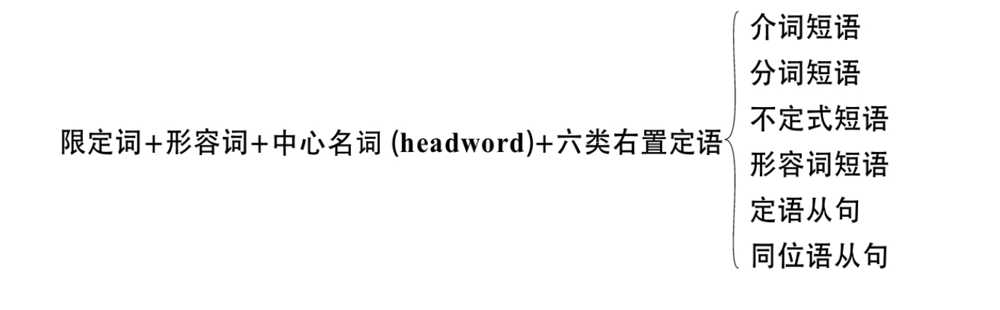
“左二右六”

（左）前置定语有两种：限定词和形容词；

（右）后置定语有六种：介词短语、分词短语、不定式短语、形容词短语、定语从句以及同位语从句。
## 0.3 英语句子五成分论
主谓宾补状
# 1 名词
## 1.1 名词的定义与分类
### 1.1.1 名词的定义
名词是用来表示人、事物、地点以及抽象事物的名称的。

例： 人：John, sister, father

    事物：water, air, sun, computer

    地点：London, theater

    抽象事物：love, happiness, imagination, hope
### 1.1.2 名词的分类
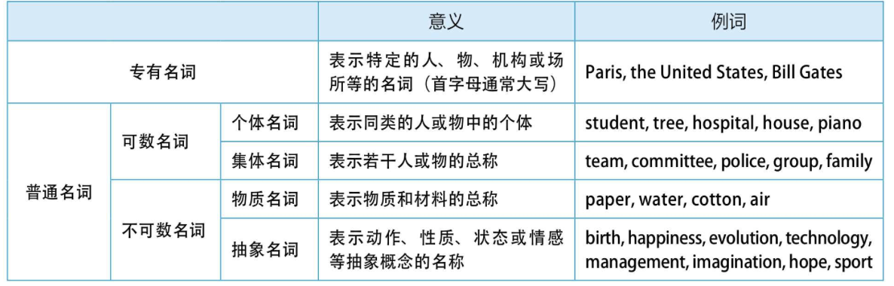

专有名词：1. 人名及头衔；2.著作名称；3.月份；4.星期；5.节日；6.地理名词；

普通名词：可数名词和不可数名词；

简单名词和复合名词；
## 1.2 可数与不可数
### 1.2.1 常用作不可数的名词
第一组：对于一些无法分割的名词，我们将其看作一个整体，因而作为不可数名词，没有复数变化。
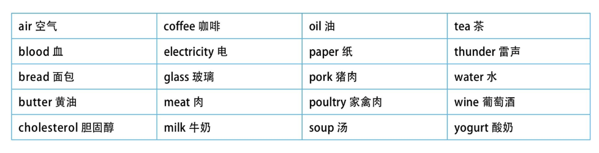

    或者按气体、液体和固体分类:

    气体：air, fog, oxygen, smoke等。

    液体：beer, blood, coffee, cream, gasoline, honey, juice, milk, oil, tea, water, wine等。

    固体：bread, butter, cheese, ice, ice cream, meat, beef （牛肉）, chicken （鸡肉）, fish （鱼肉）, chalk, copper, cotton, glass, gold, iron, paper等。

第二组：一些因其组成部分太小而不易数的名词用作不可数名词。
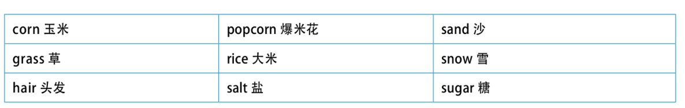
第三组：表示总称的名词通常不可数。这些名词侧重于表示某类事物的总的概念，而不是具体的事物。如果要具体指出该总称概念下的具体事物，则要用其他不同的名词。
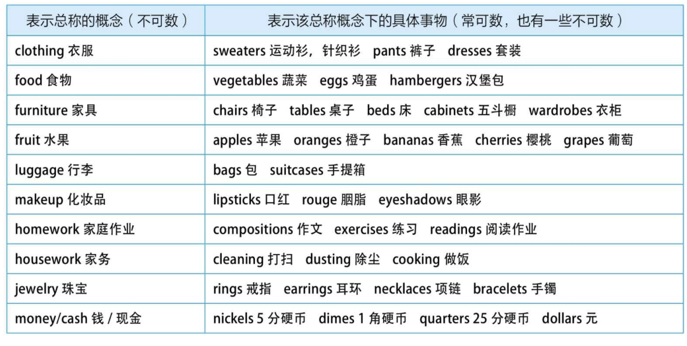
第四组：抽象的名词一般是不可数的。
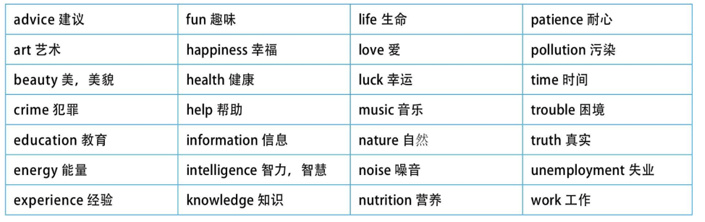
第五组：表示研究学科，一般作为不可数名词。

       biology生物学；geometry几何学history历史；chemistry化学；grammar语法；math数学；
### 1.2.2 可数与不可数的“相对论”
所谓可数与不可数的“相对论”，即是指一个名词是可数还是不可数关键在于它所表达的意义，而意义又随语境的不同而改变，因而名词的可数性是与它所使用的上下文语境密切相关的。

一、 规律一：对于物质名词或总称的名词，若是表示不同的种类，或者因为特定的意思，或者是液体表示“几杯”或“几瓶”这样的数量，则转化为可数名词。

二、规律二：对于抽象名词，若是具体化了，则转化为可数名词。并且，此时往往伴随着词义上或大或小的改变。

比如art（艺术）/an art（一项技术，一门特定的艺术）；

beauty（美丽）/a beauty（一个美人）；

youth（青春）/a youth（一个年轻人）。

三、 规律三：从更广泛的意义上来说，当一个名词表示抽象的、总称的概念（abstract or generic concept）时，一般作为不可数名词来用（比如上面讨论的husband and wife这样的特殊例子）。而当它表示具体的、特定的事物（concrete or particular things）时，则通常用作可数名词。这就是为什么词典中对于某个单词的某一词义，后面标注的既是可数，也是不可数。此时关键要看如何使用这个词义，如果是当作具体的事物来看，则是可数；如果是当作一个概念来看，则是不可数。拿area（面积）来说，如果是指某个地方的具体多大的“面积”，则是可数。

### 1.2.3 不能按中文的思维理解英文名词的可数与不可数
### 1.2.4 不可数名词的度量
一、 不可数名词与量词

1. 常用piece修饰抽象名词和物质名词
    例如：advice,bread,baggage,chalk,equipment,furniture,information,jewelry,luggage,music和news等。
        a piece of news(一条消息)；
        two piecea of news(两条消息)；
        several pieces of furniture(几件家具)；
        three pieces of luggage(三件行李)；
2. 用bottle,cup,drop和glass修饰液态物质
    例如：beer, blood, coffee, milk, tea, water和wine等。
        several drops of blood（几滴血）
        a glass of milk（一杯牛奶）
        two glasses of wine（两杯葡萄酒）
        two cups of coffee（两杯咖啡）
3. 其他的量词
    a loaf of bread（一长条面包）
    a tube of toothpaste（一管牙膏）
    a slice of meat（一片肉）

二、不可数名词不能被a(n)修饰

三、 不可数名词不能被基数词修饰

## 1.3 单数与复数
### 1.3.1 英语名词的单数与复数的概念
单数表示“一”；复数表示“多于一”，即表示两个或两个以上的数量
### 1.3.2 只用作单数的名词
作单数的名词主要包括不可数名词与专有名词
### 1.3.3 只用作复数的名词
一、 “二合一”的复数名词

1. 工具和仪器
glasses（眼镜）spectacles（眼镜）binoculars（双筒望远镜，双目显微镜）scales（天平）clippers（理发剪，指甲刀）forceps（钳子，镊子〈尤指外科医生用的镊子〉）pincers（铁钳，钳子〈比如家用的老虎钳〉）tongs（钳子，夹子，镊子〈比如火钳子〉）tweezers（小钳〈比如女用的夹眉毛的小钳子〉）scissors（剪刀）shears（大剪刀）
2. 服装
jeans（牛仔裤）trousers（长裤）shorts（短裤）trunks（男士泳裤）briefs（内裤）pants（短裤）slacks（休闲）slacks（休闲裤）pajamas（睡衣）
对于这些名词，要说明数量，我们往往要用pair（如a pair of）表示
二、“单形复义”的名词

有些名词虽然没有复数的标记，但用作复数，即形式上是单数但是表达复数的意义。
1. people 人
2. cattle 牛群
3. police 警察
4. poultry 家禽
5. livestock 农场里饲养的牲畜
三、 “the+形容词“———表示一类人的复数名词

“the+形容词”表示一类人，此时当作复数名词，作主语时，谓语要用复数。
四、 复数专有名词

the Alps 阿尔卑斯山脉
The Himalayas are the roof of the world. 喜马拉雅山脉是世界屋脊。
The Great Lakes are a series of five lakes between the USA and Canada. 五大湖是位于美国和加拿大之间的五个湖。
The Niagara Falls are the falls on the Niagara River. 尼亚加拉瀑布是位于尼亚加拉河上的一个瀑布群。
### 1.3.4 规则的复数名词
一、 一般在词尾加-s

比如：desk/desks, book/books, hand/hands, dog/dogs, bee/bees, face/faces, orange/oranges等。
二、以-s,-x,-ch,-sh结尾的名词加-es

比如：class/classes, box/boxes, match/matches, bush/bushes等。
特别注意：以-ch结尾的名词，若-ch发/k/音，则加-s，例如：stomach/stomachs。
三、以“辅音字母+y“结尾的名词，变-y为-i，再加-es;而以“元音字母+y“结尾的名词，则加-s

比如：country/countries, family/families, baby/babies, lady/ladies;
    play/plays, boy/boys, guy/guys, donkey/donkeys, monkey/monkeys, key/等。
四、 有关以-o结尾的名词

1. 一般加-es的名词有：
 tomato/tomatoes（西红柿） hero/heroes（英雄）
  Negro/Negroes（<侮辱>黑人） veto/vetoes（否决）
  这些一般是以“辅音字母+o”结尾的名词。
2. 一般加-s的名词有：
 dynamo/dynamos（发电机） kilo/kilos（千克）kimono/kimonos（和服） memo/memos（备忘录）piano/pianos（钢琴） photo/photos（照片）soprano/sopranos（女高音歌手） solo/solos（独奏曲）tobacco/tobaccos（烟叶）
以上这些一般是以“辅音字母+o”结尾的外来词或缩写词。另外还有以“元音字母+o”结尾的名词变复数也是加-s的：
bamboo/bamboos（竹子） cuckoo/cuckoos（布谷鸟，杜鹃鸟）radio/radios（收音机） studio/studios（工作室，演播室）zoo/zoos（动物园）
3. 少数名词后加-s或加-es均可
 memento/memento(e)s（纪念品） motto/motto(e)s（座右铭）volcano/volcano(e)s（火山） manifesto/manifesto(e)
五、有关以-f或-fe结尾的名词

1. 一般变f, fe为v，再加-es的词有下面12个：
  calf/calves（小牛） half/halves（一半）
  knife/knives（小刀） leaf/leaves（树叶）
  life/lives（生命） loaf/loaves（一条）
  self/selves（自身） sheaf/sheaves（一捆，一束）
  shelf/shelves（架子） thief/thieves（贼）
  wife/wives（妻子） wolf/wolves（狼）
2. 一般直接加-s的名词有：
  belief/beliefs（信仰） chief/chiefs（首领）
  cliff/cliffs（悬崖） proof/proofs（证据）
  reef/reefs（暗礁） roof/roofs（屋顶）
  safe/safes（保险箱）
3. 少数名词后加-s或变f, fe为v加-es均可：
  dwarf/dwarfs/dwarves（矮人） handkerchief/handkerchiefs/handkerchieves（手帕）
  hoof/hoofs/hooves（蹄） scarf/scarfs/scarves（围巾）
  wharf/wharfs/wharves（码头）
  另外要注意：beef（牛肉）/beefs（牢骚，抱怨）/beeves（肉用牛，=beef cattle）
### 1.3.5 不规则的复数名词
1. 以-a结尾的拉丁语名词，词尾变为-ae或-as（少数词）
alga/algae（海藻） alumna/alumnae（女校友，女毕业生）
antenna/antennae/antennas（天线） formula/formulae/formulas（公式）larva/larvae/larvas（幼虫）
2. 以-ex或-ix结尾的拉丁语名词，在词尾直接加-es，或把-ex和-ix变为-ices
apex/apexes/apices（顶点，最高点） appendix/appendixes/appendices（附录；阑尾）index/indexes/indices（索引）
3. 以-is结尾的希腊语名词，变-is为-es。例如：
  analysis/analyses（分析） basis/bases（基础）
  crisis/crises（危机） diagnosis/diagnoses（诊断）
  thesis/theses（论文）
4. 以-on或-um结尾的名词，变-on或-um为-a，有的可在词尾直接加-s。例如：
  bacterium/bacteria（细菌） criterion/criteria/criterions（标准）datum/data（数据） erratum/errata（错误，错字勘误表）medium/media/mediums（媒介，介质） memorandum/memoranda/memorandums（备忘录）phenomenon/phenomena（现象）
5. 变-oo-为-ee-。例如：
  foot/feet（脚） tooth/teeth（牙齿）goose/geese（鹅）
6. 变-ouse为-ice。例如：
mouse/mice（老鼠） louse/lice（虱子）
7. 以-us结尾的拉丁语名词，变-us为-i，有的可在词尾直接加-es。例如：
  alumnus/alumni（男校友） bacillus/bacilli（杆菌）
  cactus/cacti/cactuses（仙人掌） fungus/fungi/funguses（真菌）genius/genii/geniuses（天才） nucleus/nuclei/nucleuses（原子核）stimulus/stimuli（刺激物）
### 1.3.6 复合名词变复数
1. “man/woman+名词”构成的复合名词
  由“man/woman+名词”构成的复合名词，两个词均须变为复数。例如：man teacher/men teachers（男老师） man doctor/men doctors（男医生）man servant/men servants（男仆） woman pilot/women pilots（女飞行员）woman journalist/women journalists（女记者）
2. 以-man/-woman/-child结尾的复合名词
以-man/-woman/-child结尾的复合名词变复数时，将-man/-woman/-child变为复数。例如：
fireman/firemen（消防员） chairwoman/chairwomen（女主席）horseman/horsemen（骑兵） grandchild/grandchildren（孙子，孙女）policeman/policemen（警察） Englishman/Englishmen（英国人）Frenchman/Frenchmen（法国人）但是German不是一个合成词，所以其复数形式是在词尾直接加-s，即Germans。
3. “名词+介词或介词短语”构成的复合名词
  “名词+介词或介词短语”构成的复合名词变复数时，将主体名词（或者说中心名词）变为复数。例如：comrade-in-arms/comrades-in-arms（战友）
4. 由动词短语演变成的复合名词
由动词短语演变成的复合名词，一般没有主体名词，变复数时在词尾加-s。例如：
forget-me-not/forget-me-nots（勿忘我） go-between/go-betweens（中间人）grown-up/grown-ups（成年人） take-off/take-offs（起飞）assistant director/assistant directors（助理导演） babysitter/babysitters（保姆）breakdown/breakdowns（崩溃，衰落） close-up/close-ups（特写镜头）takeover/takeovers（接管） sit-in/sit-ins（静坐抗议）stand-by/stand-bys（可以信任的人）
5. “名词+形容词“构成的复合名词
“名词+形容词“构成的复合名词变复数是，变名词为复数。例如：
notary public/notaries public（公证员） secretary general/secretaries general（秘书长）Attorney General/Attorneys General（［美］司法部长，大法官/［英］总检察长）consul general/consuls general（总领事）
### 1.3.7 单复数同形的名词
一、 动物名称

1. 永远用作零复数
sheep（绵羊）从来没有sheeps*这个词形。
    deer（鹿）从来没有deers*这个词形。
  2. 通常用作零复数
bison（北美野牛）：a bison/two bison　grouse（松鸡）：a grouse/two grouse
quail（鹌鹑）：a quail/two quail　salmon（三文鱼，大马哈鱼）：a salmon/two salmon
cod（鳕鱼，也叫作codfish。在英国，满大街的快餐Fish and Chips〈炸鱼和炸薯条〉就是常用这种鱼做的。大家有机会到英国不妨尝尝就知道了，非常油腻，绝对是增肥食品）：a cod/two cod
3. 零复数和规则复数均可
antelope（羚羊）复数可以是antelope，或者是antelopes。
reindeer（驯鹿）复数可以是reindeer，或者是reindeers。圣诞节前夜，帮圣诞老人拉雪橇的就是这种鹿。
fish（鱼）复数可以是fish，或者是fishes。
flounder（比目鱼）复数可以是flounder，或者是flounders。
herring（鲱鱼）复数可以是herring，或者是herrings。还要注意，有一个常用的俚语red herring（遮眼法，转移注意力的东西），表示提出不相干的事实或论点，以分散对主题的注意力。
shrimp（虾）复数可以是shrimp，或者是shrimps。
二、 国籍名称

以-ese结尾的国籍名词常用零复数
没有形式变化的名词有三类：
第一类是不可数名词，如music，它们没有词形的变化，只能用作单数。
第二类是复数可数名词，如people，它们没有词形的变化，只能用作复数。
第三类是单复数同形的名词，如sheep，它们没有词形的变化，但既可以用作单数，也可以用作复数。
### 1.3.8 有新词义的复数名词
1. arm（手臂） arms（=weapons武器，军事）
2. custom（风俗） customs（海关）
3. damage（损坏，损失） damages（赔偿金）
4. letter（信） letters（文学）
5. minute（分钟） minutes（会议记录）
6. spirit（精神） spirits（烈酒）
7. premise（提前） premises（房屋，营业场所）
8. security（安全） securities（证劵）
9. line（行） lines（台词）
## 1.4 ‘s所有格的构成及逻辑语义关系
### 1.4.1 ‘s所有格的构成
1. 单数名称
单数名称的所有格，在词尾家'‘s'，注：对于像actress这样以-s结尾的单数名词
2. 复数名词
对于复数名词的所有格的构成，要分下面两种情况： 一是，不以-s或-es结尾的特殊变化的复数名词，在词尾加“'s”。二是，以-s结尾的复数名词，在词尾加“'”构成所有格。
3. 复合名词
复合名词的所有格，在最后一个词的词尾加“'s”构成。
4. 并列名词
对于由and连接的并列名词，当表示“共有”的情况下，只需在最后一个名词的词尾加“'s”；若表示“各自所有”，则须在每个名词的词尾加“'s”。
### 1.4.2 ’s所有格的逻辑语义关系
 1. 所属关系
所谓“所属关系”，就是指某人所拥有的人或物。在以上讨论的例子中，“'s”主要是用来表示所属关系。
例：my father-in-law's company 我岳父/公公的公司
另外，所属关系有时是表示某物属于某一类人，而不是属于具体的某个人。
  例：the children's books 儿童读物
除了表示所属关系之外，名词所有格还可以表示下列逻辑语义关系，包括主谓关系、动宾关系和同位关系等。
 2. 主谓关系
  How will Bhutto's death affect the world?
  妙语点睛 名词短语Bhutto's death相当于说Bhutto died，表示“布托死了”，即相当于一个主谓关系。
  精品译文 布托之死将会如何影响世界？
  由上面这个例子可知，所谓“主谓关系”，是指所有格名词（如Bhutto）相当于主语，而被修饰的名词（如death）相当于一个谓语。此时，这个被修饰的名词通常都是由一个动词转化过来的，比如death对应动词die。
 3. 动宾关系
 Bhutto's assassination rocks Pakistan.

 妙语点睛 这里的名词短语Bhutto's assassination相当于说assassinate Bhutto，表示“刺杀布托”，即相当于一个动宾关系。显然，这里的Bhutto's assassination不是上面所说的主谓关系，即不是表示“布托刺杀别人”。

  精品译文 布托的遇刺事件震惊了整个巴基斯坦。

  由上面的例子可知，所谓“动宾关系”，是指被修饰的名词（如assassination）相当于一个谓语，且是及物动词（如assassinate）。而所有格名词（如Bhutto）相当于这个及物动词的宾语。此时，这个被修饰的名词通常都是由一个动词转化过来的，比如assassination是由动词assassinate转化而来。
 4. 同位关系
 For Washington, Bhutto's loss is incalculable.

  妙语点睛 这里的名词短语Bhutto's loss相当于the loss of Bhutto，表示“失去了布托这一损失”或“损失了布托”。这里loss是中心词，表示“损失”，而Bhutto's是用来详述具体损失了什么东西，补充说明loss，即相当于一个同位语。显然，这里的Bhutto's loss既不是上面所说的主谓关系来表示“布托失去了（什么东西）”，也不是动宾关系来表示“某人弄丢了布托”。

  精品译文 对于华盛顿（即指美国）来说，失去了布托这一损失无法估量。

  以上讨论的例子都是关于名词所有格“'s”适用于有生命的名词。名词所有格还可以用于以下“非生命名词”，此时一般都不是表示所属关系。
 5. 表示时间或距离
 所有格“'s”用在表示时间的名词后面。比如：
 today's newspaper 今天的报纸
 tomorrow's weather 明天的天气
 tonight's TV 今晚的电视节目
 last night's storm 昨夜的暴风雨
 a hard day's work 一整天的辛勤劳动
 a week's holiday 一周的假期
 a month's salary 一个月的薪水
 three hours' delay 三小时的耽搁
 I am very tired after a hard day's work. 辛苦工作了一天之后，我感到非常疲惫。
 My birthday is in two weeks' time. 我的生日是在两周之后。
 Let's have ten minutes' break. 我们休息10分钟吧。
 My college is fifteen minutes' ride from my home. 我的大学离我家开车15分钟。
 Each morning, people swarm into the offices and factories of America, seeking a day's work for a day's pay. 每天早晨，人们涌进美国的办公室和工厂，来寻找日薪工作。
 6. 表示重量或价值等度量
所有格“'s”用在表示度量的名词后面。比如：
 two pounds' weight 两磅重
 a ton's weight 一吨重
 a ton's steel 一吨钢材
 two dollars' worth of sugar 两美元的白糖
 ten dollars' worth of meat 10美元的肉
 7. 表示国家、城市、国际组织或地理名词等
 China's population 中国的人口
 China's industrial development 中国的工业发展
 China's exports and imports in January 中国1月份的进出口额
 America's West Coast 美国的西海岸
 Shanghai Tower, Shanghai's tallest building 上海中心大厦，上海的第一高楼
 the city's weather 这个城市的天气
 the European Union's exports 欧盟的出口额
 the world's three most famous tenors 世界最著名的三大男高音
 the world's seven wonders 世界七大奇迹
 the earth's surface 地球的表面
 the sea's depth 海洋的深度
 the moon's shadow 月球的阴影
 the sun's ray 太阳的光线
 8. 用于交通工具及其部件的所属关系
 the car's exhaust 汽车的排气管
 the plane's engine 飞机的发动机
 the yacht's mast 游艇的桅杆
 the ship's boiler 轮船上的锅炉
### 1.4.3 名词所有格修饰的名词被省去
 1. 避免名词重复
 具体来说，若名词所有格所修饰的名词已经出现过，则第二次出现在所有格后面的名词可以省去，以避免重复。
 This bike is mine, not Michael's（=Michael's bike）.
 这辆自行车是我的，不是迈克尔的。

  This is my room and that is my sister's（=my sister's room）.
  这是我的房间，那是我姐姐的房间。

 I don't know her name, but I can tell you her husband's（=her husband's name）.
  我不知道她的名字，但是我可以告诉你她丈夫的名字。
 2. 表示店铺或教堂
 具体来说，在一些表示店铺或教堂的名词的所有格后面可省去名词，此时所有格表示相应的场所，且一般要在所有格名词前加定冠词the。
  at the baker's（=baker's shop） 在面包店
  at the butcher's（=butcher's shop） 在肉铺
   at the chemist's（=chemist's store） 在药店
   at the florist's（=florist's shop） 在花店
   at the dentist's（=dentist's clinic） 在牙医诊所
   at the doctor's（=doctor's clinic） 在医生的诊所
   I'm going to the dentist's tomorrow afternoon（=dentist's clinic）. 明天下午我要去看牙医。
   I want to pay a visit to the St. Paul's（=St. Paul's Cathedral）. 我想去拜访一下圣保罗大教堂。
  3. 表示某人的住宅
  具体来说，在人名后的所有格省去名词时，表示某人的住宅。比如：
   go to my sister's（=my sister's home） 去我姐姐家
   I called at my uncle's yesterday（=my uncle's home）. 我昨天拜访了我叔叔家。
## 1.5 of属格的构成及逻辑语义的关系
### 1.5.1 of属格的构成
其基本构成是：N1+of+N2。这里N1表示第一个名词，N2表示第二个名词。
一是，表示无生命物体的名词的所有关系。比如：
   the roof of the church 教堂的屋顶
   the name of the song 歌曲的名字
   the title of the book 书名
   the leg of the table 桌子腿
  因此，总体来说，'s所有格主要是用于有生命的名词，而of属格主要是用于无生命的名词。从这个意义上来说，两种所有格是互为补充的关系，在彼此不作为的领域发挥着作用。
二是，当有生命的名词后面接短语或从句修饰时，也用of 属格。
 What is the name of the boy sitting next to her?
### 1.5.2 of属格的逻辑语义关系
一、 主谓关系：从右往左翻译

基本结构是N1+of+N2，这里N1是由不及物动词变化过来的名词，表示某个行为，这一行为是由N2来发出的。或者说，N2是N1行为的执行者。比如：
the arrival of my mother
妙语点睛 这里第一个名词arrival是由不及物动词arrive变化过来的，它表示一个行为；而第二个名词my mother则是这个行为的执行者，即相当于说 my mother arrived。
二、动宾关系：从左往右翻译

其基本结构是N1+of+N2，这里N1是由及物动词变化过来的名词，与上述“主谓关系”相反，N2是N1行为的承受者，而不是执行者。比如：
 America's invasion of Iraq
妙语点睛 这里的invasion是由及物动词invade变化过来的，这个短语相当于说America invaded Iraq，即第二个名词Iraq是该动作的承受者。
  精品译文 美国入侵伊拉克
  综上所述，对于不及物动词，则必然是从右往左按主谓关系翻译。而对于既可作及物又可作不及物的动词，则一般按动宾关系从左往右翻译，除非上下文语境有相反的证明。
三、同位关系
 其结构是N1+of+N2，这里N2表示N1的具体内容，二者互为同位说明。比如：
  the city of Rome
  妙语点睛 相当于“Rome is a city.”或者说“The city that I mean is Rome.”。这与the people of Rome中的of表达的逻辑关系显然是不同的。
  精品译文 罗马城市
# 2 限定词（一）：冠词
## 2.1 引言：Story-telling
## 2.2 冠词的位置与读音
冠词有三个：a, an和the。因为the有两种读音，所以从读音的角度来看，冠词有四个：a, an以及在辅音前读［ðə］的the和在元音前读［ði］的the。
## 2.3 冠词的用法概念

一、冠词的用法必须与名词结合起来讨论
二、区分特指与泛指
 谓泛指，也叫类指，顾名思义，是表示一类事物，或某类事物的总称。所谓特指，是表示某类事物中的具体的某一个或某一些。

 冠词的特指用法会涉及说话者/作者（speaker/writer）与听话者/读者（listener/reader）之间的共有知识。

 对于the来说，就是特指和泛指。定冠词主要是表示特指的用法，其次才是表示泛指的用法。但对于不定冠词a/an来说，不能表示特指，主要是用来表示泛指。此外，对于不定冠词，其实还有一个定指/不定指的概念（specific or nonspecific reference）。
 三、结合篇章和语境
 四、与其他问题相结合
 ## 2.4 英语中四种泛指的表达模式
 ### 2.4.1 不可数名词不加冠词表示泛指
 不可数名词在表示泛指时，不可与定冠词the连用。如果与the连用，此时不可数名词是表示特指。

 用法最简单的泛指概念就是不可数名词所表示的泛指，它不像可数名词表示泛指时那样变化多端。不过，这里有个前提，就是首先要能区分一个名词是不可数还是可数。这就不只是冠词用法的问题了，而是涉及名词的用法了。接下来我们讨论可数名词在表示泛指时该如何与冠词连用。
 ### 2.4.2 复数名词不加冠词表示泛指
 复数名词同不可数名词一样，在表示泛指时，不可与定冠词the连用。如果与the连用，此时复数名词是表示特指。

  Books become more and more expensive.

 Books fill leisure time for many people.

 Put away the books on your desk.

 Move the books off that chair and sit down.

  妙语点睛 在例句1）中，该句的意思是泛指一切书都在涨价，即这里的books是表示泛指，所以不能说“The books become more and more expensive.”。在例句2）中，这里的books是泛指一切书，而不是具体指某些书，即books是表示泛指的，所以不能说“The books fill leisure time for many people.”。在例句3）中，这里的books是专指“你桌上的那些书”，所以是特指，要说成the books。在例句4）中，这里的books是专指“椅子上的那些书”，所以是特指，要说成the books。

   书变得越来越贵。

   对于大多数人来说，书填补了他们很多的闲暇时光。

   把你书桌上的那些书都摆整齐了。

   把椅子上的书拿开就可以坐了。

   从上面的讨论我们知道，一般来说，“the+复数名词”不能用作泛指，而只能表示特指。不过，有两种特殊的表示复数名词概念的结构，是与the连用的，却可以表示泛指：一是“the+国籍名词”，二是“the+形容词”。
   一、the+国籍名词
   该结构是指一个国籍的、一个种族的人。
   二、the+形容词
   the+形容词”表示一类人，是泛指，相当于在形容词的后面省去了people，所以被看作是复数名词，作主语时，谓语要用复数。
### 2.4.3 单数名词与定冠词the连用可以表示泛指

定冠词the与单数名词连用时，可以表示泛指。在语气上显得比较正式或文雅，表示一个由典型的样品所代表的那个类别。

定冠词the与单数名词连用，也可以表示特指，即表示某类事物中具体的某一个。

对于“the+单数名词”，到底是表示泛指还是表示特指，一定要根据上下文的语境来判断。

正因为“the+单数名词”既可以表示泛指也可以表示特指，所以，在特指还是泛指的理解上有时会出现模棱两可的现象。
### 2.4.4 单数名词与不定冠词a/an连用可以表示泛指
1. 单数名词与不定冠词a/an连用可以表示泛指

  “a/an+单数可数名词”可以表示泛指，不定冠词a/an的泛指用法指的是某一类事物中任何一个具有代表性的成员，所以这里的a/an相当于any。

2. 关于a(n)的泛指用法的深入讨论

  不定冠词a/an的泛指用法指的是某一类事物中任何一个具有代表性的成员，所以我们可以用any来替换a/an。
## 2.5 定冠词the的特指用法
### 2.5.1 情景/文化特指

1. 一般常识/较大情景

这里的“一般常识”指的就是说话者与听话者共同具有的较大情景的知识。由于这样的一般常识，定冠词the所指的对象究竟是什么，对双方来说都是不言而喻的。

the North Pole 北极

the Equator 赤道

the earth 地球

2. 具体知识/局部情景

说话者与听话者共有的知识只是局限在一个特定的较小的范围内，比如对于同一个家庭或村庄的成员来说是独一无二的。

3. 即时情景用法

  在说话的时刻，所指为双方唯一看到或听到的。此时，定冠词the的所指是从语言以外的实境中推知的。
### 2.5.2 上下文共指

  上下文共指，就是指听话者或读者可以根据上下文找到所指。它可分为前指和后指。前指又可分为直接前指和间接前指。

1. 直接前指

  前面话语中已经提供的信息使后文中的某个名词短语特指某个事物，即是前指。直接前指是指前面提到的某个事物，在后文中再次提到，这样前后两个名词短语是一种共指关系，指代同一个事物。

2. 间接前指/话题与定冠词the

  间接前指，表示所指的对象间接地成为听话者知识的一部分。这种知识不是通过上面讨论的那样的直接谈及而获得，而是从已经谈到的事物中推断得到的。此时，在上文中往往会提到的一个与下文有紧密联系的概念或谈论的话题，然后下文围绕这个话题展开讨论。

3. 后指/结构特指

  后指，也叫结构特指（structural reference），往往出现在带有后置定语的名词短语中。一般来说，被某个后置定语所修饰的名词的前面要用定冠词the。
### 2.6 不定冠词a/an的用法
### 2.6.1 不定冠词的泛指与非法泛指用法

1. 用在主语中，具有泛指功能

例：A tiger is a dangerous animal. 老虎是一种非常危险的动物。

2. 用在补语中，表示分类，具有描述功能

在英语中，单数可数名词在作表语时，通常需要一个冠词。如果用不定冠词a/an，则具有描述的功能，而没有所指功能。

3. 用在宾语中，具有所指功能
不定冠词用于泛指（generic reference）也是它的所指功能（referring role）的一种。为了分析清楚不定冠词a/an在宾语位置的所指功能，我们有必要搞清楚冠词所指的确定性（specific or nonspecific）与说话者或听话者之间的关系。下列表格给出了两者之间的四种关系：

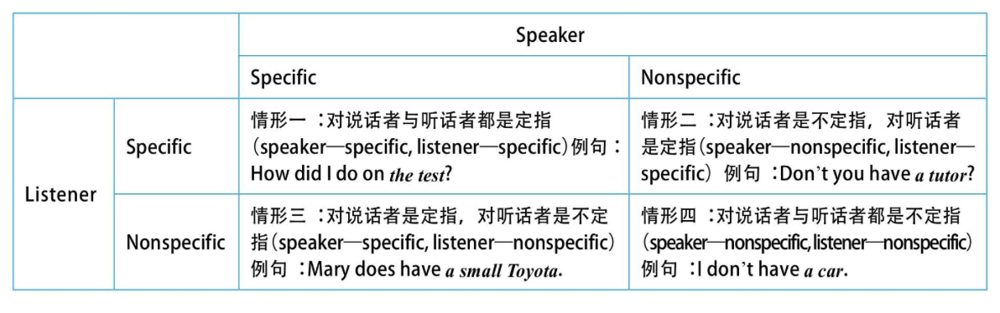
从以上表格的“情形一”中，我们清楚地看到，只有当被限定的名词对说话者与听话者双方来说都是定指的（speaker—specific, listener—specific），我们才可以用定冠词the。这就是我们在前文说过的“用定冠词the必须依赖于说话双方共有的知识”。

从这个表格里，我们也可看到“特指”、“泛指”、“定指/不定指”这几个概念之间的关系：特指是对于说话双方都是定指的（如情形一：speaker—specific, listener—specific）；泛指是对于说话双方都是不定指的（如情形四：speaker—nonspecific, listener—nonspecific）。在特指与泛指这两个极端情形之间存在着两类过渡的指代状态，即对于说话者或听话者某一方来说是定指而对于另一方是不定指。这又可分为两种情形：对说话者不定指/对听话者定指（如情形二：speaker—nonspecific, listener—specific）与对说话者定指/对听话者不定指（如情形三：speaker—specific, listener—nonspecific）。

关于“特指”、“泛指”、“定指/不定指”这几个概念之间的相互关系：特指是对于说话双方来说都是定指的（speaker—specific, listener—specific）；泛指是对于说话双方来说都是不定指的（speaker—nonspecific, listener—nonspecific）。在特指与泛指这两个极端情形之间存在着两类过渡的指代状态，即对于说话者或听话者某一方来说是定指而对于另一方是不定指，具体来说就是：对说话者来说是不定指/对听话者来说是定指（speaker—nonspecific, listener—specific）或对说话者来说是定指/对听话者来说是不定指（speaker—specific, listener—nonspecific）。

  对于the来说，就是特指和泛指。定冠词主要是表示特指的用法，其次才是表示泛指的用法。

  但对于不定冠词a/an来说，不能表示特指，而主要是用来表示泛指以及两种不同的定指/不定指的指代关系。
### 2.6.2 不定冠词a/an与不可数名词

  一般来说，不可数名词是不用a/an来修饰的。但是，在下列三种情况下，a/an可以与不可数名词连用：

  1. 很多不可数名词与a/an连用，表示“一种”或“一类”

  如果说话者或作者想以某种方式来特指所说的事物，比如通常以关系从句的方式加以限定，或当说话者的意思是“一类”或“一种”的时候，不可数名词前可以用a/an。

  2. 对于饮料类的不可数名词，与a/an连用时，表示“一杯”

   I'd like a beer,please. 我要一杯啤酒。

  3. 有些不可数名词，当他们与a/an连用时，会有特别的意思，或者说意思会发生改变。
### 2.6.3 不定冠词a/an与数词one

不定冠词在历史上起源于非重读形式的one，在当代英语的许多语境中，不定冠词的这种数词功能仍是非常主要的。所以，在下列并列结构中，one可作为a的强调形式的等同词而替代a。

1. 强调数量“一”时用one

当我们想加强口吻或引人注意的时候，我们用one强调“只有一个/不超过一个（one only/not more than one）”的意思，而a/an则没有这个意思，它显得比较平淡、中性。也就是说，one比a/an更强调数量。
2. 因为one强调数量，所以常用于准确的对照数字

用one，我们仅考虑到有关数字的方面，或只想强调只是一个而不是两个或三个。所以，当我们想准确地对照数字时，我们就要用one。
3. 讲故事中用one

在讲故事或讲述某种经历时，我们常用one来强调人或事物，作为我们将要讲到的一个重要话题。

4. 表示类指意义的a/an不能换成one

我们可以用a/an表示一类事物，是不定冠词泛指意义的用法。此时，我们就不能用one来替换a/an，否则意思会发生改变。

5. 表示度量的a/an不能换成one

我们可以用a/an来表示度量，以表示价格、速度或比率等概念。这时的a/an相当于per（每，每一），不能换成one。

6. 表示数量的固定搭配固定中的a不能换成one

各种数量词中也含有不定冠词a，此时不能换成one，比如：a few, a little, a great many以及a large number of等等。因为这些是固定短语，所以不能把其中的a替换成one，比如不能说：one few* 或one little*等。
### 2.6.4 不定冠词a/an与this
在口头叙述中，当说话者想强调某个人、某个地方或某件事，并使他们变得更加生动时，就可以用this代替a。这个用法在讲笑话时尤为常见。

So I go in this queue, and I'm waiting, so I saw them taking names and writing things down, so I had this feeling I was in the wrong place, so I thought to myself, “Oh, I'm going from here.” But as I was standing at the table this person said, “Now then, you're next!”

  妙语点睛 我们看到，这里作者用了this来描述queue, feeling和person，显得作者是在轻松地讲述自己排错队的笑话。如果这里作者用不定冠词a来代替这些this，那么就显得很正式，而失去了幽默的效果。

  精品译文 于是我就排到这个队伍里，我在那等着，我看到他们记下名字并写了些什么。这时我感觉我站错地方了，于是我心里想：“哦，我得离开这里。”但是这时我已站在桌子旁边了，这个人说道：“好了，下一个就是你啦！”
## 2.7 用/不用冠词的意义区别(the hospital/hospital)
在英文中，有一类表示家居生活和社会事业机构的名词，如hospital（医院）等，在有冠词修饰（如the hospital）和没有冠词修饰（如hospital）的两种不同情况下，意思往往是不同的。

His mother is in hospital and he has been in the hospital to take care of her.

  妙语点睛 这里有两个介词短语in hospital和in the hospital，前者是“生病住院”的意思，而后者表示“在医院里”，但不是因为生病，而是因为其他原因，比如在这里是因为要照顾他妈妈。

  精品译文 他妈妈生病住院了，他就一直在医院里照顾她。

用与不用冠词，对这类名词来说意义是不同的。当我们不用冠词时，表示的是人们去这些地方做在这些地方应该做的事，或者说做的事情与这些地方密切相关。比如：in hospital（在医院）就是因为“生病”，in prison（在监狱）就是因为“犯罪”，go to church（去教堂）就是为了“礼拜祷告”，go to temple（去庙里）就是为了“拜佛求签”等等。此时这些名词只表示一种抽象的概念，并非特指具体的、实际的建筑物或地点，而主要是强调在该处所的活动。

另一方面，当我们使用冠词时，则表示人们去这些地方不是要做与该处所密切相关的事，而是由于其他原因。

简言之，对于表示处所或社会事业机构类的名词（如prison, church和college等），使用冠词the，是强调处所，指的是实际的建筑物或地点；不用冠词the，是强调活动，不是指实际的建筑物或地点，而是指与它们相关的社会事业机构。

1. 家具生活类名词

    at table 进餐，吃饭

    at the table 在餐桌旁，在桌旁

    go to bed 上床睡觉

    go to the bed 到床边

    go to bed 上床睡觉（不是要干别的）

    lie down on the bed 躺在床上 （不是为了睡觉，而是为了休息等等）

    in bed 在睡觉

    in the bed 卧在床上

2. 所处、建筑物或社会事业机构

    go to hospital（as patients） 生病住院

    redecorate the hospital 重新装修这家医院

    in hospital 住院

    in the hospital（因事）在医院里

    come out of hospital（病愈）出院

    come out of the hospital（因事）从医院出来

    go to prison 犯罪入狱

    walk around the prison 绕着这个监狱走

    be in/at church (to pray) 在教堂做礼拜（强调活动）

    admire the church 欣赏这座教堂（指具体建筑物）

    go to/be in town 去/在城里

    the town is very old. 这个小城很古老

3. 关于上学(class,school,college和university)

    go to school 上学

    go to the school（因事）去学校

    in school 在校念书

    in the school 在学校里

    go to class 去上课

    The class works hard. 全班同学学习认真。

    in class 在上课

    in the class 在这个班级

    go to college 上大学

    the gates of the college 这个学院的大门

    at desk 在读书，在做作业

    at the desk 在课桌边，在课桌旁

4. 关于sea的表达

    go to sea（as sailors） 当水手，做海员；出海航行，出航（以水手的身份）
    go to the sea 去海边，去海滨

    go to sea（as sailors） 当水手，做海员；出海航行，出航（以水手的身份）

    look out towards the sea 眺望大海

    be at sea（as passengers or crew）在海上航行；茫然，迷惑

    be at the sea在海边

    by sea 乘船

    by the sea 在海边

    in office 在职，上台执政

    in the office 在办公室里

    out of office 离职；下台，在野，不执政

    out of the office 离开办公室

    behind time 晚点，迟了

    behind the time(s) 过时，落伍，落后于时代

    in red 穿着红色的衣服

    in the red 负债，亏损

    by day 白天

    by the day 按日计算，论日

    in secret 秘密地，私下地

    in the seecret 知道内情

    in front of 在···（外部）的前面

    in the front of 在···（内部）的前面

    take place 发生

    take the palce 代替

    out of question 毫无疑问，没有问题

    out of the question 完全不可能

    men of age 成年人

    men of an age 同龄人

    keep house 料理家务

    keep the house 守在家里

    with child 怀孕

    with a/the child 带着孩子/和这个小孩在一起

## 2.8 其他用冠词的场合

一、形容词或副词的最高级、序数词，以及only用作形容词后接名词时，它们的前面一般要用the。

  the only/best way to cope with the problem 解决这个问题的唯一/最好的方法

  This is the first time I've come to Beijing. 这是我第一次来北京。

二、在乐器、乐团、合唱团及流行音乐团体前加the

  the Beatles “甲壳虫”乐队

  the Philadelphia Orchestra 费城管弦乐队

  play/learn the guitar 弹/学吉他

  learn the piano 学钢琴

  注意：运动项目前不加the。比如：play chess, play football/basketball/table tennis等。

三、定冠词the与姓氏连用

  我们可以把定冠词the与姓氏连用，然后要在姓氏的后面添加复数-s。比如：

  the Smiths

  这类短语要表达的意思主要有两种：一是表示夫妇两人（husband and wife），二是可以表示一家人，即包括孩子在内（including children）。所以，the Smiths可以表示“史密斯夫妇”，也可以表示“史密斯一家人”。具体的意思可依据上下文而定。

  此外，如果是名门望族的姓氏，则除了表示上述两个意思之外，往往还表示整个家族。比如：

  the Kennedys

  这个短语虽然可以表示“肯尼迪总统夫妇”或“肯尼迪总统全家人”，“但实际上往往是表示“肯尼迪家族”。

  再比如：

  the Bushes

  这个短语可以表示“布什总统夫妇”或“布什总统全家人”，也可以表示“布什家族”，包括与老布什和小布什总统有关的所有亲人。

四、表示强调时，会用the

  请看下面的对话：

  （at the airport check-in desk）

  Airline official: How many bags are you checking in?

  Passenger: Just the one.

  妙语点睛 这里的the是为了表示强调。

  精品译文 （在机场登记处）

  机场人员：你要登记几个包？

  乘客：就这一个。

  Receptionist: So it's just one person then?

  Customer: No, no, it's for the two of us.

  Receptionist: Oh, I'm sorry. Right, two persons.

  妙语点睛 这里的the是为了表示强调。

  精品译文 接待员：那么就只有一个人？

  顾客：不，不，是我们两个人。

  接待员：啊，对不起。好的，两个人。

## 2.9 其他不用冠词的场合
一、关于职业、身份或头衔

表示某人的职业，一般是用不定冠词a/an。
1. I am an English teacher.
2. 1. They appointed him Head Librarian. 他们任命他为图书馆馆长
   2. He's a librarian. 他是个图书管理员
3. 1. He was elected President in 1879. 他于1879年选为总统
   2. I want to see the President. 我要见总统
4. 1. Queen Elizabeth had dinner with President Kennedy. 伊丽莎白女王和肯尼迪总统共进晚餐
   2. The Queen had dinner with the President. 女王和总统共进晚餐
1. 独一无二的头衔出现在表语位置
  1. John F. Kennedy was (the) President of the United States in 1961. 约翰·F.肯尼迪于1961年当选为美国总统。

  2. John is (the) captain of the team. 约翰是该队的队长。

  3. She is chairman of the committee. 她是该委员会的主席。

  4. Mr. Smith used to be president of our bank. 史密斯先生当过我们银行的行长。
2. 独一无二的头衔出现在主语补足语的位置
  1. Henry was elected chairman of the committee.

    妙语点睛 这里的chairman补充说明主语Henry，即作主语补足语。

    精品译文 亨利当选为该委员会的主席。

  2. He was elected President for the second time.

    妙语点睛 这里的President补充说明主语he，即作主语补足语。

    精品译文 他是第二次当选总统。
3. 独一无二的头衔出现在宾语补足语的位置
  1. hey elected Henry chairman.

    妙语点睛 这里的chairman补充说明宾语Henry，即作宾语补足语。

    精品译文 他们推选亨利为主席。

  2. They've appointed Fred (the) treasurer, and no doubt he will soon become (the) secretary.

    精品译文 他们已经推选弗雷德为财政司司长，毫无疑问将来他会很快成为财政部部长。
4. 独一无二的头衔出现在同位语的位置
  1. As (the) chairman of the committee, I declare this meeting closed.

    妙语点睛 这里as引导的名词短语chairman of the committee是作主语I的同位语。

    精品译文 以委员会主席的身份，我宣布会议结束。
二、关于球类、棋类运动

 表示球类、棋类运动项目的名词前面不加冠词。例如：

1. play football 踢足球

2. play chess 下棋

3. play tennis 打网球

三、关于其他限定词与冠词

下面这些限定词彼此排斥，不能同时出现在名词的前面。

1. 冠词：the, an, a

2. 物主形容词：my, your, his, her, our, their

3. 指示形容词：this, that, these, those

4. 名词属格：Tom's, John's

四、特殊名词

在下列这些特殊名词前不加the：

1. nature：泛指自然界（动植物及无生命的物质的世界），不加冠词。比如“在大自然中”要说成in nature，而不是in the nature*。请看例句：

If you destroy nature you will suffer for it.

精品译文 谁要是破坏大自然，谁就要遭受恶果。

2. society：泛指我们在其中生活的这个社会，一般不加冠词。比如“在社会中”要说成in society，而不是in the society*。请看例句：

Society turns people into criminals and then locks them up.

精品译文 社会使人犯罪，然后又把他们关进监狱。

3. space：泛指星球之间的空间，不加冠词。比如“在太空中”要说成in space，而不是in the space*。请看例句：

Man has just taken his first steps into space.

精品译文 人类才刚刚迈出了探索太空的第一步。

4. man：泛指整个人类时，不加冠词。请看例句：

Man can conquer nature.

精品译文 人定胜天。

That's one small step for a man, one giant leap for mankind.

精品译文 这对于一个人来说是一小步，对于全人类却是一次巨大的飞跃。

From early times man has used garlic（大蒜）. Through the years man has tried to cope with the smell of garlic. But no herb, mouthwash, chewing gum, or toothpaste seems to help much.

精品译文 人类从很早以前就开始食用大蒜了。一直以来，人们都在努力消除大蒜的气味。但无论是中草药、漱口剂、口香糖还是牙膏，似乎都没有什么用处。

5. history：泛指人类的整个历史时，不用冠词。比如“在历史上”要说成in history，而不是in the history*。请看例句：

History may repeat itself.

精品译文 历史可能重演。

Throughout history man has had to accept the fact that all living things must die.

精品译文 自古以来，人类不得不接受所有生命都要死亡这个事实。

五、关于星期

首先，上述不加冠词的星期表达“on+星期名称”所指的具体时间是与真实的说话语境所暗示的某一个时间点有联系的。比如现在的说话时间是在“周三”，那么我们说on Monday，就是指刚刚过去的那个“周一”，即“前天”，表示的是一个过去的时间（past time）；而我们说on Friday，就是指即将到来的那个“周五”，即“后天”，表示的是一个将来的时间（future time）。

不加冠词的星期表达“on+星期名称”表示的不是一个“过去的时间”就是一个“将来的时间”，而且都是以说话的时间为参照的，是在说话时的同一周，即与说话时的真实语境密切相关。除此以外，“on+星期名称”还可以表示周期性的“星期几”，表示一个规律性的日期，比如on Monday可以表示“每逢周一”。在英语中，表示“每逢周几”，我们还可以在星期名词的后面加-s，比如on Mondays。

on+星期名称”这样的星期表达可以包含两个意思：一是表示一个规律性的日期，意思是“每逢周几”；二是表示过去或将来的某个具体日期（a specific date），此时是以说话时间为参照的。

但是，如果某个星期几不是以说话时间为参照，而是以上下文中别的时间为参照，此时就需要用定冠词the来修饰星期，说成“on the+星期名称”。

两种定指的星期表达，一个是以说话的时间为参照，另一个是以上下文中特定的时间为参照。既然有定指的星期表达，那么也就有不定指的星期表达，此时用不定冠词a来修饰星期，说成“on a+星期名称”。

六、关于四季

指一般的四季而不是具体指某年的某一段时间时，通常不加冠词。比如：

  in spring（在春天） in summer（在夏天）

  in autumn（在秋天） in winter（在冬天）

  Winter is coming. 冬天就要来了。

  但是，如果指特定的某一年的某个季节时，就要加冠词。比如：

  The spring of last year was cold. 去年春天很冷。

七、关于昼夜的各段时间

表示昼夜的各段时间的名词主要有：

  dawn/daybreak（黎明/破晓） sunrise（日出）

  sunset（日落） noon（正午）

  dusk/twilight（黄昏） night（夜晚）

  midnight（午夜）

  以上这些名词尤其是当它们出现在at, by, after和before之后时，往往不加冠词。比如（以at为例）：

  at dawn（在黎明时） at daybreak（在破晓时）

  at sunrise（在日出时） at sunset（在日落时）

  at noon（在正午时） at dusk/twilight（在黄昏时）

  at night（在夜晚） at midnight（在午夜）

  如果是用在其他介词之后，或者是在其他场合，这些名词前则往往要加冠词。比如：

  watch the dawn（看黎明到来） The sunrise was splendid.（日出很壮观。）

  We admired the sunset.（我们欣赏了日落。） see nothing in the dusk （在黄昏时什么也没看见）

  wake up in the night（在夜里醒来） all through the night（整整一夜）

  另外，要注意的是，若是表示特定的某一天的某个时间段，往往用不定冠词，并且用介词on，此时这些名词的前面通常都会有形容词修饰。比如：
   on a frosty December night

  妙语点睛 这里的night前面有修饰语frosty和December，表示的是具体的某一天的晚上。此时用了不定冠词a，并且用了介词on。

  精品译文 在12月份一个寒冷的晚上

  再比如：

  on a rainy morning 在一个下雨的早晨

  on a sunny winter afternoon 在一个阳光明媚的冬日午后

八、关于进餐

指一般日常惯例的用餐时，通常不加冠词。比如：

  have rice for dinner 晚餐吃米饭

  其他的比如：

  for breakfast/lunch（早餐/午餐吃……） stay for breakfast（留下来吃早餐）

  before lunch（午餐前） after dinner（晚餐后）

  I was invited to dinner. 我受邀赴晚宴。

  但是如果指需要特别提出的某一次用餐，则常用the来强调。请比较：

  Where are we having dinner tonight?

  The dinner after his retirement party was quite lavish.

  精品译文 1） 今天的晚餐我们在哪里吃？

  2） 他退休聚会后的晚餐非常豪华丰盛。

 若在三餐名词前有形容词时，则一般加不定冠词，来表示什么样的一餐。例如：

 We often have a big lunch and a nice dinner. 我们通常午饭吃得较多，晚饭则吃得较好。

九、关于交通工具的名词

接在by之后的交通工具名词，其前面不加冠词。但是这些名词在其他场合要加冠词。请比较：

  1） by bicycle

  2） take the bicycle

  精品译文 骑自行车

  1） by bus

  2） be on the bus

  精品译文 乘公交车

  1） by car

  2） be in the car

  精品译文 坐小汽车

  1） by boat

  2） take the boat

  精品译文 坐船

  1） by train

  2） take the train

  精品译文 坐火车

  1） by plane

  2） be on the plane

  精品译文 坐飞机

从以上对比我们看到，若用在介词in或者on后，以及用在动词后，这些名词的前面一般都须用冠词限定。需要提醒大家注意的是，“步行”是on foot，而不用其他介词，foot前也不加冠词。

十、关于通讯工具的名词

接在by之后的通讯工具名词，其前面不加冠词。但是这些名词在其他场合要加冠词。请比较：

  1） by radio

  2） a talk on the radio

  精品译文 1） 通过收音机

  2） 收音机中的一个谈话节目

  1） by telephone

  2） John is on the telephone.

  精品译文 1） 通过电话

  2） 约翰在接听电话。

  1） by post

  2） put a letter in the post

  精品译文 1） 通过邮寄（的方式）

  2） 邮寄信件

  1） by mail

  2） send the letter through the mail

  精品译文 1） 通过邮寄（的方式）

  2） 邮寄信件

  1） by satellite

  2） The satellite TV is replacing cable TV.

  精品译文 1） 通过卫星

  2） 卫星电视正在取代有线电视。

十一、平行结构

如果两个名词一起放在同一平行结构里，即使是单数可数名词，也通常不加冠词。比如：

 face to face 面对面；当面

 back to back 背对背

 arm in arm 手挽着手

 hand in hand 手牵手

 eye to eye/eyeball to eyeball 面对面地，针锋相对地

 toe to toe 脚尖挨脚尖，摩肩接踵

 shoulder to shoulder/side by side 肩并肩地

 inch by inch 逐渐地，一步一步地

 day after day（=day by day） 日复一日

 from person to person 挨个地

 from door to door 挨家挨户地

 from top to toe 从头到脚，完完全全

 from father to son 从父到子

在上面带有重复名词的短语，如face to face, toe to toe和eyeball to eyeball等，这样的短语往往具有副词的功能，在句中用作状语，修饰动词。比如：

 They talked face to face. 他们面对面地谈话。

 They talked man to man. 他们坦率地交谈。

 They stood toe to toe. 他们摩肩接踵地站着。

 They stood eyeball to eyeball. 他们面对面地站着。

这些名词没有冠词是因为它们基本上失去了名词的主要特性，比如它们没有数的变化。不能说：

  They talked faces to faces. *

  它们的前面也不能有修饰语。比如不能说：

  They talked old man to young man. *

  因此，我们不妨把这些短语看成是英语的固定习语。

# 3 限定词（二）：数量限定词与个体限定词
## 3.1 数量限定词（一）：a few, few/a little, little

一、与名词的搭配关系

从与名词的搭配来看，a few和few的后面只能接复数名词，而a little和little的后面只能接不可数名词。

二、肯定/否定之别

从肯定及否定的角度来看，a few和a little的意思是肯定的，相当于some，表示“有一些”的意思。而few和little的意思是否定的，表示“很少，几乎没有”。例如：

 His theory is rather difficult; few people understand it.

  =His theory is rather difficult; almost no people understand it. 他的理论很深奥，没什么人能够理解。

三、与only或very的搭配关系

我们只能说：only a little或only a few，而不能说：only few*或only little*。但为了强调否定意义，我们可说：very few或very little。

## 3.2 数量限定词（二）：some/any

一、与名词的搭配关系

从与名词的搭配来看，some和any均可以与不可数名词及可数名词复数连用，表示“一些”。some一般用在肯定句中，而any一般用在否定句中。例如：

Clint is busy. He always has some work to do. But John is lazy. He never does any work. 克林特很忙，他总是有工作要做。但是约翰很懒，他什么也不干。

二、特殊用法一：any与单数名词搭配

当any的后面接单数名词时，它的意思是“无论哪一个，任何一个”，此时可用于任何类型的句子。比如用于下面的肯定句中：

You can catch any bus. They all go to the railway station. 你坐哪辆公共汽车都行，它们都到火车站。

三、特殊用法二：some与单数名词搭配

some可与单数可数名词连用，这时的some表示不确定的“某一个”的意思。例如：

Of the many ways of getting to prison, Soapy thought the best was to eat a big meal at some good restaurant and then tell the manager that he doesn't have money to pay.

妙语点睛 这是欧·亨利（O’ Henry）的小说《警察与赞美诗》中的句子。我们看到，这里some的后面接的是一个单数名词restaurant，表示“某一家餐馆”。显然，他不会同时在“几个餐馆”吃饭，所以不说some restaurants。

精品译文 在众多可能入狱的办法当中，苏比认为最好的办法是找一家好餐馆大吃一顿，然后告诉经理说没钱付账。

值得注意的是，some的这一特殊用法可表示强烈的感情色彩，它往往暗示缺乏兴趣，甚至是蔑视的态度。请看例句：

I don't want to spend my life in some lonely little village. 我可不想把自己的一生消磨在一个偏僻的小山村里。

四、特殊用法三：some与数词连用

在限定复数名词时，some的后面还可以先接一个数词，然后再接名词，此时some表示“大约”的意思。这一用法常常暗指这是一个给人以深刻印象的很大的数字。例如：

Some 1,500 passengers and crew died aboard the Titanic when it sank on April 14,1912 after hitting an iceberg. It lies at a depth of some 4,000 meters, some 640 kilometers south of Newfoundland, Canada.
 妙语点睛 这里共有三处some与数词连用，都是为了强调这些数字是相当可观的。

精品译文 在“泰坦尼克”号游轮于1912年4月14日因为撞击冰山而沉没时，船上大约有1,500名乘客和船员丧生。它的沉没地点位于加拿大纽芬兰省以南约640千米处大约4,000米深的海里。
## 3.3 个体限定词（一）：each/every
一、与名词的搭配关系

从与名词的搭配来看，each和every的后面都只能接单数可数名词，这就是要称它们为“个体”限定词的原因。它们不能修饰不可数名词和复数名词。比如我们说：every/each boy，而不说：every/each boys*。此时若作主语，句子的谓语动词显然要用单数。例如：

Every boy has a gift. 每个男孩都有礼物。

二、二者用法上的差异

这两个限定词都是只能与单数名词连用，这是二者的共同点。但二者的差异重点在于其用法上。具体阐述如下。

  1. 二者在词性上的差别

  二者最重大的区别是：each不仅可用作限定词，也可用作代词；而every只能用作限定词。因此，each用作代词可以单独使用，而every只能与名词连用，不能单独使用。

  Each of the boys has a gift.

  妙语点睛 each用作代词，后面加of短语。此时of的后面须加限定词，然后再接复数名词。不能说：each of boys*，而要说：each of these/the/my boys。但谓语依然用单数，因为each是主语核心词。

  精品译文 每个男孩都有礼物。

  2. 二者在意思上有两点区别

  首先，each可以用来指两个或两个以上的事物，而every却总是指三个或三个以上的事物，不能指两个。例如：

  Each sex has its own physical and psychological characteristics.

  妙语点睛 性别就“男”和“女”两种，故不能说：Every sex...*。

  精品译文 男女各有其生理和心理上的特点。

  其次，尽管each和every都可作“每一个”讲，但两者的意思并不完全一样。every强调整体，相当于all的意思；而each则表示个别的概念。当我们用each时，我们强调的是一个一个不同的人或事物。例如：

  We want every student to succeed in the exam.

  妙语点睛 这里用every是强调整体，即表示希望“所有的学生”都能通过考试。

  精品译文 我们希望每个学生都能通过考试。

  3. 与数词的搭配关系

  一般来说，each不与数词连用，而every可与数词连用，然后再加复数名词。例如：

  every two days

  妙语点睛 “每隔一天”还可以说成every other day。

  精品译文 每两天/每隔一天
## 3.4 个体限定词（二）：another/other
一、与名词的搭配关系

从与名词的搭配来看，another不能修饰不可数名词及复数名词，只能与单数可数名词连用，表示不确定的“另一个”，“再一个”。比如：

another day 另一天

而不能接复数名词，比如说：

another days*

也不能接不可数名词，比如说：

another water*

然而，other可与单数名词、复数名词以及不可数名词连用，表示不确定的“另外的”、“其余的”人或物。请看例子：

the other boy 另一个男孩

二、与数词的搭配关系

从与数词的搭配来看，二者都可以与数词连用，但在语序和意思上都不相同。

首先，二者在词序上的差别是：数词要置于another的后面，但要放在other的前面。具体来说就是采用下面的结构：

1. another+数词+复数名词

2. 数词+other+复数名词

nother three days 另外三天

不说：

three another days*

相反，我们要说：

three other days 另外三天

而不说：

other three days*

其次，从语义上来看，两种结构所表达的意思完全不同。“another+数词+名词复数”这一结构的基本意思是“在原有基础上的一个延续”。

数词+other+复数名词”这一结构表达的意思却完全不同。它并不像“another+数词+复数名词”结构那样具有一种“累加延续”的效果，而只是单纯地表示“其他的，另外的”。

another+数词+名词复数”结构强调的是数量概念。比如another three days表示“接下来还有三天”，是一个量的累积。而“数词+other+复数名词”结构强调的是类别概念。比如three other days表示“其他三天”，说明的是特定的某三天，而不是一个数量的概念。

另外，与“another+数词+名词复数”这一结构意思相同的另一种结构是：“数词+more+复数名词”。

需要注意的是，因为another不能与a连用，因此与a few搭配时，我们要说another few，而不能说another a few*。但如果与more连用，则要说成a few more，表示的意思完全一样。

顺便需要提及的是，从以上的讨论我们可知，虽然another不能直接与复数名词连用，但其后可以先接数词或few，然后再接复数名词。

三、other本身的其他用法

现在，我们简单总结一下有关other这个限定词的其他用法。具体如下：

1. other之前可以有其他限定词修饰

  常见的置于other前面的限定词包括：some, any, every, enough, one/two/three..., no, many和his/my/their等。例如激励演讲大师金·克拉（Zig Ziglar）有句名言是这么说的：

  You can have everything in life you want if you'll just help enough other people to get what they want! 如果你能帮助别人梦想成真，你自己也就可以心想事成！

  我们不能因为汉语里可以说“其他许多书”而译成other many books*；不能因为汉语里可以说“其他三本书”而译成other three books*；不能因为汉语里可以说“其他一些书”而译成other some books*等等。也就是说，在这方面，英汉的语序是相反的。

2. other/others

  词尾不带-s的other只能作限定词来用，其后面必须接名词，而不能单独使用。比如不能说：other are...*。与此相反，others只能用作代词，后面不能再接名词，而只能单独使用，比如不能说：others people are...*。

3. other/the other

  这里是关于other与the other在含义上的区别的问题。“other+名词”表示不确定的“其他的，另外的”。若有了定冠词the限定，“the other+名词”则表示特定范围内的“剩下其余的”。
## 3.5 个体限定词（三）：either/neither

一、与名词的搭配关系

从与名词的搭配来看，二者都是与单数可数名词连用，谓语动词用单数。请看例句：

Either day is OK.（不说：... are OK.） 两天中的哪一天都行。

Neither day is OK.（不说：... are OK.） 两天中的哪一天都不行。

这是二者作限定词的用法。此时，二者均不能再与其他的限定词（如冠词、物主代词或指示形容词等）连用。比如我们不说：

the either book*

either your book*

二、二者用作代词

用作代词时，二者不直接接名词，而是单独使用或接of短语。例如：

Come over on Saturday or Sunday. Either is OK. 你周六或周日过来，哪天都行。

You can't choose Choices A and B. Neither is right. 选项A和B你都不能选，两个都不对。

注意它们与of短语连用时的结构：“either/neither of+限定词(如冠词、物主代词或指示形容词)+名词复数+单数谓语动词”。请看例句：

Either of the answers is right. 两个答案都对。

Neither of my children has done that. 我的两个孩子都没做那件事。

在这个结构中有三点须注意：

名词前面必须有限定词。比如我们不说：

either of answers*, neither of children*。

名词必须用复数。比如我们不说：

either of the answer*, neither of my child*。

谓语动词通常用单数。比如我们一般不说：

Either of the answers are right*.

Neither of my children have done that*.

以上内容主要是从结构上来讨论either/neither的用法。接下来我们来讨论二者在含义上的差别。

三、词义差别

从词义的角度分析，这两个词的词义不同。

either有两个意思。首先，either的基本意思是“两个当中的任何一个”，“这个或那个（one or the other）”。例如：

Come over on Saturday or Sunday. Either day is OK. 周六或周日过来，这两天中的哪一天都行。

另外，either有时候也指“两个中的每一个（each of two）”，特别是在与end和side连用时。

四、either...not相当于neither

Either of the answers is not correct.＝Neither of the answers is correct. 两个答案都不正确。
## 3.6 限定词总结（一）：限定词中的“二”与“三”
一、都：both vs. all

在英文中，both只表示“两者都”，而all表示“三个或三个以上都”。请比较：

1） Both of us have learned English for a year.

2） All of us have learned English for a year.

妙语点睛 在例句1）中，both of us只涉及两个人。在例句2）中，all of us至少是有三个人。

精品译文 1） 我们俩学习英语都有一年了。

2） 我们大家学习英语都有一年了。

二、都不：neither vs. none

在英文中，neither只表示“两者都不”，而none表示“三者或三者以上都不

三、另外一个：the other vs. another

在英文中，the other是表示“确定的另外一个”，常用来表示“两个中的另外一个”。因为总共就只有两个，所以若确定其中一个，则另外一个也就随之确定了。因此，常常构成这样的搭配：one...the other。

另一方面，another是表示“不确定的另外一个”，必然是指“三个或三个以上的另一个”。因为总共有三个或三个以上，所以即使确定了其中一个，剩下的依然是不确定的。

四、每一个：each vs.every

each表示两个或两个以上的“每一个”，而every表示从三个算起的“每一个”。需要提醒大家注意的是，上面讨论的both, neither及either是只能表示“二”的概念，而each可以表示“二”，也可以表示“二”以上的数目。
## 3.7 限定词总结（二）：限定词与可数/不可数名词
一、只与单数可数名词搭配的限定词

这样的限定词有：a, an, each, every, either, neither, another和one等等。

二、只与复数可数名词搭配的限定词

这样的限定词有：both, few, a few, fewer, a number of, many, several, these, those, two及two以上的基数词等等。

三、只与不可数名词搭配的限定词

这样的限定词有：little, a little, less, much, a bit of和a great amount/deal of等等。

四、既可以与不可数名词也可以与复数可数名词搭配的限定词

这样的限定词有：a lot of, lots of, plenty of, more, most和all等等。

五、与单数可数名词、复数可数名词和不可数名词均可搭配的限定词

这样的限定词有：any, some, no, the, 物主限定词（如your和my等），名词属格（如Tom's和my mother's）等等。
## 3.8 限定词总结（三）：限定词与of短语
在英文中，有很多数量或个体限定词同时还可以用作代词，此时它们的后面可以接of短语连用。此时的结构一般是：

数量或个体词+of+特指限定词+复数名词或不可数名词。

值得提醒大家注意的是，在of的后面必须有一个“特指限定词”，然后才能接名词，否则就是错误的。这里的“特指限定词”主要有下列四类：

一是，指示限定词，如this, that, these和those；

二是，物主限定词，如my, your, his, her, its, their和our；

三是，名词所有格，如Mike's, Mary's和the teacher's等；

四是，定冠词the。

注意，这四类限定词不能没有，也不能同时出现两个或以上。所以，我常常将这种情况简称为“四分之一”，即这四类限定词“有且只能有一个”。

一、all/most/some/any of+特指限定词+复数可数或不可数名词

二、many/a few/few/several/both/two/three of+特指限定词+复数可数名词

三、much/a little/little of+特指限定词+不可数名词

其他本身就带有of的数量词如a lot of, lots of, a couple of, plenty of, a number of和a great deal of等，则必须直接与名词连用，名词的前面不需要加特指限定词修饰。

四、特别关注：all和both

在上述数量限定词中，all（指“三个或三个以上都”）与both（指“两个都”）的用法较为特殊。

五、特别关注：不定代词与of短语

不定代词none, someone, anyone以及everyone，都是两个词合起来写成的一个词。它们还分别有分开写的形式：no one, some one, any one以及every one，都是两个词构成的不定代词。它们与of短语的搭配关系不同。
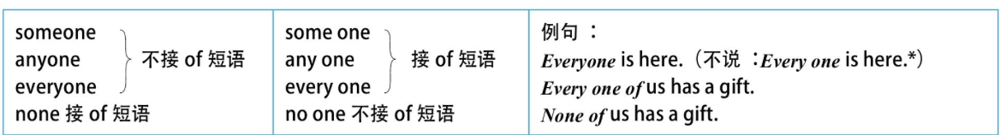
一是，合起来写的someone, anyone和everyone的后面不能接of短语。分开写的no one不能接of短语。

二是，分开写的some one, any one和every one的后面必须接of短语。合起来写的none要接of短语。
## 3.9 限定词总结（四）：限定词之间的位置关系
根据限定词在名词前的位置关系，我们把限定词分为三类：前位限定词（pre-determiner）、中位限定词（central determiner）和后位限定词（post-determiner）

 一、前位限定词

1. 种类

  前位限定词主要是用来说明名词的数量，主要有三种：

  1.表示倍数关系的数量形容词。例如：
  half my salary 我工资的一半
  twice my salary 我工资的两倍
  double my salary 我工资的两倍
  three times my salary 我工资的三倍
  2.表示几分之几的数词。例如：
  one third my salary 我工资的三分之一
  two-thirds my salary 我工资的三分之二
  3.个体形容词：all和both。例如：
  all my salary 我全部的工资
  both my salaries 我的两份工资
2. 共存性

  前位限定词一般互相排斥，不能共存。比如不能说：

  all half my salary*

  half double her income*

二、中位限定词
1. 种类

  1.冠词：the, an和a。
     all the book 所有的书
     half an hour 半小时
     twice the size 两倍的尺码
  2.形容词性物主代词：my, your, his, her, our和their。
     all my money 我所有的钱
     all his money 他所有的钱
  3.指示代词：this, that, these和those。
     all these problems 所有这些问题
     twice that size 那个尺码的两倍
     four times this amount 这个数量的四倍
  4.名词所有格：John's和his father's等。

     all John's money 约翰所有的钱
     由此可知，中位限定词就是我们前面说的“四分之一”。

2. 共存性

  中位限定词亦彼此排斥，不能同时出现。比如不能说：

  my the money*
  our these problems*

三、后位限定词

1. 种类

    1.基数词或序数词：one/first, two/second, three/third和four/fourth等。例如：
      the two children 那两个孩子
      his fourth birthday 他的四岁生日
    2.一般序数词：next, last, past, previous, subsequent, other和another等。例如：
      my next plan 我的下一个计划
      our last meeting 我们的最后一次会议
      your previous mistakes 你从前的错误
      her subsequent response 她接下来的反应
    3.数量限定词：few, many, several, little, less和more等。例如：
      my many friends 我的许多朋友
      our several achievements 我们的几项成就
      the few friends that I have 我的几个朋友

2. 共存性

  不同于相互排斥的前位和中位限定词，后位限定词可以同时出现在名词前。

  但也有先后顺序问题，一般采用如下顺序：

  1.序数词/一般序数词+基数词。例如：

   the first two weeks 前两个星期

   during the next 50 years 在接下来的50年里

  2.序数词/一般序数词+数量限定词。例如：

   during the past few years 在过去的几年里

  3.一般序数词与基数词的位置关系

  基数词/数量限定词一般置于other的前面，如：two other people和many other people。基数词一般置于another的后面，如：another ten minutes（又过了10分钟）。
## 3.10 限定词与形容词的区别
一、限定词用来限定名词所指的范围，对名词起泛指或特指、定量或不定量等限定修饰作用；而形容词则是用来表示名词的性质、特征的。例如：

  many/few/his children 许多/几乎没有/他的孩子

  naughty/lovely/clever children 淘气的/可爱的/聪明的孩子

二、限定词一般不用作表语（少数表示数量的限定词few, many和much除外），而绝大多数形容词都可用作表语。

  除了few, little, many和much外，限定词没有比较级和最高级形式，而大多数形容词有比较级和最高级形式。

  限定词总是位于名词之前，而形容词作定语时有的可置于被修饰词之后。例如：

  this/his/Tom's/every/the book 这本/他的/汤姆的/每一本/这本书
# 4 形容词
## 4.1 形容词
一、单个形容词在名词短语中的位置

在一个名词短语中，若是单个形容词作定语修饰一个名词，其结构通常是“限定词+形容词+名词”，即形容词要放在名词的前面、限定词的后面。
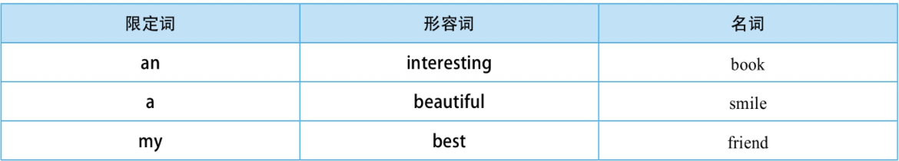
不过，读者要注意，修饰something, anything, nothing, everything, somebody/someone, anybody/anyone, nobody/no one和everybody/everyone等不定代词时，形容词要后置。

二、多个形容词修饰名词时的词序排列

一个中心名词若有多个形容词修饰，此时这些形容词先后的位置关系要遵循一定的规则。这个规则一般是：

观点形容词(opinion adjective)+描绘形容词(descriptive adjective)

所谓“观点形容词”，即完全是表述个人主观上对事物的看法的形容词。如：good, lovely, beautiful, handsome, comfortable等。

所谓“描绘形容词”，又称为描述事实形容词（fact adjective），即用来描述事物本身固有特征的形容词，是对事物进行客观上的表述，如事物的颜色（blue, yellow, dark, white）、事物的形状（round, square）等。
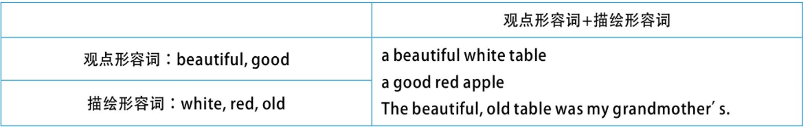
由于事物客观上的属性可以有许多种，因此，描绘形容词又有以下进一步的分类。
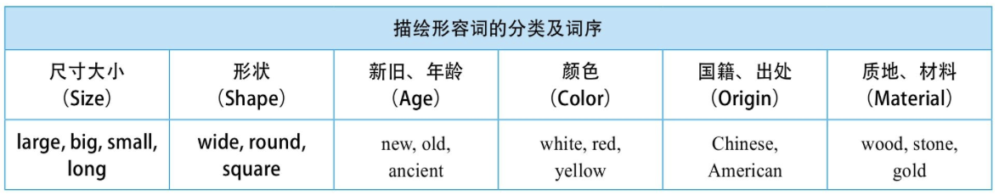
限定词（my, the, three, this）—观点形容词（beautiful, famous）—尺寸大小（large, small, long）—形状（round, square）—新旧、年龄（new, old, ancient）—颜色（white, yellow）—国籍、出处或产地（Chinese）—质地、材料（wood）—中心名词。

最靠近名词的形容词是表示事物的材料、质地的，因为它是与名词的关系最为密切的，因而必须要紧靠名词。另外，如果有表示“用途（purpose）”的修饰语，则其位置是“材料+用途+名词”，即表示“用途”的修饰语要紧靠名词
## 4.1.2 后置修饰名词
我们知道，单个形容词作定语，一般是置于被修饰的名词前面。但形容词短语作定语，一般只能置于被修饰名词的后面，即充当后置定语。

形容词短语的构成主要可以有两类，一类是“形容词+补足语”构成的形容词短语，即在一个形容词的后面接一个介词短语或一个非谓语动词短语作它的补足语。另一类是多个形容词并列使用，从而也构成形容词短语。

一、“形容词+补足语”构成的形容词短语

  这类形容词短语因其后的补足语不同，又可以分为三小类，即“形容词+介词短语”“形容词+不定式短语”以及“形容词+动名词短语”。请看例句：

  1. 形容词+介词短语

  a jacket similar to yours

  妙语点睛 这里的形容词短语similar to yours后置修饰jacket。

  精品译文 一件与你的（夹克）类似的夹克

  形容词的后面除了接介词短语外，还可以接非谓语动词短语作它的补足语，从而构成形容词短语。这里的非谓语动词短语主要是不定式短语或动名词短语。

  2. 形容词+不定式短语

  parents eager to support their children's efforts

  妙语点睛 这里的形容词短语eager to support their children's efforts后置修饰parents。该形容词短语由形容词eager接不定式短语to support their children's efforts构成。

  精品译文 非常乐意支持孩子的父母们

  3. 形容词+动名词短语

  a waiter busy serving the guests

  妙语点睛 这里的形容词短语busy serving the guests后置修饰waiter。该形容词短语由形容词busy接动名词短语serving the guests构成。

  精品译文 忙于招待客人的服务生

  有时我们还可以在形容词的后面接一个that从句来构成形容词短语。

  构成形容词短语的中心形容词与其补足语（如介词短语）都是紧密地连在一起的。但有时候两者之间也可能会插入其他成分，因而造成形容词与其补足语被分隔。这种形容词短语被分隔的情况往往会增加句子理解的难度，因为读者很可能看不到形容词与其补足语遥相呼应的语义联系。

二、多个形容词并列构成的形容词短语

两个或两个以上的形容词（短语）并列作定语，一般是放在被修饰词的后面，而且还用逗号将形容词与句子的其他部分隔开。这时，作定语的形容词通常是对所修饰词作补充性的说明或解释。

形容词短语是由两个单个的形容词并列组成的，当然还有单个的形容词与上面讨论过的“形容词+补足语”这样的形容词短语并列而成

有时，这样的并列形容词不是修饰名词，而是修饰动词或整个句子，此时具有状语的意味
## 4.2 形容词的比较级和最高级的构成形成
### 4.2.1 单音节词
一、一般直接在词尾加-er和-est，分别构成比较级和最高级”
|原级|比较级|最高级|
|----|----|----|
|bright|brighter|brightest|
|tall|taller|tallest|
|strong|stronger|strongest|
|long|longer|longest|
二、以-e结尾的词，直接在词尾加-r和-st，分别构成比较级和最高级
|原级|比较级|最高级|
|----|----|----|
|brave|braver|bravest|
|late|later|latest|
|large|laeger|largest|
|safe|safer|safest|
三、以-y结尾的词应先变y为i，再加-er和-est分别构成比较级和最高级
|原级|比较级|最高级|
|----|----|----|
|shy|shier|shiest|
四、以“一个元音+辅音”结尾的词，要先双写词尾的辅音字母，然后再加-er和-est分别构成比较级和最高级
|原级|比较级|最高级|
|----|----|----|
|fat|fatter|fattst|
|big|bigger|biggest|
|sad|sadder|saddest|
## 4.2.2 双音节词
一、以-y结尾的双音节形容词，要先变y为i，再加-er和-est分别构成比较级和最高级
|原级|比较级|最高级|
|----|----|----|
|happy|happier|happiest|
|early|earlier|ealiest|
|silly|sillier|silliest|
|heavy|heavier|heaviest|
|pretty|prettier|prettiest|
像slowly这样的副词中的-ly，不同于像early这样的形容词中的-ly。前者是后缀-ly（slow+-ly→slowly），而后者是该词不可缺少的组成部分（并不是ear+-ly→early）。这种以后缀-ly结尾的副词（尽管是以-y结尾的双音节词）通常是分别在词前加more和most来构成比较级和最高级。所以，slowly在构成比较级和最高级时，应为more slowly和most slowly。再比如：strongly—more strongly—most strongly。
二、其他绝大多数双音节词是分别在词前加more和most构成比较级和最高级
|原级|比较级|最高级|
|----|----|----|
|tiring|more tiring|most tiring|
三、少数几个双音节词则同时可以用上述两种基本方法来构成比较级和最高级
|原级|比较级|最高级|
|----|----|----|
|common|commoner/more common|commonest/most common|
|clever|cleverer/more clever|cleverest/most clever|
|shallow|shallower/more shallow|shallowest/most shallow|
常见的这样的双音节词有：common, cruel, friendly, funny, handsome, mature, noisy, pleasant, polite, quiet, stupid和tired；以-ow结尾的词有：hollow, narrow和shallow；以-er结尾的词有：clever和tender；以-le结尾的词有：feeble, gentle和noble等等。
### 4.2.3 多音节词
一、三个或更多音节的词都是分别在其前面加more和most来构成比较级和最高级
|原级|比较级|最高级|
|----|----|----|
|interesting|more intereting|most interesting|
|excited|more excited|most excited|
|successful|more successful|most successful|
二、特殊形式的比较级和最高级
|原级|比较级|最高级|
|----|----|----|
|good/well|better|best|
|bad/ill|worse|worst|
|far|father/futher|fathest/futhest|
|old|older/elder|oldest/eldest|
|little|less|least|
|many/munch|more|most|
|late|later/latter|latest/last|
|up|upper|uppermost/upmost|
 1. farther(farthest)/further(furthest)

  这四个词都可以指实际的距离。不过，further/furthest可用于抽象意义，表示“进一步的，更多的，更深入的”，常与抽象名词连用。
 2. older(oldest)/elder(eldest)

  elder和eldest主要是用来表示家庭成员之间的长幼关系，而并非指年龄的大小。
 3. later, latter, latest, last

  1. later：一般用来表示时间上“较迟的”。
  2. latter：则表示顺序上的“后者”，与former（前者）相对应。
  3. latest：意思是“最近的，最新的”，主要用来指新近的事物。
  4. last：主要有两个意思，一是指“在目前之前的一个（the one or ones before the present one）”，或者指“一系列事物中的最后一个（after all others）”。
### 4.2.4 不具有等级的形容词
英语中有一小部分形容词，它们表示绝对的含义，因此没有比较级和最高级形式。其中常见的词包括：absolute（完全的，绝对的），alone（单独的，独一无二的），dead（死的，无感觉的），empty（空的，空洞的），equal（平等的），eternal（永恒的，不变的），final（最终的，决定性的），horizontal（水平的），perfect（完美的），primary（第一位的），pregnant（怀孕的，富有的），round（圆的，球形的），single（单一的），square（正方形的），straight（直的），supreme（最高的，至高的），unique（唯一的，独特的）和unanimous（意见一致的，无异议的）。

尽管这些词没有“等级差别”，但我们还是可以用下面一些表示“接近，几乎”的副词来修饰。比如：nearly, almost, the most closely和more nearly等等。比如：

  1 nearly perfect（接近完美的）

  2 almost fatal（几乎是致命的）

  3 nearly dead（奄奄一息的）

## 4.3形容词的比较级和最高级的用法
### 4.3.1 形容词的比较级的用法
一、than的比较级句型

  对于这一比较级句型的用法，我们首先需要明确以下几点：

  第一，在than的前面必须有形容词或副词的比较级形式；

  第二，被比较的两个对象应该是同类事物，即“事物的可比性”。

  1. 常见的句型是：A+比较级+than+B。A，B一般是两个同类的、彼此独立的人或事物。例如：

  This question is less difficult than that question. 这个问题没有那个问题难。

  2. 也可以不是两个同类事物的比较，而是某一事物自身相比。此时句子的结构为：A+比较级+情形1+than+情形2。例如：

  He did much better in the finals this term than last term. 他这学期的期末考试比上学期的考得好多了。

  Since it has been repaired, the machine works more efficiently than it did before. 机器被修好了，因此比以前的效率更高了。

  3. 若被比较的对象不是彼此独立的人或事物，而是具有“一事物包含另一事物”这样的所属关系，此时我们要用other或else将其与整体区别开来，以免造成逻辑上的矛盾。例如：

  Iron is more useful than any other metal. 铁比其他任何金属都有用。

  She works harder than any other student in her class. 她学习比班里其他任何学生都努力。

  但若说“She works harder than any student in her class.”*就是错误的，因为she属于her class中的一员，而any student in her class则包括“她自己”，这显然前后矛盾。

二、比较级与the

  比较级的前面一般不需加定冠词the，但当介词短语of the two出现在比较级句中的时候，比较级的前面必须加定冠词the。例如：

  I think this painting is the more interesting of the two.（定冠词不能省去） 我觉得在这两幅画中，这一幅更有意思。

  请比较：I think this painting is more interesting than that one. 我觉得这幅画比那幅画更有意思。

三、more and more句型

  用more and more双重比较来表示事物持续不断的变化，相当于汉语中的“越来越”。例如：

  The city is becoming more and more beautiful. 这座城市变得越来越美丽了。

  That female singer is getting fatter and fatter. 那位女歌手变得越来越胖了。

  As summer approaches, the days seem longer and longer. 夏天快要到了，白天变得越来越长。

  这个短语的用法特点如下：

  more and more不可用在单音节词前。如不说：more and more fat*。

  在more and more结构中，不能重复使用形容词或副词。如不能说：more beautiful and more beautiful*。

四、可以修饰比较级的词

  形容词的比较级前可以用以下表示程度的词或短语来进行修饰：a bit, a little bit, a little, a lot, a great deal, any, even, far, by far（还可用在最高级的前面）, much, very much, no, rather, still和slightly等。请看例句：

  Are you feeling any better? 你感觉好些了吗？

  Things are no better than before. 情况并没有比以前有所改善。

  He makes far fewer mistakes in spellings than before. 他犯的拼写错误比以前少多了。

  注意，这些词一般不用来修饰比较级：very, many, quite和fairly等。比如不说：

  My girlfriend is very older than me. *

五、否定意义的词+比较级

  在英文中，我们可以用“否定意义的词+比较级”这种结构来表达一个最高级的意思。这样的词有：few, nothing, never和not等。

  A: How have you been?

  B: It couldn't be worse.

  精品译文 A：你怎么样？

  B：糟透了。

  Few are better qualified for the job than he is.

  精品译文 再没有谁比他更适合做这项工作了。

  另外，never与比较级连用，是在对这个比较级的词进行强调，意思也相当于这个词的最高级，且要用在完成时的句子中。例如：

  I have never heard a better song.

  精品译文 我从未听过比这更好的歌曲。

  该句的言外之意是“This is the best song that I have ever heard.”。

### 4.3.2 形容词最高级的用法
比较级是将彼此独立的人或事物进行比较，最高级则是把一个群体中的一员与该群体整体进行比较。其用法的一般特点是：

  最高级用于两者以上的事物之间进行比较；

  一般的结构是：the+形容词/副词的最高级+比较范围。

  最高级的句型有：

一、the+最高级+in+地方

  It is the most expensive car in the world. 这是世界上最贵的汽车。

  不能说：It is the most expensive car of the world. *

  再看下面的例句：

  The best woman in the world is my mother. The most beautiful sound in the world is my mother's voice. 世界上最好的女人是我的母亲，最美的声音是我母亲的声音。

二、the+序数词+最高级+in+地方

  这一句型是在第一个句型的基础上演化而来的。请看例句：

  The Yangtze River is the longest river in China, but it is the third longest river in the world. 长江是中国最长的河流，是世界第三长的河流。

  The Huanghe River is the second longest river in China. 黄河是中国第二长的河流。

三、the+形容词/副词的最高级+of+所属范围

  Certain zoologists regard crows the most intelligent of birds. 有些动物学家认为，乌鸦是所有鸟类当中最聪明的（一种鸟）。

  很多读者对这一句中的最高级the most intelligent of birds表示不理解，他们疑惑为什么不直接说the most intelligent bird。其实，这一句可以看作是在最高级形容词的后面省去了代词one，即指bird。所以原来的句子可改为：

  Certain zoologists regard crows the most intelligent one (bird) of birds.

  但在实际应用中常常是将这个代词one省去。

四、最高级前面的定冠词the加与不加

  具体规则如下：

  1. 形容词的最高级修饰名词用在名词之前，一般要加the。例如：

  This is the most interesting book of all. 这是所有的书里最有趣的一本。

  2. most有时用在形容词前，并非表示最高级，而是表示“非常，很”之意，相当于very, very much。此时，most的前面一般不用定冠词the。例如：

  The story is most interesting. 这个故事非常有趣。

  It is a most difficult problem. 这是个很棘手的问题。

## 4.4 interesting or interested?
### 4.4.1 -ing形容词与-ed形容词的特点
interesting往往是与事物联系在一起的，而interested往往是与人联系在一起的。由此推而广之，我们可以得出下列一般规律：

  1. -ing形容词主要是用来描述引起人某种感觉的事物，因此，句子的主语通常是事物，或该形容词作定语修饰事物（用于修饰人的情况较少）；

  2. -ed形容词主要是用来描述人的感觉，表示“人对事物产生某种感觉”，句子的主语通常是人或有情绪的动物，或该形容词用来修饰人或有情绪的动物（一般不指事物）。

 the exciting news

 the excited man

  精品译文  激动人心的消息

   显得很激动的人

 a frightened bird/boy

 a frightening story

  精品译文  受到惊吓的鸟/男孩

   让人毛骨悚然的故事

 the annoyed man

 the annoying words

  精品译文  被激怒的人

   令人气愤的话

再比如谈到自己的工作时，如果是job作主语，则要用-ing形容词来描述工作的性质特征

### 4.4.2 -ing形容词可以修饰“人”
对于-ing形容词修饰人的情况，读者应该不会觉得很奇怪，因为这比较常见。不过，出现这种用法时要注意理解句子的意思，否则就可能会出现误解。一般来说，用-ing形容词修饰人，是说明这个人能够引起的某种情绪。
### 4.4.3 -ed形容词可以修饰“物”
般都认为-ed形容词修饰“人”，而-ing形容词修饰“物”。其实不然，关键还是要看表意，意思的表达最重要。上面我们看到了-ing形容词修饰“人”的情况，下面我们来举几个-ed形容词可以修饰“物”的例子。如果对于-ing形容词修饰“人”的用法不太习惯的话，那么对于-ed形容词修饰“物”的用法则会感到更加难以理解。
# 5 动词分类（一）：实义动词与（情态动词）助动词
## 5.1 实义动词
实义动词的特点：

  1. 从词义的角度来看，实义动词具备完整的词汇意义；

  2. 从在谓语中的作用这一角度来看，实义动词能单独充当句子的谓语。

  英语中除了助动词和情态动词以外，其他的动词均为实义动词。
## 5.2 助动词
### 5.2.1助动词be,do和have
助动词的特点：

  1. 从词义的角度来看，助动词不具备词汇意义；

  2. 从在谓语中的作用这一角度来看，助动词不能单独充当句子的谓语，它必须和实义动词连用，以帮助构成各种时态、语态、语气、否定和疑问等。

英语的助动词有三个：be, do和have，它们分别具有各种变化形式。如下：

  1. be: am, is, are, was, were, been, being

  2. do: does, did

  3. have: has, had, having
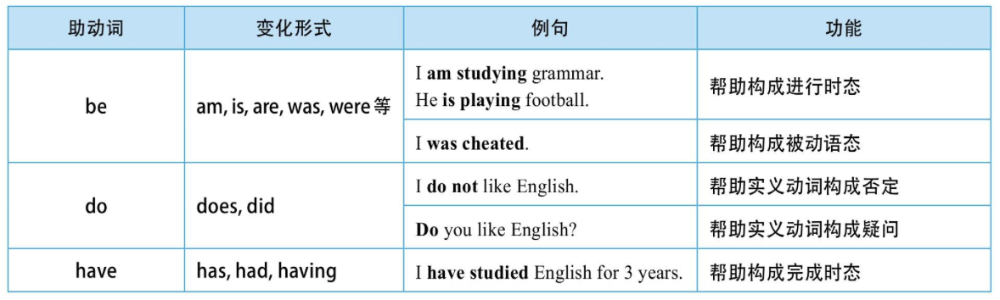
### 5.2.2 用作实义动词的be,do和have
需要提醒大家注意的是，三个助动词be, do和have，同时也可以用作实义动词。而作为助动词或实义动词，它们在词义和谓语中的作用这两方面是完全不同的。所以，不要混淆be作为系动词和助动词、do作为实义动词和助动词以及have作为实义动词和助动词。
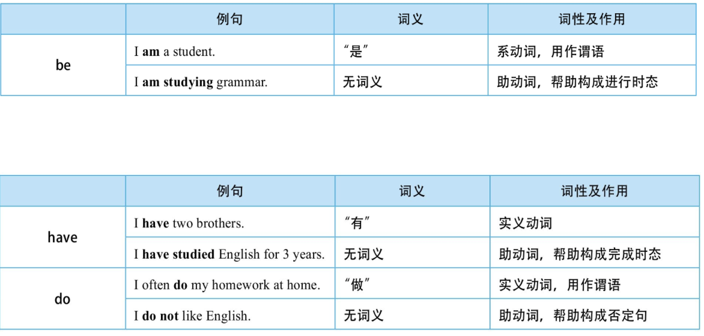
### 5.3 情态动词
情态动词的特点：

从词义的角度来看，情态动词有别于助动词。情态动词有其自身的词汇意义，如用来表示可能、建议、愿望、必要、允许、能力、怀疑等等，以表示说话者对某种行为或状态的看法或态度。

从在谓语中的作用这一角度来看，与助动词一样，情态动词在句中不能单独作句子的谓语，而必须和实义动词一起构成复合谓语。

英文中的情态动词主要有下列10个：

  can/could, may/might, shall/should, will/would, must和had better。

另外还有一些与上述情态动词有关的短语动词：

  be able to（与can类似）

  be going to（与will类似）

  ought to, be supposed to（与should类似）

  have to, have got to（与must类似）

此外，need和dare既可以用作情态动词，也可以用作实义动词。
## 5.4 陈述句的否定
### 5.4.1 谓语中含有be动词或情态动词的否定
这时直接在be动词或情态动词的后面加否定词not即构成否定句。
|肯定句|否定句|
|----|----|
|he is a teacher|he is not a teacher|
|i can swim|i cannot swim|
|he will come to the party|he will not come to the part|
### 5.4.2 谓语动词是实义动词的否定
这时陈述句的否定要借助助动词do及其各种变形来完成。如果是一般现在时的句子，谓语则是“do+not+动词原形”结构；若句子的主语是单数第三人称，谓语则用“does+not+动词原形”。如果是一般过去时的句子，则用“did+not+动词原形”。
|肯定句|否定句|
|----|----|
|i like english|i do not like english|
|he likes english|he does not like english|
|i liked english|i did not like english|
### 5.4.3 否定的缩写
在英语中，助动词或情态动词可以与not缩写
|（情态）助动词|分开写|缩写|
|----|----|----|
|i am|am not|没有缩写|
|we/you/they are|are not|aren't|
|she/he/it is|is not|isn't|
|i/he/she/it was|was not|wasn't|
|we/you/they were|were not|wasn't|
|i/you/we/they do|do not|don't|
|he/she/it does|does not|doesn't|
|did|did not|didn't|
|i/you/we/they have|have not|haven't|
|he/she/it has|has not|hasn't|
|had|had not|hadn't|
|will|will not|won't|
|would|would not|wouldn't|
|shall|shall not|shan't|
|should|should not|shouldn't|
|can|cannot|can't|
|could|could not|couldn't|
|may|maynot|没有缩写|
|might|might not|mightn't|
|must|must not|mustn't|
## 5.5 一般疑问句
### 5.5.1 谓语动词中含有be动词或情态动词的提问
这时要构成一般疑问句，只需将be动词或情态动词移到句首。请看下表中的例句比较：
|肯定句|疑问句|回答|
|----|----|----|
|he is a teacher|is he a teacher?|yes,he is./no,he isn't.|
|he can swim|can he swim?|yes,he can./no,he can't.|
注意一般疑问句的回答方式：肯定回答用yes，否定回答用no。

|肯定句|疑问句|回答|
|----|----|----|
|i like english|do you like english?|yes,i do/no,i don't|
|he like english.|does he like english?|yes,he does./no,he didn't.|
|he like english.|did he like english?|yes,he did./no,he didn't.|
## 5.6特殊疑问句
### 5.6.1 不与名词连用的疑问句
一、对人提问——who

He can sing in English.

Who can sing in English?

  精品译文  他会唱英文歌。

   谁会唱英文歌？

二、对事物或所做的事情提问——what
I like English.

What do you like?

  精品译文 我喜欢英语。

   你喜欢什么？
三、对时间提问——when

I was born in 1980.

When were you born?

  精品译文 我是1980年出生的。

  你是什么时候出生的？

四、对地点提问——where

He lives in Beijing.

Where does he live?

  精品译文 他住在北京。

  他住在哪里？

五、对方式提问——how

He goes to school by bus.

How does he go to school?

  精品译文 他坐公共汽车上学。

  他怎么上学？

六、对原因提问——why

I often study at the library because it's quiet.

Why do you often study at the library?

  精品译文 我常常在图书馆学习，因为那里很安静。

  你为什么常常在图书馆学习？
### 5.6.2 要与名词连用的疑问句
一、which
当说话者提供多种对象供对方选择时，我们就要用which来提问。此时，which的后面通常要接一个名词，意思是“哪一个什么东西”。

二、whose
whose的后面必须接名词，表示“谁的什么东西”。

### 5.6.3 how的用法详解
一、how可以单独使用

how单独使用时，是对动作的方式进行提问。

二、how还常与形容词或副词连用

与形容词连用的例句如下：

How old are you? 你多大岁数？

How tall is he? 他身高多少？

How big is your new house? 你的新房子有多大？

How far is it from your home to school? 从你家到学校有多远？

与副词连用的例句如下：

How well does he speak English? 他英语说得怎么样？

How quickly can you get here? 你多快能到这里？

三、对动作发生的频率提问——how often/how many times...?

I make a phone call to my parents once a month.

How often do you make a phone call to your parents?

  精品译文 我每个月给父母打一次电话。

  你多久给父母打一次电话？

I make a phone call to my parents once a month.

How many times a month do you make a phone call to your parents?

  精品译文  我每个月给父母打一次电话。

  你每个月给父母打几次电话？

I go shopping twice a week.

How often do you go shopping?

  精品译文 我每周去购物两次。

  你多久去购物一次？

I go shopping twice a week.

How many times a week do you go shopping?

  精品译文 我每周去购物两次。

  你每周去购物几次？
# 6 动词分类（二）：英语的五种基本句型
## 6.2 五种基本句型概述
### 6.2.1 主语+谓语
一个完整的句子都由两部分组成：

  “陈述对象+陈述内容”

  这里的陈述对象一般是由名词或相当于名词的成分来充当，用语法术语来说叫作主语。而陈述内容则是说明主语怎么样了，都是用动词来表达，我们称之为谓语。因此，一个完整的英文句子就是：

  “主语+谓语”

  或

  “名词+动词”

  所以，英文句子的结构有自己的规律，总是要写出“主语+谓语”。我们还可以进一步思考：“英文句子为什么一定要有主语和谓语动词呢？”

  其实，我们可以从哲学的角度找到答案。辩证唯物主义认识世界的基本出发点是：

  1. 世界统一于物质，即世界是由物质组成的；

  2. 物质的存在形式是运动。

  因此，人们对世界的认识可归结为“物质的运动”或“运动的物质”。

  而语言作为人类思维认识的载体，自然也得体现这一客观规律“物质+运动”→“名词+动词”→“主语+谓语动词”。

  因此，今后我们写英文句子时，通常就要写出主语，还要写出谓语动词；既要有“陈述对象”，又要有“陈述内容”，这样才能表达一个完整的意思。

### 6.2.2 五种基本句型概述

进一步研究之后我们还会发现，上述句子的动词后面所接的成分长短不一，于是我们又可以把这些句子进一步细分。如下表所示：
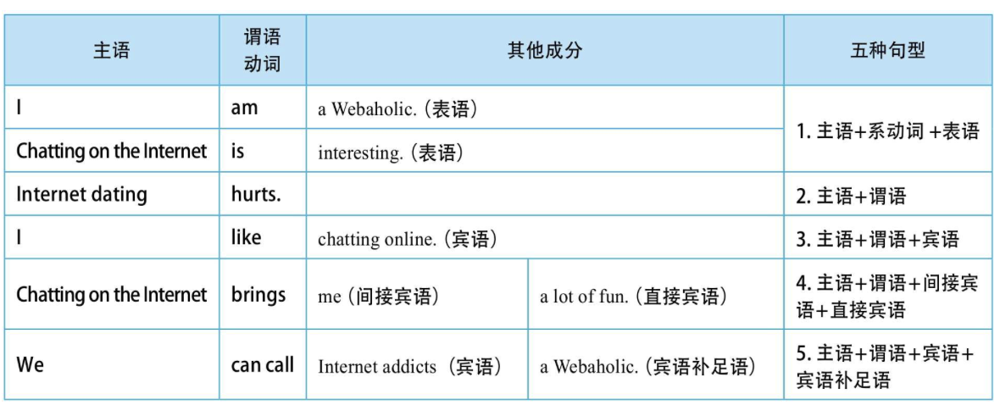
在上面的表格中，有好多术语（如表语、间接宾语、直接宾语或宾语补足语）读者也许不太熟悉，在后面马上就会有详细的解释。在此，我们先要了解上述英文的五种基本句型。之所以有这五种基本句型，关键在于谓语动词。比如有的动词后面不带宾语，例如：

  Internet dating【主】 hurts【谓】.

有的动词要有宾语。例如：

I【主】 like【谓】 chatting online【宾】.

有的动词后面要接两个宾语。例如：

Chatting on the Internet【主】 brings【谓】 me【间宾】 a lot of fun【直宾】.

有的动词后面仅有一个宾语不能够表达完整的意思，在宾语的后面还需接一个补充宾语的成分。例如：

We【主】 can call【谓】 Internet addicts【宾】 a Webaholic【宾补】.

因此，动词构成了一个句子的骨架结构，因为动词决定了一个句子是否有宾语、有几个宾语以及其他句子成分。在下面的句型分析中，读者要特别注意每一种句型的谓语动词的特点。
## 6.3 句型一：主语+表语
该句型的谓语动词是系动词（如be或其他系动词）。所谓系动词，又叫联系动词（linking verb），顾名思义，这种动词并不表示具体的动作，而只是起连接主语和后面成分的作用。这种动词后面所接的成分是用来说明主语的特点，表明主语的性质特征的，因此我们称之为主语补足语，或表语（能表示主语特征的成分）

英文中最常见的系动词是be动词，其具体的形式有：am（I am）, is（he is, she is, it is）, are（you are, we are, they are）。其他的系动词还有：

  look（看起来是） sound（听起来是） smell（闻起来是）

  taste（尝起来是） feel（感觉是） seem（似乎是）

  appear（似乎是） become（变为） turn（转变为）

用作表语的词通常是名词（如Webaholic和teacher等）和形容词（如interesting, important, nice和yellow等）。副词一般不作表语，
## 6.4 句型二：主语+谓语
该句型的谓语动词是不及物动词（intransitive verb），所表示的动作没有作用对象，其本身的意思完整，其后不需带宾语。

这种句型中谓语动词的后面虽然不接宾语，但通常会接副词（如hard）或介词短语（如in the west）来说明动作的方式、地点或时间等等。英文中把这种修饰动作的成分称作状语。
## 6.5 句型三：主语+谓语+宾语
该句型的谓语动词是及物动词（transitive verb），这种动词告诉我们由主语发出的动作所作用的对象是什么，这里所作用的对象就是我们通常所称的宾语，即宾语是主语动作的承受对象，因此这类动词是带有宾语的。英文中的绝大多数动词都是及物动词，在词典中标为vt.。

play既可以用作及物动词，又可以用作不及物动词，但意思和用法都不一样。事实上，英语中大多数动词都像play一样，既可以用作及物动词，又可以用作不及物动词，但意思和用法都不一样。
## 6.6 句型四：主语+谓语+间接宾语+直接宾语
该句型的谓语动词是双宾动词（dative verb），这种动词的后面所接成分有“人”又有“物”。一般来讲，这里的“人”表示动作的接受者，称作间接宾语（indirect object）。“物”表示动作作用的对象，是动作的承受者，称作直接宾语（direct object）。间接宾语和直接宾语合起来叫做双宾语
## 6.7 句型五：主语+谓语+宾语+宾语补足语
该句型中的谓语动词是宾补动词（factitive verb），这种动词的后面接宾语，而此宾语的后面又接补充说明宾语的补足语（object complement）。宾语和宾语补足语合起来叫做复合宾语。

比较一下上一节讲的“主语+谓语+双宾语”句型和本节讨论的“主语+谓语+复合宾语”句型，学会区分双宾语和复合宾语。其实，区分这两种宾语的方法很简单，就是在宾语的后面加上be动词，若能构成一个语义通顺的句子，则是补足语。因为宾语与宾语补足语的语义关系就相当于主语与主语补足语的关系，即类似一个“主系表”结构。所以，在宾语的后面添上一个系动词be，自然就能构成一个逻辑语义通顺的句子。而间接宾语与直接宾语之间就没有这样的语义关系，所以，添上be之后，不能构成一个语义通顺的句子。
# 7 英文时态（一）：一般时态
## 7.1 英文时态体系概述
### 7.1.1 英文时态的构成：四时四态
我们通常所说的时态（tense and aspect），在英语中其实反映的是两个不同的概念，即tense（时）和aspect（态或体）。与时间相联系的“时”，以及与动作的内在结构相关的“态”或“体”，这两方面组合在一起就构成了“时态”。

一、tense（时）

是用来规定事物发生的时间的。在英文中主要有四种不同的时间标识：

  1. 现在时（present）

  2. 过去时（past）

  3. 将来时（future）

  4. 过去将来时（past future）

二、aspect（态）

是用来规定动作完成的程度，反映说话者对事物的态度的。在英文中，这种动作方面的规定有四种：

  1. 简单体（simple，或者称为“零”体态）

  2. 进行体（continuous）

  3. 完成体（perfect）

  4. 完成进行体（perfect continuous）

英语的“态（aspect）”是有关动作内在结构特点方面的属性。当我们谈到“时（tense）”的时候，我们关心的是这个动作发生的时间，即是在现在、过去还是将来发生的。当我们谈到“态（aspect）”的时候，我们关心的则是这个动作是固定不变的还是动态变化的（fixed or changing），这个动作是完成了的还是在延续的（complete or ongoing），这个动作持续的时间是很短还是很长（lasting for only a moment or for a long time）等等。

我们在实际造句中所使用的时态正是由上述四种时间规定和四种动作规定组合在一起而构成的。

|时间标示\动作标示|一般|进行|完成|完成进行|
|----|----|----|----|----|
|现在|现在一般时|现在进行时|现在完成时|现在完成进行时|
|过去|过去一般时|过去进行时|过去完成时|过去完成进行时|
|将来|将来一般时|将来进行时|将来完成时|将来完成进行时|
|过去将来|过去将来一般时|过去将来进行时|过去将来完成时|过去将来完成进行时|

我们现在以动词work为例，来看这些时态的构成形式。

|时间标示｜动作标示|一般|进行|完成|完成进行时|
|----|----|----|----|----|
|现在|work/works|am/is/are working|has/have worked|has/have been working|
|过去|worked|was/were working|has worked|has been working|
|将来|will work|will be working|will have working|will have been working|
|过去将来|would work|would be working|would have working|would have been working|

三、英语谓语的“万能公式”

对于上述复杂的谓语变化，我们现在给出一个非常简单的谓语公式来概括。该谓语公式如下：

|tense|modal|perfect|continous|verb|
|----|----|----|----|----|
|past or present|will|have + ed|be + ing|verb|

英语中所有的谓语形式都可以从上面这个谓语公式推导出来。对于上面这个公式，现在说明如下：

第一，tense表示“时”，主要有两种最基本的“时”：现在（present）和过去（past）。

第二，modal表示英语谓语中的“情态”，这里以will作为代表。其中括号“（）”表示它是一个备选项，即可以被省去。由tense加modal就可以构成上面说过的英语中的另外两种“时”：将来时（will）和过去将来时（would）。

第三，perfect表示“完成体”，这里以have+-ed来表示。其中括号“（）”表示它是一个备选项，即可以被省去。

第四，continuous表示“进行体”，这里以be+-ing来表示。其中括号“（）”表示它是一个备选项，即可以被省去。

第五，verb表示英语的谓语动词，它没有用括号，表示谓语动词不是备选项，而是必不可少的。

除了动词是英语谓语必不可少的一部分，“时”也是英语谓语必不可少的组成部分。因此，英语谓语的核心组成有两部分：一个是表示动作发生时间的“时”，另一个是基础动词。这其实也就是英语“一般时态”的基本构成。下面我们简单地介绍一下英语“一般时态”“进行时态”“完成时态”和“完成进行时态”的构成。

四、一般时态的构成

如果把“时（tense）”和“态（aspect）”区分开来看的话，我们立即就会发现，“一般时态”只有“时”的变化，而没有“态”的变化。因此，我们把“一般时态”称为“零”体动作。它们的谓语构成公式是：

|tense|modal|verb|
|----|----|----|
|past or present|will|verb|

这里括号中的modal表示可以省去。我们现在用上面这个公式分别表示出一般现在时、一般过去时和一般将来时的谓语构成形式，以work为例。

一般现在时的works可以具体表示为：

|tense|verb|
|----|----|
|present-s|work|

或者简化为：works=present+work。

一般过去时的worked可以具体表示为：

|tense|verb|
|----|----|
|past-ed|work|

或者简化为：worked=past+work。

一般将来时的will work可以具体表示为：

|tense|modal|verb|
|----|----|----|
|present|will|work|

或者简化为：will work=present+modal+work。

从以上的表格中，我们没有看到“体态”的表达，因为“一般动作”本来就是零体态动作。

五、进行时态的构成

对于进行时态，这里有了一个“进行体”，所以上述总的谓语公式只要保留“进行体”，去掉“完成体”，即可变成进行时态的谓语公式。如下：

|tense|modal|continuous|verb|
|----|----|----|----|
|past or present|will|be + ing|verb

关于进行时态的具体谓语构成，详见8. 5节，在此不再赘述。

六、完成时态的构成

对于完成时态，这里有了一个“完成体”，所以上述总的谓语公式只要保留“完成体”，同时去掉“进行体”，即可变成完成时态的谓语公式。如下：

|tense|modal|prefect|verb|
|----|----|----|----|
|past or present|will|have + -ed||verb

关于完成时态的具体谓语构成，详见《英语语法新思维中级教程——通悟语法》，在此不再赘述。

七、完成进行时态的构成

对于完成进行时态，这里同时含有了两个“体”：“完成体”和“进行体”。所以上述总的谓语公式只要把“完成体”和“进行体”的括号全部去掉，表示都是必选项，即可变成完成进行时态的谓语公式。如下：

|tense|madal|perfect|continuous|verb|
|----|----|----|----|----|
|past or present|will|have + -ed|be + -ing|verb|

### 7.1.2 时态学习技巧
一、时态的形式、意义和用法

关于时态的用法的讲解和学习，必须结合语境，给出具体的、真实的说话语境，这样才便于读者真正地理解一种时态所要表达的意义及用法。时态的表达是英语思维的重要组成部分。

二、深入理解每一种体态动作的核心意义

每一种时态的核心意义，就是它最基本、最稳定的中心意义。比如，简单体的核心意义是，被概念化的整体事件，这些事件是无法继续发展的。简言之，一般时态具有完整和不变的核心意义，这种体态与进行体相对。进行体表示不完整的或未完成的，其相关的事件或状态被看作是一个整体的某个部分，往往还有继续发展或变化的余地。

打个比方来说，一般时态就好像是一幅静态的画，画作完成之后就不会改变了，没有动态变化的过程。而进行时态就相当于一幅“沙画”作品，它是处于动态变化中的。看过沙画艺术的读者应该知道，沙画艺术家现场在一块透明的玻璃画板上，用自己手中的沙子可以描绘出变化多端、栩栩如生的美丽画作，他不断地在原有画作的基础上变化出形态万千的图画作品。而进行时态就相当于这些变化中的沙画。

三、以“体态（aspect）”为学习时态的基础

首先，学习时态重在深刻地理解“体（aspect）”的内涵。因为同一“体”的动作有着本质上相通的特点，区别只是说话人的“时间视角”不同罢了。其次，在以表示动作规定方面的“体”为逻辑主线的前提下，分析比较不同时间规定下的同一“体”的动作以及其他各种时态之间的区别（如现在完成时态与一般过去时态的区别）。

四、动词与时态表达有关

英语通过两方面来表达，这也就是英语中的两类体：一类是“语法体（grammatical aspect）”，就是读者熟悉的“进行体（continuous）”和“完成体（perfect）”；另一类是“动词体（lexical aspect）”，这是用来标示动词词义本身所固有的特点（the inherent properties of the verb's meaning）的。在这方面，英语把动词分为“状态”和“动作”（state and action），又把动作分为“短暂动作”和“延续动作”（punctual and durative）等等。

说到这里，我们看到“体”有广义和狭义之分：广义的“体”包括“语法体”和“动词体”；狭义的“体”就是指“语法体”。
## 7.2 一般现在时态——并非表示现在
### 7.2.1 用法一：表示普遍的事实或真理
表示不受时间限制的科学事实、客观真理、谚语格言，以及用于概括、结论、观点等。此时，这些动作或状态的发生不限于某个特定的时间，即它们可发生于任何时间，包括现在、过去和将来。

这里主要讨论了一般现在时表示不受时间限制的科学事实、客观真理、谚语格言，及用于概括、结论、观点等的用法，因为这些动作或状态的发生不限于某个特定的时间，即它们可发生于任何时间，包括现在、过去和将来。从这个意义上看，一般现在时并非表示“现在发生”的动作或状态，这是一般现在时态最基本的思维特征。
### 7.2.2 用法二：表示重复活动
表示经常发生的、习惯性的动作（action）或者是存在的状态（state）。

一、表示习惯的动作

He often goes to the gym. 他经常去健身房。

I go to the gym twice a week. 我每周去两次健身房。

He walks to school every day. 他每天步行去上学。

二、表示习惯的状态

I like rice for dinner. 我晚餐喜欢吃米饭。

补充：这一用法常和一些表示动作频率的时间副词连用。

1. 表示肯定的频度副词有：always, frequently, usually, sometimes, generally, occasionally和often等。

2. 表示否定的频度副词有：never, seldom和rarely。

3. 表示频度的副词短语有：once a week, twice a year和on alternate days等。

不过，在应用上述这些副词时，要注意以下几点：

1. 它在句子中的位置通常是：在be动词后、实义动词前。

He is always late. 他总是迟到。

He always goes to school by bike. 他总是骑自行车上学。

2. 上述否定副词不能再与否定助动词（如don't等）连用。

He doesn't seldom come late. *（一般不这么说）

He seldom comes late. 他几乎从不迟到。

3. 这些副词一般放在否定助动词，always除外。

The history lectures sometimes aren't interesting. 关于历史的讲座有时很没意思。

His wife complains that he sometimes doesn't listen to her. 他的妻子抱怨，说他有时候不注意听她说话。

  He doesn't always leave before 6 o'clock. Sometimes he works until 7 o'clock.

  他并不总是在6点钟之前下班，有时他会工作到7点。
### 7.2.3 用法表示：表示重复活动的一般现在时态和现在完成时态
由于是对一项运动的一般性介绍，并没有时间限制，所以这里都使用了一般现在时态（除了一个情态动词would以外）。一般现在时表示“动作或状态的发生不限于某个特定的时间，它们可发生于任何时间，包括现在、过去和将来”。

一般现在时是在泛泛地谈时间，并没有时间段的概念；而完成进行时表示说话人的脑子里会有一个“到目前为止”的时间段的概念，甚至是给出像for about four years这样一个明确的时间段。
### 7.2.4 用法三：一般现在时表示正在发生的动作

一、一般现在时态用在以there或here开头的句子中，表示目前的短暂动作

请看例句：

Here comes your wife.

妙语点睛 这里显然是说话人看到your wife正在走过来，然后说的这句话，即表示正在发生的动作。在这个结构中不能用现在进行时态，不能说“Here is coming your wife.”* 可以说“Your wife is coming.”。但是，此时的进行时是表示将来的动作，所以这句话的意思是：你妻子很快就要过来了。

精品译文 你妻子来了。

二、表示现在瞬间的动作（instant actions）

这个瞬间动作是说话人在说话的同时即刻发生的。这只适用于表达动作的动词，表示对一些动作的解说，比如：球赛解说、剧情介绍、解释自己正在做的事情、给别人一边说一边做的示范动作等等。请看例句：

Michael passes to Clint. Clint to Jack, Jack back to Clint—and Clint shoots—and it's a goal!

妙语点睛 这是球赛的解说，表示在说话时刻正在发生的动作。

精品译文 迈克尔传给克林特，克林特传给杰克，杰克又回传给克林特——克林特射门——球进了！

### 7.2.5 用法四：一般现在时表示将来发生的动作
一、用在条件状语从句和时间状语从句中

主要用在条件状语从句（if和unless）和时间状语从句（when, as soon as, before和after等）中，表示将来的动作。

二、在谈到未来的计划和时间安排表的时候，表示将来的动作

此时句中的动词往往是表示短暂性动作的动词，如go, come, leave, start和move等。请看例句：

The train starts at 2 o'clock. 火车两点钟开。

We move next week. 我们下周搬家。

They leave for Shanghai by train tomorrow evening. 他们明晚出发去上海。

三、在从句中表示将来的动作，此时主句往往用了一个将来时

请看例句：

I will reward the person who finds my lost kitten. 我将酬谢找到我丢失的猫的人。

I will give the booklet to whoever asks for it. 谁来索取这个小册子，我就把它给谁。
### 7.2.6 用法五：一般现在时表示过去发生的动作
一、表示死者的理论、著作等

因为这些理论、著作到现在仍有效；或表示一些名人名言。请看例句：

Francis Bacon says, “Reading makes a full man; conference a ready man; and writing an exact man.”

弗朗西斯·培根说：“读书使人充实，讨论使人机智，写作使人准确。

二、引用书刊、报纸、通知或新近收到的信件的内容时

请看例句：

The newspaper reads, “The criminal who killed eight women has been executed.”

妙语点睛 这里的reads其实是表示过去的，因为显然是说话人看过the newspaper之后才说了这句话。

精品译文 报纸上写着：“杀害八名妇女的那个罪犯已经被处决了”。
### 7.2.7 用法六：一般现在时指现在完成时
在口语中，可以用一般现在时代指现在完成时。能这样使用的动词不多，通常有：hear, find, see, learn, tell和read等。

## 7.3 被遗忘了的一般过去时态
### 7.3.1 引言
英文与中文的一个重大差异，就是英文通过动词的变形来潜含各种言外之意。比如英文里只要对be动词做不同的变形（如was或is等变形），就能轻而易举地表达出各种不同的意义，但是对应的中文翻译却完全不同了。这就是相对于中文来说英文语言的一大特色——话语标记（language mark），这是中文里所没有的语言现象。我们中文绝不可能通过词形的变化来表达出不同的意义，因为汉语没有任何词形的变化。英文里的时态就是一种最为重要的英文话语标记。所以，我们要想习得英语思维，精通英语表达，还是要从时态开始。

另一方面，这里的was就是be动词的一般过去时态。一般过去时并不像很多人想的那样简单，实际上，对于我们这些有着根深蒂固汉语思维的中国人来说，一般过去时是最容易被忽略的一个时态。

### 7.3.2 基本用法一：过去发生的短暂动作或状态
一般过去时常表示在过去某一个特定的时间所发生的动作或存在的状态，此时常和表示过去的特定的时间状语连用。这些时间状语有：yesterday, yesterday evening, last night, the night before last（前天晚上）, last year, last spring（去年春天）以及three days/months/years ago等等。注意，这些时间状语之前不需加介词，比如不能说：at last night*, in last year*或in three years ago*等等。
### 7.3.3 基本用法二：过去发生的重复或延续活动
除了上述表示短暂动作之外，一般过去时还可以表示过去的一段时间（a specific period of time in the past）内延续或重复的动作
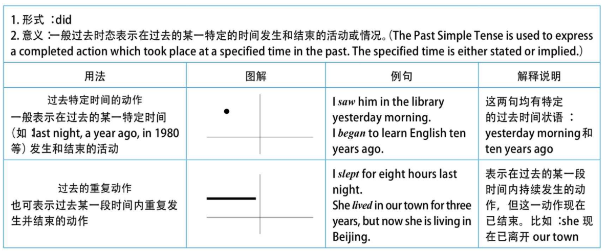
### 7.3.4 用法比较：一般现在时和现在完成时用于“for+时间段”的区别
一般过去时与“for+时间段”连用，表示动作在过去已经结束，并没有延续到现在；而现在完成时与“for+时间段”连用，则表明动作延续到现在，并且还有可能延续下去。

### 7.3.5 口语用法一：“我不知道”——"i don't know" or "i didn't know"?
我们先来看看下列这个场景对话：

  A: Do you see the person with loose pants and long hair? Is it a boy or girl?

  B: A girl. She is my daughter.

  A: Oh, please forgive me. I didn't know you were her mother.

  B: No, I'm her father.

  精品译文 A: 你看见那边那个穿着宽松裤子、留着长发的人了吗？是男的还是女的？

  B: 是女的。她是我女儿。

  A: 哦，真对不起，我不知道你是她母亲。

  B: 不，我是她父亲。

  如果句子中带有表示过去的时间状语，相信大家都还记得要用一般过去时态。然而，对于像这个实际的口语对话，我们很可能就把一般过去时抛到九霄云外去了。比如，上面对话中的“我不知道你是她母亲”这一句，很多读者的第一反应很可能就是：

  I don't know you are her mother.

  但是，通过对上下文进行仔细的分析后，我们发现A说“我不知道”的时候其实他已经知道了，因为B已经告诉他“She is my daughter.”了，也就是说，他的真正意思应该是“我刚才不知道”，因此正确的英文应该说成：

  I didn't know you were her mother.
### 7.3.6 口语用法二：“我忘记了”——"i forget" or "i fprgot"?
 比如我们说“我忘记了这个单词的意思”和“我忘记把你的耳机带来”，这两个“忘记”在汉语中丝毫没有区别，但在英文中却是大不相同，即它们发生的时间不一样。“我忘记了这个单词的意思”是“我”现在还不知道；而“我忘记把你的耳机带来”是当“我”想起来之后说的一句话，“忘记”已成为过去。因此，这两句英文要分别说成：

  I forget the meaning of the word.

  I forgot to bring your earphone back.

  再看下列例句：

  A: Oh, I'm sorry. I just realized that I forgot to bring the camera you lent me. I left it back in my dorm.

  B: That's all right. I won't need it until tonight. As long as I've got it back by then.

  精品译文 A：哦，对不起，我现在才想起来我忘了把你借给我的那个相机带来，我把它忘在宿舍里了。

  B：没关系，我今晚才用呢，只要到时你能拿过来就行。

  A: I am sorry I forgot to return your physics book last night.

  B: I'll forgive you considering the test isn't until Friday.

  精品译文 A：很抱歉，昨晚我忘了还你的那本物理书。

  B：没关系，因为周五才考试呢。

  以上这两句同样都是在说话人想起来之后才能有的“我忘记了”，所以都用了一般过去时态。因此，在我们汉语中说“我忘记做某事”，英文一般都是说成I forgot to do...，因为这一定是当你想起来之后才能说的一句话，“忘记”已成为过去，否则你不可能说出这句话。因此，英文中一般说不出*I forget to do...，因为找不到使用它的语境。我就曾经问过我的英国朋友是否能说*I forget to do...，他皱起眉头想了半天，最后还是摇摇头，说找不到这样的语境。可见，native speakers是将英语时态深刻地融入到了自己的思维表达之中，而我们这些“老外”却根本不注意时态。不论forget如何变形（如forgot, have forgotten和have been forgetting），我们只有一种译法——“忘记”，而不去考虑每一种时态表达的背后都是对应有特定的语境的。我们往往只注重单词本身的词义，而忽略了时态背后所潜含的思维语境。这样一来，我们说出来的英文往往是“有口无心”式的“鹦鹉学舌”，而不是“身临其境”般的“言传心声“。
### 7.3.7 口语用法三：“我以为”——"i think" or "i thought"?
I thought和I think都可以翻译成“我认为……”，这就看不出二者到底有什么区别了。受此影响，我们往往就不分I think和I thought了，在什么场合都一律说成I think，这就不妥了。

  总之，读者不妨记住这个小技巧：当我们要说“我本来还以为……”时，在英文中就要说成I thought...。
### 7.3.8 口语用法四：根据上下文的语境灵活地使用一般过去时
很多时候没有这样的规律可循，使用过去时完全取决于上下文语境的含义，这时就需要说话者对某个特定语境中暗含的过去时间特别敏感，方能正确地使用一般过去时。

这里同样是用了一般过去时was。因为经过聊天后，“认识（meet）”或“聊天（talk）”都已成为刚刚的过去，所以自然要用was而不是is。上面两句告别用语可以分别简化成“Nice meeting you.”和“Nice talking to you.”。另外还要注意的是，告别时说“认识”用的是动名词meeting，而不是不定式to meet。所以，读者以后在初次认识老外后，在告别时，不要说“Nice to meet you.”而要说“（It was） Nice meeting you.”。
### 7.3.9 口语用法五：礼貌表达
在口语中，一般过去时（也可用过去进行时）可以表示语气委婉，此时的过去时丝毫没有过去的意味，而谈的是现在的情况。请看例句：

  I wondered if you could help me. 我想知道你能否帮我。

  Could you give me a hand? 你能帮我一下吗？
## 7.4 一般将来时——预测、计划和意愿
### 7.4.1 引言
对于一般将来时（the future simple tense）的讨论，要比前两个时态稍微复杂一些。因为从严格意义上来说，英文里是没有“将来时态”的，而只有现在时态和过去时态这两种时态（Technically, English has no “future tense”, but only two distinct tense forms—present and past tenses.）。

首先，从时态形式（tense form）的构成上来看。现在时态（present tense）的构成是用动词原形（basic verb form），或遇到单数第三人称主语，谓语动词加-s。过去时态（past tense）的构成则是动词变为过去式（如加-ed或其他特殊变形）。因此，对于现在时态和过去时态，都是在谓语动词的词尾上进行变形。但对于将来时态，在动词的词尾却没有任何变形。

其次，从表达“将来时态”的各种手段来看。在英文中，表示现在时态，就用动词原形或者加-s；表达过去时态，就用动词过去式变形。但表达将来时态，即人们谈论将来要发生的事情时，事实上，是采取动词形式变化以外的其他方式来达到这一目的的。具体的方式非常多，比如使用情态动词will和be going to，比如使用现在进行时（be doing）表示将来的动作，以及采用其他的句型结构，如be to do或者be about to do等（这些不同的表示将来的手段，都是我们接下来要讨论的重点内容）。由此看来，英文中并不只是用will do表示将来，所以，我们并不能因为will do可以表示将来的动作，就说将来时态的构成就是will do。如果是这样，那么be to do或be about to do这样的结构也是将来时态吗？或者表示将来事情的进行时态也是将来时态吗？或者表示将来事情的进行时态也是将来时态吗？当然不能这么认为。从这个意义上来说，英语是没有将来时态的。

再次，从是否成为事实的角度（factual or non-factual）来看。将来的事情与发生在过去或现在的事情是完全不同的，发生在过去或现在的事情都已是确定无疑的，是一个事实（fact）。但谈论将来要发生的事情，就不可能成为一个确定无疑的事实，而只能是表示一种可能性（Situations in the future are treated differently. They are inherently non-factual, but can be considered as either relatively certain or relatively unlikely or even impossible. Thus future events are not treated as facts, hence are only possibilities.）。所以，从核心意义的角度来说，发生在“将来”的事件与发生在“过去”或“现在”的事件不可能有相同的确信度（certainty）。因此，严格地讲，我们无法以事实为基础去报告将来的事件。所以，will用来表示很有把握的预测（prediction），但不是对事实的叙述或报告。

从情态意义来看。上文讲过，表示将来时态的will do只是情态动词的一种用法而已，因此表示将来的事件往往是与各种情态意义联系在一起的。比如：预测某事将会发生，计划将来做某事，或表示愿意去做某事。因此，对于将来时态的学习，理解以下三个概念是至关重要的：

  1. 预测（prediction）：表示说话人认为将来会发生某件事；

  2. 事先计划（future plan）：表示说话人在头脑里已经做出决定将来要做某件事；

  3. 意愿（willingness）：表示说话人既不是预计某事将会发生，也不是预先经过考虑决定将做某事，而是在说话的时刻立即做出决断表明他将去做某事。

接下来，我们就以能够表示将来活动情景的各种不同的手段为主线，重点讨论will和be going to的用法与区别，同时结合三大情态意义——预测、计划和意愿，来讨论将来时态的各种用法。
### 7.4.2 will表示将来——预测
一、关于“科技（Science）”方面的预测包括：

  Will we travel to the stars?（我们能够进行星际旅行吗？）

  Will we clone a dinosaur?（我们能克隆恐龙吗？）

  Will a killer asteroid hit the earth?（小行星能撞毁地球吗？）

  Will the brain understand itself?（大脑能理解自己吗？）

  Will we keep evolving?（我们人类还能一直进化吗？）

  Will we travel back or forward in time?（我们能进入时光隧道回到过去或去到未来吗？）

  Will we live on Mars?（我们能生活在火星上吗？）

  Will we meet E. T. ?（我们能遇到外星人吗？）

  Will someone build a perpetual motion machine?（有人能发明永动机吗？）

  Will we discover another universe?（我们能发现另外的宇宙吗？）

  Will we figure out how life began?（我们能知道生命是如何起源的吗？）

  Will we control the weather?（我们能控制天气吗？）

  How will the universe end?（宇宙会怎样结束？）

  Will there be anything left to discover?（还有哪些有待于我们去发现的东西？）

二、关于“人类如何生活（How We Will Live）”方面的预测包括：

  Will women still need men?（女人还需要男人吗？）

  What will we wear?（我们会穿什么？）

  Will there be any teenagers?（还会有青少年吗？）

  Will we still have privacy?（我们还能有自己的隐私吗？）

  What will our houses look like?（我们的房子会是什么样子？）

  Will the Internet rule our lives?（互联网能主宰我们的生活吗？）

三、关于“我们的工作，我们的世界（Our Work, Our World）”方面的预测包括：

  What will our offices look like?（我们的办公室会是什么样子？）

  What will be the 10 hottest jobs?（十大热门职业会是什么？）

  How will we fight?（我们如何作战？）

  What will peace mean for the Middle East?（中东能实现和平吗？）

  How much will the Internet rule our lives?（互联网将在何种程度上控制我们的生活？）

四、关于“健康与环境（Health and Environment）”方面的预测包括：

  How hot will it get? （地球将会变得多热？）

  Will we still eat meat?（我们还需要吃肉吗？）

  Will we keep getting fatter?（我们会一直变胖吗？）

  Will we live to be 125?（我们能活到125岁吗？）

  When will we cure cancer?（何时我们能治愈癌症？）

### 7.4.3 be going to 表示将来——预测
我们还可以用be going to来表示“预测”，即我们对未来某件事发生的可能性做出推测。比如：

  Look at those black clouds! It's going to rain.

一、表示“预测”，be going to比will有更多的证据支持，而且事件发生的时间更近

  由于be going to是一个现在时态的形式（如am/is/are going to），因此，它所表示的对将来行为的预测往往暗示与“现在”有联系，而且是在说话后不久就将发生的（Be going to has an implication that the future action is related to the present and will occur relatively soon after the time of speaking.）。所以当有现在的证据可以支持预测时，或者说根据目前的明显迹象来推断某件事将要发生时，我们就要用be going to，而不宜用will。请看例句：

  With all of these typos in this resumé, you are not going to make a very good impression.

  妙语点睛 这里的typo即type error的缩写，表示“打字错误”。说话人根据with all of these typos in this resumé这一证据，而预测“你”不会给别人留下好印象。

  精品译文 这份简历上有这么多的打字错误，这样恐怕你不会给对方留下好印象的。

在表示预测时，will 和 be going to有以下两点区别：

  1. 用be going to特别意指根据目前的明显迹象来推断某件事将要发生（We can use “be going to” for a strong prediction based on present conditions.）；而will则只是表明说话人认为或相信某件事将要发生。

  2. be going to 通常用来表示说话人预期所说的事件马上或在相当近的将来就要发生；而will所表示的动作发生的时间可近可远。

  此外，be going to往往还表示当前已有迹象表明说话者无力控制的即将发生的行为，这显然与上述两点密切相关。

二、表示“预测”时，will的语气比be going to显得正式、

will比较正式，be going to更为不正式，常用于私人谈话中，所以在口语中很常用，而且be going to在口语交流中常被读成be gonna。比如两个朋友在餐馆里吃饭点菜，一个会对另一个说：I'm gonna have the chicken. 但一会儿侍者过来为他们点菜时，这个人可能会对侍者改口说道：I'll have the chicken. 这样以保持一定程度的正式性。

