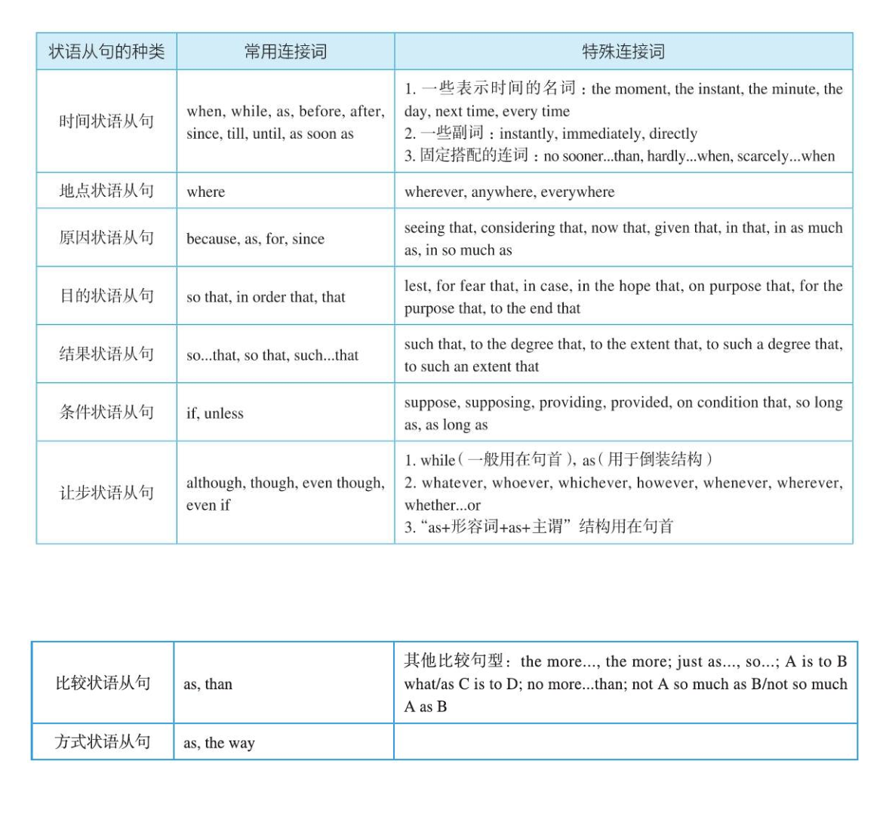

# 1 名词从句
## 1.1 名词从句的本质
### 1.1.1 名词从句的本质：三种句子充当四种成分
所谓名词从句，就是把完整句子当作名词来使用，在另一个句子中充当某种成分。一般来讲，名词在句中主要充当四种成分：主语、宾语、表语和同位语。同样，我们可以把一个完整的句子当作名词来使用，也在另一个句子中充当这四种成分，于是便有了常说的四种名词从句：主语从句、宾语从句、表语从句和同位语从句。

### 1.1.2 引导名词从句的常用连接词
|名词从句引导词|对应简单句类型|引导词是否做成分|引导词是否可以省略|
|连接词that|陈述句|that在从句中既不做成分，也没有实义|在不影响句子的意思的情况下，宾语从句中的that可以省去|
|连接副词when,where,why,how;
连接副词who,whom,what,which,whose|特殊疑问句|when,where,why,how在从句中作状语；
who,whom,what在从句中作主语、宾语或表语；
which,whose在从句中作定语，后面接名词连用|不能省去，因为它们既作成分，又有意义|

第一，对于陈述句，连接词that是后来添加上去的，此时的that自然不充当从句里的任何成分，而且也没有任何意义，只起连接主句和从句的作用。

  第二，对于一般疑问句，连接词whether/if也是后来添加上去的，目的是为了保留句子的疑问意义，有“是否”的含义，即whether/if是有意义的，这不同于that。与that相同的是，whether/if也不充当任何句子成分。

  第三，对于特殊疑问句，我们不需要添加任何连接词，因为特殊疑问词就充当了连词，从而变成了相应的连接词。但关键是，我们需要把倒装语序还原成陈述语序。这些特殊疑问词都是在句中充当各种成分的，比如连接代词可以充当主语、宾语或表语，而连接副词则充当状语。

## 1.2 主语从句
### 1.2.1 that引导的主语从句
对于that引导的主语从句，我们要重点看其在句中的位置特点：它一般是置于句末的，偶尔也可以置于句首。

That the seas are being overfished has been known for years.

妙语点睛　这里that从句that the seas are being overfished即是一个主语从句，直接置于主语位置。

精品译文　海洋正在被人们过度捕捞，许多年以来这已是尽人皆知的事情了。

一、it+be动词+过去分词+that从句

  It's reported that...据报道……

  It's believed that...据信……

  It is generally thought that...人们普遍认为……

  It should be noted that...应当注意……

  It has been found that...现已发现……

  It must be pointed out that...必须指出…

二、It+be动词+形容词+that从句

  It is clear that...显然……

  It is possible that...很可能……

  It is likely that...很可能……

  It is natural that...很自然……

  It is certain that...可以肯定的是……

  It is strange that...奇怪的是……

  It is fortunate that...幸运的是……

  It is necessary that...有必要……

三、It+be动词+名词短语+that从句

  It is a pity that...可惜的是……

  It is a fact that...事实是……

  It is good news that... ……真是太好了。

  It is a good thing that... ……真是件好事。

  It is no wonder that...难怪……

  It is a shame that...遗憾的是……/……真是太不像话了。

  It is an honor that...真荣幸……

  t is common knowledge that... ……是常识。

  It is my belief that...我相信……

  It is a miracle that... ……真是奇迹。

四、It+不及物动词+that从句

  It seems that...似乎……

  It follows that...因此……/由此可见……

  It happens that...碰巧……

  It turns out that...结果证明是……

  It comes about that...结果是……

五、其他结构

  It dawns upon/on sb. that...某人突然想起……

  It occurs to sb. that...某人突然想起……

  It makes no difference that... ……无所谓

  It doesn't need to be bothered that...不必担忧……

  It is of little consequence that... ……无关紧要

### 1.2.2 whether及连接代词或连接副词引导的主语从句

连词whether以及连接代词或连接副词引导主语从句一般放在句首，这不同于上面讨论的that引导的主语从句。请看例句：

  Whether the Government should increase the financing of pure science at the expense of technology or vice versa often depends on the issue of which is seen as the driving force.

  妙语点睛　这里是whether引导的主语从句，谓语部分是depends on the issue。Of后面接的which从句是一个宾语从句，补充说明issue，相当于issue的同位语。

  精品译文　政府究竟是以减少对技术的经费投入来增加对纯理论科学的经费投入，还是相反，这往往取决于把哪一方面看作是驱动性的力量。

我们再来看几个由连接代词或连接副词引导的主语从句，此时从句一般位于句首。

  Whoever tries to resolve a conflict soon learns that nothing pleases everybody.

  妙语点睛　这里的连词代词whoever相当于who的强调形式，它引导的从句作主语，主句的谓语是learns。其中whoever在从句中作主语。

  精品译文　任何想要试图解决这个矛盾的人很快就会发现，他不可能让所有人都满意。

### 1.2.3 because引导的主语从句
在英语中，还有一种较为特殊的主语从句，即是由because引导的主语从句。这种主语从句的结构一般是“because+陈述句”，置于主语位置，后面直接加谓语，而且这个谓语往往都是does not mean。在because前面往往会有just一词，起强调语气的作用。请看例句：

  Just because someone doesn't love you the way you want them to doesn't mean they don't love you with all they have.

  妙语点睛　该句的主语是just because someone doesn't love you the way you want them to这个从句，谓语是doesn't mean。

  精品译文　如果有人没有以你希望的方式去爱你，并不意味着他们没有全身心地爱你。

## 1.3 宾语从句
### 1.3.1 在及物动词后作宾语

读者对这种类型的宾语从句应该都比较熟悉。请看下面这个很美的例句：

  I’ve learned that love, not time, heals all wounds. I’ve learned that everyone you meet deserves to be greeted with a smile.

  I’ve learned that there's nothing sweeter than sleeping with your babies and feeling their breath on your cheeks.

  妙语点睛　这里有三个that引导的宾语从句，都是直接跟在及物动词learn后边的。

  精品译文　我明白了，是爱，而不是时间能治愈一切创伤。我明白了，你遇到的每一个人都值得你以笑脸相迎。我明白了，世间最美好的事莫过于睡在孩子身边，感受着他们飘散在你脸庞上的呼吸。

### 1.3.2 在双宾动词后作直接宾语

I assure you that I had no intention of offending you.

妙语点睛　这里that引导的从句that I had no intention of offending you充当assure的直接宾语，而you作间接宾语。

精品译文　我向你保证，我当时绝不是故意冒犯你。

### 1.3.3 在双宾动词后作间接宾语

They gave who came to the meeting a pamphlet.

妙语点睛　这里who引导的从句who came to the meeting作主句谓语gave的间接宾语，而gave的直接宾语是a pamphlet。

精品译文　他们给到会的所有人员每人发一本小册子。

### 1.3.4 在介词后作宾语

I find the best way to concentrate is to make notes on what the teachers are saying.

妙语点睛　这里what引导的从句what the teachers are saying作介词on的宾语。

精品译文　我认为（上课）集中注意力的最好办法就是把老师讲的内容记下来。

### 1.3.5 宾语从句后置

宾语从句若出现在复合宾语结构中，此时的宾语从句被置于补足语后面了，因此是一个后置的宾语从句，即“动词+it形式宾语+宾语补足语+that宾语从句”。请看例句：

  We believe it true that the human body is also a kind of good conductor.

  妙语点睛　这里就是一个后置的宾语从句结构，用it来指代这个被后置的宾语从句that the human body is also a kind of good conductor。形容词true作宾语补足语。

  精品译文　人体也是一种良导体，我们认为这是对的。

### 1.3.6 that在宾语从句中省略的问题

一般来讲，连词that引导宾语从句时，可省去。但若是几个宾语从句并列使用，则that一般都不可省去。原因很简单，有了that的“指路牌”的作用（详见《英语语法新思维中级教程——通悟语法》中2.1.2小节的内容），便于读者快速判断句子结构。请看例句：

“I once read that “the beauty of life is its changes”and that “the art of life lies in a constant readjustment to our surroundings”.

  妙语点睛　句中含有两个that从句，连词that一般不省去。这里两个that从句作read的宾语，即构成并列的宾语从句。

  精品译文　我曾经读到过这样一句话：“生活的魅力在于变化，而生活的艺术在于不断地适应周围环境的变化。”

## 1.4 表语从句

表语从句比较简单，通常就是将从句置于系动词，尤其是be动词（如is或was）后面。

Some women are much too preoccupied by family. Once the marriage begins to disintegrate, they’re lost. That's where their unhappiness springs from and that's why most divorced mothers regard themselves as victims.

妙语点睛　这里的where从句和why从句放在is后面作表语，即构成表语从句

精品译文　一些女性太专注于家庭了。一旦婚姻开始瓦解，她们就会迷失方向。这就是她们不快乐的原因，也是为什么大多数离婚的母亲认为她们是受害者。

## 1.5 同为语从句
### 1.5.1 同位语从句句型（一）：名词+that+陈述句

最常见的同位语从句句型是“名词+that+陈述句”。请看例句：

I have been left with the knowledge that it's better to expect nothing than to give everything and then be disappointed.

妙语点睛　这里的that从句用作同位语，来补充说明先行词knowledge。

精品译文　我从中懂得了，不抱任何期待比付出努力却最终失望要好。

### 1.5.2 同位语从句句型（二）：名词+定语+that+陈述句

如果一个名词后面既有定语又有同位语从句，那么往往定语在前，同位语从句在后，这样便形成了先行词与同位语从句被定语分隔的结构，即“名词+定语+同位语从句”。请看例句：

The statement by the driver of the vehicle that he did not see the lorry was rejected by the Court.

妙语点睛　这里的介词短语by the driver of the vehicle和同位语从句that he did not see the lorry共同修饰中心名词statement。具体来说，the statement by the driver of the vehicle表示“这位汽车司机的陈述”，即用介词短语来限定statement；the statement...that he did not see the lorry表示“他说没有看见卡车这一陈述”，即同位语从句用来详细说明statement的内容是什么。所以我们看到，这里的先行词statement与同位语从句that he did not see the lorry被作定语的介词短语by the driver of the vehicle隔开。

精品译文　该汽车司机说自己没有看见卡车，但法庭并不相信这个说法。

### 1.5.3 同位语从句句型（三）：名词+谓语+that+陈述句

如果一个名词作主语，并且它后面还带有一个同位语从句，此时我们通常把这个同位语从句置于谓语的后面，而不是放在名词的后面，因而造成先行名词与同位语从句的分隔，结构是“作主语的先行词+谓语部分+同位语从句”。比如本章讨论的第一个例句：

  Concerns were raised that witnesses might be encouraged to exaggerate their stories in court to ensure guilty verdicts.

  妙语点睛　这里的先行词concerns与that引导的同位语从句被谓语were raised隔开。

  精品译文　人们日益担心，证人可能会受到鼓励，在法庭上夸大其词以确保陪审团对被告做出有罪的判决。

## 1.6 从句嵌套结构
### 1.6.1 名词从句的“嵌套结构”
所谓名词从句的“嵌套结构”，即指多个名词从句之间存在的包含与被包含的关系。请看例句：

  I realized that what I said was not exactly what I meant to say.

  妙语点睛　在that引导的宾语从句中同时含有what引导的主语从句what I said和what引导的表语从句what I meant to say。

  精品译文　我后来意识到，当时所说的话并非是我真正想要说的。

### 1.6.2 连词与动词的配比原则

对于复杂的名词从句，尤其是当一个复杂句子里“嵌套”有多个名词从句时，我们一定要注意弄清楚各个不同层次的名词从句之间的逻辑关系。此时我们往往就要借助于名词从句的谓语动词和连词来帮助我们断句。因此，在分析句子结构时，我们可以先找到句中的各个谓语动词，然后再找连词。又因为连词后面必然是从句，而从句中必然有谓语动词，因此，在每个连词后面必然要找到一个与之相应的从句的谓语动词。当把连词与对应的谓语动词划分清楚之后，整个难句的结构也就迎刃而解了。在英语中，有N个谓语动词，就会对应有N-1个连词以及N-1个对应的从句，这就是我提出的“连词与动词的配比原则”，也就是说，在英语句子中，谓语动词的个数一定是多于连词个数的，通常是多出一个，因为这个多出的动词就是主句的谓语动词。

That the seas are being overfished has been known for years. What researchers such as Ransom Myers and Boris Worm have shown is just how fast things are changing.

妙语点睛　我们看到，在第一个句子中，与连词that对应的谓语动词是are being overfished，而主句的谓语是has been known。这里第二个句子是一个“嵌套”式的主系表结构，主语是what引导的从句what researchers such as Ransom Myers and Boris Worm have shown，表语是how引导的从句how fast things are changing。它们各自都有对应的谓语动词：what引导的从句的谓语是have shown，而how引导的从句的谓语是are changing。主句的谓语是is。

精品译文　海洋正在被人们过度捕捞，许多年以来这已是尽人皆知的事实了。研究人员（如Ransom Myers和Boris Worm）所揭示的仅仅是情况变化得多么迅速。

# 2 定语从句
## 2.1 先行词的结构特点
### 2.1.1 先行词是一个词
先行词可以是一个单词，通常是名词，也可以是代词。比如在下面这个句子中，先行词均是名词。这是影星奥黛丽·赫本（Audrey Hepburn）谈到女人的美时说的一番话：

  The beauty of a woman is not in the clothes she wears, the figure that she carries, or the way she combs her hair. The beauty of a woman must be seen from in her eyes, because that is the doorway to her heart, the place where love resides.

  妙语点睛　我们看到，这里的四个定语从句所修饰的先行词都是单个的名词，即clothes, figure, way和place。具体来说就是：she wears修饰clothes，that she carries修饰figure，she combs her hair修饰way，where love resides修饰place。

  精品译文　女人之美，不在于她所穿的衣服，或她的身材，或她的发型。女人之美，必定能从其眼睛中看到，因为那是心灵之窗，爱心之房。

先行词除了可以是名词外，还可以是代词，主要包括：人称代词he（其他人称代词不可以），指示代词that/those，不定代词one等。

  There is this difference between happiness and wisdom: he who thinks himself the happiest man really is so; but he who thinks himself the wisest is generally the greatest fool.

  妙语点睛　我们看到，这里的两个定语从句的先行词都是代词he。注意：这里的he不是具体指某个人，而是表示泛指。一般来讲，人称代词后面是不能接定语从句的，比如我们不能说“We who think ourselves...*”，或“You who think yourself...*”等等，因为人称代词已经表达了一个完整的意思，不需要任何定语从句来修饰。但人称代词若是表示泛指，则可以接定语从句来进行修饰，如这里的he相当于anyone。

  精品译文　幸福与智慧的区别在于：认为自己最幸福的人，他真的就是最幸福；而认为自己最智慧的人，却往往是最大的傻瓜。

我们来看指示代词作先行词的例句：

  Only those who have the patience to do simple things perfectly will acquire the skill to do difficult things easily.

  妙语点睛　这里的those指人，作先行词，被定语从句who have the patience to do simple things perfectly所修饰。

  精品译文　只有那些有耐心将简单的事情做得完美的人，才能学会轻松地做好难事的技能。

我们来看不定代词one作先行词的例句：

  A rich person is not one who has the most, but is one who needs the least.

  妙语点睛　这里的两个定语从句who has the most和who needs the least都是修饰先行词one的，这里的one指人。

  精品译文　一个人富有，并不是因为他拥有的最多，而是因为他需要的最少。

### 2.1.2 先行词是一个短语

先行词可以是一个名词短语。请看例句：

  In Europe, as elsewhere, multi-media groups have been increasingly successful groups which bring together television, radio, newspapers, magazines and publishing houses that work in relation to one another.

  妙语点睛　这是考研英语翻译真题。这里的关系词which指代的先行词是successful groups这个名词短语，关系词that指代的先行词是television, radio, newspapers, magazines and publishing houses这个名词短语。

  精品译文　在欧洲，像在其他地方一样，多媒体集团越来越成功了。这些集团把相互间联系密切的电视台、电台、报纸、杂志以及出版社组合到了一起。

  译文心得　本题的考点就是定语从句的翻译技巧。本句的结构不难理解，带有两个定语从句，因为过长，所以不可能把两个从句都译成汉语的定语结构“……的”，而要进行拆句。这里是拆分了which引导的定语从句，并且重复which所指的先行词“这些集团”。把that引导的定语从句译成了汉语的定语结构，即“相互间联系密切的”。

### 2.1.3 先行词是一个分句

先行词可以是一个分句。请看例句：

  He said that he had no time, which isn't true.

  妙语点睛　这里which指代的是一个宾语从句that he had no time。

  精品译文　他说他没有时间，事实并非如此。

### 2.1.4 先行词是一个完整的句子

先行词可以是一个完整的主句。请看例句：

  My girlfriend likes dancing with other guys, which really drives me crazy.

  妙语点睛　先行词是my girlfriend likes dancing with other guys这一完整的句子。

  精品译文　我女友喜欢和别的小伙子跳舞，这让我十分恼火。

综上所述，“先行词”并不一定只是一个单词，换句话说，定语从句所修饰的对象不一定就是一个单词，而可以是一个短语、分句或完整的句子，这即是先行词的结构特点。掌握了先行词的这一结构特点，有助于我们快速、准确地判断定语从句所修饰的对象。请读者做下面的练习，检验自己对先行词结构特点的掌握情况，看看能不能快速且正确地找到先行词。

## 2.2 先行词的位置特点
### 2.2.1 先行词+其他定语+定语从句
在先行词与关系词之间插入其他的定语，这种情形最常见。这是由于先行词同时带有多个定语，其中包括定语从句。定语从句与其他定语相比，一般较长，结构也较复杂，因此，按照英语的“尾重原则（principle of end weight）”，结构复杂的定语从句置于其他定语后边，从而造成与先行词隔离。请看例句：

  The mineral elements from the soil that are usable by the plant must be dissolved in the soil solution before they can be taken into the root.

  妙语点睛　这里的介词短语from the soil和定语从句that are usable by the plant共同修饰中心名词elements，也就是说被定语从句修饰的名词不是与从句紧挨着的soil，而是较远的elements，这就是为什么定语从句的谓语动词用复数的are而不用单数的is，即先行词elements与定语从句之间被介词短语from the soil隔开。具体来说，the mineral elements from the soil表示“土壤里的矿物质”，the mineral elements...that are usable by the plant表示“能够被植物利用的矿物质”。整个名词短语the mineral elements from the soil that are usable by the plant表示“土壤中可供植物利用的矿物质”。

  精品译文　土壤中可供植物利用的矿物质只有先溶解在土壤中，然后才能被植物的根部吸收。

  译文心得　这里before引导的从句虽然表示时间，但就上下文的逻辑关系来看，我们可以转译成一个条件从句，译成“只有……才”。

### 2.2.2 先行词+状语+定语从句
造成先行词与关系词被分隔的第二种情形，就是在先行词与关系词之间插入一个状语，这个状语一般是修饰主句的谓语动词的。请看例句：

  Never leave that until tomorrow which you can do today.

  妙语点睛　这里的先行词是that，定语从句是which you can do today。现在二者之间插入了一个时间状语until tomorrow来修饰leave，从而造成先行词与关系词被分隔。

  精品译文　今日事，今日毕（不要把今天能做的事情留到明天做）。

### 2.2.3 作主语的先行词+谓语部分+定语从句

先行词与关系词被分隔的第三种情形就是两者被主句谓语隔开。这是因为先行词在主句中作主语，然后它又被一个定语从句所修饰，而定语从句一般都会比主句谓语的结构复杂。因此，按照英语的“尾重原则（principle of end weight）”，结构复杂的定语从句置于主句谓语后边，从而造成关系词与先行词被隔离。请看例句：

  Social science is that branch of intellectual enquiry which seeks to study humans and their endeavors in the same reasoned, orderly, systematic, and dispassioned manner that natural scientists used for the study of natural phenomena.

  妙语点睛　这是考研英语翻译真题。该句主语social science后面接有一个which引导的定语从句which seeks to study humans and their endeavors...，但这个定语从句并没有紧跟在名词social science后边，而是被谓语部分is that branch of intellectual enquiry隔开。

  也许有读者要问：你怎么知道social science就是被修饰的先行词？其实可以看定语从句的内容，比如这里natural scientists（自然科学家）与social science（社会科学）是反义对照关系，从而可以判断定语从句的内容讲的一定就是social science。

  精品译文　社会科学是知识探索的一个分支，它力图像自然科学家研究自然现象那样，用理性的、有序的、系统的和冷静的方式研究人类及其行为。

## 2.3 如何判断先行词

找先行词的步骤如下：1. 先翻译定语从句，正确地理解定语从句本身的意思；2. 结合先行词的结构特点和位置特点，在关系词之前寻找与定语从句的意思有逻辑语义联系的名词、短语或从句，这即为先行词。

  For workers it can mean an end to the security, benefits and sense of ______ that came from being a loyal employee.

  A. excitement　B. conviction　 C.enthusiasm　 D.importance

  正确答案　D。

  妙语点睛　这是考研完形填空真题。同上一题一样，解此题的关键还是在于理解定语从句that came from being a loyal employee的意思，即“作为一名忠实雇员所带来的……”。注意这里定语从句的先行词是the security, benefits and sense of _____。我们来看四个选项：excitement“激动，兴奋”，conviction“坚信，信念”，enthusiasm“热衷，热情”，importance“重要，价值”。这里sense of importance是表示认为自己对于公司的发展很重要，很有一种自豪感，就相当于我们汉语里常说的“主人翁精神”，而这种精神是作为一名“忠实雇员”所能感受到的。故importance正确。

  精品译文　对于雇员来说，这（雇用临时工的趋势）意味着失去作为一名忠实雇员所带来的安全感、福利待遇以及自豪感。

综合前面各节的内容，下面总结一下在判断先行词时，我们要同时考虑哪几个方面。判断先行词主要可以根据两个方面：一是看主句，二是看定语从句。前者是辅助，后者是根本。

  首先，结合定语从句的特点，主要看四个方面：

  1. 结合定语从句的意思：定语从句的内容必然是与先行词密切相关的。比如，第2.3节的例句1中的定语从句that will give them three meals a day and a place to sleep at night对先行词shelter的解释说明关系。

  2. 结合定语从句中的关键词：比如，第2.2.3小节的例句2中，natural scientist与social science构成的反义对照关系。

  3. 结合定语从句的谓语单复数：比如，第2.3节的例句4中的are表明elements是先行词。

  4. 结合定语从句的关系词：比如，第2.3节的例句6中，which的先行词不可能是listener。

  其次，结合主句的结构特点，主要看两方面：

  5. 结合先行词的结构特点：先行词可能是一个词、短语、分句或完整的句子等。

  6. 结合先行词的位置特点：先行词通常与定语从句是“手拉手”在一起的，但也可能被分隔两处。被分隔的情况有三种，即被定语、状语或谓语分隔。对于这一点，读者一定要真正弄懂我们前面讲过的内容，不能有丝毫含糊，因为这正是构成难句结构的一个方面。

  所以，要想快速而准确地判断先行词，需要读者具备相当深厚的英语功底。当然，以上主要是针对复杂难句而言的。如果是简单的定语从句，找先行词则没有这么费劲。

## 2.4 与先行词有关的考点
最重要的是要搞清楚它所修饰的对象，即正确地找到先行词。而定语从句的基本结构是“先行词+关系词+（从句主语+）谓语动词”（如the person who does或the thing which does）。其中，先行词决定了关系词是什么，进而决定了从句的谓语动词是单数还是复数。

### 2.4.1 先行词的选择
### 2.4.2 关系词的翻译
在翻译定语从句时，如果先行词判断错误，往往会导致句子误译。

### 2.4.3 关系词的选择
关系词与先行词密切相关，因为关系词用来指代先行词，并且在从句中充当一定的成分。为此，选择什么样的关系词，必然要看清先行词是什么。

  The words used by the speaker may stir up unfavorable reactions in the listener ______ interfere with his comprehension.

  A. who　B. as　 C.which　 D.what

  正确答案　C。

  妙语点睛　这是考研完形填空真题。本题测试的是定语从句，考查的是关系代词的选择。而关系代词的选择取决于先行词，所以本题真正考查的是考生对定语从句先行词的判断。若先行词是listener，则选who；若先行词是reactions，则选which。但结合从句谓语动词interfere这一复数形式可知，先行词应该是复数名词reactions而不是单数名词listener，因此这里的关系代词要用which，故C正确。

  此外，关系代词as引导限定性定语从句时，其先行词需要被the same或such等修饰，若没有则不用as。what引导定语从句时，其前面是不能出现先行词的。故B、D均不正确。

  精品译文　说话者的用词可能会引起听者的不良反应，这种反应会影响听者的理解。

### 2.4.4 定语从句中的主谓一致问题
我们知道，定语从句的谓语动词是用单数还是用复数，这不取决于关系词，而是由先行词决定的。因此，对先行词的判断直接影响了定语从句谓语动词的单复数形式。请看例句：

  Despite【A】 much research, there are still certain elements in【B】 the life cycle of the insect that is【C】 not fully understood【D】.

  正确答案　C，应改为are。

  妙语点睛　这是考研英语改错题。本题考查对定语从句先行词的判断。这里先行词elements与关系词that被分隔，因为elements还有一个后置定语in the life cycle of the insect。显然，这种分隔属于2.2.1小节中讨论过的第一种分隔情况：先行词+其他定语+定语从句。that指代elements，在从句中作主语，所以，谓语动词要用复数形式的are。

  精品译文　尽管人们已经对昆虫进行了大量的研究，但是对其生命周期中的某些方面还没有完全了解。

### 2.5 关系代词which/that/who/whom
关系词分为关系代词和关系副词。常用的关系代词有who/whom （指代的先行词表示人）, which （指代的先行词表示物）, that/whose （指代的先行词表示人或物）。其他的关系代词还有as （见2.8节）, than （见2.9节）, but （见2.10节）以及what （见2.11节）。这些特殊的关系代词的用法我们在下文都会详细讨论。关系代词在定语从句中可充当主语、宾语或表语等句子成分。

关系副词有when （表示时间），where （表示地点）和why （表示原因），它们在定语从句中一般只充当状语。

最常用的关系代词主要是which, that, who和whom，这些都是读者很熟悉的，在此不再赘述。下面仅举几例予以说明：

  A friend is a present which you give yourself. To be a good friend or partner, it's important to be a good listener.

  妙语点睛　如本句所示，先行词present指物，关系词可以用which。

  精品译文　朋友是你送给自己的一份礼物。要想成为一个好朋友或好伙伴，重要的是做一个好听众。

## 2.6 关系代词whose
上面讨论的关系代词一般都是单独使用，它们后面不接名词。但whose则不同，它后面必须接一个名词，而不能单独使用。因此，whose用作关系词确切来讲应该算作是关系形容词，或者叫关系限定词。另外，whose同that一样，既可以指人，也可以指物。请看例句：

  There are nations whose lack of contact with the outside world has resulted in poverty.

  妙语点睛　这里的whose与名词短语lack of contact with the outside world连用，whose修饰先行词nations。

  精品译文　有些国家因为闭关锁国，缺少与其他国家的交流，导致贫困。

## 2.7 介词+关系代词
### 2.7.1 看从句选介词

一、看从句的动词：所用介词须与定语从句中的动词构成固定搭配（最常见）

  这里所说的动词往往是指定语从句中的谓语动词。我们先来看几个简单的例句：

  The girl with whom you work is his girlfriend.

  妙语点睛　关系词whom前面的介词with与定语从句中的谓语动词work构成固定搭配work with，表示“和……一起工作”。

  精品译文　和你一起工作的那个女孩是他的女朋友。

二、看从句的形容词：所用介词须与定语从句中的形容词构成搭配（比较常见）

  以上讨论的介词往往都是与定语从句的谓语动词（或其他动词）构成固定搭配，但是如果定语从句的谓语不是一个实义动词，而是由be动词与某个形容词构成的，我们则要使用与该形容词搭配的介词。请看例句：

  We assume that the meanings of these underwater sounds are similar to those with which we are familiar on land.

  妙语点睛　关系词which前面的介词with与定语从句谓语部分中的形容词familiar构成固定搭配be familiar with sth.，表示“对……熟悉”。

  精品译文　据我们猜测，这些水下声音的意义同我们所熟悉的陆地上的声音的意义相似。

三、看从句的名词：所用介词须与定语从句中的某个名词构成搭配（较少用）

  以上讨论的介词，往往是与定语从句中的谓语动词或谓语部分中的形容词构成搭配。但如果从句中的动词或形容词都没有可与之形成固定搭配的介词，那么我们则要根据从句中的名词来分辨介词。请看例句：

  I am sending you an inquiry, to which your prompt attention is highly appreciated.

  妙语点睛　这句话通常会出现在商务函电中。这里的关系词which前面的介词to与定语从句中的名词attention构成固定搭配attention to，表示“处理”。

  精品译文　兹寄去询价单一纸，望尽快办理，不胜感激。

### 2.7.2 看先行词选介词

关系词前面用什么介词与定语从句没有关系，而是与关系词前面的先行词密切相关，所选用的介词要与先行词构成固定搭配，我简称其为“看先行词选介词”。在详细讨论之前，我们先来看一个例句：

  About a thousand species of animals are in danger of extinction, and the rate at which they are being destroyed has increased.

  妙语点睛　我们可以把上面这个句子拆分成这样的简单句：

  1）About a thousand species of animals are in danger of extinction. They are being destroyed at this rate and the rate has increased.

  这句话表示“约有1000种动物濒临灭绝的危险，它们目前正在以这样的速度遭到人类的杀戮，而且这个速度还在增加。”

  我们现在要明确说明是什么速度在增加，于是用they are being destroyed at this rate作定语修饰the rate，我们便得到：

  2） The rate （they are being destroyed at this rate） has increased.

  先行词是rate，所以我们用关系词which来指代，上句便改写成：

  3） The rate （they are being destroyed at which） has increased.

  关系词which应该放在从句的开头，又因为at which（就相当于at this rate）是一个固定搭配，所以要将at which一同移到句子开头，于是上句就进一步改写成：

  4） The rate （at which they are being destroyed） has increased.

  最后，我们得到一个标准的定语从句，如下：

  The rate at which they are being destroyed has increased.

  这里的关系词which前面的介词at与先行词rate构成固定搭配at the rate。

  精品译文　约有1000种动物濒临灭绝的危险，而且它们受残害的速度日益加快。

总结

  我们详细分析了两种判断关系词前面的介词如何使用的方法，一种是根据定语从句中的动词、形容词或名词来判断，另一种是根据先行词来判断。这两种方法是最常用、最重要的，为此，下面我们再来深入地比较一下这两种方法的特点，以便读者更好地理解和掌握。请注意以下几点：

  一、介词在短语中的位置

  根据定语从句判断介词，所用介词与从句中的动词、形容词或名词构成搭配，比如：depend on, familiar with, attention to等等。

  根据先行词判断介词，所用介词与先行词构成搭配，比如：with ease, at the rate, to the extent等等。

  通过比较发现，介词在短语中的位置是不同的，有时候是在短语的末尾，比如to在attention的后面；有时候是在短语的开头，比如with是在ease的前面。因此，同样是名词，若是定语从句中的名词，则要看名词后面用什么介词；而如果是先行名词，则要看名词前面用什么介词。

  二、介词在定语从句中的位置

  虽然都是“介词+关系代词”这一结构，但两种判断方法所选用的介词在句中的位置是有差别的。若是看从句选介词，所用的介词可前置，即置于关系代词前面（如下面的例句3）；也可后置，即把介词后移到定语从句中，分别紧跟在动词、形容词或名词后面（如下面的例句4）。

  三、定语从句的完整性

  看从句选介词时，定语从句的意思一般都是不完整的，而“介词+关系代词”结构补充说明定语从句中的动词、形容词或名词的意思。

  看先行词选介词时，定语从句的意思是完整的，或者说定语从句中没有任何词缺少与之搭配的介词。

  四、“介词+关系代词”充当的成分

  正是因为上述的两种判断介词的方法在定语从句的完整性方面有差异，导致“介词+关系代词”这一结构在定语从句中所充当的成分是不同的。看从句选介词，这种情况下的介宾结构“介词+关系代词”是在定语从句中作补足语，补充说明从句中的某个动词、形容词或名词。

  而看先行词选介词这种情况下的介宾结构“介词+关系代词”是在定语从句中作状语，修饰从句的谓语动词。

###  2.7.3 看句义选介词
以上分析的关于如何选用介词的两大规律是最常用的，而且所选用的介词往往都是固定搭配（比如depend on及to the extent）。但是，有时关系词前面的介词的选用完全是根据句子意思而定，不是固定搭配。也就是说，选用介词时，既不看前面的先行词，也不看后面的定语从句，而是要看句子的意思来确定。

  America's capacity utilization, for example, has reached historically high levels earlier this year, and its jobless rate （5.6% in August） has fallen below most estimates of the natural rate of unemployment—the rate below which inflation has taken off in the past.

  妙语点睛　我们看到，这里的先行词为rate。如果按照我们在上面讨论过的介词的使用规律，那么这里应该用介词at。但是根据句子意思表达的要求，上句用了介词below。

  精品译文　例如，美国的就业率在今年的前段时间创下了历史高水平，并且它的失业率（8月份为5.6%）已降至低于大多数对于自然失业率的估测——在过去，当失业率低于自然失业率时，通货膨胀率已开始急剧上升。

### 2.7.4 表示所属关系或部分与整体的关系时用介词of

表示所属关系或部分与整体关系，比较常用的介词是of。我们先来看几个例句：

  1 The company, of which Max Harrison was until recently the chairman, has made loss of three million pounds this year.

  妙语点睛　这里的of which相当于of the company，于是整个定语从句相当于Max Harrison was until recently the chairman of the company，所以这里的of表示所属关系，即the chairman是属于这个公司的。原定语从句可以改写为：the chairman of which was Max Harrison until recently。

  精品译文　这家公司今年亏损达三百万英镑，直到前不久Max Harrison还是它的董事长。

  2 They’re all groaning about soaring health budgets, the fastest-growing component of which are pharmaceutical costs.

  妙语点睛　这里表示整体的是health budgets，在定语从句中用which来指代。表示部分的是the fastest-growing component，即从句中的pharmaceutical costs，也就是说这个costs是health budgets的一部分。原从句可以改写为：of which pharmaceutical costs are the fastest-growing component。由此看来，定语从句是一个倒装句，从句主语是costs。

  精品译文　他们所有人都在抱怨高涨的医疗预算，其中增长最快的部分是药品费用。

我们可以总结出该句型的结构特点如下：

  1. 该句型的结构往往是“不定代词/数量词/形容词的比较级或最高级+of which/whom”，用来表示数量或某种特点。具体来讲，在介词of前面常出现的词包括：all, each, both, either, neither, none, little, few, many, much, some, most, any, the majority, half, several, a number, half, none以及数字和形容词的最高级等等。

  2. 值得注意的是，这里of前面的成分都可以后移至定语从句中。比如上面的例句，我们既可以说10, 000 acres of which，也可以说of which 10, 000 acres。

### 2.7.5 固定的介宾结构
关系代词前面的介词有时与固定的介宾短语结构有关，比如in this case, in one's honor和with one's help等，它们若出现在定语从句中，则会相应地变成in which case, in whose honor和with whose help。所以，这里的关系代词which/whose前面的介词in/with是从原来的短语中继承过来的。请看例句：

  He may be late, in which case we should wait for him.

  妙语点睛　这里的in which case就是由短语in this case变过来的，这里which指前面整个句子“he may be late”。

  精品译文　他可能要迟到，如果是这样，我们就应该等等他。

### 2.7.6 定语从句的倒装结构
介词+关系代词”这种结构的定语从句往往还伴随着从句采用倒装结构。具体的结构就是“介词+关系代词+从句谓语+从句主语”，即一个将整个谓语放在主语前面的全部倒装结构。关于定语从句的倒装结构，我们在前面提到过。比如这个例句：

  They’re all groaning about soaring health budgets, the fastest-growing component of which are pharmaceutical costs.

  该定语从句可以改写为：of which pharmaceutical costs are the fastest-growing component，所以定语从句的主语是复数名词短语pharmaceutical costs，而不是单数，这就是为什么从句谓语用are而不是is的原因。

### 2.7.7 “介词+关系代词+to do“结构
上面讨论的“介词+关系代词”这一定语从句结构，可以简化成不定式，于是就有了“介词+which+to do”的结构。请看例句：

  1） The farmer used wood to build a house in which he could store grains.

  2） The farmer used wood to build a house in which to store grains.

  妙语点睛　由1）句简化为2）句，先是把定语从句in which he could store grains中的主语he省去（因为he与主句主语the farmer一致，所以可以省略），然后把情态动词could替换为不定式to（因为不定式具有情态意义），于是便得到in which to store grains。

  精品译文　这位农夫用一些木材建造了一座房子，在那里储存粮食。

需要提醒大家的是，在使用这一结构时我们应注意以下几点：

  1） “介词+关系代词”不能用一个关系副词来替换。比如不能说“The farmer used wood to build a house where to store grains. *”。

  2） 有介词、有关系代词时，不能将介词置于句末。比如不能说“The farmer used wood to build a house which to store grains in. *”。

  3） 若没有介词，我们不能采用“半定语从句半不定式”的混合形式作后置定语。比如不能说“I can't think of anybody whom to invite. *”。而要说“I can't think of anybody to invite.”，或者“I can't think of anybody who I should invite.”。

我们共用了七个小节详尽地论述了关系词前面的介词的使用规律，并且比较系统地介绍了五大规律，它们是：

  规律1：看从句选介词——介词与定语从句中的动词、形容词或名词构成固定搭配；

  规律2：看先行词选介词——介词与先行词构成固定搭配；

  规律3：看句义选介词——为了意思表达的需要而使用特定的介词；

  规律4：表示所属关系或部分整体关系时用介词of；

  规律5：固定的介宾结构。

## 2.8 关系代词
### 2.8.1 as引导非限定性定语从句

因为as引导非限定性定语从句的情况比较常见，所以我们首先来讨论它。as引导的非限定性定语从句的特点主要有两个：第一，as所指代的先行词通常都是一个完整的句子；第二，as引导的定语从句位置很灵活，可以在句首、句中或句末。另外，因为which也可以引导非限定性定语从句，因此下面我们通过与which进行比较来讨论as的用法。

  一、as引导的非限定性定语从句可放在句首

  as引导的非限定性定语从句可以放在句首，此时as指代后面的整个主句。换句话说，关系代词as的先行词可以出现在as后边。这点不同于which及任何其他关系词，因为which及其他关系词所指代的先行词必须出现在它们的前面，因此which引导的非限定性定语从句不能放在句首，这是as和which的重要区别。

  As is so often pointed out, knowledge is a two-edged weapon which can be used equally for good or evil.

  妙语点睛　这是一个放在句首的由as引导的定语从句，此时as所指代的先行词是其后面的完整的主句，即knowledge is a two-edged weapon which can be used equally for good or evil。as在定语从句中作主语。注意：在这里我们不能说“Which is so often pointed out, ...*”。

  精品译文　正如人们常常指出的，知识是一把双刃剑，既可以用于造福，也同样可以用来为害

  二、as引导的非限定性定语从句可放在句中

  as引导的非限定性定语从句放在句中，往往会分隔主句中的某两个成分，因此在分析句子时要跳过这个as引导的从句，直接将从句的前后两个成分联系起来看，这样才便于理解。尽管as引导的从句放在句中，但as所指代的先行词依然是主句，只不过此时的主句是被as引导的从句分隔成了前后两部分。我们知道，which引导的非限定性定语从句也可以放在句中，但which的先行词必须出现在其前面。请看例句：

  Stratford-on-Avon, as we all know, has only one industry—William Shakespeare—but there are two distinctly separate and increasingly hostile branches.

  妙语点睛　as引导的定语从句放在句中，隔开了主语Stratford-on-Avon与其谓语has。此时as指代的先行词依然是主句，只不过此时的主句是被as引导的从句“分隔成了Stratford-on-Avon和has only one industry—William Shakespeare—but there are two distinctly separate and increasingly hostile branches两部分。as指代这个主句的同时在定语从句中作know的宾语，因此“我们所知道”的是Stratford-on-Avon has only one industry—William Shakespeare—but there are two distinctly separate and increasingly hostile branches，即“Stratford-on-Avon只有一个产业，即威廉·莎士比亚，但是存在着两个明显不同且日益敌对的分支”。

  这里若用which替换as，说成which we all know，那么which只能指代Stratford-on-Avon而不能指代整个主句。因此，which表示“我们所知道”的是Stratford-on-Avon这个城市。所以，which和as所指代的“我们所知道”的对象是不同的。

  精品译文　众所周知，埃文河上的斯特拉特福德镇只有一个产业，即威廉·莎士比亚，但是存在着两个明显不同且日益敌对的分支。

  三、 as引导的非限定性定语从句可放在句末

  因为在as引导的定语从句中，as有“正好……”“就像……”“由……而知”的含义，所以，当主句和从句在内容上一致时，或者说从句内容是顺着主句的意思说下来时，通常用as。若主句和从句在内容上不一致，或从句的内容对主句的内容起消极作用，即对主句内容起反对、排斥、否定等作用时，则多用which。请比较分析：

  1） She has married again, as was expected.

  2） She has married again, which was unexpected.

  妙语点睛　在例句1）中，定语从句中的关键词expected表明定语从句的意思与前面主句的意思是顺接关系，所以用as比较妥当，表示“正如人们所意料的那样”。在例句2）中，定语从句中的关键词unexpected表明定语从句的意思与前面主句的意思是否定、排斥的关系，所以用which比较妥当，表示“这是出乎人们意料的”。

  精品译文　1）她又结婚了，正如人们所预料的那样。

  2）她又结婚了，这真出乎人们预料。

### 2.8.2 as引导限定性定语从句

as引导限定性定语从句只能用在一些固定结构中，即只能用在由such, the same, as修饰的先行词的后面。as在定语从句中可以作主语、宾语或表语。as的先行词可以是人，也可以是物。请看例句：

  一、as在定语从句中作主语

  He’ll repeat such points as are discussed in the book.

  妙语点睛　这里such...as构成结构上的呼应关系。如果没有such，则不用as引导定语从句，比如可以说成“He’ll repeat the point that are discussed in the book.”。as的先行词是points。

  精品译文　他将会重复书上讨论过的要点内容。

  二、as在定语从句中作宾语

  He tried to make as few mistakes as he could avoid.

  妙语点睛　这里as...as构成结构上的呼应关系。如果没有as，则不用as引导定语从句。as指代先行词mistakes，并且在从句中作avoid的宾语。

  精品译文　他尽量避免犯错误。

  三、as在定语从句中作表语

  He is not such a fool as we would assume him to be.

  妙语点睛　这里such...as构成结构上的呼应关系。如果没有such，则不用as引导定语从句。as指代先行词fool，并且在从句中作be的表语。

  精品译文　他并不像我们想象的那样傻。

### 2.9 关系代词than

than引导的定语从句有如下用法特点：

  1. than可作关系代词引导定语从句，在从句中一般作主语（也可作宾语）；

  2. than前面的主句需有形容词的比较级形式；

  3. 比较级所修饰的名词即为先行词。

  Don't drink more wine than is good for health.

  精品译文　不要过量饮酒。适量饮酒有益于健康。

### 2.10 关系代词but

对于but用作关系代词，很多读者也许觉得很陌生。下面总结一下它的用法特点：

  1. 从but所表达的意义来看，but作关系代词具有否定意义，相当于that...not。因此but后面接的定语从句在形式上是肯定的，但在意义上是否定的。

  2. 从主句的结构上来看，but所修饰的先行词往往会被一个否定词修饰，换句话说，but常与具有否定意义的主句连用。这样一来，主句中的否定和but本身的否定意义结合起来即构成双重否定，表达一个肯定意思。

  3. but可指人也可指物，在句中作主语或宾语。

  4. but通常只引导限定性定语从句。

There are very few rules of grammar but have exceptions; the exception proves the rule.

  妙语点睛　首先，我们看到定语从句but have exceptions在形式上是肯定句，但由于but本身具有否定意义，所以该定语从句相当于说that don't have exceptions，表示“没有例外的”。其次，在主句中有否定词few来修饰先行词rules of grammar，表示“很少有语法规则”。于是主句的否定与从句的否定结合起来构成一个双重否定，整个句子表示“很少有语法规则是没有例外的”。第三，but在这里指物，即rules of grammar，在从句中作主语。

  精品译文　很少有语法规则是没有例外的，因为有例外才证明规则存在。

## 2.11 缩合关系代词what
### 2.11.1 使用关系词what的前提：what的前面不能有先行词
what本身的含义里面已经包括了一个关系代词及其先行词，所以what前面不能再有先行词出现。换句话说，如果句中已有先行词，就一定不能再用what引导定语从句。

  Beethoven, the great musician, wrote【A】 nine symphonies in his life, most of what【B】 were written after he had lost【C】 his hearing【D】.

  正确答案　B。应改为：most of which。

  妙语点睛　从表面上看来，这里的most of what中的what前面没有名词，但其实这是一个非限定性定语从句，这个定语从句是补充说明先行词nine symphonies的。因为有先行词，所以不能用what引导从句，而应改成most of which，也就相当于most of the nine symphonies。

  精品译文　贝多芬这位伟大的音乐家一生中创作了九部交响曲，其中大部分是在他耳朵失聪后完成的。

 ### 2.11.2 what单独使用，即其后面可以不接名词
 在通常情况下，what是单独使用的，即其后面不接名词。此时，what可表示物，也可表示人。所以，what在意义上相当于说the thing that或the person that，此时的what一般不具有“什么”这样的疑问意义。

  She is not what she used to be.

  妙语点睛　这里的what后面没有接名词，what用来指人，原句可以改成一个含有定语从句的句子：“She is not the girl that she used to be.”。由此可见，这里的what没有疑问意义，它相当于一个先行词和关系代词的结合体，从这个意义上来说，what引导的是一个定语从句。但从结构上来说，这里what引导的从句是充当is的表语，即名词从句中的表语从句。换句话说，what所引导的从句，既可以看作是特殊的定语从句，又可以看作是名词从句。因此，为了方便起见，我们以后把what引导的从句统称为what从句。

  精品译文　她不再是以前的她了。

### 2.11.3 what的后面可以接名词
尽管what的前面不能有名词，但它后面可以接名词。当what后面接名词时，what作关系形容词，其结构是“what+名词”，相当于“all the+名词+that”，意思为“所有的……，尽可能多的……”。所以，此时的what同样没有疑问含义。这里的what一般表示物，而不表示人。

  Lend me what reference books you have on the subject.

  妙语点睛　这里what后面接名词短语reference books，what reference books相当于all the reference books that，表示“所有的参考书”，并不表示疑问意义的“什么参考书”。于是，what reference books you have相当于all the reference books that you have，表示“你所有的参考书”，并不表示疑问意义的“你有什么参考书”。

  精品译文　请把你所有的有关这个研究专题的参考书借给我。

在“what+名词”这个结构中，在名词前面还可以添加其他限定词修饰名词，比如little，于是就有了“what little+名词”结构，相当于“all the little+名词+that”，表示“仅有的这点东西”。

  The accident completely wiped out what little sight he had left.

  妙语点睛　这里what后面接名词短语little sight，相当于说all the little sight that，表示“仅有的这点视力”。于是，what little sight he had left相当于all the little sight that he had left，表示“他所剩下的仅有的这点视力”。

  精品译文　这次事故使他原本仅有的一点视力也完全丧失了。

### 2.11.4 what用在一些固定结构中
what从句常用在一些结构中，比如表示“所谓的”：what is called, what can be called, what we call, what used to call。此外还有其他结构，比如：what they described as, what they regarded as, what you may see as等等。这些结构可以作插入语，一般放在动词或介词后面作宾语。

  For Williams, those activities became what he calls “electronic heroin”.

  精品译文　对威廉斯来说，这些活动成了他所称的“电子海洛因”。

 ## 2.12 关系副词when
 ### 2.12.1 用when引导定语从句，其先行词必须是表示时间的名词
 关系副词when的用法特点有：

  1. when在定语从句中作时间状语，修饰从句谓语动词。

  2. 其前面的先行词必须是表示时间的名词，如day, year, time等。

  3. 可引导限定性和非限定性定语从句。

Most education experts today stress the importance of “life-long learning”. They point out that education never ends. It is a continuous process. The day when we stop learning is the day when we die.

妙语点睛　表示时间的名词day是先行词，所以这里用when来引导定语从句。这个句子让我们知道，我们现在身处一个“终身学习（life-long learning）”的时代。大家不妨记住这个句子，也许在写作文时能派上用场。

精品译文　大多数的教育专家现如今都强调“终身学习”的重要性。他们指出，教育是一个连续的过程，永远不应该停止，除非我们离开了这个世界。

### 2.12.2 先行词表示时间时，不一定都是用when引导定语从句
因为用when来引导定语从句的前提条件不仅是先行词要表示时间，更重要的是when 要在定语从句中作时间状语。换句话说，若定语从句不是缺少状语，而是缺少主语或宾语，那么我们就要用which或that来引导定语从句，即使先行名词是表示时间的。

  1） I’ll never forget the time which I spent on campus.

  2） I’ll never forget the day when we first met in the park.

  妙语点睛　在这两句里，尽管先行词分别是表示时间的名词time和day，但用的关系词不同。在例句1）里，由于定语从句中的谓语spent缺少宾语，因此填入的关系词要充当这一宾语，故要用which。

  在例句2）中，定语从句不缺少主语或宾语，而是从句谓语met缺少时间状语，故关系词用when。

  精品译文　1） 我永远不会忘记在大学校园里度过的时光。

  2） 我永远不会忘记我们第一次在公园见面的那天。

### 2.12.3 如何区分when引导的定语从句与when引导的时间状语从句
when引导的定语从句和时间状语从句有如下三点不同：

  1. 结构上的不同

  若when引导定语从句，则when的前面必然有表示时间的名词（如上面例句2中的the latest dates），即先行词。若when引导时间状语从句，则其前面往往没有表示时间的名词，比如上面例句3中，when前面的tone就不是表示时间的名词，因此不可能作when的先行词。

  2. when的作用不同

  经过更为深入的分析，我们会发现when在两种从句中的作用是不同的。当when引导定语从句时，此时when是指代表示时间的先行词，在定语从句中作时间状语，修饰从句的谓语。比如在上面的例句2中，when指代the latest dates，修饰定语从句中的谓语expect，表示“在那个时候我们有望看到（数百项重大的突破和发现）”。

  当when引导时间状语从句时，此时when不在从句中作任何成分（比如不是作状语来修饰从句谓语），只起连接主句和从句的作用。不过需要注意的是，when引导的时间从句修饰主句的谓语，作主句谓语的时间状语。比如在上面的例句3中，时间从句when they put pen to paper before the 1960s修饰主句谓语sought，表示“在20世纪60年代之前，当人们伏案写作时，他们追求……”。

  因此，我们可以用这样一句话来区分when的两类从句：在when引导的定语从句里，作从句谓语的状语是when这个词，而在when引导的时间从句里，作主句谓语的状语是when引导的从句，而不是when这个词。

  3. when的译法不同

  最后，从翻译的角度来看，when引导定语从句，如果从句谓语是过去时，则when表示从句谓语动作发生的过去时间，因而一般译成“当时”“那时”；如果从句谓语是表示将来的动作，则when表示从句谓语动作发生的将来时间，因而常译成“到时”“届时”，或在翻译时根据上下文灵活处理，比如我们在例句2中不把它译出来。而引导时间状语从句的when，通常都是译成“当……时候”。

To her, the arguments about little things and other obstacles she and her husband face are forgettable when she thinks back to when she first met her husband.

妙语点睛　我们看到，这里有两个when引导的从句，而且二者是嵌套关系，即在第一个when引导的从句when she thinks back to when she first met her husband里面嵌套着另一个when引导的从句when she first met her husband。第一个when引导的从句不难理解，应是一个时间状语从句，所以when可译成“当……时”。而第二个when引导的从句较为特殊，从结构上看，这个从句是作介词to的宾语，所以应该是一个宾语从句。但从when的意义上来看，这个when相当于说the day when，即这里的when完全类似2.11小节中讨论的what的用法，是一个“缩合关系词”，也就是说when本身含有一个“隐性”先行词the day。所以从句when she first met her husband可以改写成一个定语从句the day when she first met her husband，表示“当初第一次认识她丈夫时的那天”。

精品译文　对于她来说，当她回忆起初遇丈夫时的情景，就把他们之间的关于生活琐事的争议抛到九霄云外了。

## 2.13 关系副词where
### 2.13.1 用where引导定语从句，其先行词通常是表示地点的名词
关系副词where的用法特点有：

  1. where在定语从句中作地点状语，修饰从句谓语动词；

  2. 其前面的先行词通常是表示地点的名词，如place, house等；

  3. 可引导限定性和非限定性定语从句。

Literature is the place where the past meets the present to contemplate the future.

妙语点睛　这里的先行词place表示地点，而且where在从句中充当地点状语（定语从句中不缺少主语或宾语），修饰从句谓语meets。

精品译文　在文学作品里，过去与现实交汇，以思考未来。

### 2.13.2 先行词表示地点，不一定都用where引导定语从句
与when类似，并非凡是先行词表示地点的名词都得由where引导定语从句来进行修饰，这得看关系词在从句中充当的成分。若定语从句不是缺少状语，而是缺少主语或宾语，则要用which或that引导定语从句，即使先行词是表示地点。请看例句：

  1） This is the town where I spent my childhood.

  2） This is the town which I told you about before.

  妙语点睛　在这两句话里，尽管先行词都是表示地点的名词town，但用的关系词不同。在例句1）中，定语从句不缺少主语或宾语，而是缺少地点状语，故关系词用where。这里的where作地点状语，修饰spent。在例句2）里，由于定语从句中的谓语部分told you about缺少宾语，那么关系词要充当这一宾语，故要用which。

  精品译文　1） 这就是我度过童年的小城。

  2） 这就是我以前告诉过你的小城。

### 2.13.3 where引导定语从句，先行词可以是含有地点意义的其他各种名词
when的先行词必须是表示时间的名词，where的先行词通常是表示地点的名词。换句话说，where引导定语从句，其先行词可以不是表示地点的名词。我们可以把这种不表示地点的名词解释成一种“含有地点意义的名词”，这些名词往往是一些抽象名词，比如dream, case, situation, point等等。

  Cheating is most likely in situations where the vital interests are high and the chances of getting caught are low.

  妙语点睛　这里的先行词situations表示“情形，情况”，并非我们习惯意义上表示地点的名词，但这里依然用了where引导定语从句。where在从句中充当地点状语，定语从句中不缺少主语或宾语。

  精品译文　如果利益重大而且被人发现的可能性又很小，在这种情况下，欺诈行为最有可能发生。

### 2.13.4 如何区分where引导的地点状语从句和定语从句
  1） 45 percent of the world's population live where mosquitoes transmit malaria.

  2） Approximately 45 percent of the world's population live in the climate zone where mosquitoes transmit malaria.

  妙语点睛　例句1）是地点状语从句，因为where前面没有被修饰的表示地点的名词。而例句2）就是一个定语从句，因为climate zone是被修饰的先行词。所以，两个句子的结构完全不同，尽管二者译成汉语时意思没有多大区别。

  精品译文　疟疾是由蚊子传播的，全球有大约45％的人口生活在疟疾肆虐的区域。

where引导的这两种从句有如下两点不同：

  1. 结构上的不同

  若where引导定语从句，则where的前面必然有表示地点的名词，如上面例句2）中的in the climate zone，即先行词。若where引导地点状语从句，则其前面往往没有表示地点的名词，比如上面的例句1），where前面只有动词live。

  2. where的作用不同

  经过更为深入的分析，我们会发现where在两类从句中的作用是不同的。当where引导定语从句时，指代表示地点的先行词在定语从句中作地点状语，修饰从句的谓语。比如在上面的例句1）中，where指代in the climate zone，修饰定语从句的谓语transmit，表示“蚊子在这样的气候区传播疟疾”。

  当where引导地点状语从句时，不在从句中充当任何成分（比如不是作状语来修饰从句的谓语），只起连接主句和从句的作用。不过需要注意的是，where引导的地点状语从句修饰主句的谓语，作主句谓语的地点状语。比如在上面的例句1）中，地点状语从句where mosquitoes transmit malaria修饰主句的谓语live，表示“生活在蚊子传播疟疾的地方”。

  因此，我们可以用这样一句话来区分where引导的两类从句：在where引导的定语从句中，作从句谓语的状语是where这个词，而在where引导的地点状语从句中，作主句谓语的状语是整个where引导的从句，而不是where这个词。

The attacks on ambition are many and come from various angles; its public defenders are few and unimpressive, where they are not extremely unattractive.

妙语点睛　这里where引导的是地点状语从句，因为其前面没有被修饰的先行名词。

精品译文　对雄心壮志的攻击为数众多，并且出于不同的角度；公开为它辩护的人极少，辩词也很平淡，尽管辩护者并非极不引人注意。

定语从句中的where才能转换成“介词+which”的结构，而地点状语从句的where不能。

总结

  对于关系词where的用法，首先要确认它是在从句中作状语，然后才要确认先行词是表示地点的名词，因为即使有表示地点的名词作先行词，但如果从句不缺少状语，也不能用where引导定语从句。在此基础上，我们进一步提出下列假说：

  如果一个定语从句不是缺少主语或宾语，而是缺少状语，并且先行词是除了表示时间的名词（在这种情况下会用when）和表示原因的名词（在这种情况下会用why）以外的任何其他名词，此时，我们都要用where引导定语从句。

  因此，我们常常会在where引导的定语从句里看到一些很“离谱”的先行词（即并非习惯意义上的表示地点的名词）。或者说，一些不是表示地点的名词，我们也会用where引导的定语从句来修饰。因此，我们既不能从where引导的定语从句中推导出先行词一定是表示地点的名词，也不能从表示地点的先行词推导出一定用where引导定语从句。换句话说，不同于when引导定语从句是表示时间的先行词的充分但不必要条件，where引导的定语从句与表示地点的先行词既不是充分也不是必要条件。所以我们说，在三个关系副词（when/where/why）里面，where的用法最为复杂。

## 2.14 关系副词why
关系副词why的用法较简单，其用法特点有：

  1. why在定语从句中作原因状语，修饰从句的谓语动词；

  2. 其先行词必须是表示原因的名词，如reason, cause等；

  3. 只引导限定性定语从句。这点不同于when和where。

## 2.15 关系副词有how吗？
how不可以作为表示方式的关系副词。在英语中，若要表示方式，我们用以下四种句型：

  1. the way+从句

  2. the way that+从句

  3. the way in which+从句

  4. the manner that+从句

所以我们看到，在英语中没有“the way how+从句”这样的表达。

  You know the old golden rule, “Care for others the way you would like them to care for you.”

  妙语点睛　这里the way后面的关系词省去了，直接跟了从句you would like them to care for you。

  精品译文　要记住这样一个真理——以希望别人对待你的方式来对待别人（己所不欲，勿施于人）。

## 2.16带有插入语的定语从句
所谓带有插入语的定语从句，是指在某些定语从句的关系词后面紧跟着一个插入语。插入语可以分为两类：一类是插入一个主谓结构，另一类是插入其他各种成分，如插入各种从句。
### 2.16.1 定语从句的关系词后面插入一个主谓结构
带有插入语的定语从句的结构主要有两种：作主语的关系词+插入语+定语从句的谓语部分；作宾语的关系词+插入语+定语从句的主谓部分。

一、作主语的关系词+插入语+定语从句的谓语部分

  Many students face problems when they have to study a subject that they think is difficult.

  妙语点睛　我们看到，这里的定语从句本身的结构是that...is difficult，但现在关系代词that后面紧跟了一个插入语they think，于是便得到了一个带插入语的定语从句that they think is difficult。换句话说，定语从句的主语that和谓语部分is difficult被they think这个插入语分隔。

  精品译文　很多学生如果必须学一门他们认为很难的课程时，就会遇到很多问题。

二、作宾语的关系词+插入语+定语从句的主谓部分

  The millionaire had a very ugly girl who I could not have dreamed many boys fell in love with.

  妙语点睛　我们看到，这里的定语从句本身的结构是who...many boys fell in love with，关系词who作介词with的宾语。但现在关系代词who后面紧跟了一个插入语I could not have dreamed，于是便得到了一个带插入语的定语从句who I could not have dreamed many boys fell in love with。换句话说，定语从句的宾语who和定语从句的主谓语many boys fell in love with被I could not have dreamed这个插入语分隔。

  精品译文　这个百万富翁有一个十分丑陋的女儿，可是让我难以想象的是，竟然有很多男孩子在追求她。

三、what引导的从句中带一个主谓结构的插入语

作插入语的主谓结构也可放在what引导的从句中

There was a very interesting remark in a book by an Englishman that I read recently giving what he thought was a reason for this American characteristic.

|there was a very intaresting remark|中心词remark|
|in a book|介词短语，修饰remark|
|by an Englishman|修饰book的并列定语1|
|that i read recently|修饰book的并列定语2|
|giving what he thought was a reson for this Americian characterristic|分词短语，修饰remark|

精品译文　我最近看过一本书，它是由一个英国人写的，我还记得书里有一句十分有趣的话，作者认为这句话说明了美国人为什么是这种性格。

### 2.16.2 定语从句的关系词后面插入一个其他成分
1 Our limited thinking prevents us from progress. There was a fisherman who, every time he caught a big fish, would throw it back into the river, keeping only the smaller ones. A man watching this unusual behavior asked the fisherman why he was doing this. The fisherman replied: “Because I have a small frying pan.”Most people never make it in life because they are carrying a small frying pan. That is limited thinking.

  妙语点睛　我们看到，这段短文第二句的插入成分是一个every time引导的时间从句，而不是一个主谓结构。具体来说，定语从句的关系词who后面带有插入语every time he caught a big fish，分隔了who与定语从句的谓语部分would throw it back into the river，其中who充当定语从句的主语。

  精品译文　我们局限性的思维会阻碍我们进步。比如，有个渔夫，每次捕到大鱼时都会把它丢回河里，而只把个头比较小的鱼留下。有个人看到了渔夫这种不寻常的行为，就问他为什么这样做。渔夫回答说：“因为我家只有一只很小的平底锅。”大部分人在生活中不能成功就是因为他们只带着一只小平底锅。这就是局限性的思维。

4 When we honestly ask ourselves which person in our lives means the most to us, we often find that it is those who, instead of giving much advice, solutions, or cures, have chosen rather to share our pain and touch our wounds with a gentle and tender hand.

  妙语点睛　我们看到，这句话在定语从句的主语who和谓语have chosen之间插入了一个介词短语instead of giving much advice, solutions, or cures。

  精品译文　当我们坦率地问自己，哪种人在我们的生活中对我们最具有意义时，我们常常会发现，不是那些给我们很多劝告、答案或对策的人，而是那些选择分担我们的痛苦，用温柔而亲切的手抚慰我们创伤的人。

我们可以从以下两方面来把握带有插入语的定语从句：

  1. 插入语的结构特点

  这是关于插入语本身结构的问题。由以上的论述可知，插入语可以分为两类：一类是插入一个主谓结构，另一类是插入其他各种成分，尤其是插入各种从句。

  2. 插入语的位置特点

  这是指插入语在定语从句中的位置。从以上例句我们看到，插入语一般只能放在定语从句的关系词后面。

## 2.17 并列定语从句
所谓并列定语从句，是指两个或两个以上的定语从句，通过and, but, or等并列连词连接共同修饰一个先行词。

  The errors occurring in the exam often result from the things that you don't know or that you think you know.

  妙语点睛　两个定语从句that you don't know 和that you think you know由连词or连接，修饰同一个先行词the things。

  精品译文　考试中所犯的错误，往往是因为某些知识点你不知道或者你认为自己知道（但实际上你不知道）。

## 2.18 双层定语从句
不同于上面讨论的并列定语从句，英语中还有一种双层定语从句，其特点是：

  1. 一个先行词首先被一个限定性定语从句所修饰，来表示一个特定的意思。然后，这个“先行词+限定性定语从句”再被另外一个限定性定语从句所修饰。

  2. 这两个限定性定语从句是处在不同层次上的，并不像并列定语从句那样是同一个先行词后面带有两个并列的定语从句，因而不能用连词and, but, or等来连接它们。

He is the only person that we know who speaks so many foreign languages.

妙语点睛　第一层定语从句that we know的先行词为the only person；第二层定语从句who speaks so many foreign languages的先行词为the only person that we know。

精品译文　他是我们所认识的人当中唯一一位会说这么多外语的人。

# 3 状语从句
## 3.1 状语从句的本质
  There is a story about a wealthy farmer who was once offered all the land he could walk on in a day, provided he came back by the sundown to the point where he started. To get a head start, early the next morning the farmer started covering ground quickly because he wanted to get as much land as he could. Even though he was tired, he kept going all afternoon because he didn't want to miss this once-in-a-lifetime opportunity to gain more wealth.

  妙语点睛　我们看到，这段文字里有四个逻辑连词：一个表示条件关系的provided，两个表示因果关系的because，还有一个表示让步关系的even though，它们分别连接各个分句，以明确表示分句之间的逻辑语义关系。顺便要提及的是，这里也有我们在第二章里详细讨论过的定语从句，比如who was once offered all the land修饰wealthy farmer，（which/that） he could walk on in a day修饰the land（关系词which或that被省去），where he started修饰the point。这个故事的结尾是：农夫因为过于贪婪，总是不停地往前跑，想得到更多的土地，最后他精疲力竭，死了。他被埋葬了，此时他所需要的土地也只是那么一小块而已（He was buried and all the land he needed was a small plot.）。

  精品译文　这里讲的是一个富农的故事。他得到了一个机会，能够获得一天内走到的所有土地，前提条件是他得在日落前回到他的出发地。为了占尽先机，第二天一早农夫就快速地上路了，因为他想得到尽可能多的土地。尽管他十分疲惫，整个下午他仍然在不停地行走，因为他不希望错过这个获取更多财富的千载难逢的机会。

while作连词时主要有四个意思：

  1） 当……时候（during the time that），时间状语从句连词；

  2） 只要（as long as），条件状语从句连词；

  3） 尽管（although），让步状语从句连词；

  4） 然而（whereas），表示对比。

## 3.2 状语从句的省略
一般来说，应同时满足以下两点：

  1. 主句的主语和从句的主语一致，或从句主语是it；

  2. 从句谓语中含有be动词的情况下，我们可将从句的主语和be动词省去。这种省略常见于时间、地点、条件及让步状语从句中。

一、时间状语从句的省略

  A zero can have its meaning only when used with real numbers; thoughts can give off brilliant light only when put into actions.

  妙语点睛　这是when引导的时间状语从句的省略，还原后完整的句子结构应该是“A zero can have its meaning only when it is used with real numbers; thoughts can give off brilliant light only when they are put into actions.”。所以这里的两个when引导的从句分别省去了it is和they are。这里的it指主句的主语zero，they指主句的主语thoughts。

  精品译文　零，只有和实数在一起使用才有意义；思想，只有付诸行动才能散发光芒。

二、地点状语从句的省略

  The kind of tree grows favorably where wet.

  妙语点睛　这是where引导的地点状语从句的省略，还原后的完整的句子结构应该是“The kind of tree grows favorably where it is wet.”。所以where引导的从句省略了it is。请注意：这里的it并不是指代主句的主语tree，而是泛指任何地方。所以我们看到，从句的主语若是it，则是可以省去的。

  精品译文　这种树在潮湿的地方生长得好。

三、条件状语从句的省略

  A tiger can't be tamed unless caught very young.

  妙语点睛　这是一道托福考试真题，是unless引导的条件状语从句的省略，还原后的完整的句子结构应该是“A tiger can't be tamed unless it is caught very young.”。所以这里unless引导的从句省略了it is。这里的it指主句的主语tiger。

  精品译文　老虎只有在年幼时捉来才能被驯服。

四、让步状语从句的省略

  Although not an economist himself, Dr. Smith has long been a severe critic of the government's economic policies.

  妙语点睛　这是although引导的让步状语从句的省略，还原后的完整的句子结构应该是“Although he is not an economist himself, Dr. Smith has long been a severe critic of the government's economic policies.”。所以这里although引导的从句是省略了he is。这里的he指主句的主语Dr. Smith。

  精品译文　尽管史密斯博士本人不是经济学家，但他一直以来对政府的经济政策提出尖锐的批评。

## 3.3 时间状语从句
下列贯穿所有时间状语从句的两个核心要点：

  1. 注意主句、从句的时态搭配关系。对于不同时间状语从句的连接词，这种搭配关系是不同的。

  2. 注意主句、从句的谓语动词的延续性和短暂性。延续动词所表示的动作，下文简称为“长动作（long action）”，短暂动词所表示的动作，简称为“短动作（short action）”。

### 3.3.1 时间连词when的用法特点

时间状语从句所表达的时间概念不外乎三种：过去、现在和将来。我们先来看when引导从句表示过去动作的五组时态搭配。

一、主句一般过去时+从句一般过去时

  I started my dinner when he left.

  精品译文　他走了之后，我才开始吃晚饭。

二、主句一般过去时+从句过去完成时

  1） When I had written my letters I did some gardening.

  2） When I wrote him a letter, he came at once.

  妙语点睛　句1）不宜说成When I wrote...，因为这里的had written是持续了一段时间的，这从宾语my letters可以看出来，也就是说等一系列“写”的动作完成之后，才有主句动作发生。在句2）中，用wrote比had written更自然，因为“我写信”和“他过来”有一种因果关系。

  精品译文　1）我把信写完后，就到花园里干了些活。

  2）我给他去了封信后，他立即就来了。

三、主句过去完成时+从句一般过去时

  He had already left when I got there.

  精品译文　我到的时候，他已经离开了。

四、主句一般过去时+从句过去进行时

  The doorbell rang when I was telephoning.

  妙语点睛　这里的短暂性动作ring用一般过去时，延续性动作telephone用过去进行时。

  精品译文　门铃响的时候，我正在打电话。

五、主句过去进行时+从句一般过去时

  I was telephoning when the doorbell rang.

  精品译文　我当时正在打电话，突然门铃响了。

  注意：由“主句一般过去时+when+从句过去进行时”变成“主句过去进行时+when+从句一般过去时”，此时when的意思发生了改变，即由during the time（当……时候）变成了at the time（正在那时），这时when强调某个短暂性动作突然发生，所以我们可以在when引导的从句中添加suddenly一词。

六、主句一般将来时+从句一般现在时

  在表示将来的动作时，主句显然要用一般将来时，而时间状语从句要用一般现在时表示将来，不能使用将来时态。

  I’ll speak to him when he arrives.

  精品译文　他来了以后我会和他谈谈。

七、主句一般将来时+从句现在完成时

  在when引导的从句中，除了用一般现在时表示将来之外，还可用现在完成时表示一个将要发生的动作，主句依然用一般将来时。这种时态搭配一般读者是不太注意的。从句中用完成时态是为了强调：在从句动作结束了之后，主句动作才开始发生。此时从句的动作一般都是需要持续一段时间的。

  I’ll give you a call when I have finished the work.

  精品译文　工作做完后，我就给你打电话。

八、主句将来完成时+从句一般现在时

  The performer will already have played the music when we get here.

  精品译文　一会我们到的时候，那位演奏家一定已经弹完那首曲子了。

九、主句将来进行时+从句一般现在时

  The performer will be playing the music when we get there.

  精品译文　一会我们到的时候，那位演奏家一定正在弹那首曲子。

十、主从句都用一般现在时

  表示现在一般动作的时态搭配是，主从句都用一般现在时态。表示一般动作的when引导的从句往往是说明一般情况，阐明一个道理，因而常出现在名言警句、谚语或格言中。

  When you were born, you cried and the world rejoiced. Live your life so that when you die, the world cries and you rejoice.

  妙语点睛　我们看到，这里的主从句都是用了一般现在时态。

  精品译文　出生的时候，你是哭着来到这个世界，而周围的人都在欢笑。要好好度过此生，以便在你去世的时候，全世界都为你哭泣，而你却微笑着离开。

十一、whenever引导时间状语从句

  Whenever you say “I love you”, mean it. Whenever you say “I’m sorry”, look the person right in the eyes.

  精品译文　无论何时说“我爱你”，请真心诚意。无论何时说“对不起”，请看着对方的眼睛。

### 3.3.2 时间连词while的用法特点
当while用作时间连词时，意思相当于during that time（在……期间），表示某一时间段内发生的动作，因此，从句谓语动词通常接延续动词。

  The phone rang while I was taking my bath.

  妙语点睛　此句中while后面的谓语部分taking my bath是一个持续性动作。

  精品译文　电话铃响的时候我正在洗澡。

时间连词while和when的含义有差别，while的意思相当于during that time（在……期间），表示某一时间段内发生的动作，因此，从句的谓语动词通常接延续动词。when的意思相当于at that time（在……时刻），从句谓语动词通常是短暂动词，表示某一时刻的动作（从句也可接延续动词，这时从句往往用过去进行时态）。

  A detective arrested a criminal and was about to handcuff （给……戴上手铐） him when a huge gust （一阵狂风） of wind blew the detective's hat off.

  “Shall I go and fetch it?”the criminal asked. “Do you take me for a fool?”asked the detective. “You wait here while I go and get it!”

  妙语点睛　此句中的go and get虽然是短暂动词，但两动词连用表示的是在一段期间内的活动，所以用连词while。而when的从句的谓语是blew off，表示“吹落”，显然是一个短暂性动作，所以不能用while引导。

  精品译文　一个侦探逮着了一名罪犯。他正准备给罪犯戴上手铐，这时刮起了一阵狂风，把侦探的帽子吹落了。罪犯立即说：“需要我去帮你把帽子捡起来吗？”侦探答道：“你把我当傻瓜啊？你在这里等着，我自己去捡！

### 3.3.3 时间连词as的用法
在英语中，as作为连词，可以引导各类状语从句，所以遇到as引导的从句时，我们需要小心，注意正确理解其意思。当as引导时间从句时，它相当于while，即后面要接延续动词，一般译成“正当……”，“随着……”或“一边……一边……”。与as引导的从句搭配的主句的谓语可以是延续动词，也可以是短暂动词。

  Urban Japanese have long endured lengthy commutes （travels to and from work） and crowded living conditions, but as the old group and family values weaken, the discomfort is beginning to tell.

  妙语点睛　从句的谓语weaken是延续动词，主句的谓语is beginning表示一个持续的过程。as在这里可以译成“随着……”。

  精品译文　日本的城市居民长期以来忍受着漫长的上下班往返时间以及拥挤的住房条件，但是，随着老龄人群和家庭的价值削弱，人们慢慢开始感受到不舒服了。

### 3.3.4 时间连词before的用法特点
连词before引导时间从句时，同when一样，主从句也会有各种时态搭配关系，其中比较常见的一种是“主句用过去完成时，从句用一般过去时”。

  During several years of gambling in that casino, Williams, a state auditor earning $35,000 a year, lost approximately $175,000. He had never gambled before the casino sent him a coupon for $20 worth of gambling.

  妙语点睛　这里before的后面接了一个时间从句，从句的谓语用一般过去时态sent，主句的谓语用过去完成时态had gambled。

  精品译文　威廉斯先生是一位审计员，年收入为35,000美元，他这几年在这个赌场里输掉了175,000美元。而在该赌场送给他一张价值20美元的赌票之前，他从未赌博过。

在before引导的从句之前若有一段时间，这时候before引导的从句一般可以翻译成“在多长时间之后才……”。

  It took a few months of investigation before it became clear.

  妙语点睛　我们看到，这里before的前面有一个时间段a few months，如果我们按照原文的语序译成“在情况变得明朗之前，花了几个月时间的调查”，就有股“英语腔”，不符合我们汉语的表达习惯，因此我们宜把它译成“在多长时间之后才……”的结构。

  精品译文　经过了几个月的调查之后，情况才开始变得明朗。

### 3.3.5 时间连词after的用法特点
对于连词after引导时间从句，读者应该比较熟悉。它的主从句时态搭配关系也有各种情况，其中一种是与before相反，即“主句用一般过去时，从句用过去完成时”。

