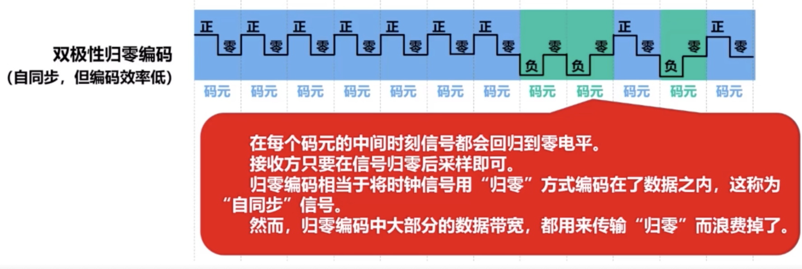

# 1 概述
## 1.1 计算机网络在信息时代的作用
## 1.2 因特网概述
1. 网络、互联网与因特网的区别与关系
    若干节点和链路互联形成网络
    若干网络通过路由器形成互联网
    因特网是当今世界上最大的互联网
    internet 互联网
    Internet 因特网
2. 因特网简介
    发展的三个阶段
    1969 ARPANET向互联网发展
    1985 三级结构因特网
    1993 多层次ISP结构的因特网
    因特网已发展成为基于ISP的多层次结构的互联网络

## 1.3 电路交换、分组交换和报文交换
1. 电路交换
    建立连接 ———— 通话 ———— 释放连接
   分配通信资源 一直占用资源 归还通信资源
2. 分组交换
    发送方：构造分组、发送分组
    交换节点：缓存分组、转发分组
    接受方：接受分组、还原报文

    优点：
    1. 没有建立连接和释放连接的过程
    2. 分组传输过程中逐段占用通信链路，有较高的通信线路利用率
    3. 交换节点可以为每一个分组独立选择转发路由，使得网络有很好的生存性

    缺点：
    1. 分组首部带来了额外的传输开销
    2. 交换节点存储转发会造成一定的时延
    3. 无法确保通信时端到端通信资源全部可用，在通信量较大时可能造成网络拥塞
    4. 分组可能会出现失序和丢失等问题
3. 报文交换
4. 三种交换方式对比
    1. 若要连续传送大量的数据，并且数据传送时间远大于建立连接的时间，则使用电路交换时通信线路的利用率会很低
    2. 报文交换和分组交换都不需要建立连接（即预先分配通信资源），在传送计算机的突发数据时可用提高通信线路的利用率。
    3. 将报文构造成若干个更小的分组进行分组交换，比将整个报文进行报文交换的时延要小，并且还可以避免太长的报文时间占用链路，有利于差错控制，同时具有更好的灵活性。

## 1.4 计算机网络的定义和分类
1. 计算机网络的定义
    计算机网络主要是由一些通用的、可编程的硬件互联而成的，而这些硬件并非专门用来实现某一特定目的（例如，传送数据或视频信号）。这些可编程的硬件能够用来传送多种不同类型的数据，并支持广泛的和日益增长的应用。
2. 计算机网络的分类
    1. 交换方式：电路交换、报文交换、分组交换
    2. 使用者：公用网（因特网）、专用网（军队、铁路、电路、银行）
    3. 传输介质：有线网络、无限网络
    4. 覆盖范围：广域网（WAN）：几十到几千千米、城域网（MAN）：5到50千米、局域网（LAN）：1千米左右、个域网（PAN）：10米
    5. 拓扑结构：总线型、星型、环形网络、网状型
## 1.5 计算机网络的性能指标
### 1.5.1 速率、带宽、吞吐量、时延
1. 计算机网络的性能指标
    1. 速率：
        比特（bit,记为小写b）是计算机中的数据量的基本单位，一个比特就是二进制数字中的1或0；
        数据量的常用单位有字节（byte，记为大写B）、千字节（KB）、兆字节（MB）、吉字节（GB）以及太字节（TB）
        1B = 8bit
        KB = 2^10B
        MB = K*KB = 2^20B
        GB = K*MB = 2^30B
        TB = K*GB = 2^40B

        速率是指数据的传送速率（即每秒传送多少个比特），也称为数据率（Data Rate）或比特率（Bit Rate）
        速率的基本单位是比特/秒（bit/s或bps）。速率的常用单位有千比特/秒（kb/s或kps）、兆比特/秒（Mb//s或Mbps）、吉比特/秒（Gb/s或Gbps）以及太比特/秒（Tb/s或Tbps）
        kb/s = 10^3 b/s
        Mb/s = k*kb/s = 10^6 b/s
        Gb/s = k*Mb/s = 10^9 b/s
        Tb/s = k*Gb/s = 10^12 b/s
    2. 带宽：
        带宽在模拟信号系统中的意义：
            某个信号所包含的各种不同频率成分所占的频率范围
            单位：Hz(KHz, MHz, GHz)

        带宽在计算机网络中的意义：
            用来表示网络的通信线路所能传达数据的能力，即在单位时间内从网络中的某一点到另一点所能通过的最高数据率
            单位：b/s(Kb/s,Mb/s,Gb/s,Tb/s)

            数据传输速率=min (主机借口速率，线路带宽，交换机或路由器的接口速率)
            |数据传输速率|主机的接口速率|线路带宽|交换机或路由器的接口速率|
            |1Gb/s|1Gb/s|1Gb/s|1Gb/s|
            |100Mb/s|100Mb/s|1Gb/s|1Gb/s|
            |100Mb/s|1Gb/s|100Mb/s|1Gb/s|
            |100Mb/s|1Gb/s|1Gb/s|100Mb/s|
    3. 吞吐量
        吞吐量是指在单位时间内通过某个网络或接口的实际数据量。吞吐量常被用于对实际网络的测量，以便获知有到底有多少数据

        吞吐量受网络带宽的限制。
    4. 时延
        时延是指数据从网络的一段传送到另一段所耗费的时间，也成为延迟或迟延。数据可由一个或多个分组、甚至是一个比特构成。
        发送时延 = 分组长度（b）/发送速率（b/s）
            发送速率 = min
        传播时延 = 信道长度（m）/信号传播速率（m/s）
            自由空间：3.0*10^8 m/s
            铜线：2.3*10^8 m/s
            光纤：2.0*10^8 m/s
        排队时延：不方便计算
        处理时延：不方便计算
        
        
### 1.5.2 时延带宽积、往返时间、利用率、丢包率
1. 计算机网络的性能指标
    1. 时延带宽积
        时延带宽积石传播时延和带宽的乘积。
        
    2. 往返时间
        往返时间（RTT）是指从发送端发送数据分组开始，到发送端收到接收端发来的相应确认分组为止，总共耗费的时间。
    3. 利用率
        1. 链路利用率：链路利用率是指某条链路有百分之几的时间是被利用的（即所有数据通过）。
            完全空闲的链路的利用率为零。
        2. 网络利用率：网络利用率是指网络中所有链路的链路利用率的加权平均。
        3. 根据排队论可知，当某链路的利用率增大时，该链路引起的时延就会迅速增加。
        4. 当网络的通信量较少时，产生的时延并不大，但在网络通信量不断增大时，分组在交换节点（路由器或交换机）中的排队时延会随之增大，因此网络引起的时延就会增大
        5. 令D0表示网络空闲时的时延，D表示网络当前的时延，那么在理想的假定条件下，可用下式表示D、D0的网络利用率U的关系
            D = D0/（1 - U）
            
    4. 丢包率
        丢包率是指在一定范围内，传输过程中丢失的分组数量与总分数数量的比率
        分组丢失主要有以下两种情况：
            1. 分组在传输过程中出现误码，被传输路径中的节点交换机测出误码而丢弃
            2. 节点交换机根据丢弃策略主动丢弃分组
        丢包率可以反映网络的拥塞情况：
            1. 无拥塞时路径的丢包率为0
            2. 轻度拥塞时路径的丢包率为1%～4%
            3. 严重拥塞时路径丢包率为5%～15%
## 1.6 计算机网络体系结构
### 1.6.1 常见的三种计算机网络体系结构
1. 常见的三种计算机网络体系结构
    
    
### 1.6.2 计算机网络体系结构分层的必要性
2. 计算机网络体系结构分层的必要性
    物理层（考虑的主要问题）：
        采用什么传输媒体（介质）（物理层之下）
        采用什么物理接口
        采用什么信号表示比特0和1
    数据链路层（考虑的主要问题）：
        表示网络中各主机（主机编址，例如MAC地址）
        从比特流中分出地址和数据（数据封装格式）
        协调各主机争用总线（媒体接入控制）
        以太网交换机的实现（自学习和转发帧）
        检测数据是否误码（差错检测）
        出现传输差错如何处理（可靠传输和不可靠传输）
        接受方控制发送方注入网络的数据量（流量控制）
    网络层（考虑的主要问题）：
        标识网络和网络中的各主机（网络和主机共同编址，例如IP地址）
        路由器转发分组（路由选择协议、路由表和转发表）
    运输层（考虑的主要问题）：
        进程之间基于网络的通信（进程的标识，例如端口号）
        出现传输差错如何处理（可靠传输和不可靠传输）
    应用层（考虑的主要问题）：
        通过应用进程间的交互来完成特定的网络应用
        进行会话管理和数据表示
### 1.6.3 计算机网络体系结构分层思想举例
3. 计算机网络体系结构分层思想举例

### 1.6.4 计算机网络体系结构中的专用术语
4. 计算机网络体系结构中的专用术语
    1. 实体
        实体是指任何可发送或接收信息的硬件或软件进程。
        对等实体是指通信双方相同层次中的实体
    2. 协议
        协议是控制两个对等实体在“水平方向”进行”逻辑通信“的规则的集合
        协议的三要素
            语法：定义所交换信息的格式
            语义：定义通信双方所要完成的操作
            同步：定义通信双方的时序关系
    3. 服务
        在协议控制下，两个对等实体在水平方向的逻辑通信是的本层能够向上一层提供服务
        要实现本层协议，还需要使用下面一层所提供的服务
        协议时“水平”的，而服务是“垂直”的
        实体看得见下层提供的服务，但并不知道实现该服务的具体协议。下层的协议对上层的实体是“透明”的。
        在同一系统中相邻两层的实体交换信息的逻辑接口称为服务访问点SAP，它被用于区分不同的服务类型。
        帧的“类型”字段、IP数据报的“协议”字段，TCP报文段或UDP用户数据报的“端口号”字段都是SAP。
        上层要使用下层所提供的服务，必须通过与下层交换一些命令，这些命令称为服务原语。
        对等层次之间传送的数据包称为该层的协议数据单元（Protocol Data Unit，PDU）。
        同一系统内层与层之间交换的数据包称为服务数据单元（Service Data Unit，SDU）。

# 2 物理层
## 2.1 物理层概述
1. 物理层要实现的功能
    “透明”传输比特流：数据链路层“看不见”（也无需看见）物理层究竟使用的是什么方法来传输比特流

        数据链路层只管“享受”物理层提供的比特流传输服务即可

2. 物理层接口特性
     机械特性：
        形状和尺寸
        引脚数目和排列
        固定和锁定装置
    电气特性：
        信号电压的范围
        阻抗匹配的情况
        传输速率
        距离限制
    功能特性：
        规定接口电缆的各条信号线的作用
    过程特性：
        规定在信号线上传输比特流的一组操作过程，包括各信号间的时序关系

## 2.2 物理层下面的传输媒体
1. 传输媒体的分类
    传输媒体是计算机网络设备之间的物理通路，也成为传输介质或传输媒介
    传输媒体并不包含在计算机网络体系结构中。
    传输媒体：
        导向型传输媒体（固体媒体）：同轴电缆、双绞线、光纤
        非导向型传输媒体（自由空间）：无线电波、微波、红外线、大气激光、可见光

2. 导向型传输媒体
    同轴电缆：外部保护层、绝缘层、屏蔽层、内导体
        基带同轴电缆（50欧）：用于数字传输，在早期局域网中广泛使用
        宽带同轴电缆（75欧）：用于模拟传输，目前主要用于有线电视的入户线

    双绞线：
        绞和的作用：
            减少相邻导线间的干扰
            抵御部分来自外界的电磁干扰

    光纤
        光纤利用光脉冲在光纤中的传递来进行通信。由于可见光的频率非常高，因此一个光纤通信系统的传输带宽远大于目前其他各种传输媒体的带宽
        
        多模光纤
            多条光波在多摸光纤中不断地全反射（只适合于建筑物内的近距离传输）
        单模光纤
            光在单模光纤中一直向前传播（适合长距离传输且衰减更小）

        在光纤通信中，常用的三个广播波段的中心波长为
            850nm  衰减较大，但其他特性较好
            1300nm 衰减较小
            1550nm 衰减较小
            25000～30000GHz的带宽光纤的通信容量很大

        常用的光纤规格有：
            单模光纤：8/125微米、9/125微米、10/125微米
            多模光纤：50/125微米（欧洲标准）、62.5/125微米（美国标准）

        光纤的优点
            通信容量非常大
            抗雷电和电磁干扰性能非常好
            传输损耗小，中继距离长
            无串音干扰，保密性好
            体积小，重量轻

        光纤的缺点
            割接光纤需要较贵的专业设备
            目前光接口还比较昂贵

3. 非导向型传输媒体
    无线电波：LF和MF波段：地面波沿着地面传播
            HF和VHF波段：地面波会被地表吸收，无线电波主要依靠电离层的反射，再回到地球表面
    微波：直线传播：微波接力通信和卫星通信
    红外线：遥控器，红外接口
    激光
    可见光

## 2.3 传输方式
1. 串行传输和并行传输
    串行传输：发送端和接收端只有一条通信线路
    并行传输：发送端和接收端有多条通信线路

2. 同步传输和异步传输
    同步传输：收发双方时钟同步的方法：
        外同步：在收发双方之间增加一条时钟信号线
        内同步：发送端将时钟信号编码发送数据中一起发送

    异步传输：
        字节之间异步，即字节之间的时间间隔不固定
        字节内的每个比特任然要同步，即各比特的持续时间相同的

3. 单向通信、双向交替通信和双向同时通信
    单向通信：只能有一个方向的通信（无线电广播、电视广播）
    双向交替通信：通信双方都可以发送信息和接收信息，对于任何一方，发送和接收不能同时进行（对讲机）
    双向同时通信：通信双方都可以同时发送和接收信息（传统电话）

## 2.4 编码与调制
1. 编码与调制的基本概念
    
    

2. 编码方式
    双极性不归零编码:编码效率高，但存在同步问题
        
    双极性归零编码：
        
    曼彻斯特编码：
        
    差分曼彻斯特编码：
        

    
    

3. 基本的带通调制方法和混合调制方法
    混合调制方法
        
## 2.5 信道的极限容量
1. 造成信道失真的主要因素
    码元的传输速率：传输速率越高，信号经过传输后的失真就越严重
    信号的传输距离：传输距离越远，信号经过传输互后的失真就越严重
    噪声干扰：噪声干扰越大，信号经过传输后的失真就越严重
    传输媒体的质量：传输媒体质量越差，信号经过传输后的失真就越严重
    信道上传输的数字信号，可以看作是多个频率的模拟信号进行多次叠加后形成的方波
    如果数字信号中的高频分量在传输时受到衰减甚至不能通过信道，则接收端收到的波形前沿和后沿就变得不那么陡峭，每一个码元所占的时间界限也不再明确。这样，在接收端接收到的信号波形就失去了码元之间的清晰界限，这种现象称为码间串扰
    如果信道的频带越宽，则能够通过信号的高频分量就越多，那码元之间的传输速率就可以更高，而不会导致码间串扰
    然而，信道的频率带宽是有上限的，不可能无限大。因此，码元的传输速率也有上限。

2. 奈氏准则
    
    

3. 香农公式
    
    
    
    

## 2.6 信道的复用技术
1. 信道复用技术的基本原理
    复用就是在一条传输媒体上同时传输多路用户的信号
    当一条传输媒体的传输容量大于多条信道传输的总容量时，就可以通过复用技术，在这条传输媒体上建立多条通信信道，以便充分利用传播媒体的带宽
    尽管实现信道复用会增加通信成本，但如果复用的信道数量较大，还是比较划算的。

2. 常见的信道复用技术
    频分复用FDM：需留出隔离频带
        频分复用的所有用户同时占用不同的频带资源发送数据

    时分复用TDM：
        各用户时隙周期性出现周期为TDM帧的长度
        TDM帧实际上是一段固定长度的时间，它与数据链路层对等实体间逻辑通信的“帧”，是完全不同的概念
        时分复用的用户在不同的时间占用同样的频带进行通信

    波分复用WDM：光的频繁复用FDM
        根据频分复用的设计思想，可在一根光纤上同时传输多个频率（波长）相近的光载波信号，实现基于光纤的频分复用技术
        目前可以在一根光纤上复用80路或更多的光载波信号。因此，这种复用技术也成为密集波分复用DWDM。
        铺设光缆的工程耗资巨大，应尽量在一根光缆中放入尽可能多的光纤，然后对每一根光纤使用密集波分复用技术。
            例如，在一个光缆中放入100根速率为2.5Gb/s的光纤，对每根光纤采用40倍的密集波分复用，则这根光缆的总数据速率为(2.5Gb/s * 40) * 100 = 10000Gb/s = 10Tb/s。
    码分复用CDM
        码分复用常称为码分多址，它是在扩频通信技术上发展起来的一种无线通信技术。
        与FDM和TDM不同，CDMA的每个用户可以在相同时间使用相同的频带进行通信。
        CDMA最初用于军事通信，这种系统发送的信号有很强的抗干扰能力，其频谱类似于白噪声，不易被敌人发现。
        随着技术的进步，CDMA设备的价格和体积都大幅度下降，因而现在已广泛用于民用的移动通信中。
        
        
        
        

# 3 数据链路层
## 3.1 数据链路层概述
1. 数据链路层在网络体系结构中所处的地位
    数据是在数据链路层沿水平方向传送
    不同的数据链路层采用不同的数据链路层协议

2. 链路、数据链路和帧
    链路是指从一个节点到相邻节点的一段物理线路（有线或无线），而中间没有任何其他的交换节点
    数据链路是基于链路的。当在一条链路上传送数据时，除需要链路本身，还需要一些必要的体系协议来控制这些数据的传输，把实现这些协议的硬件和软件加到链路上，就构成了数据链路
        计算机中的网络适配器和其相应的软件驱动程序就实现了这些协议，一般的网络适配器包含了物理层和数据链路这两层的功能。
    帧时数据链路层对等实体之间在水平方向进行逻辑通信的协议单元PDU
        帧是在通信双方数据链路层的对等实体之间沿水平方向传送的

## 3.2 数据链路层的三个重要问题
1. 数据链路层的三个重要问题
    
## 3.3.1 封装成帧和透明传输
1. 封装成帧
    封装成帧是指数据链路层给上层交付下来的协议数据单元PDU添加一个首部和尾部，使之成为帧
        帧的首部和尾部中包含有一些重要的控制信息
        帧首部和尾部的作用之一就是帧定界
        并不是每一种数据链路层协议的帧都包含有帧定界标志
        为了提高数据链路层传输帧的效率，应当使帧的数据载荷长度尽可能大于首部或尾部的长度
        考虑到缓存空间的需求以及差错控制等诸多因素，每一种数据链路层协议都规定了帧的数据载荷的长度上限，即最大传送单元。例如以太网的MTU为1500个字节。
2. 透明传输
    透明传输是指数据链路层对上层交付下来的协议数据单元PDU没有任何限制，就好像数据链路层不存在一样。
        面向字节的物理链路使用字节填充的方法实现透明传输。
        面向比特的物理链路使用比特填充的方法实现透明传输。

### 3.2.2 差错检测
1. 误码的相关概念
    实际的通信链路都不是特别理想的，比特在传输过程中可能会产生差错：
        比特1可能变成比特0
        比特0可能变成比特1
    在一段时间内，传输错误的比特数量占所传输比特总数的比率称为误码率（BER）
    提高链路的信噪比，可以降低误码率。但在实际的通信链路上，不可能使误码率下降为0
    使用差错检测技术来检测数据在传输过程中是否产生了比特差错，是数据链路层所要解决的重要问题之一。

2. 奇偶校验
    奇校验是在待发送的数据后面添加1个校验位，使得添加该校验位后的整个数据中比特1的个数为奇数。
    偶校验是在待发送的数据后面添加1个校验位，使得添加该校验位后的整个数据中比特1的个数为偶数。
    在所传输的数据中，如果有奇数个位发生误码，则所包含比特1的数量的奇偶性会发生改变，可以检测出误码
    在所传输的数据中，如果有偶数个位发生误码，则所包含比特1的数量的奇偶性不会发生改变，不可以检测出误码（漏检）
    在实际使用时，奇偶校验又可以分为垂直奇偶校验、水平奇偶校验以及水平垂直奇偶校验

3. 循环冗余校验
    数据链路层广泛使用漏检率极低的循环冗余校验（CRC）检错技术
    循环冗余校验CRC的基本思想：
        收发双方约定好一个生成多项式G（X）。
        发送方基于待发送的数据和生成多项式G（X），计算出差错检测码（冗余码），将冗余码添加到带发送数据的后面一起传输
        接收方收到数据和冗余码后，通过生成多项式G（X）来计算收到数据和冗余码是否产生了误码
    发送方CRC操作
        
        
    
    
    

### 3.2.3 可靠传输
#### 3.2.3.1 可靠传输的基本概念
1. 可靠传输的相关基本概念
    使用差错检测技术（例如循环冗余校验CRC），接收方的数据链路层就可以检测出帧在传输过程中是否产生了误码（比特差错）

    数据链路层向其上层提供的服务类型
        不可靠传输服务：仅仅丢弃有误码的帧，其他什么也不做
        可靠传输服务：通过某种机制实现发送方发送什么，接收方最终就能接收到什么。

    一般情况下，有线链路的误码率比较低。为了减小开销，并不要求数据链路层向其上层提供可靠传输服务。即使出现了误码，可靠传输的问题由其上层处理。

    无线链路易受干扰，误码率较高，因此要求数据链路层必须向其上层提供可靠传输服务。

    可靠传输服务并不局限于数据链路层，其他各层均可选择实现可靠传输

    可靠传输的实现比较复杂，开销比较大，是否使用可靠传输取决于应用需求

#### 3.2.3.2 停止——等待协议
1. 停止-等待协议的实现原理

2. 停止-等待协议的信道利用率

#### 3.2.3.3 回退N帧协议

#### 3.2.3.4 选择重传协议