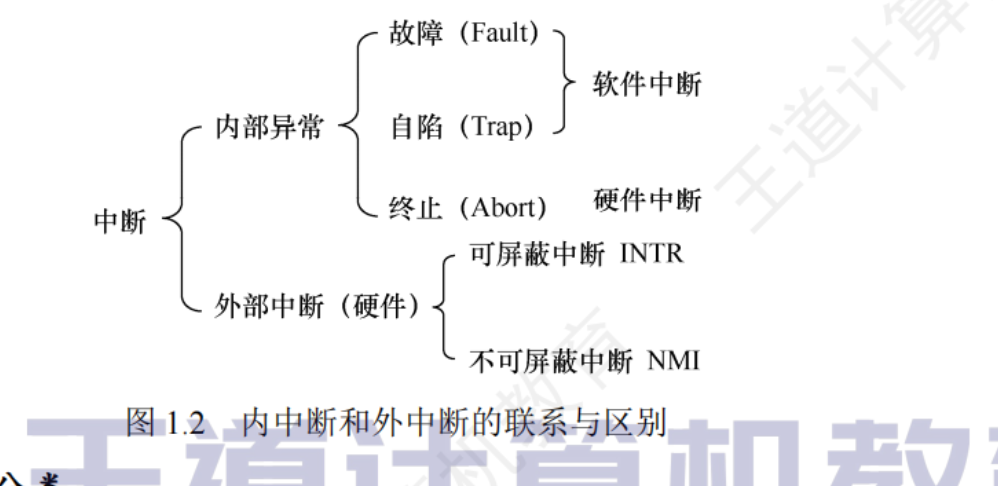
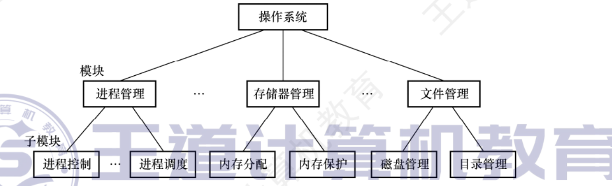
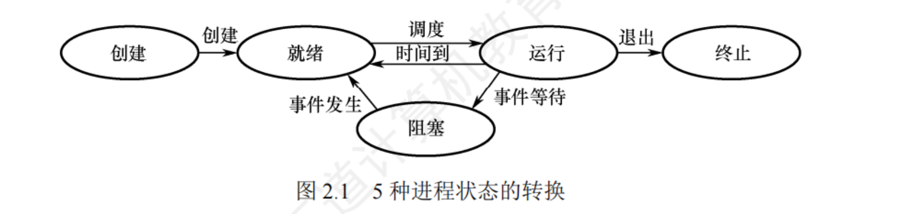
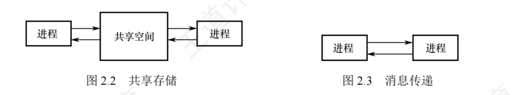
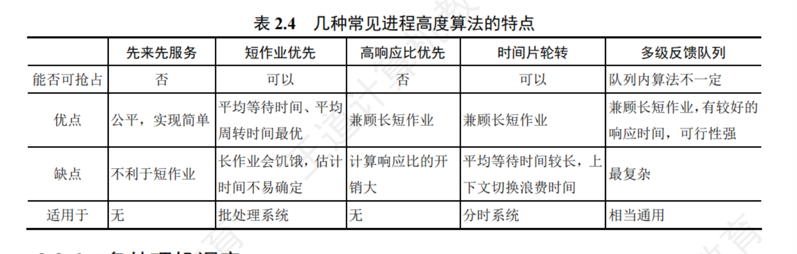

# 1 计算机系统概述
## 1.1 操作系统的基本概念
###  1.1.1 操作系统的概念

操作系统是指控和管理整个计算机系统的硬件与软件资源，合理地组织、调度计算机的工作与资源的分配，进而为用户和其他软件提供方便借口与环境的程序集合。操作系统是计算机系统中最基本的系统软件。

### 1.1.2 操作系统的功能和目标（向上层提供方便易用的服务）
1. 操作系统作为计算机系资源的管理者

    1. 处理机管理/任务管理

        在多道程序环境下，处理机的分配和运行都以进程为基本单位，因此对处理机的管理可归结为对进程的管理。并发是指在计算机内同时运行多个进程，因此进程何时创建、何时撤销、如何管理、如何避免冲突、合理共享就是进程管理最主要的任务。进程管理的主要功能包括进程控制、进程同步、进程通信、死锁处理、处理机调度等。

    2. 存储器管理/内存管理

        存储器管理是为了给多道程序的运行提供良好的环境，方便用户提供使用及提高内存的利用率，主要包括内存分配与回收、地址映射、内存保护与共享和内存扩展等功能。

    3. 文件管理

        计算机中的信息都是以文件的形式存在的，操作系统中负责文件管理的部分称为文件系统。文件管理包括文件存储空间的管理、目录管理及文件读/写管理和保护等。

    4. 设备管理

        设备管理的主要任务是完成用户的I/O请求，方便用户使用各种设备，提高设备的利用率，主要包括缓冲管理、设备分配、设备处理和虚拟设备等功能。

2. 操作系统作为用户与计算机硬件系统之间的接口

    1. 命令接口

        联机命令接口也称交互式命令接口，适用于分时或实时系统的接口。用户通过控制台或终端输入操作命令，向系统提出各种服务要求。

        脱机命令接口也称批处理命令接口，适用于批处理系统。脱机用户不能直接干预作业的运行，而应事先用相应的作业控制命令编写一份作业操作说明书，连同作业一起提交给系统。当系统调度到作业时，由系统中的命令解释程序逐条解释执行作业说明书上的命令，进而间接地控制作业的运行。

    2. 程序接口

        程序接口由一组系统调用组成。用户通过在程序中使用这些系统调用来请求操作系统为其提供服务。当前最流行的是图形用户界面GUI，即图形接口。GUI最终是通过调用程序接口实现的，用户通过鼠标和键盘在图形界面上单击或使用快捷键，就能方便地使用操作系统。

3. 操作系统实现了对计算机资源的扩充

    裸机在最内层，外面是操作系统。操作系统所提供的资源管理功能和方便用户的各种服务功能能讲裸机改造成功能更强、使用更方便的机器。通常将覆盖了软件的机器称为扩充机器或虚拟机。

### 1.1.3 操作系统的特征
1. 并发concurrent/并行parallelism

    并发是指两个或多个事件在同一时间间隔内发生。并行性是指系统具有同时进行运算或操作的特性，在同一时刻能完成两种或两种以上的工作。

2. 共享

    资源共享即共享，是指系统中的资源可供内存中的资源可供内存中多个并发执行的进程共同使用。

    1. 互斥共享方式

        规定在一段时间内指允许一个进程访问该资源。仅当A访问完并释放该资源后，才允许另一个进程对该资源进行访问。我们将这种资源共享方式称为互斥共享，而将在一段时间内只允许一个进程访问的资源称为临界资源。

    2. 同时访问方式

        这类资源允许一段时间内多个进程“同时”访问。在微观上，这些进程可能是交替地对该资源进行访问，即“分时共享”的。

    并发和共享是操作系统两个最基本的特征，两者之间互为存在的条件：1. 资源共享是以程序的并发为条件的，若系统不允许程序并发执行，则自然不存在资源共享问题；2. 若系统不能对资源共享实施有效的管理，则必将影响到程序的并发执行，甚至根本无法并发执行。

3. 虚拟

    虚拟是指将一个物理上的实体编程若干个逻辑上的对应物。操作系统的虚拟技术可归纳为：时分复用技术，如虚拟机处理器；空分复用技术，如虚拟存储器。

    利用多道程序设计技术将一个物理上的CPU虚拟为多个逻辑上的CPU，称为虚拟处理器。

4. 异步

    多道程序环境允许多个程序并发执行，但由于资源有限，进程的执行并不是一贯到底的，而是走走停停，它以不可预知的速度前进，这就是进程的异步性。

## 1.2 操作系统发展历程
### 1.2.1 手工操作阶段

用户在计算机上算题的所有工作都要人工干预。手工操作阶段有两个突出的缺点：1. 用户独占全机，虽然不会出现因资源已被其他用户占用而等待的现象，但资源利用率低。 2. CPU等待手工操作，CPU的利用不充分。

### 1.2.2 批处理阶段
1. 单道批处理系统、

    为实现对作业的连续处理，需要先将一批作业以脱机方式输入磁带，并在系统中配上监督程序，在其控制下，使这批作业能一个接一个地连续处理。

    1. 自动性。在顺利情况下，磁带的一批作业能自动地逐个运行，而无需人工干预。

    2. 顺序性。磁带上的各道作业顺序地进入内存，先调入内存的作业先完成。

    3. 单道性。内存中仅有一道程序运行，即监督程序每次从磁带上只调入一道程序进入内存运行，当该程序完成或发生异常情况下，才换入其后继程序进入内存运行。

    面临的问题是：每次主机内存中仅存放一道作业，每当它在运行期间发出输入/输出请求后，高速的CPU便处于等待低速的I/O完成状态。

2. 多道批处理系统

    多道程序的设计的特点是多道、宏观上并行、微观上串行。

    1. 多道。计算机内存中同时存放多道相互独立的程序。
    2. 宏观上并行。同时进入多道程序都处于运行过程中，但都未运行完毕。
    3. 微观上串行。内存中的多道程序轮流占有CPU，交替执行。

    多道程序设计技术的实现需要解决下列问题：

    1. 如何分配处理器

    2. 多道程序的内存分配问题

    3. I/O设备如何分配

    4. 如何组织和存放大量的程序和数据，以便用户使用并保证其安全性与一致性。

    优点：资源利用率高，多道程序共享计算机资源，从而使各种资源得到充分利用；系统吞吐量大，CPU和其他资源保持“忙碌”状态。缺点：用户响应的时间较长；不提供人机交互能力，用户即不能了解自己的运行情况，又不能控制计算机。

### 1.2.3 分时操作系统
所谓分时，是指将处理器的运行时间分成很短的时间片，按时间片轮流将处理器分配给各联机作业使用

分时操作系统是指多个用户通过终端共享一台主机，这些终端连接在主机上，用户可以同时与主机进行交互操作而互不干扰。

分时操作系统的特征：

1. 同时性。同时性也称多路性，指允许多个终端用户同时使用一台计算机。

2. 交互性。用户通过终端采用人机对话的方式直接控制程序运行，与同程序进行交互

3. 独立性。系统中多个用户可以彼此独立地进行操作，互不干扰，单个用户感觉不到别人也在使用这台计算机。

### 1.2.4 实时操作系统
为了能在某个限制内完成某些紧急任务而不需要时间片排队，诞生了实时操作系统。分为两种情况：若某个动作必须绝对地在规定的时刻发生，则称为硬实时系统。若能够接受偶尔违反时间规定且不会引起任何永久性的损害，则称为软实时系统。

实时操作系统的主要特点是及时性和可靠性。

### 1.2.5 网络操作系统和分布式操作系统
网络操作系统是伴随着计算机网络的发展而诞生的，它把网络中的各台计算机有机的结合起来，实现各台计算机之间的通信和数据传送功能，实现网络中各种资源的共享。

分布式计算机系统是由多台计算机组成并满足下列条件的系统：系统中任意两台计算机通过通信方式交换信息；每台计算机都具有同等的地位，即没有主机也没有从机；每台计算机上的资源为所有用户共享；系统中的任意台计算机都可以构成一个子系统，并且还能重构；任何工作都可以分布在几台计算机上，由它们并行工作、协同完成。特点是

## 1.3 操作系统的运行环境
### 1.3.1 处理器运行模式
通常CPU执⾏两种不同性质的程序：⼀种是操作系统内核程序：另⼀种是⽤户⾃编程序

    1.特权指令，是指不允许⽤户直接使⽤的指令

    2.⾮特权指令，是指允许⽤户直接使⽤的指令，它不能直接访问系统中的软硬件资源，仅限于访问⽤户的地址空间，这也是为了防⽌⽤户程序对系统造成破坏。

CPU的运⾏模式划分为⽤户态（⽬态）和内核态（也称管态、核⼼态）。当⼩开关为0时，CPU处于内核态，此时CPU可以执⾏特权指令，切换到⽤户态的指令也是特权指令。当⼩开关为1时，CPU处于⽤户态，此时CPU只能执⾏⾮特权指令。应⽤程序运⾏在⽤户态，操作系统内核程序运⾏在内核态。应⽤程序向操作系统请求服务时通过使⽤访管指令，访管指令是在⽤户态执⾏的，因此是⾮特权指令。

1. 时钟管理

    时钟的第⼀功能是计时，操作系统需要通过时钟管理，向⽤户提供标准的系统时间。另外，通过时钟中断的管理，可以实现进程的切换。

2. 中断机制

    引⼊中断技术的初衷是提⾼多道程序运⾏时的CPU利⽤率，使CPU可以在I/O操作期间执⾏其他指令。

    中断机制中，只有⼀⼩部分功能属于内核，它们负责保护和恢复中断现场的信息，转移控制权到相关的处理程序。这样可以减少中断的处理时间，提⾼系统的并⾏处理能⼒。

3. 原语/原子性

    按层次结构设计的操作系统，底层必然是⼀些可被调⽤的公⽤⼩程序，它们各⾃完成⼀个规定的操作，通常将具有这些特点的程序称原语。它们的特点如下：

        1. 处于操作系统的底层，是最接近硬件的部分。

        2. 这些程序的运⾏具有原⼦性，其操作只能⼀⽓呵成（出于系统安全性和便于管理考虑）。

        3. 这些程序的运⾏时间都较短，⽽且调⽤频繁。

    定义原语的直接⽅法是关中断，让其所有动作不可分割地完成后再打开中断。系统中的设备驱动、CPU切换、进程通信等功能中的部分操作都可定义为原语，使它们成为内核的组成部分。

4. 系统控制的数据结构及处理

    系统中⽤来登记状态信息的数据结构很多，如作业控制块、进程控制块、设备控制块、各类链表，消息队列、缓冲区、空闲区登记表作业、内存分配表等。为了块实现有效的管理，系统控制需要⼀些基本的操作，常见的操作有以下3种：

        1. 进程管理。进程状态管理、进程调度和分派、创建与撤销进程控制块等。

        2. 存储器管理。存储器的空间分配和回收、内存信息保护程序、代码对换程序等。

        3. 设备管理。缓冲区管理、设备分配和回收等。

可见，内核态指令实际上包括系统调⽤类指令和⼀些针对时钟、中断和原语的操作指令。

### 1.3.2 中断和异常的概念

1. 中断和异常的定义
    中断也称外中断，是指来⾃CPU执⾏指令外部的事件，通常⽤于信息输⼊/输出，

    时钟中断，表⽰⼀个固定的时间⽚已到，让处理机处理计时、启动定时运⾏的任务等。

    异常也称内中断，是指来⾃CPU执⾏指令内部的事件。异常不能被屏蔽，⼀旦出现，就应⽴即处理

2. 中断和异常的分类

    外中断可分为可屏蔽中断和东司屏蔽中断。可屏蔽中断是指通过iNTR线发出的中断通过改变屏蔽字可以实现多重中断，从⽽使得中断处理更加灵活。不可屏蔽中断是指通过NMI请求：线发出的中断请求，通常是紧急的硬件故障，如电源掉电等。此外，异常也是不能被屏蔽的。

    异常可分为故障、⾃陷和终⽌。故障通常是由指令执⾏引起的异常，如⾮法操作码、缺页故障、除数为0、运算溢出等。⾃陷（Trap，也称陷⼊）是⼀种事先安排的“异常”事件，⽤于在⽤户态下调⽤操作系统内核程序，如条件陷阱指令、系统调⽤指令等。终⽌（Abort）是指出现了使得CPU⽆法继续执⾏的硬件故障，如控制器出错、存储器校验错等。故障异常和⾃陷异常属于软件中断（程序性异常），终⽌异常和外部中断属于硬件中断

3. 中断和异常的处理过程

    中断和异常处理过程的⼤致描述如下：当CPU在执⾏⽤户程序的第i条指令时检测到⼀个异常事件，或在执⾏第i条指令后发现⼀个中断请求信号，则CPU打断当前的⽤户程序，然后转到相应的中断或异常处理程序去执⾏。若中断或异常处理程序能够解决相应的问题，则在中断或异常处理程序的最后，CPU通过执⾏中断或异常返回指令，回到被打断的⽤户程序的第；条指令或第i+1条指令继续执⾏；若中断或异常处理程序发现是不可恢复的致命错误，则终⽌⽤户程序。通常情况下，对中断和异常的具体处理过程由操作系统（和驱动程序）完成。

### 1.3.3 系统调用
系统调⽤是操作系统提供给应⽤程序（程序员）使⽤的接⼜，可视为⼀种供应⽤程序调⽤的特殊的公共⼦程序。系统中的各种共享资源都由操作系统统⼀掌管，因此凡是与共享资源有关的操作（如存储分配、I/O传输及⽂件管理等），都必须通过系统调⽤⽅式向操作系统提出服务请求，由操作系统代为完成，并将处理结果返回给应⽤程序

系统调⽤的功能：

    设备管理。完成设备的请求或释放，以及设备启动等功能。

    ⽂件管理。完成⽂件的读、写、创建及删除等功能。

    进程控制。完成进程的创建了/撤销、阻塞及唤醒等功能。

    进程通信。完成进程之间的消息传递或信号传递等功能。

    内存管理。完成内存的分配、回收以及获取作业占⽤内存区⼤⼩和起始地址等功能。

下⾯分析系统调⽤的处理过程：

    第⼀步，⽤户程序⾸先将系统调⽤号和所需的参数压⼊堆栈；

    第⼆步，分析系统调⽤类型，转⼊相应的系统调⽤处理⼦程序

    第三步，在系统调⽤处理⼦程序执⾏结束后，恢复被中断的或设置新进程的CPU现场，然后返回被中断进程或新进程，继续往下执⾏。

⽤户程序执⾏“陷⼊指令”，相当于将CPU的使⽤权主动交给操作系统内核程序（CPU状态会从⽤户态进⼊内核态），之后操作系统内核程序再对系统调⽤请求做出相应处理。处理完成后，操作系统内核程序又会将C P U的使⽤权还给⽤户程序（CPU状态会从内核态回到⽤户态）。这么设计的⽬的是：⽤户程序不能直接执⾏对系统影响⾮常⼤的操作，必须通过系统调⽤的⽅式请求操作系统代为执⾏，以便保证系统的稳定性和安全性。

操作系统的运⾏环境可以理解为：⽤户通过操作系统运⾏上层程序（如系统提供的命令解释程序或⽤户⾃编程序），⽽这个上层程序的运⾏依赖于操作系统的底层管理程序提供服务⽀持，当需要管理程序服务时，系统通过硬件中断机制进⼊内核态，运⾏管理程序；也可能是程序运⾏出现异常情况，被动地需要管理程序的服务，此时则通过异常处理进⼊内核态。管理程序运⾏结束时，退出中断或异常处理程序，返回到⽤户程序的断点处继续执⾏。

## 1.4 操作系统结构
1. 分层法

    分层法是将操作系统分若⼲层，底层（层0）为硬件，顶层（层N）为⽤户接⼜，每层只能调⽤紧邻它的低层的功能和服务（单向依赖）

    分层法的优点：

    ①便于系统的调试和验证，简化了系统的设计和实现
    ②易扩充和易维护。在系统中增加、修改或替换⼀层中的模块或整层时，只要不改变相应层间的接⼜，就不会影响其他层。

    分层法的问题：

    ①合理定义各层⽐较困难。因为依赖关系固定后，往往就显得不够灵活。
    ②效率较差。操作系统每执⾏⼀个功能，通常要⾃上⽽下地穿越多层，各层之间都有相应的层间通信机制，这⽆疑增加了额外的开销，导致系统效率降低。

2. 模块化

    模块化是将操作系统按功能划分为若⼲具有⼀定独⽴性的模块。
    

    衡量模块的独⽴性主要有两个标准：

    •内聚性，模块内部各部分间联系的紧密程度。内聚性越⾼，模块独⽴性越好。

    •耦合度，模块间相互联系和相互影响的程度。耦合度越低，模块独⽴性越好。

    模块化的优点：①提⾼了操作系统设计的正确性、可理解性和可维护性；②增强了操作系统的可适应性；③加速了操作系统的开发过程。

    模块化的缺点：①模块间的接⼜规定很难满⾜对接⼜的实际需求。②各模块设计者齐头并进，每个决定⽆法建⽴在上⼀个已验证的正确决定的基础上，因此⽆法找到⼀个可靠的决定顺序。

3. 宏内核

    宏内核，也称单内核或⼤内核，是指将系统的主要功能模块都作一个为各管理模块⼀个紧密联系的整体运⾏在内核态，从⽽为⽤户程序提供⾼性能的系统服务。

4. 微内核
    1. 微内核的基本概念
    微内核构架，是指将内核中最基本的功能保留在内核，⽽将那些不需要在内核态执⾏的功能移到⽤户态执⾏，从⽽降低内核的设计复杂性

    微内核结构将操作系统划分为两⼤部分：微内核和多个服务器。微内核是指精⼼设计的、能实现操作系统最基本核⼼功能的⼩型内核，通常包含：①与硬件处理紧密相关的部分；②⼀些较基本的功能；③客户和服务器之间的通信。

    2. 微内核的基本功能
        1. 进程（线程）管理。
        2. 低级存储器管理
        3. 中断和陷入处理

    3. 微内核的特点
        1. 扩展性和灵活性
        2. 可靠性和安全性
        3. 可移植性
        4. 分布式计算

    微内核结构的主要问题是性能问题，因为需要频繁地在内核态和⽤户态之间进⾏切换，操作系统的执⾏开销偏⼤。为了改善运⾏效率，可以将那些频繁使⽤的系统服务移回内核，从⽽保证系统性能，但这又会使微内核的容量明显地增⼤。

5. 外核

    在底层，⼀种称外核的程序在内核态中运⾏。它的任务是为虚拟机分配资源，并检查这些资源使⽤的安全性，以确保没有机器会使⽤他⼈的资源。每个⽤户的虚拟机可以运⾏⾃⼰的操作系统，但限制只能使⽤⼰经申请并且获得分配的那部分资源

## 1.5 操作系统引导

常见操作系统的引导过程如下：

    1. 激活CPU

    2. 硬件自检

    3. 加载带有操作系统的硬盘

    4. 加载主引导记录（MBR）

    5. 扫描硬盘分区表，加载硬盘活动分区

    6. 加载分区引导记录（PBR）

    7. 加载启动管理器

    8. 加载操作系统

## 1.6 虚拟机

虚拟机是指利⽤虚拟化技术，将⼀台物理机器虚拟化为多台虚拟机器，通过隐藏特定计算平台的实际物理特性，为⽤户提供抽象的、统⼀的、模拟的计算环境

### 1.6.1 第一类虚拟机管理程序
1. 第一类虚拟机管理程序

    第⼀类虚拟机管理程序就像⼀个操作系统，因为它是唯⼀⼀个运⾏在最⾼特权级的程序。它在裸机上运⾏并且具备多道程序功能。虚拟机管理程序向上层提供若⼲虚拟机，这些虚拟机是裸机硬件的精确复制品。因为每台虚拟机都与裸机相同，所以在不同的虚拟机上可以运⾏任何不同的操作系统

    虚拟机作为⽤户态的⼀个进程运⾏，不允许执⾏敏感指令。然⽽，虚拟机上的操作系统认为⾃⼰运⾏在内核态（实际上不是），称虚拟内核态。虚拟机中的⽤户进程认⾃⼰运⾏在⽤户态（实际上确实是）。当虚拟机操作系统执⾏了⼀条CPU处于内核态才允许执⾏的指令时，会陷⼊虚拟机管理程序。在⽀持虚拟化的CPU上，虚拟机管理程序检查这条指令是由虚拟机中的操作系统执⾏的还是由⽤户程序执⾏的。若是前者，则虚拟机管理程序将安排这条指令功能的正确执⾏。否则，虚拟机管理程序将模拟真实硬件⾯对⽤户态执⾏敏感指令时的⾏为。

2. 第二类虚拟机管理程序

    第⼆类虚拟机管理程序。它是⼀个依赖于Windows、Linux等操作系统分配和调度资源的程序，很像⼀个普通的进程。第⼆类虚拟机管理程序仍然伪装成具有C P U和各种设备的完整计算机。VMware Workstation是⾸个x86平台上的第⼆类虚拟机管理程序。

    运⾏在两类虚拟机管理程序上的操作系统都称为客户操作系统。对于第⼆类虚拟机管理程序，运⾏在底层硬件上的操作系统称宿主操作系统。

    ⾸次启动时，第⼆类虚拟机管理程序像⼀台刚启动的计算机那样运转，期望找到的驱动器可以是虚拟设备。然后将操作系统安装到虚拟磁盘上（其实只是宿主操作系统中的⼀个⽂件）。客户操作系统安装完成后，就能启动并运⾏。

    虚拟化在Web主机领域很流⾏。没有虚拟化，服务商只能提供共享托管（不能控制服软件）和独占托管（成本较⾼）。当服务商提供租⽤虚拟机时，⼀台物理服务器就虚拟机，每个虚拟机看起来都是⼀合完整的服务器，容户可以在虚拟机上安装⾃可以⼰想运⾏⽤的务器的多个操作系统和软件，但是只需⽀付较低的费⽤，这就是市⾯上常见的“云”主机。

# 2 进程和线程
## 2.1 进程与线程
### 2.1.1 进程的概念和特征
1. 进程的概念

    在多道程序环境下，允许多个程序并发执⾏，此时它们将失去封闭性，并具有间断性及不可再现性的特征。为此引⼊了进程（Process）的概念，以便更好地描述和控制程序的并发执⾏，实现操作系统的并发性和共享性（最基本的两个特性）。

    为了使参与并发执⾏的每个程序（含数据）都能独⽴地运⾏，必须之配置⼀个专门的数据结构，称为进程控制块由程序段、相关数据段和PCB三部分构成了进程实体（也称进程映像）。所谓创建进程，就是创建进程的PCB；⽽撤销进程，就是撤销进程的PCB。

    从不同的⾓度，进程可以有不同的定义，⽐较典型的定义有：

        1）进程是⼀个正在执⾏程序的实例。

        2）进程是⼀个程序及其数据从磁盘加载到内存后，在CPU上的执⾏过程。

        3）进程是⼀个具有独⽴功能的程序在⼀个数据集合上运⾏的过程。

2. 进程的特征

    1. 动态性，最基本的特征

    2. 并发性，最重要的特征

    3. 独立性

    4. 异步性

### 2.1.2 进程的组成
1. 进程控制块

    进程创建时，操作系统为它新建⼀个PCB，该结构之后常驻内存，任意时刻都可以存取，并在进程结束时删除。PCB是进程实体的⼀部分，是进程存在的唯⼀标志。

    进程执⾏时，系统通过其PCB了解进程的现⾏状态信息，以便操作系统对其进⾏控制和管理；进程结束时，系统收回其PCB，该进程随之消亡。

        1. 进程描述信息。进程标识符：标志各个进程，每个进程都有⼀个唯⼀的标识号。⽤户标识符：进程所归属的⽤户，⽤户标识符主要为共享和保护服务。

        2. 进程控制和管理信息。进程当前状态：描述进程的状态信息，作为CPU分配调度的依据。进程优先级：描述进程抢占CPU的优先级，优先级⾼的进程可优先获得CPU。
        3. 资源分配清单，⽤于说明有关内存地址空间或虚拟地址空间的状况，所打开⽂件的列表和所使⽤的输⼊/输出设备信息。
        4. 处理机相关信息，也称CPU上下⽂，主要指CPU中各寄存器的值。当进程处于执⾏态时，CPU的许多信息都在寄存器中。当进程被切换时，CPU状态信息都必须保存在相应的PCB中，以便在该进程重新执⾏时，能从断点继续执⾏

2. 程序段
程序段就是能被进程调度程序调度到C P U执⾏的程序代码段。注意，程序可被多个进程共享，即多个进程可以运⾏同⼀个程序

3. 数据段
⼀个进程的数据段，可以是进程对应的程序加⼯处理的原始数据，也可以是程序执⾏时产⽣的中间或最终结果。

### 2.1.3 进程的状态与转换
1. 运⾏态。进程正在CPU上运⾏。在单CPU中，每个时刻只有⼀个进程处于运⾏态。

2. 就绪态。进程获得了除CPU外的⼀切所需资源，⼀旦得到CPU，便可⽴即运⾏。系统中处于就绪态的进程可能有多个，通常将它们排成⼀个队列，称为就绪队列。

3. 阻塞态，也称等待态。进程正在等待某⼀事件⽽暂停运⾏，如等待某个资源可⽤（不包括CPU）或等待I/0完成。

4. 创建态。进程正在被创建，尚未转到就绪态。创建进程需要多个步骤：⾸先申请⼀个空⽩PCB，并向PCB中填写⽤于控制和管理进程的信息：然后为该进程分配运⾏时所必须的资源；最后将该进程转⼊就绪态并插⼊就绪队列

5. 终⽌态。进程正从系统中消失，可能是进程正常结束或其他原因退出运⾏。

区分就绪态和阻塞态：就绪态是指进程仅缺少CPU，只要获得CPU就⽴即运⾏：⽽阻塞态是指进程需要其他资源（除了CPU）或等待某⼀事件

就绪态⼀运⾏态：处于就绪态的进程被调度后，获得CPU资源（分派CPU的时间⽚），于是进程由就绪态转换为运⾏态。

运⾏态⼀就绪态：处于运⾏态的进程在时间⽚⽤完后，不得不让出CPU，从⽽进程由运⾏态转换为就绪态。此外，在可剥夺的操作系统中，当有更⾼优先级的进程就绪时，调度程序将正在执⾏的进程转换为就绪态，让更⾼优先级的进程执⾏。

运⾏态⼀阻塞态：进程请求某⼀资源（如外设）的使⽤和分配或等待某⼀事件的发⽣（如I/O操作的完成）时，它就从运⾏态转换为阻塞态。进程以系统调⽤的形式请求操作系统提供服务，这是⼀种特的、由运⾏⽤户态程序调⽤操作系统内核过程的形式。

阻塞态⼀就绪态：进程等待的事件到来时，如I O操作完成或中断结束时，中断处理程序必须将相应进程的状态由阻塞态转换为就绪态。

### 2.1.4 进程控制

一般将进程控制⽤的程序段称为原语，原语的特点是执⾏期间不允许中断，它是⼀个不可分割的基本单位。

1. 进程的创建

    允许⼀个进程创建另⼀个进程，此时创建者称为⽗进程，被创建的进程称为⼦进程。⼦进程可以继承⽗进程所拥有的资源。当⼦进程终⽌时，应将其从⽗进程那⾥获得的资源还给⽗进程。

    在操作系统中，终端⽤户登录系统、作业调度、系统提供服务、⽤户程序的应⽤请求等都会引起进程的创建。操作系统创建⼀个新进程的过程如下（创建原语）：

        1. 为新进程分配一个唯一的进程标示号，并申请一个空白PCB（PCB是有限的），若PCB申请失败，则创建失败。

        2. 为进程分配其运⾏所需的资源，如内存、⽂件、I/O设备和CPU时间等（在PCB中体现），这些资源或从操作系统获得，或仅及其⽗进程获得，若资源不⾜（如内存），则并不是创建失败，⽽是处于创建态，等待内存资源。

        3. 初始化PCB，主要包括初始化标志信息、初始化CPU状态信息和初始化CPU控制信息，以及设置进程的优先级等。

        4. 若进程就绪队列能够接纳新进程，则将新进程插⼊就绪队列，等待被调度运⾏。

2. 进程的终止

    引起进程终⽌的事件主要有：①正常结束，表⽰进程的任务已完成并准备退出运⾏。②异常结束，表⽰进程在运⾏时，发⽣了某种异常事件，使程序⽆法继续运⾏，如存储区越界、保护错、⾮法指令、特权指令错、运⾏超时、算术运算错、I/O故障等。③外界⼲预，指进程应外界的请求⽽终⽌运⾏，如操作员或操作系统⼲预、⽗进程请求和⽗进程终⽌。

    操作系统终⽌进程的过程如下（终⽌原语）：

        1. 根据被终⽌进程的标识符，检索出该进程的PCB，从中读出该进程的状态。

        2. 若被终⽌进程处于运⾏状态，⽴即终⽌该进程的执⾏，将CPU资源分配给其他进程。

        3. 若该进程还有⼦孙进程，则通常需将其所有⼦孙进程终⽌（有些系统⽆此要求）。

        4. 将该进程所拥有的全部资源，或归还给其⽗进程，或归还给操作系统。

        5. 将该PCB从所在队列（链表）中删除。

3. 进程的阻塞和唤醒

    正在执⾏的进程，由于期待的某些事件未发⽣，如请求系统资源失败、等待某种操作的完成、新数据尚未到达或⽆新任务可做等，进程便通过调⽤阻塞原语（Block），使⾃⼰由运⾏态变为阻塞态。可见，阻塞是进程⾃⾝的⼀种主动⾏为，也因此只有处于运⾏态的进程（获得CPU），才可能将其转为阻塞态。阻塞原语的执⾏过程如下：

        1. 找到将要被阻塞进程的标识号（PID）对应的PCB。

        2. 若该进程为运⾏态，则保护其现场，将其状态转为阻塞态，停⽌运⾏。
        3. 将该PCB插⼊相应事件的等待队列，将CPU资源调度给其他就绪进程。

    当被阻塞进程所期待的事件出现时，如它所期待的1/O操作已完成或其所期待的数据已到达，由有关进程（⽐如，释放该I/O设备的进程，或提供数据的进程）调⽤唤醒原语（Wakeup），将等待该事件的进程唤醒。唤醒原语的执⾏过程如下：

        1. 在该事件的等待队列中找到相应进程的PCB。

        2. 将其从等待队列中移出，并置其状态为就绪态。

        3. 将该PCB插⼊就绪队列，等待调度程序调度。

    应当注意，Block原语和Wakeup原语是⼀对作⽤刚好相反的原语，必须成对使⽤

### 2.1.5 进程的通信

1. 共享存储

    在通信的进程之间存在⼀块可直接访问的共享空间，通过对这⽚共享空间进⾏读/写操作实现进程之间的信息交换.共享存储又分为两种：低级⽅式的共享是基于数据结构的共享；⾼级⽅式的共享则是基于存储区的共享。操作系统只负责为通信进程提供可共享使⽤的存储空间和同步互斥⼯具，⽽数据交换则由⽤户⾃⼰安排读/写指令完成。

2. 消息传递

    在消息传递系统中，进程间的数据交换以格式化的消息为单位。进程通过操作系统提供的发送消息和接收消息两个原语进⾏数据交换。

        1. 直接通信⽅式。发送进程直接将消息发送给接收进程，并将它挂在接收进程的消息缓冲队列上，接收进程从消息缓冲队列中取得消息

        2. 间接通信⽅式。发送进程将消息发送到某个中间实体，接收进程从中间实体取得消息。这种中间实体⼀般称为信箱。该通信⽅式⼴泛应⽤于计算机⽹络中

    简单理解就是，甲要将某些事情告诉⼄，就要写信，然后通过邮差送给⼄。直接通信就是邮差将信直接送到⼄的⼿上；间接通信就是⼄家门⼜有⼀个邮箱，邮差将信放到邮箱⾥

3. 管道通信

    管道是⼀个特的共享⽂件，也称pipe⽂件，数据在管道中是先进先出的。管道通信允许两个进程按⽣产者-消费者⽅式进⾏通信，只要管道不满，写进程就能向管道的⼀端写⼊数据：只要管道⾮空，读进程就能从管道的⼀端读出数据。为了协调双⽅的通信，管道机制必须提供三⽅⾯的协调能⼒：

                1. 互斥，指当⼀个进程对管道进⾏读/写操作时，其他进程必须等待

                2. 同步，指写进程向管道写⼊⼀定数量的数据后，写进程阻塞，直到读进程取⾛数据后再将它唤醒;读进程将管道中的数据取空后，读进程阻塞，直到写进程将数据写⼊管道后才将其唤醒。

                3. 确定对⽅的存在

    管道可以克服使⽤⽂件进⾏通信的两个问题，具体表现如下：

        1. 限制管道的⼤⼩。管道⽂件是⼀个固定⼤⼩的缓冲区，在Linux中该缓冲区的⼤⼩为4KB，这使得它的⼤⼩不像普通⽂件那样不加检验地增长

        2.读进程也可能⼯作得⽐写进程快。当管道内的数据已被读取时，管道变空。当这种情况发⽣时，⼀个随后的read（）调⽤将被阻塞，等待某些数据的写⼊。

4. 信号

    信号（Signal）是⼀种⽤于通知进程发⽣了某个事件的机制。不同的系统事件对应不同的信号类型，每类信号对应⼀个序号在进程的PCB中，⽤⾄少n位向量记录该进程的待处理信号

    信号是如何发送的，主要有两种⽅式：

        1. 内核给某个进程发送信号。当内核检测到某个特定的系统事件时，就给进程发送信号。例如，若进程使⽤⾮法指令，则内核给该进程发送SIGILL信号（序号为4）。

        2. ⼀个进程给另⼀个进程发送信号。进程可以调⽤kill函数，要求内核发送⼀个信号给⽬的进程（需要指明接收进程的PID和信号的序号）。当然，进程也可给⾃⼰发送信号。

    当操作系统把⼀个进程从内核态切换到⽤户态时（如系统调⽤返回时），会检查该进程是否有未被阻塞的待处理信号，若有，则强制进程接收信号，并⽴即处理信号（若有多个待处理信号，则通常先处理序号更⼩的信号）。信号的处理⽅式有两种：

        1. 执⾏默认的信号处理程序。操作系统为每类信号预设了默认的信号处理程序。例如，收到SIGILL信号的默认操作就是终⽌进程。

        2. 执⾏进程定义的信号处理程序。进程可为某类信号⾃定义信号处理程序。例如，进程可以定义收到SIGILL信号时输出“helloworld”，⽽不是终⽌进程。

### 2.1.6 线程和多线程模式
1. 线程的基本概念

    引⼊进程的⽬的是更好地使多道程序并发执⾏，提⾼资源利⽤率和系统吞吐量；⽽引⼊线程（Threads）的⽬的则是减⼩程序在并发执⾏时所付出的时空开销，提⾼操作系统的并发性能。

    线程最直接的理解就是轻量级进程，它是⼀个基本的CPU执⾏单元，也是程序执⾏流的最⼩单元，由线程I D、程序计数器、寄存器集合和堆栈组成。⼀个线程可以创建和撤销另⼀个线程，同⼀进程中的多个线程之间可以并发执⾏。由于线程之间相互制约，致使线程在运⾏中呈现出间断性。线程也有就绪、阻塞和运⾏三种基本状态。

2. 线程与进程的比较

    1. 调度，线程切换的代价远低于进程。在同⼀进程中，线程的切换不会引起进程切换。但从⼀个进程中的线程切换到另⼀个进程中的线程时，会引起进程切换。

    2. 并发性，不仅进程之间可以并发执⾏，⼀个进程中的多个线程之间也可并发执⾏，甚⾄不同进程中的线程也能并发执⾏，从⽽使操作系统具有更好的并发性，提⾼了系统资源的利⽤率和系统的吞吐量。

    3. 拥有资源，进程是系统中拥有资源的基本单位，⽽线程不拥有系统资源（仅有⼀点必不可少、能保证独⽴运⾏的资源），但线程可以访问其⾪属进程的系统资源，这主要表现在属于同⼀进程的所有线程都具有相同的地址空间

    4. 独立性，每个进程都拥有独⽴的地址空间和资源，除了共享全局变量，不允许其他进程访问。某个进程中的线程对其他进程不可见。同⼀进程中的不同线程是为了提⾼并发性及进⾏相互之间的合作⽽创建的，它们共享进程的地址空间和资源。

    5. 系统开销，在创建或撤销进程时，系统都要之分配或回收进程控制块（PCB）及其他资源，如内存空间、I/O设备等。操作系统为此所付出的开销，明显⼤于创建或撤销线程时的开销。类似地，在进程切换时涉及进程上下⽂的切换，⽽线程切换时只需保存和设置少量寄存器内容，开销很⼩。此外，同⼀进程内的多个线程共享进程的地址空间，因此这些线程之间的同步与通信⾮常容易实现，甚⾄⽆须操作系统的⼲预。

    6. 支持多处理器系统，对于传统单线程进程，不管有多少个CPU，进程只能运⾏在⼀个CPU上。对于多线程进程，可将进程中的多个线程分配到多个CPU上执⾏。

3. 线程的属性

    1. 线程是⼀个轻型实体，它不拥有系统资源，但每个线程都应有一个唯一的标识符和一个线程控制块，线程控制块记录线程执⾏的寄存器和栈等现场状态。

    2. 不同的线程可以执⾏相同的程序，即同⼀个服务程序被不同的⽤户调⽤时，操作系统将它们创建成不同的线程。

    3. 同⼀进程中的各个线程共享该进程所拥有的资源。

    4. 线程是CPU的独⽴调度单位，多个线程是可以并发执⾏的。在单CPU的计算机系统中，各线程可交替地占⽤CPU；在多CPU的计算机系统中，各线程可同时占⽤不同的CPU，若各个CPU同时为⼀个进程内的各线程服务，则可缩短进程的处理时间。

    5. ⼀个线程被创建后，便开始了它的⽣命周期，直⾄终⽌。线程在⽣命周期内会经历阻塞态、就绪态和运⾏态等各种状态变化

4. 线程的状态与转换

    执⾏态：线程已获得CPU⽽正在运⾏。

    就绪态：线程已具备各种执⾏条件，只需再获得CPU便可⽴即执⾏。

    阻塞态：线程在执⾏中因某事件受阻⽽处于暂停状态

5. 线程的组织与控制

    1. 线程控制块

        系统也为每个线程配置⼀个线程控制块TCB，⽤于记录控制和管理线程的信息。线程控制块通常包括：

            ①线程标识符：
            ②⼀组寄存器，包括程序计数器、状态寄存器和通⽤寄存器：
            ③线程运⾏状态，⽤于描述线程正处于何种状态：
            ④优先级：
            ⑤线程专有存储区，线程切换时⽤于保存现场等；
            ⑥堆栈指针，⽤于过程调⽤时保存局部变量及返回地址等。

        同⼀进程中的所有线程都能访问进程的地址空间和全局变量。但是，每个线程都拥有⾃⼰的堆栈，且互不共享
    2. 线程的创建

        ⽤户程序启动时，通常仅有⼀个称为初始化线程的线程正在执⾏，其主要功能是⽤于创建新线程。在创建新线程时，需要利⽤⼀个线程创建函数，并提供相应的参数，如指向线程主程序的⼊⼜指针、堆栈的⼤⼩、线程优先级等。线程创建函数执⾏完后，将返回⼀个线程标识符。

    3. 线程的终止

        当⼀个线程完成⾃⼰的任务后，或线程在运⾏中出现异常⽽要被强制终⽌时，终止线程调⽤相应的函数执⾏终止操作。但是有些线程（主要是系统线程）⼀旦被建⽴，便⼀直运⾏⽽不被终止。线程被终止后并不立即释放它所占有的资源，只有当进程中的其他线程执⾏了分离函数后，被终止线程才与资源分离，此时的资源才能被其他线程利⽤。

        被终止但尚未释放资源的线程仍可以被其他线程调用，以使被终⽌线程重新恢复运⾏

6. 线程的实现方式

    线程的实现可以分为两类：⽤户级线程和内核级线程。内核级线程也称内核⽀持的线程。

    1. 用户级线程

        通俗地说，⽤户级线程就是“从⽤户视⾓能看到的线程”。在⽤户级线程中，有关线程管理（创建、撤销和切换等）的所有⼯作都由应⽤程序在⽤户空间内（⽤户态）完成，⽆须操作系统⼲预，内核意识不到线程的存在。应⽤程序可以通过使⽤线程库设计成多线程程序。通常，应⽤程序从单线程开始，在该线程中开始运⾏，在其运⾏的任何时刻，可以通过调⽤线程库中的派⽣例程创建⼀个在相同进程中运⾏的新线程

        对于设置了⽤户级线程的系统，其调度仍然以进程为单位进⾏，各个进程轮流执⾏⼀个时间⽚。

        这种实现⽅式的优点如下：
            ①线程切换不需要转换到内核空间，节省了模式切换的开销。
            ②调度算法可以是进程专⽤的，不同的进程可根据⾃⾝的需要，对⾃⼰的线程选择不同的调度算法。
            ③⽤户级线程的实现与操作系统平台⽆关，对线程管理的代码是属于⽤户程序的⼀部分。

        这种实现方式的缺点如下：
            1. 系统调用的阻塞问题，当线程执行一个系统调用好似，不仅该线程被阻塞，进程内的所有线程也都被阻塞。
            2. 不能发挥多CPU的优势，内核每次分配给一个进程的仅有一个CPU，因此进程中仅有一个进程能执行

    2. 内核级线程

        内核级线程是在内核的支持下运行的，线程管理的所有工作也是在内核空间内实现的。操作系统为每个内核级进程设置了一个线程控制块TCB，内核根据该控制块感知某线程的存在，并对其加以控制。

        这种实现⽅式的优点如下：
            ①能发挥多CPU的优势，内核能同时调度同⼀进程中的多个线程并⾏执⾏。
            ②若进程中的⼀个线程被阻塞，则内核可以调度该进程中的其他线程占⽤CPU，也可运⾏其他进程中的线程。
            ③内核⽀持线程具有很⼩的数据结构和堆栈，线程切换⽐较快、开销⼩。
            ④内核本⾝也可采⽤多线程技术，可以提⾼系统的执⾏速度和效率。

        这种实现⽅式的缺点如下：同⼀进程中的线程切换，需要从⽤户态转到内核态进⾏，系统开销较⼤。这是因为⽤户进程的线程在⽤户态运⾏，⽽线程调度和管理是在内核实现的。

    3. 组合方式

        在组合实现⽅式中，内核⽀持多个内核级线程的建⽴、调度和管理，同时允许⽤户程序建⽴、调度和管理⽤户级线程。⼀些内核级线程对应多个⽤户级线程，这是⽤户级线程通过时分多路复⽤内核级线程实现的。同⼀进程中的多个线程可以同时在多CPU上并⾏执⾏，且在阻塞⼀个线程时不需要将整个进程阻塞，所以组合⽅式能结合KLT和ULT的优点，并且克服各⾃的不⾜

        线程库是为程序员提供创建和管理线程的API。实现线程库主要的⽅法有如下两种：
            ①在⽤户空间中提供⼀个没有内核⽀持的库。这种库的所有代码和数据结构都位于⽤户空间中。这意味着，调⽤库内的⼀个函数只导致⽤户空间中的⼀个本地函数的调⽤。
            ②实现由操作系统直接⽀持的内核级的⼀个库。对于这种情况，库内的代码和数据结构位于内核空间。调⽤库中的⼀个A P I函数通常会导致对内核的系统调⽤。

        ⽬前使⽤的三种主要线程库是：POSIXPthreads、Windows API、Java。Pthreads作为POSIX标准的扩展，可以提供⽤户级或内核级的库。Windows API是⽤于Windows系统的内核级线程库。Java线程API允许线程在Java程序中直接创建和管理。JVM实例通常运⾏在宿主操作系统之上，Java线程API通常采⽤宿主系统的线程库来实现，因此在Windows系统中Java线程通常采⽤Windows API来实现，在类UNIX系统中采⽤Pthreads来实现。

7. 多线程模式

    1. 多对一模式

        将多个⽤户级线程映射到⼀个内核级线程每个进程只被分配⼀个内核级线程，线程的调度和管理在⽤户空间完成

        优点：线程管理是在⽤户空间进⾏的，⽆须切换到内核态，因此效率⽐较⾼。

        缺点：若⼀个线程在访问内核时发⽣阻塞，则整个进程都会被阻塞；在任何时刻，只有⼀个线程能够访问内核，多个线程不能同时在多个CPU上运⾏。

    2. 一对一模式

        将每个⽤户级线程映射到⼀个内核级线程每个进程有与⽤户级线程数量相同的内核级线程，线程切换由内核完成，需要切换到内核态。

        优点：当⼀个线程被阻塞后，允许调度另⼀个线程运⾏，所以并发能⼒较强。

        缺点：每创建⼀个⽤户线程，相应地就需要创建⼀个内核线程，开销较⼤。
    3. 多对多模式

        将n个⽤户级线程映射到m个内核级线程上，要求n≥m，

        特点：既克服了多对⼀模型并发度不⾼的缺点，又克服了⼀对⼀模型的⼀个⽤户进程占⽤太多内核级线程⽽开销太⼤的点。此外，还拥有上述两种模型各⾃的优点。

## 2.2 CPU调度
### 2.2.1  调度的概念

1. 调度的基本概念

    CPU调度是对CPU进⾏分配，V即从就绪队列中按照⼀定的算法（公平、⾼效的原则）选择⼀个进程并将CPU分配给它运⾏，以实现进程并发地执⾏。

    CPU调度是多道程序操作系统的基础，是操作系统设计的核⼼问题。

2. 调度的层次

    1. 高级调度

        按照某种规则从外存上处于后备队列的作业中挑选⼀个（或多个），给它（们）分配内存、I/O设备等必要的资源，并建⽴相应的进程，以使它（们）获得竞争CPU的权利。简⾔之，作业调度就是内存与辅存之间的调度。每个作业只调⼊⼀次、调出⼀次。

        多道批处理系统中⼤多配有作业调度，⽽其他系统中通常不需要配置作业调度。

    2. 中级调度（内存调度）

        引⼊中级调度的⽬的是提⾼内存利⽤率和系统吞吐量。为此，将那些暂时不能运⾏的进程调⾄外存等待，此时进程的状态称为挂起态。当它们已具备运⾏条件且内调度来决定将外存上的那些已具备运⾏条件的挂起进程再重新调⼊内存，存又稍有空闲时并修改，由中级其状态为就绪态，挂在就绪队列上等待。中级调度实际上是存储器管理中的对换功能。

    3. 低级调度（进程调度）

        按照某种算法从就绪队列中选取⼀个进程，将C P U分配给它。进程调度是最基本的⼀种调度，在各种操作系统中都必须配置这级调度。进程调度的频率很⾼，⼀般⼏⼗毫秒⼀次。

3. 三级调度的联系

    1. 作业调度为进程活动做准备，进程调度使进程正常活动起来

    2. 中级调度将暂时不能运行的进程挂起，中级调度处于作业调度和进程调度之间

    3. 作业调度次数少，中级调度次数略多，进程调度频率最高

    4. 进程调度使最基本的，不可或缺。

### 2.2.2 调度的实现

1. 调度程序

    用于调度和分派CPU的组建称为调度程序，由三部分组成：

        1. 排队器，将系统中的所有就绪进程按照⼀定的策略排成⼀个或多个队列，以便于调度程序选择。每当有⼀个进程转变次就绪态时，排队器便将它插⼊相应的就绪队列。

        2. 分派器，依据调度程序所选的进程，将其从就绪队列中取出，将CPU分配给新进程。

        3. 上下文切换器。在对CPU进⾏切换时，会发⽣两对上下⽂的切换操作：第一对，将当前进程的上下⽂保存到其PCB中，再装⼊分派程序的上下⽂，以便分派程序运⾏；第⼆对，移出分派程序的上下⽂，将新选进程的CPU现场信息装⼊CPU的各个相应寄存器。

    通常采⽤两组寄存器，其中⼀组供内核使⽤，⼀组供⽤户使⽤。这样，上下⽂切换时，只需改变指针，让其指向当前寄存器组即可。

2. 调度的时机、切换与过程

    调度程序是操作系统内核程序。请求调度的事件发⽣后，才可能运⾏调度程序，调度了新的就绪进程后，才会进⾏进程切换。

    进行进程调度和切换的情况如下：

        1. 创建新进程后，⽗进程和⼦进程都处于就绪态，因此需要决定是运⾏⽗进程还是运⾏⼦进程，调度程序可以合法地决定其中⼀个进程先运⾏。

        2. 进程正常结束或异常终⽌后，必须从就绪队列中选择某个进程运⾏。若没有就绪进程，则通常运⾏⼀个系统提供的闲逛进程。

        3. 当进程因1/0请求、信号量操作或其他原因此被阻塞时，必须调度其他进程运⾏。

        4. 当1/0设备准备就绪后，发出1/0中断，原先等待1/O的进程从阻塞态变为就绪态，此时需要决定是让新的就绪进程投⼊运⾏，还是让中断发⽣时运⾏的进程继续执⾏。

    进程切换往往在调度后立刻发生，它要求保持原进程当前断点的现场信息，恢复被调度进程的现场信息。现场切换时，操作系统内核将原进程的现场信息推入当前进程的内核堆栈来保存它们，并更新堆栈指针。内核完成从新进程的内核栈中装入新进程的现场信息、更新当前运行进程空间指针、重设PC寄存器等相关工作之后，开始运行新的进程。

    不能进行进程的调度与切换的情况如下：

        1. 在处理中断的过程中。中断处理过程复杂，在实现上很难做到进程切换，⽽且中断处理是系统⼯作的⼀部分，逻辑上不属于某⼀进程，不应被剥夺CPU资源。

        2. 需要完全屏蔽中断的原⼦操作过程中。如加锁、解锁、中断现场保护、恢复等原⼦操作。在原⼦过程中，连中断都要屏蔽，更不应该进⾏进程调度与切换。

    若在上述过程中发⽣了引起调度的条件，则不能马上进⾏调度和切换，应置系统的请求调度标志，直到上述过程结束后才进⾏相应的调度与切换。

3. 进程调度的方式

    所谓进程调度⽅式，是指当某个进程正在CPU上执⾏时，若有某个更为重要或紧迫的进程需要处理，即有优先权更⾼的进程进⼊就绪队列，此时应如何分配CPU。

    通常有以下两种进程调度⽅式：

        1. ⾮抢占调度⽅式，也称⾮剥夺⽅式。是指当⼀个进程正在CPU上执⾏时，即使有某个更为重要或紧迫的进程进⼊就绪队列，仍然让正在执⾏的进程继续执⾏，直到该进程运⾏完成（如正常结束、异常终⽌）或发⽣某种事件（如等待I/O操作、在进程通信或同步中执⾏了Block原语）⽽进⼊阻塞态时，才将CPU分配给其他进程。

            ⾮抢占调度⽅式的优点是实现简单、系统开销⼩，适⽤于早期的批处理系统，但它不能⽤于分时系统和⼤多数的实时系统。

        2. 抢占调度⽅式，也称剥夺⽅式。是指当⼀个进程正在CPU上执⾏时，若有某个更为重要或紧迫的进程需要使⽤CPU，则允许调度程序根据某种原则去暂停正在执⾏的进程，将CPU分配给这个更为重要或紧迫的进程。

            抢占调度⽅式对提⾼系统吞吐率和响应效率都有明显的好处。但“抢占”不是⼀种任意性⾏为，必须遵循⼀定的原则，主要有优先权、短进程优先和时间⽚原则等。
4. 闲逛进程

    当进程切换时，若系统中没有就绪进程，则会调度闲逛进程运⾏，它的PID为0。若没有其他进程就绪，则该进程就⼀直运⾏，并在指程就令周期后测试中断。闲逛进程优先级级最低，没有就绪进程时才会运⾏闲逛进程，只要有进程的就绪，就会⽴即让出CPU。

    闲逛进程不需要C P U之外的资源，它不会被阻塞。
5. 两种线程的调度

    1. ⽤户级线程调度。因内核并不知道线程的存在，所以内核还是和以前⼀样，选择⼀个进程，并给予时间控制。由进程中的调度程序决定哪个线程运⾏。

    2. 内核级线程调度。内核选择⼀个特定线程运⾏，通常不⽤考虑该线程属于哪个进程。对被选择的线程赋予⼀个时间⽚，若超过了时间⽚，则会强制挂起该线程。

    ⽤户级线程的线程切换在同⼀进程中进⾏，仅需少量的机器指令；内核级线程的线程切换需要完整的上下⽂切换、修改内存映像、使⾼速缓存失效，这就导致了若⼲数量级的延迟。

### 2.2.3 调度的目标
1. CPU利用率

    CPU的利用率=CPU有效工作时间/（CPU有效工作时间+CPU空闲等待时间）

2. 系统吞吐量

    表⽰单位时间内CPU完成作业的数量。长作业需要消耗较长的CPU时间，因此会降低系统的吞吐量。⽽对于短作业，需要消耗的CPU时间较短，因此能提⾼系统的吞吐量。调度算法和⽅式的不同，也会对系统的吞吐量产⽣较⼤的影响。

3. 周转时间

    在CPU上运行及I/O操作所话费时间的总和

        周转时间=作业完成时间-作业提交时间

        平均周转时间=（作业1的周转时间+···+作业n的周转时间）/n

        带权周转时间=作业周转时间/作业实际运行时间

        平均带权周转时间=（作业1的带权周转时间+···+作业n的带权周转时间）/n

4. 等待时间

    指进程处于等待CPU的时间之和，等待时间越长，⽤户满意度越低。CPU调度算法实际上并不影响作业执⾏或I/O操作的时间，只影响作业在就绪队列中等待所花的时间。因此，衡量⼀个调度算法的优劣，常常只需简单地考察等待时间。

5. 响应时间

    指从⽤户提交请求到系统⾸次产⽣响应所⽤的时间。从⽤户⾓度来看，调度策略应尽量降低响应时间，使响应时间处在⽤户能接受的范围之内

### 2.2.4 进程切换
1. 上下文切换

    切换CPU到另⼀个进程需要保存当前进程状态并恢复另⼀个进程的状态，这个任务称为上下⽂切换。进程上下⽂采⽤进程PCB表⽰，包括CPU寄存器的值、进程状态和内存管理信息等。当进⾏上下⽂切换时，内核将旧进程状态保存在其PCB中，然后加载经调度⽽要执⾏的新进程的上下⽂。

    上下文切换流程：

        1. 挂起一个进程，将CPU上下文保存到PCB，包括程序计数器和其他寄存器。

        2. 将进程的PCB移入相应的队列，如就绪、在某件事阻塞等队列

        3. 选择另一个进程执行，并更新其PCB

        4. 选择另一个进行执行，并更新其PCB

        5. 跳转到新进程PCB中的程序计数器所指向的位置执行

2. 上下文切换

    上下⽂切换通常是计算密集型的，即它需要相当可观的CPU时间，在每秒⼏⼗上百次的切换中，每次切换都需要纳秒量级的时间，所以上下⽂切换对系统来说意味着消耗⼤量的CPU时间。有些CPU提供多个寄存器组，这样，上下⽂切换就只需要简单改变当前寄存器组的指针。

3. 上下文切换与模式切换

    模式切换与上下⽂切换是不同的，模式切换时，CPU逻辑上可能还在执⾏同⼀进程。⽤户进程最开始都运⾏在⽤户态，若进程因中断或异常进⼊内核态运⾏，执⾏完后又回到⽤户态刚被中断的进程运⾏。⽤户态和内核态之间的切换称模式切换，⽽不是上下⽂切换，因为没有改变当前的进程。上下⽂切换只能发⽣在内核态，它是多任务操作系统中的⼀个必需的特性。

    调度和切换的区别：调度是指决定资源分配给哪个进程的⾏为，是⼀种决策⾏为；切换是指实际分配的⾏为，是执⾏⾏为。⼀般来说，先有资源的调度，然后才有进程的切换。

### 2.2.5 CPU调度算法
1. 先来先服务调度算法FCFS

    FCFS调度算法是⼀种最简单的调度算法，它既可⽤于作业调度，又可⽤于进程调度。

    在作业调度中，FCFS调度算法每次从后备作业队列中选择最先进⼊该队列的⼀个或⼏个作业，将它们调⼊内存，分配必要的资源，创建进程并放⼊就绪队列。

    在进程调度中，FCFS调度算法每次从就绪队列中选择最先进⼊该队列的进程，将CPU分配给它，使之投⼊运⾏，直到运⾏完成或因某种原因此阻塞时才释放CPU。

    FCFS调度算法属于不可剥夺算法。从表⾯上看，它对所有作业都是公平的，但若⼀个长作业先到达系统，就会使后⾯的许多短作业等待很长时间，因此它不能作为分时系统和实时系统的主要调度策略。但它常被结合在其他调度策略中使⽤

    FCFS调度算法的特点是算法简单，但效率低；对长作业⽐较有利，但对短作业不利（相对SJF和⾼响应⽐）；有利于CPU繁忙型作业，⽽不利于I/O繁忙型作业。

2. 短作业优先调度算法SJF

    短作业（进程）优先调度算法是指对短作业（进程）优先调度的算法。短作业优先（SJF）调度算法从后备队列中选择⼀个或⼏个估计运⾏时间最短的作业，将它们调⼊内存运⾏；短进程优先（SPF）调度算法从就绪队列中选择⼀个估计运⾏时间最短的进程，将CPU分配给它，使之⽴即执⾏，直到完成或发⽣某事件⽽阻塞时才释放CPU。

    SJF算法也存在不容忽视的缺点：

        1. 该算法对长作业不利，SJF调度算法中长作业的周转时间会增加。更严重的是，若有⼀长作业进⼊系统的后备队列，由于调度程序总是优先调度那些（即使是后进来的）短作业，将导致长作业长期不被调度，产⽣饥饿现象（注意区分死锁，后者是系统环形等待，前者是调度策略问题）。

        2. 该算法完全未考虑作业的紧迫程度，因此不能保证紧迫性作业会被及时处理。

        3. 由于作业的长短是根据⽤户所提供的估计执⾏时间⽽定的，⽽⽤户又可能有意或⽆意地缩短其作业的估计运⾏时间，致使该算法不⼀定能真正做到短作业优先调度。

    SPF算法也可以是抢占式的（若未特别说明，则默认为⾮抢占式）。当⼀个新进程到达就绪队列时，若其估计执⾏时间⽐当前进程的剩余时间⼩，则⽴即暂停当前进程，将CPU分配给新进程。因此，抢占式SPF调度算法也称最短剩余时间优先调度算法。

    注意：短作业（SJF）调度算法的平均等待时间、平均周转时间是最优的。

3. 高响应比优先调度算法

    ⾼响应⽐优先调度算法主要⽤于作业调度，是对FCFS调度算法和SJF调度算法的⼀种综合平衡，同时考虑了每个作业的等待时间和估计的运⾏时间。在每次进⾏作业调度时，先计算后备作业队列中每个作业的响应⽐，从中选出响应⽐最⾼的作业投⼊运⾏。

    响应比的变化规律克描述为：响应比= （等待时间+要求服务时间）/要求服务时间

    根据公式可知：

        1. 作业的等待时间相同时，要求服务时间越短，响应⽐越⾼，有利于短作业，因此类似于SJF。

        2. 要求服务时间相同时，作业的响应⽐由其等待时间决定，等待时间越长，其响应⽐越⾼，因此类似于FCFS。

        3. 对于长作业，作业的响应⽐可以随等待时间的增加⽽提⾼，当其等待时间⾜够长时，也可获得CPU，克服了“饥饿”现象。

4. 优先级调度算法

    优先级调度算法既可⽤于作业调度，又可⽤于进程调度。该算法中的优先级⽤于描述作业的紧迫程度。在作业调度中，优先级调度算法每次从后备作业队列中选择优先级最⾼的⼀个或⼏个作业，将它们调⼊内存，分配必要的资源，创建进程并放⼊就绪队列。在进程调度中，优先级调度算法每次从就绪队列中选择优先级最⾼的进程，将CPU分配给它，使之投⼊运⾏。

    可将该调度算法分为如下两种：

        1. ⾮抢占式优先级调度算法。当⼀个进程正在CPU上运⾏时，即使有某个优先级更⾼的进程进⼊就绪队列，仍让正在运⾏的进程继续运⾏，直到由于其⾃⾝的原因此让出CPU时（任务完成或等待事件），才将CPU分配给就绪队列中优先级最⾼的进程。

        2. 抢占式优先级调度算法。当⼀个进程正在CPU上运⾏时，若有某个优先级更⾼的进程进⼊就绪队列，则⽴即暂停正在运⾏的进程，将CPU分配给优先级更⾼的进程。

    ⽽根据进程创建后其优先级是否可以改变，可将进程优先级分以下两种：

        1. 静态优先级。优先级是在创建进程时确定的，且在进程的整个运⾏期间保持不变。确定静态优先级的主要依据有进程类型、进程对资源的要求、⽤户要求。优点是简单易⾏，系统开销⼩；缺点是不够精确，可能出现优先级低的进程长期得不到调度的情况。

        2. 动态优先级。”创建进程时先赋予进程⼀个优先级，但优先级会随进程的推进或等待时间的增加⽽改变，以便获得更好的调度性能。例如，规定优先级随等待时间的增加⽽提⾼，于是，对于优先级初值较低的进程，在等待⾜够长的时间后也可获得CPU。

    ⼀般来说，进程优先级的设置可以参照以下原则：

        1. 系统进程＞⽤户进程。系统进程作系统的管理者，理应拥有更⾼的优先级。

        2. 交互型进程＞⾮交互型进程（或前台进程＞后台进程）。⼤家平时在使⽤⼿机时，在前台运⾏的正在和你交互的进程应该更快速地响应你，因此⾃然需要被优先处理。

        3. I/O型进程＞计算型进程。所谓I/O型进程，是指那些会频繁使⽤I/O设备的进程，⽽计算型进程是那些频繁使⽤CPU的进程（很少使⽤I/O设备）。我们知道，I/O设备（如打印机）的处理速度要⽐CPU慢得多，因此若将I/O型进程的优先级设置得更⾼，就更有可能让I/O设备尽早开始⼯作，进⽽提升系统的整体效率。

5. 时间片轮转调度算法RR（用于进程调度）

    时间⽚轮转（RR）调度算法主要适⽤于分时系统。这种算法最⼤的特点是公平，系统将所有的就绪进程按FCFS策略排成⼀个就绪队列，每隔⼀定的时间（如30ms）便产⽣⼀次时钟中断，激活调度程序进⾏调度，将CPU分配给就绪队列的队⾸进程，并令其执⾏⼀个时间⽚。在执⾏完⼀个时间⽚后，即使进程并未运⾏完成，它也必须释放出（被剥夺）CPU给就绪队列的新队⾸进程，⽽被剥夺的进程返回到就绪队列的末尾重新排队，等候再次运⾏。

    在RR调度算法中，若⼀个时间⽚尚未⽤完⽽当前进程已运⾏完成，则调度程序会被⽴即激活；若⼀个时间⽚⽤完，则产⽣⼀个时钟中断，由时钟中断处理程序来激活调度程序。

    在RR调度算法中，时间⽚的⼤⼩对系统性能的影响很⼤。若时间⽚⾜够⼤，以⾄于所有进程都能在⼀个时间⽚内执⾏完毕，则时间⽚轮转调度算法就退化为先来先服务调度算法。若时间⽚很⼩，则CPU将在进程间过于频繁地切换，使CPU的开销增⼤，⽽真正⽤于运⾏⽤户进程的时间将减少。因此，时间⽚的⼤⼩应选择适当，时间⽚的长短通常由以下因素确定：系统的响应时间、就绪队列中的进程数⽬和系统的处理能⼒

6. 多级队列调度算法

    在多CPU系统中，这种单⼀调度策略实现机制的缺点更为突出，多级队列调度算法能在⼀定程度上弥补这⼀缺点。

    该算法在系统中设置多个就绪队列，将不同类型或性质的进程固定分配到不同的就绪队列。每个队列可实施不同的调度算法，因此，系统针对不同⽤户进程的需求，很容易提供多种调度策略。同⼀队列中的进程可以设置不同的优先级，不同的队列本⾝也可以设置不同的优先级。在多CPU系统中，可以很⽅便为每个CPU设置⼀个单独的就绪队列，每个CPU可实施各⾃不同的调度策略，这样就能根据⽤户需求将多个线程分配到⼀个或多个CPU上运⾏。

7. 多级反馈队列调度算法（融合了前几种算法的优点）

    通过动态调整进程优先级和时间⽚⼤⼩，多级反馈队列调度算法可以兼顾多⽅⾯的系统⽬标

    多级反馈队列调度算法的实现思想如下：

        1. 设置多个就绪队列，并为每个队列赋予不同的优先级。第1级队列的优先级最⾼，第2级队列的优先级次之，其余队列的优先级逐个降低。

        2. 赋予各个队列的进程运⾏时间⽚的⼤⼩各不相同。在优先级越⾼的队列中，每个进程的时间⽚就越⼩。例如，第i+1级队列的时间⽚要⽐第i级队列的时间⽚长1倍。

        3. 每个队列都采⽤FCFS算法。新进程进⼊内存后，⾸先将它放⼊第1级队列的末尾，按FCFS原则等待调度。当轮到该进程执⾏时，如它能在该时间⽚内完成，便可撤离系统。若它在⼀个时间⽚结束时尚未完成，调度程序将其转⼊第2级队列的末尾等待调度；若它在第2级队列中运⾏⼀个时间⽚后仍未完成，再将它放⼊第3级队列，以此类推。当进程最后被降到第n级队列后，在第n级队列中便采⽤时间⽚轮转⽅式运⾏。

        4. 按队列优先级调度。仅当第1级队列为空时，才调度第2级队列中的进程运⾏；仅当第1～i-1级队列均为空时，才会调度第；级队列中的进程运⾏。若CPU正在执⾏第；级队列中的某个进程时，又有新进程进⼊任何⼀个优先级较⾼的队列，此时须⽴即将正在运⾏的进程放回到第i级队列的末尾，⽽将CPU分配给新到的⾼优先级进程。

    多级反馈队列的优势有以下⼏点：

        1. 终端型作业⽤户：短作业优先。

        2. 短批处理作业⽤户：周转时间较短。

        3. 长批处理作业⽤户：经过前⾯⼏个队列得到部分执⾏，不会长期得不到处理。

8. 基于公平原则的调度算法

    1. 保证调度算法

        保证调度算法向⽤户做出明确的性能保证，⽽⾮优先运⾏保证。⼀种很实际且很容易实现的保证是：若系统中有n个用户登陆，则每个用户都能保证获得1/n的CPU时间；又如，若在单用户系统中有n个进程正在运行，则每个进程都保证获得1/n的CPU时间。

        为了实现保证调度算法，系统必须具有下列功能：

            1. 跟踪各个进程⾃创建以来已获得了多少CPU时间。

            2. 计算各个进程应获得的CPU时间，即⾃创建以来的时间除以n。

            3. 计算各个进程真正获得的CPU时间和应获得的CPU时间之⽐。若⽐率为0.5，则说明⼀个进程只获得了应得时间的⼀半，⽽若⽐率为2.0，则说明它获得了应得时间的2倍。
            4. 调度⽐率最⼩的进程持续运⾏，直到该进程的⽐率超过最接近它的进程的⽐率为⽌。
    2. 公平分享调度算法

        保证对进程公平，但并不意味着对⽤户也公平。假设各个⽤户所拥有的进程数不同，如⽤户1启动4个进程⽽⽤户2只启动1个进程，采⽤RR调度，那么对每个进程⽽⾔很公平，⽤户1得到80%的CPU时间，⽽⽤户2只得到20%的CPU时间，显然对⽤户2有失公平。

        公平分享调度算法保证所有⽤户能获得相同的CPU时间，或所要求的时间⽐例。在这种⽅式下，不论⽤户启动多少进程，都能保证每个⽤户分配到应得的CPU份额。例如，系统中有两个⽤户，⽤户1有4个进程A、B、C和D，⽽⽤户2只有1个进程E，若采⽤R R调度，为保证两个⽤户能获得相同的C P U时间，⼀个满⾜条件的调度序列是
            A E B E C E D E A E B E C E D E···

            若⽤户1获得的C P U时间是⽤户2的两倍，则可能的调度序列是
            A B E C D E A B E C D E···

### 2.2.6 多处理机调度
⾮对称多处理机（AMP）⼤多采⽤主从式操作系统，内核驻留在主机上，⽽从机上只运⾏⽤户程序，进程调度由主机负责。当从机空闲时，便向主机发送⼀个索求进程的信号，在主机中有⼀个就绪队列，只要队列不为空，主机便从队⾸摘下⼀个进程分配给索求进程的从机。这种分配⽅式实现简单，缺点是主机太忙，容易成为系统瓶颈。

对称多处理机（SMP）的所有处理机都是相同的，因此由调度程序将任何⼀个进程分配给任何⼀个CPU。

1. 亲和性和负载平衡

    系统应尽量避免将进程从⼀个CPU移到另个CPU，⽽应试图让⼀个进程运⾏在同⼀个CPU上，这称为处理器亲和性。

    对于SMP系统，应尽量保证所有CPU的负载平衡（也称负载均衡），以便充分利⽤多处理机的优点，否则，⼀个或多个CPU会空闲，⽽其他CPU会处于⾼负载状态，且有⼀些进程处于等待状态。负载平衡应设法将负载平均分配到SMP系统的所有CPU上。

    负载平衡通常会抵消处理器亲和性带来的好处，保持⼀个进程运⾏在同⼀个CPU上的好处是可以利⽤它在该CPU的缓存。⽽将进程从⼀个CPU迁移到另⼀个CPU会失去这个好处。因此，在某些系统中，只有当不平衡达到⼀定程度后才移动进程。

2. 多处理机调度方案

    方案一：公共就绪队列

        系统中仅设置⼀个公共就绪队列，所有CPU共享同⼀个就绪队列。这种⽅案很好地实现了负载平衡，因CPU⼀旦空闲，它就⽴刻从公共就绪队列中选择⼀个进程运⾏。缺点是各进程可能频繁地在不同的CPU上运⾏，处理器亲和性不好。

        提升处理器亲和性的⽅法有两种：软亲和和硬亲和。软亲和是指由调度程序尽量保持⼀个进程到某个CPU上，但这个进程也可以迁移到其他CPU上。硬亲和是指由⽤户进程通过系统调⽤，主动请求系统分配到固定的CPU上。例如，Linux系统实现了软亲和，也⽀持硬亲和的系统调⽤。

    ⽅案⼆：私有就绪队列

        系统为每个CPU设置⼀个私有就绪队列，当CPU空闲时，就从各⾃的私有就绪队列中选择⼀个进程运⾏。这种⽅案很好地实现了处理器亲和性，缺点是必须进⾏负载平衡。

        平衡负载的⽅法通常有两种：推迁移和拉迁移。对于推迁移，⼀个特定的系统程序周期性检查每个CPU的负载，若发现不平衡，则从超载CPU的就绪队列中“推”⼀些进程到空闲CPU的就绪队列，从⽽平均分配负载。若⼀个CPU负载很低，则从超载CPU的就绪队列中“拉”⼀些进程到⾃⼰的就绪队列，发⽣拉迁移。在系统中，推迁移和拉迁移常被并⾏实现。

## 2.3 同步与互斥
### 2.3.1 同步与互斥的基本概念
