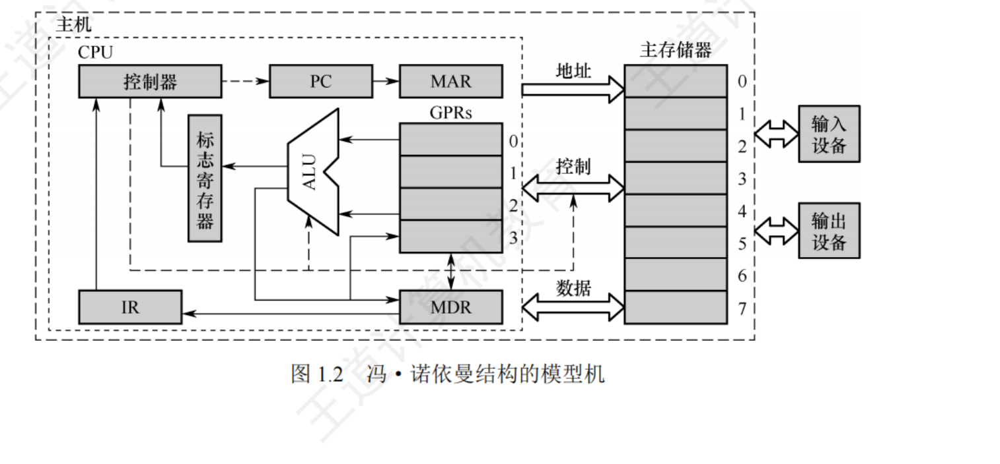
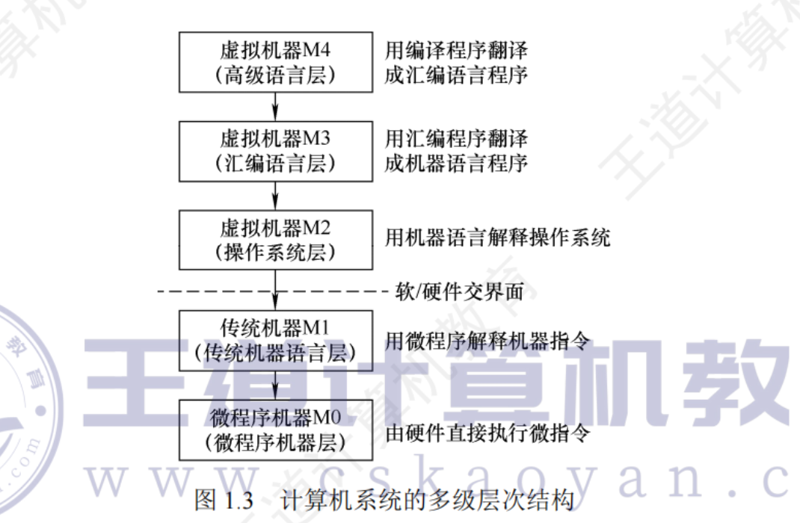
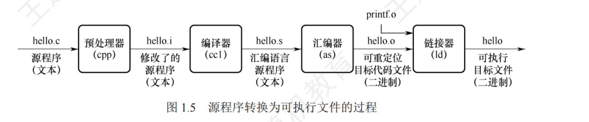
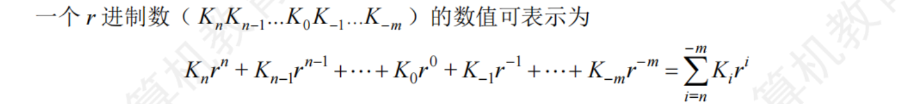
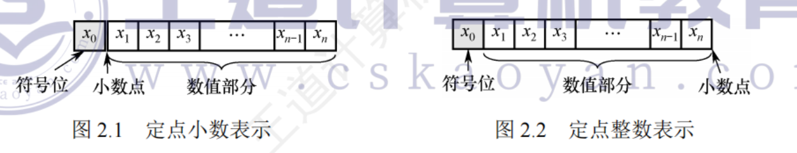
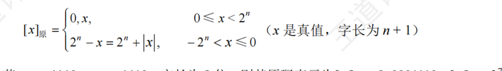

# 1 计算机系统概述
## 1.2 计算机系统层次结构
### 1.2.1 计算机系统组成
硬件系统和软件系统共同构成了一个完整的计算机系统。对某一功能来说， 若其既可⽤软件实现，又可⽤硬件实现，则称为软/硬件在逻辑功能上是等价的。

在设计计算机系统时，要进⾏软/硬件的功能分配。通常来说，⼀个功能若使⽤较为频繁且⽤硬件实现的成本较为理想，则使⽤硬件解决可以提⾼效率。

### 1.2.2 计算机硬件
1. 冯·诺依曼机基本思想
冯•诺依曼在研究EDVAC机时提出了“存储程序”的概念，“存储程序”的思想奠定了现代计算机的基本结构，以此概念为基础的各类计算机统称冯•诺依曼机，其特点如下：
1）采⽤“存储程序”的⼯作⽅式。
2）计算机硬件系统由运算器、存储器、控制器、输⼊设备和输出设备5⼤部件组成。
3）指令和数据以同等地位存储在存储器中，形式上没有区别，但计算机应能区分它们。
4）指令和数据均⽤⼆进制代码表⽰。
5）指令由操作码和地址码组成，操作码指出操作的类型，地址码指出操作数的地址

“存储程序”的基本思想是：将事先编制好的程序和原始数据送⼊主存储器后才能执⾏，一旦程序被启动执⾏，就⽆须操作⼈员的⼲预码指，计算机会⾃动逐条执⾏指令，直⾄程序执⾏结束。

2. 计算机功能部件
    1. 输入设备
    输入设备的主要功能是将程序和数据以机器所能识别和接受的信息形式输入计算机
    2. 输出设备
    输出设备的任务是将计算机处理的结果以⼈们所能接受的形式或其他系统所要求的信息形式输出
    3. 存储器
    存储器分为主存储器（也称内存储器或主存）和辅助存储器（也称外存储器或外存）。CPU能够直接访问的存储器是主存储器。辅助存储器⽤于帮助主存储器记忆更多的信息，辅助存储器中的信息必须调⼊主存储器后，才能为CPU所访问。主存储器的⼯作⽅式是按存储单元的地址进⾏存取，这种存取⽅式称为按地址存取⽅式。

    存储器地址寄存器（MAR）存放访存地址，经过地址译码后找到所选的存储单元。存储器数据寄存（MDR）⽤于暂存要从存储器中读或写的信息，时序控制逻辑⽤于产⽣存储器操作所需的各种时序信号。

    每个存储单元包含若⼲存储元件，每个存储元件存储⼀位⼆进制代码“0”或“1”。因此存储单元可存储⼀串⼆进制代码，称这串代码为存储字，称这串代码的位数为存储字长，存储字长可以是I B（8 b i t）或是字节的偶数倍。

    MAR⽤于寻址，其位数反映最多可寻址的存储单元的个数，如MAR为10位，则最多有2的10方=1024个存储单元，记为1K。MAR的长度与PC的长度相等。
    MDR的位数通常等于存储字长，⼀般为字节的2次幂的整数倍。

    4. 运算器
    运算器是计算机的执⾏部件，⽤于进⾏算术运算和逻辑运算。算术运算是按算术运算规则进⾏的运算，如加、减、乘、除；逻辑运算包括与、或、⾮、异或、⽐较、移位等运算。

    运算器的核⼼是算术逻辑单元。运算器包含若⼲通⽤寄存器，⽤于暂存操作数和中间结果，如累加器（ACC）、乘商寄存器（MQ）、操作数寄存器（X）、变址寄存器（IX）、基址寄存器（BR）等，其中前三个寄存器是必须具备的。
    运算器内还有程序状态寄存器（PSW），也称标志寄存器，⽤于存放A L U运算得到的⼀些标志信息或处理机的状态信息

    5. 控制器
    控制器是计算机的指挥中⼼，由其“指挥”各部件⾃动协调地进⾏⼯作。控制器由程序计数器（PC）、指令寄存器（IR）和控制单元（CU）组成。

    PC⽤来存放当前欲执⾏指令的地址，具有⾃动加L的功能（这⾥的“⼯”指⼀条指令的长度），即可⾃动形成下⼀条指令的地址，它与主存储器的M A R之间有⼀条直接通路。

    IR⽤来存放当前的指令，其内容来⾃主存储器的M D R。指令中的操作码OP（IR）送⾄CU，⽤以分析指令并发出各种微操作命令序列；⽽地址码Ad（IR）送往MAR，⽤以取操作数。一般将运算器和控制器集成到同⼀个芯⽚上，称为中央处理器（CPU）。CPU和主存储器共同构成主机，⽽除主机外的其他硬件装置（外存、1/0设备等）统称外部设备，简称外设。

    CPU包含ALU、通⽤寄存器组GPRs、标志寄存器、控制器、指令寄存器（IR）、程序计数器（PC）、存储器地址寄存器（MAR）和存储器数据寄存器（MDR）
    

### 1.2.3 计算机软件
1. 系统软件和应用软件
系统软件是⼀组保证计算机系统⾼效、正确运⾏的基础软件，通常作为系统资源提供给⽤户使⽤。系统软件主要有操作系统（OS）、数据库管理系统（DBMS）、语⾔处理程序、分布式软件系统、⽹络软件系统、标准库程序、服务性程序等。
应⽤软件是指⽤户为解决某个应⽤领域中的各类问题⽽编制的程序，如各种科学计算类程序、⼯程设计类程序、数据统计与处理程序等。

2. 三个级别的语言
    1）、机器语⾔。也称⼆进制代码语⾔，需要编程⼈员记忆每条指令的⼆进制编码。机器语⾔是计算机唯⼆可以直接识别和执⾏的语⾔。
    2）汇编语⾔。汇编语⾔⽤英⽂单词或其缩写代替⼆进制的指令代码。使⽤汇编语⾔编局的程序，必须经过⼀个称为汇编程序的系统软件翻译，将其转换为机器语⾔程序后，才能在计算机的硬件系统上执⾏。
    3）⾼级语⾔。⾼级语⾔（如C、C++、Java等）可以⽅便程序设计⼈员写出解决问题的处理⽅案和解题过程的程序。通常⾼级语⾔需要经过编译程序编译成汇编语⾔程序，然后经过汇编操作得到机器语⾔程序，或直接由⾼级语⾔程序翻译成机器语⾔程序。

    翻译程序有以下三类；
        1）汇编程序（汇编器）。将汇编语⾔程序翻译成机器语⾔程序。
        2）解释程序（解释器）。将源程序中的语句按执⾏顺序逐条翻译成机器指令并⽴即执⾏。
        3）编译程序（编译器）。将⾼级语⾔程序翻译成汇编语⾔或机器语⾔程序。

3. 软件和硬件的逻辑功能等价性
    对某⼀功能来说，其既可以由硬件实现，又可以由软件实现，从⽤户的⾓度来看，它们在功能上是等价的。这⼀等价性被称软/硬件逻辑功能的等价性。

### 1.2.4 计算机系统的层次结构

第1级是微程序机器层，这是⼀个实在的硬件层，它由机器硬件直接执⾏微指令。

第2级是传统机器语⾔层，它也是⼀个实际的机器层，由微程序解释机器指令系统。

第3级是操作系统层，它由操作系统程序实现。操作系统程序是由机器指令和⼴义指令组成的，这些⼴义指令是为了扩展机器功能⽽设置的，是由操作系统定义和解释的软件指令，所以这⼀层也称混合层。

第4级是汇编语⾔层，这⼀层由汇编程序⽀持和执⾏，借此可编写汇编语⾔源程序。

第5级是⾼级语⾔层，它是⾯向⽤户的，是⽅便⽤户编写应⽤程序⽽设置的。该层由各种⾼级语⾔编译程序⽀持和执⾏.

没有配备软件的纯硬件系统称裸机。第3层～第5层称为虚拟机器，简单来说就是软件实现的机器。

层次之间的关系紧密，下层是上层的基础，上层是下层的扩展。

软件和硬件之间的界⾯就是指令集体系结构（ISA），ISA定义了⼀台计算机可以执⾏的所有指令的集合，每条指令规定了计算机执⾏什么操作，以及所处理的操作数存放的地址空间和操作数类型。可以看出，ISA是指软件能感知到的部分，也称软件可见部分。

### 1.2.5 计算机系统的工作原理
1. “存储程序”工作方式
“存储程序”⼯作⽅式规定，程序执⾏前，需要将程序所含的指令和数据送⼊主存储器，⼀旦程序被启动执⾏，就⽆须操作⼈员的⼲预，⾃动逐条完成指令的取出和执⾏任务

每条指令的执⾏过程包括：根据PC从主存储器中取指令、对指令进⾏译码、计算下⼀条指令地址、取操作数并执⾏、将结果送回存储器。

2. 从源程序到可执行文件

1）预处理阶段：预处理器（cpp）对源程序中以字符#开头的命令进⾏处理，例如将#include命令后⾯的.h⽂件内容插⼊程序⽂件。输出结果是⼀个以i为扩展名的源程序hello.i。
2）编译阶段：编译器（ccl）对预处理后的源程序进⾏编译，⽣成⼀个汇编语⾔源程序hello.s。汇编语⾔源程序中的每条语句都以⼀种⽂本格式描述了⼀条低级机器语⾔指令。
3）汇编阶段：汇编器（as）将hello.s翻译成机器语⾔指令，把这些指令打包成⼀个称为可重定位⽬标代码⽂件hello.0，它是⼀种⼆进制⽂件，因此⽤⽂本编辑器打开会显⽰乱码。
4）链接阶段：链接器（Id）将多个可重定位⽬标代码⽂件和标准库函数合并为⼀个可执⾏⽬标⽂件，简称可执⾏⽂件。本例中，链接器将hello.o和标准库函数printf所在的可重定位⽬标模块printf。合并，⽣成可执⾏⽂件hello。最终⽣成的可执⾏⽂件被保存在磁盘上。

3. 指令执行过程的描述
可执⾏⽂件中的代码段是由⼀条⼀条机器指令构成的，指令是⽤0和1表⽰的⼀串0/1序列，⽤来指⽰CPU完成⼀个特定的原⼦操作下⾯以取数指令（送⾄运算器的A C C中）为例来说明，其信息流程如下：
1）取指令：PC-MAR-M-MDR-IR

根据PC.取指令到IR。将PC的内容送MAR，MAR中的内容直接送地址线，同时控制器将读信号送读/写信号线，主存储器根据地址线上的地址和读信号，从指定存储单元读出指令，送到数据线上，MDR从数据线接收指令信息，并传送到IR中。
2）分析指令：OP（IR）-CU

指令译码并送出控制信号。控制器根据IR中指令的操作码，⽣成相应的控制信号，送到不同的执⾏部件。在本例中，IR中是取数指令，因此读控制信号被送到总线的控制线上。
3）执⾏指令：Ad（IR）-MAR-M-MDR-ACC

取数操作。将IR中指令的地址码送MAR，MAR中的内容送地址线，同时控制器将读信号送读/写信号线，从主存储器中读出操作数，并通过数据线送⾄MDR，再传送到ACC中。

每取完⼀条指令，还需为取下⼀条指令做准备，计算下⼀条指令的地址，即（PC）+1-PC。

## 1.3 计算机的性能指标
### 1.3.1 计算机的主要性能指标
1. 机器字长
通常所说的“某16位或32位机器”，其中的16、32指的是机器字长，简称字长。字长是指计算机进⾏⼀次整数运算（定点整数运算）所能处理的⼆进制数据的位数，通常与CPU的寄存器位数、ALU有关。因此，字长⼀般等于通⽤寄存器的位数或ALU的宽度，字长越长，数的表⽰范围越⼤，计算精度越⾼。计算机字长通常选定为1字节（8位）的整数倍。

2. 数据通路带宽
数据通路带宽是指数据总线⼀次所能并⾏传送信息的位数。这⾥所说的数据通路宽度是指外部数据总线的宽度，它与CPU内部的数据总线宽度（内部寄存器的⼤⼩）有可能不同。

3. 主存容量
主存容量是指主存储器所能存储信息的最⼤容量，通常以字节（B）来衡量，也可⽤字数x字长（如512K×16位）来表⽰存储容量。其中，MAR的位数反映了存储单元的个数，MDR的位数反映了存储单元的字长。

4. 运算速度
1）吞吐量和响应时间。
    吞吐量。指系统在单位时间内处理请求的数量。它取决于信息能多快地输⼊内存，CPU能多快地取指令，数据能多快地从内存取出或存⼊，以及所得结果能多快地从内存送给外部设备。及乎每步都关系到主存储器，因此系统吞吐量主要取决于主存储器的存取周期。
    响应时间。指从⽤户向计算机发送⼀个请求，到系统对该请求做出响应并获得所需结果的等待时间。通常包括CPU时间（运⾏⼀个程序所花费的时间）与等待时间（⽤于磁盘访问、存储访问、I/O操作、操作系统开销时间）
2）主频和CPU时钟周期。
    CPU时钟周期。机器内部主时钟脉冲信号的宽度，它是CPU⼯作的最⼩时间单位。
        时钟脉冲信号由机器脉冲源发出的脉冲信号经整形和分频后形成。
        时钟周期以相邻状态单元间组合逻辑电路的最⼤延迟时间为基准确定。
        时钟周期也以指令流⽔线的每个流⽔段的最⼤延迟时间确定。
    主频（CPU时钟频率）。机器内部主时钟的频率，即时钟周期的倒数，它是衡量机器速度的重要参数。对于同⼀个型号的计算机，其主频越⾼，完成指令的⼀个执⾏步骤所⽤的时间越短，执⾏指令的速度越快。主频最直观的理解就是每秒有多少个时钟周期。
    CPU时钟周期=1/主频，主频通常以H z（赫兹）为单位，1 0 H z表⽰每秒1 0个时钟周期。
3）CPI，即执⾏⼀条指令所需的时钟周期数。
    不同指令的时钟周期数可能不同，因此对于⼀个程序或机器指令集中的所有指令执⾏所需的平均时钟周期数，即平均CPI

    IPS，即每秒执⾏多少条指令，IPS=主频/平均CPI。
4）CPU执⾏时间。指运⾏⼀个程序所花费的时间。
CPU执⾏时间=CPU时钟周期数/主频=（指令条数×CPI）/主频
上式表明，CPU的性能（CPU执⾏时间）取决于三个要素：主频、CPI和指令条数。主频、CPI和指令条数是相互制约的。

5）MIPS，即每秒执⾏多少百万条指令。
MIPS对不同机器进⾏性能⽐较是有缺陷的，因为不同机器的指令集不同，指令的功能也就不同，⽐如在机器M1上基条指令的功能也许在机器M2上要⽤多条指令来完成；不同机器的CPI和时钟周期也不同，因⽽同⼀条指令在不同机器上所⽤的时间也不同。

6）FLOPS，即每秒执⾏多少次浮点运算。
MFLOPS，即每秒执⾏多少百万（10^6）次浮点运算。
GFLOPS，即每秒执⾏多少⼗亿（10^9）次浮点运算。
TFLOPS，即每秒执⾏多少万亿（10^12）次浮点运算。
PFLOPS，即每秒执⾏多少千万亿（10^15）次浮点运算。
EFLOPS，即每秒执⾏多少百京（10^18）次浮点运算（1京=1亿亿=10^16）。
ZFLOPS，即每秒执⾏多少⼗万京（10^21）次浮点运算。

5. 基准程序
基准程序是专门⽤来进⾏性能评价的⼀组程序，能够很好地反映机器在运⾏实际负载时的性能，可以通过在不同机器上运⾏相同的基准程序来⽐较在不同机器上的运⾏时间，从⽽评测其性能。

# 2 数据的表示和运算
## 2.1 数制与编码
### 2.1.1 进位计数制及其相互转换
1. 进位计数制

    1. 二进制，⼆进制只有0和1两种数码，计数“逢⼆进⼀”
    2. 八进制，基数为8，有0~7共8个不同的数码。计数逢⼋进⼀
    3. 十六进制，基数为1 6，有0~9、A～F共1 6个不同的数码，其中A～F分别表⽰10~15。计数逢⼗六进⼀

2. 不同进制数之间的相互转换
    1. 二进制数转换为八进制数和十六进制数
    整数部分，从⼩数点开始往左数，将⼀串⼆进制数分为3位（⼋进制）⼀组或4位（⼗六进制）⼀组，在数的最左边可根据需要加“0”补齐；对于⼩数部分，从⼩数点开始往右数，也将⼀串⼆进制数分为3位⼀组或4位⼀组，在数的最右边也可根据需要加“0”补齐。最终使总的位数为3或4的整数倍，然后分别⽤对应的⼋进制数或⼗六进制数取代。

    由⼋进制数或⼗六进制数转换为⼆进制数，只需将每位改为3位或4位⼆进制数即可（必要时去掉整数最⾼位或⼩数最低位的0）。⼋进制数和⼗六进制数之间的转换也能⽅便地实现，⼗六进制数转换为⼋进制数（或⼋进制数转换为⼗六进制数）时，先将⼗六进制（⼋进制）数转换为⼆进制数，然后由⼆进制数转换为⼋进制（⼗六进制）数较⽅便。
    2. 任意进制数转换为十进制数
    将任意进制数的各位数码与它们的权值相乘，再把乘积相加，就得到了⼀个⼗进制数。这种⽅法称按权展开相加法。
    3. 十进制数转换为任意进制数
    除基取余法（整数部分）：整数部分除基取余，最先取得的余数为数的最低位，最后取得的余数为数的最⾼位（除基取余，先余为低，后余为⾼），商为0时结束。

    乘基整数为数的⼩数部分：取整法（⼩数部分2；⼩数部分乘基取整，最先取得的整数为数的最⾼位，最后取得的最低位（乘基取整，先整⼒⾼；后整为低），乘积1.0（或满⾜精度要求〉时结束

### 2.1.2 定点数的编码表示
1. 真值和机器数
带“+”或“_”符号的数称为真值，通常⽤“0”表⽰“正”，⽤“1”表⽰“负”。这种把符号“数字化”的数称机器数

2. 机器数的顶点表示
在计算机中有两种数据格式：顶点表示和浮点表示。在现代计算机中，通常⽤补码整数表⽰整数，⽤原码⼩数表⽰浮点数的尾定点表数部⽰。⽤移码表⽰浮点数的阶码部分

定点表示法用来表示顶点小数和定点整数
    1. 定点小数，定点小数是纯小数
    2. 定点整数，定点整数是纯整数
    

3. 原码、补码、反码、移码
    1. 原码表示法
    用机器数的最高位表示数的符号，其余各位表示数的绝对值
    原码优点：1. 与真值的对应关系简单、直观、与真值的转换简单
            2.用原码实现乘除运算比较简单。
    缺点：1. 0的表示不唯一，有正负两个编码
         2. 用原码实现加减运算比较复杂
    
    2. 补码表示法
    补码表⽰法中的加减运算统⼀采⽤加法操作实现。正数的补码和原码相同，负数的补码等于模（n+1位补码的模为2^n+1）与该负数绝对值之差。

    若字长为n+1，则补码整数的表⽰范围为-2^n≤×≤2^n-1（⽐原码多表⽰“-2^n”）。
        •⼏个特殊数据的补码表⽰
        1）[+0]补=[-0]＊＝0,00……（合符号位共n+1个0），说明0的补码表⽰是唯⼀的。
        2）[-1]补 = 2^n+1 - 1 = 1,11……(含符号位共n+1个1)
        3）［2^n-1］补=0,11……1（n个1），即n+1位补码能表⽰的最⼤整数。
        4）[-2^n]=1.00..0（n个0），即n+1位补码能表⽰的最⼩整数。

        模运算
            A、B、M满⾜A=B+K X M（K为整数），记为A模B（m o d.M A），即A、B各除以M后的余数相同。在补码运算中，[A]	补-[B]补=[A]补+M-[B]补，而M-[B]补=[-B]补，因此补码可以借助加法运算来实现减法运算。

    真值转换为补码：对于正数，与原码的⽅式⼀样。对于负数，符号位取1，其余各位由数值部分“按位取反，末位加1”得到。补码转换为真值：若符号位0，与原码的⽅式⼀样。若符号位为1，真值的符号为负，数值部分由补码数值部分“按位取反，末位加1”得到。
    3. 反码表示法
    若符号位为0，则反码与原码相同
    若符号位为1，则数值位全部取反

    4. 移码表示法
    在补码的基础上，将符号为取反，只能表示整数

    移码（假设机器字长为n+1，偏置值2^n）具有以下特点：
    ①移码中零的表⽰唯⼀，[+0]移=2^n + 0 = [-0] 移= 2^n - 0 = 1,00……
    ②⼀个真值的移码和补码仅差⼀个符号位，[x]补的符号位取反即得［x］移（“1”表⽰正，“0”表⽰负，这与其他机器数的符号位取值正好相反），反之亦然。
    ③移码全0时，对应真值的最⼩值-2^n；移码全1时，对应真值的最⼤值2^n-1。
    ④移码保持了数据原有的⼤⼩顺序，移码⼤真值就⼤，移码⼩真值就⼩。

    原码、补码、反码和移码这.4种编码表⽰的总结如下：
    ①原码、补码、反码的符号位相同，正数的机器码相同。
    ②原码、反码的表⽰在数轴上对称，⼆者都存在+0和-0两个0。
    ③补码、移码的表⽰在数轴上不对称，零的表⽰唯⼀，它们⽐原码、反码多表⽰⼀
    ④原码很容易判断⼤⼩。⽽负数的补码、反码很难直接判断⼤⼩，可采⽤如下规个数。则快速判断单对于负数，数值位部分越⼩，其绝对值越⼤，即负得越多

### 2.1.3 整数表示
1. 无符号整数的表示
当⼀个编码的全部⼆进制位均为数值位⽽没有符号位时，该编码表⽰就是⽆符号整数。

2. 有符号整数的表示
将符号数值化，并将符号位放在有效数字的前⾯，就组成了有符号整数
①与原码和反码相⽐，0的补码表⽰唯⼀。
②与原码和移码相⽐，补码运算规则⽐较简单，且符号位可以和数值位⼀起参加运算。
③与原码和反码相⽐，补码⽐原码和反码多表⽰⼀个最⼩负数。
计算机中的有符号整数都⽤补码表⽰，所以n位有符号整数的表⽰范围是-2^n-1～2 ^n-1-1。

### 2.1.4 C语言的整数类型及类型转换
1. C语言中的整型数据类型
2. 有符号和无符号数的转换
无符号数与有符号数：不改变数据内容，改变解释方式
长整数变短整数：高位截断，保留地位
短整数变长整数：符号位扩展
3. 不同字长整数之间的转换
①若从⼩字长转换到⼤字长，则要先对原数字的⾼位部分进⾏扩展，若原数字是⽆符号整数，则进⾏零扩展；若原数字是有符号整数，则进⾏符号扩展。
②若从⼤字长转换到⼩字长，则直接截取低位部分。也就是说，先进⾏字长的转换，再进⾏符号的转换。

## 2.2 运算方法和运算电路
### 2.2.1 基本运算部件
运算器由算术逻辑单元（ALU）、移位器、状态寄存器（PSW）和通⽤寄存器组等组成，ALU的核⼼部件是加法器
1. 一位全加器
